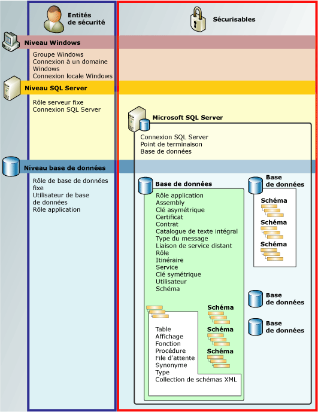

# Hiérarchie des autorisations (moteur de base de données)
[!INCLUDE[appliesto-ss-asdb-asdw-pdw-md](../../includes/appliesto-ss-asdb-asdw-pdw-md.md)]

  [!INCLUDE[ssDE](../../includes/ssde-md.md)] gère une collection hiérarchisée d’entités qui peuvent être sécurisées à l’aide d’autorisations. Ces entités sont appelées *éléments sécurisables*. Les éléments sécurisables les plus proéminents sont les serveurs et les bases de données, mais les autorisations discrètes peuvent être définies à un niveau beaucoup plus fin. [!INCLUDE[ssNoVersion](../../includes/ssnoversion-md.md)] règle les actions des principaux sur des éléments sécurisables en vérifiant que les autorisations appropriées leur ont été octroyées.  
  
 L'illustration suivante montre les relations entre les hiérarchies des autorisations du [!INCLUDE[ssDE](../../includes/ssde-md.md)] .  
  
 Le système d’autorisations est identique dans toutes les versions de [!INCLUDE[ssNoVersion](../../includes/ssnoversion-md.md)], [!INCLUDE[ssSDS](../../includes/sssds-md.md)], [!INCLUDE[ssDW](../../includes/ssdw-md.md)]et [!INCLUDE[ssAPS](../../includes/ssaps-md.md)], mais certaines fonctionnalités ne sont pas disponibles dans toutes les versions. Par exemple, une autorisation de niveau serveur ne peut pas être configurée dans les produits Azure.  
  
   
  
## Graphique des autorisations SQL Server  
 Pour obtenir un graphique de la taille d’une affiche de toutes les autorisations du [!INCLUDE[ssDE](../../includes/ssde-md.md)] au format PDF, consultez [https://aka.ms/sql-permissions-poster](https://aka.ms/sql-permissions-poster).  
  
## Utilisation des autorisations  
 Les autorisations peuvent être gérées avec les requêtes GRANT, DENY et REVOKE [!INCLUDE[tsql](../../includes/tsql-md.md)] habituelles. Les informations sur les autorisations sont visibles dans les affichages catalogue [sys.server_permissions](../../relational-databases/system-catalog-views/sys-server-permissions-transact-sql.md) et [sys.database_permissions](../../relational-databases/system-catalog-views/sys-database-permissions-transact-sql.md) . Il existe également une assistance permettant d'obtenir des informations sur les autorisations à l'aide de fonctions intégrées.  
  
 Pour plus d’informations sur la conception d’un système d’autorisations, voir [Getting Started with Database Engine Permissions](../../relational-databases/security/authentication-access/getting-started-with-database-engine-permissions.md).  
  
##  Voir aussi  
 [Sécurisation de SQL Server](../../relational-databases/security/securing-sql-server.md)   
 [Autorisations &#40;moteur de base de données&#41;](../../relational-databases/security/permissions-database-engine.md)   
 [Securables](../../relational-databases/security/securables.md)   
 [Principaux &#40;moteur de base de données&#41;](../../relational-databases/security/authentication-access/principals-database-engine.md)   
 [GRANT &#40;Transact-SQL&#41;](../../t-sql/statements/grant-transact-sql.md)   
 [REVOKE &#40;Transact-SQL&#41;](../../t-sql/statements/revoke-transact-sql.md)   
 [DENY &#40;Transact-SQL&#41;](../../t-sql/statements/deny-transact-sql.md)   
 [HAS_PERMS_BY_NAME &#40;Transact-SQL&#41;](../../t-sql/functions/has-perms-by-name-transact-sql.md)   
 [sys.fn_builtin_permissions &#40;Transact-SQL&#41;](../../relational-databases/system-functions/sys-fn-builtin-permissions-transact-sql.md)   
 [sys.server_permissions &#40;Transact-SQL&#41;](../../relational-databases/system-catalog-views/sys-server-permissions-transact-sql.md)   
 [sys.database_permissions &#40;Transact-SQL&#41;](../../relational-databases/system-catalog-views/sys-database-permissions-transact-sql.md)  
  
  
