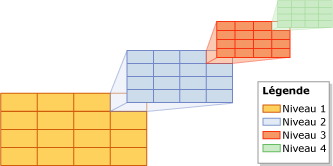
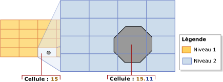
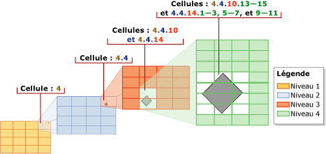
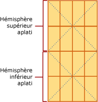

# <a name="spatial-indexes-overview"></a>Vue d'ensemble des index spatiaux
[!INCLUDE[appliesto-ss-asdb-xxxx-xxx-md](../../includes/appliesto-ss-asdb-xxxx-xxx-md.md)]
  [!INCLUDE[ssNoVersion](../../includes/ssnoversion-md.md)] prend en charge les données spatiales et les index spatiaux. Un *index spatial* est un type d'index étendu qui vous permet d'indexer une colonne spatiale. Une colonne spatiale est une colonne de table qui contient des données d’un type de données spatiales, tel que **geometry** ou **geography**.  
  
> [!IMPORTANT]  
>  Pour obtenir une description détaillée et des exemples des fonctionnalités spatiales introduites dans [!INCLUDE[ssSQL11](../../includes/sssql11-md.md)], notamment les fonctionnalités qui affectent les index spatiaux, téléchargez le livre blanc [New Spatial Features in SQL Server 2012](http://go.microsoft.com/fwlink/?LinkId=226407)(Nouvelles fonctionnalités spatiales de SQL Server 2012).  
  
##  <a name="about"></a> À propos des index spatiaux  
  
###  <a name="decompose"></a> Décomposition de l'espace indexé en une hiérarchie de grille  
 Dans [!INCLUDE[ssNoVersion](../../includes/ssnoversion-md.md)], les index spatiaux sont construits à l'aide d'arbres B (B-trees), ce qui signifie que les index doivent représenter les données spatiales bidimensionnelles dans l'ordre linéaire d'arbres B. Par conséquent, [!INCLUDE[ssNoVersion](../../includes/ssnoversion-md.md)] implémente une décomposition uniforme hiérarchique de l'espace avant de lire des données dans un index spatial. Le processus de création d’index *décompose* l’espace en une *hiérarchie de grille*à quatre niveaux. Ces niveaux sont appelés *niveau 1* (niveau supérieur), *niveau 2*, *niveau 3*et *niveau 4*.  
  
 Chaque niveau consécutif décompose davantage le niveau supérieur ; chaque cellule de niveau supérieur contient donc une grille complète au niveau suivant. Sur un niveau donné, toutes les grilles ont le même nombre de cellules le long des deux axes (par exemple, 4x4 ou 8x8) et les cellules sont toutes d'une seule taille.  
  
 L'illustration suivante montre la décomposition pour la cellule supérieure droite à chaque niveau de la hiérarchie de grille en une grille 4x4. En réalité, toutes les cellules sont décomposées de cette manière. Par exemple, la décomposition d'un espace en quatre niveaux de grilles 4x4 produit en fait un total de 65 536 cellules de niveau quatre.  
  
   
  
> [!NOTE]  
>  La décomposition d'espace pour un index spatial est indépendante de l'unité de mesure utilisée par les données de l'application.  
  
 Les cellules d'une hiérarchie de grille sont numérotées de façon linéaire en utilisant une variante de la courbe de remplissage d'espace de Hilbert. Toutefois, à des fins d'illustration, cette discussion utilise une numérotation de ligne simple plutôt que la numérotation réellement générée par la courbe Hilbert. Dans l'illustration suivante, plusieurs polygones qui représentent des bâtiments et des lignes qui représentent des rues ont déjà été placés dans une grille 4x4 de niveau 1. Les cellules de niveau 1 sont numérotées de 1 à 16, en commençant par la cellule supérieure gauche.  
  
   
  
#### <a name="grid-density"></a>Densité de grille  
 Le nombre de cellules le long des axes d'une grille détermine sa *densité*: plus le nombre est élevé, plus la grille est dense. Par exemple, une grille 8x8 (qui produit 64 cellules) est plus dense qu'une grille 4x4 (qui produit 16 cellules). La densité de grille est définie sur la base de chaque niveau.  
  
 L'instruction [CREATE SPATIAL INDEX](../../t-sql/statements/create-spatial-index-transact-sql.md)[!INCLUDE[tsql](../../includes/tsql-md.md)] prend en charge une clause GRIDS qui vous permet de spécifier des densités de grille différentes à des niveaux différents. La densité de grille pour un niveau donné est spécifiée à l'aide de l'un des mots clés suivants.  
  
|Mot clé|Configuration de grille|Nombre de cellules|  
|-------------|------------------------|---------------------|  
|LOW|4X4|16|  
|MEDIUM|8X8|64|  
|HIGH|16X16|256|  
  
 Dans [!INCLUDE[ssNoVersion](../../includes/ssnoversion-md.md)], lorsque le niveau de compatibilité de la base de données est défini sur 100 ou une valeur inférieure, la valeur par défaut est MEDIUM sur tous les niveaux. Lorsque le niveau de compatibilité de la base de données est défini sur 110 ou une valeur supérieure, la valeur par défaut est un modèle de grille automatique. (La grille automatique indique une configuration de niveau 8 de HLLLLLLL.) Au lieu d’une densité de grille d’index variable, vous pouvez modifier les cellules par objet et les cellules de fenêtre de requête par objet via l’indicateur. 
  
 Vous pouvez contrôler le processus de décomposition en spécifiant des densités de grille autres que les densités par défaut. Par exemple, différentes densités de grille sur différents niveaux peuvent être utiles pour le réglage fin d'un index en fonction de la taille de l'espace indexé et des objets contenus dans la colonne spatiale.  
  
> [!NOTE]  
>  Les densités de grille d’un index spatial sont visibles dans les colonnes level_1_grid, level_2_grid, level_3_grid et level_4_grid de l’affichage catalogue [sys.spatial_index_tessellations](../../relational-databases/system-catalog-views/sys-spatial-index-tessellations-transact-sql.md) quand le niveau de compatibilité de la base de données est défini à 100 ou à une valeur inférieure. Les options de schéma de pavage **GEOMETRY_AUTO_GRID**/**GEOGRAPHY_AUTO_GRID** ne remplissent pas ces colonnes. L’affichage catalogue sys.spatial_index_tessellations présente des valeurs **NULL** pour ces colonnes quand les options de grille automatique sont utilisées.  
  
###  <a name="tessellation"></a> Pavage  
 Après la décomposition d'un espace indexé en une hiérarchie de grille, l'index spatial lit les données de la colonne spatiale, ligne par ligne. Après avoir lu les données pour un objet spatial (ou une instance), l’index spatial exécute un *processus de pavage* pour cet objet. Le processus de pavage ajuste l’objet dans la hiérarchie de grille en associant l’objet à un ensemble de cellules de grille qu’il touche (*cellules touchées*). En partant du niveau 1 de la hiérarchie de grille, le processus de pavage continue *dans le sens de la largeur* à travers le niveau. Potentiellement, le processus peut se poursuivre à travers les quatre niveaux, un niveau à la fois.  
  
 La sortie du processus de pavage est un jeu de cellules touchées enregistrées dans l'index spatial pour l'objet. En faisant référence à ces cellules enregistrées, l'index spatial peut localiser l'objet dans l'espace relativement à d'autres objets dans la colonne spatiale qui sont également stockés dans l'index.  
  
#### <a name="tessellation-rules"></a>Règles de pavage  
 Pour limiter le nombre de cellules touchées enregistrées pour un objet, le processus de pavage applique plusieurs règles de pavage. Ces règles déterminent la profondeur du processus de pavage et lesquelles des cellules touchées sont enregistrées dans l'index.  
  
 Ces règles sont les suivantes :  
  
-   La règle de couverture  
  
     Si l'objet couvre complètement une cellule, cette cellule est dite *couverte* par l'objet. Une cellule couverte est comptée et n'est pas pavée. Cette règle s'applique à tous les niveaux de la hiérarchie de grille. La règle de couverture simplifie le processus de pavage et réduit la quantité de données enregistrées par un index spatial.  
  
-   La règle de cellules par objet  
  
     Cette règle applique la *limite de cellules par objet*, qui détermine le nombre maximal de cellules qui peuvent être comptées pour chaque objet, hormis au niveau 1. Aux niveaux inférieurs, la règle de cellules par objet contrôle la quantité d'informations qui peuvent être enregistrées à propos de l'objet.  
  
-   La règle de cellule la plus profonde  
  
     La règle de cellule la plus profonde génère la meilleure approximation d'un objet en enregistrant uniquement les seules cellules les plus profondes qui ont été pavées pour l'objet. Les cellules parentes ne contribuent pas au nombre de cellules par objet et elles ne sont pas enregistrées dans l'index.  
  
 Ces règles de pavage sont appliquées de manière récursive sur chaque niveau de grille. Le reste de cette section décrit les règles de pavage en détail.  
  
#### <a name="covering-rule"></a>Règle de couverture  
 Si un objet couvre complètement une cellule, cette cellule est dite *couverte* par l'objet. Par exemple, dans l'illustration suivante, l'une des cellules de second niveau, 15.11, est complètement couverte par la partie centrale d'un octogone.  
  
   
  
 Une cellule couverte est comptée et enregistrée dans l'index, et la cellule n'est pas pavée davantage.  
  
#### <a name="cells-per-object-rule"></a>Règle de cellules par objet  
 L’étendue de pavage de chaque objet dépend principalement de la *limite de cellules par objet* de l’index spatial. Cette limite définit le nombre maximal de cellules que le pavage peut compter par objet. Notez toutefois que la règle de cellules par objet n'est pas appliquée au niveau 1 ; il est par conséquent possible de dépasser cette limite. Si le nombre de cellules au niveau 1 atteint ou dépasse la limite de cellules par objet, aucun pavage supplémentaire n'a lieu aux niveaux inférieurs.  
  
 Tant que le nombre est inférieur à la limite de cellules par objet, le processus de pavage continue. En commençant par la cellule touchée la plus basse (par exemple, la cellule 15.6 dans l'illustration précédente), le processus teste chaque cellule afin d'évaluer s'il faut la compter ou la paver. Si le pavage d'une cellule entraîne un dépassement de la limite de cellules par objet, la cellule est comptée et non pavée. Autrement, la cellule est pavée et les cellules de niveau inférieur touchées par l'objet sont comptées. Le processus de pavage se poursuit de cette manière, dans le sens de la largeur, à travers le niveau. Ce processus est répété de façon récursive pour les grilles de niveau inférieur des cellules pavées jusqu'à ce que la limite soit atteinte ou qu'il n'y ait plus de cellules à compter.  
  
 Par exemple, considérez l'illustration précédente, qui montre un octogone qui s'adapte parfaitement à la cellule 15 de la grille de niveau 1. Dans l'illustration, la cellule 15 a été pavée, l'octogone ayant été disséqué en neuf cellules de niveau 2. Cette illustration suppose que la limite de cellules par objet est supérieure ou égale à 9. Si la limite de cellules par objet était inférieure ou égale à 8, la cellule 15 ne serait pas pavée et seule cette cellule 15 serait comptée pour l'objet.  
  
 Par défaut, la limite de cellules par objet est de 16, ce qui constitue un compromis satisfaisant entre l'espace et la précision pour la plupart des index spatiaux. Cependant, l’instruction [CREATE SPATIAL INDEX](../../t-sql/statements/create-spatial-index-transact-sql.md)[!INCLUDE[tsql](../../includes/tsql-md.md)] prend en charge une clause CELLS_PER_OBJECT**=***n* qui vous permet de spécifier une limite de cellules par objet comprise entre 1 et 8192 (inclusivement).  
  
> [!NOTE]  
>  Le paramètre **cells_per_object** d’un index spatial est visible dans l’affichage catalogue [sys.spatial_index_tessellations](../../relational-databases/system-catalog-views/sys-spatial-index-tessellations-transact-sql.md) .  
  
#### <a name="deepest-cell-rule"></a>Règle de cellule la plus profonde  
 La règle de cellule la plus profonde exploite le fait que chaque cellule de niveau inférieur appartient à la cellule située au-dessus d'elle : une cellule de niveau 4 appartient à une cellule de niveau 3, une cellule de niveau 3 appartient à une cellule de niveau 2 et une cellule de niveau 2 appartient à une cellule de niveau 1. Par exemple, un objet qui appartient à la cellule 1.1.1.1 appartient également à la cellule 1.1.1, à la cellule 1.1 et à la cellule 1. La connaissance de telles relations de hiérarchie de cellule est intégrée au processeur de requêtes. Par conséquent, seules les cellules les plus profondes doivent être enregistrées dans l'index, ce qui réduit la quantité d'informations que l'index doit stocker.  
  
 Dans l'illustration suivante, un polygone en losange relativement petit est pavé. L'index utilise la limite de cellules par objet par défaut de 16, qui n'est pas atteinte pour ce petit objet. Par conséquent, le pavage continue jusqu'au niveau 4. Le polygone réside dans les cellules suivantes du niveau 1 au niveau 3 : 4, 4.4 et 4.4.10 et 4.4.14. Toutefois, avec la règle de cellule la plus profonde, le pavage compte uniquement les douze cellules de niveau 4 : 4.4.10.13-15 et 4.4.14.1-3, 4.4.14.5-7 et 4.4.14.9-11.  
  
   
  
###  <a name="schemes"></a> Schémas de pavage  
 Le comportement d'un index spatial dépend en partie de son *schéma de pavage*. Le schéma de pavage est spécifique au type de données. Dans [!INCLUDE[ssNoVersion](../../includes/ssnoversion-md.md)], les index spatiaux prennent en charge deux schémas de pavage :  
  
-   Le*pavage de grille géométrique*, qui est le schéma pour le type de données **geometry** .  
  
-   Le*pavage de grille géographique*, qui s'applique aux colonnes du type de données **geography** .  
  
> [!NOTE]  
>  Le paramètre **tessellation_scheme** d’un index spatial est visible dans l’affichage catalogue [sys.spatial_index_tessellations](../../relational-databases/system-catalog-views/sys-spatial-index-tessellations-transact-sql.md) .  
  
#### <a name="geometry-grid-tessellation-scheme"></a>Schéma de pavage de grille géométrique  
 Le pavage GEOMETRY_AUTO_GRID est le schéma de pavage par défaut pour le type de données **geometry** , pour [!INCLUDE[ssNoVersion](../../includes/ssnoversion-md.md)] et versions ultérieures.  Le pavage GEOMETRY_GRID est le seul schéma de pavage disponible pour les types de données de géométrie dans [!INCLUDE[ssNoVersion](../../includes/ssnoversion-md.md)]. Cette section traite des aspects du pavage de grille géométrique qui sont pertinents à l'utilisation d'index spatiaux : méthodes prises en charge et zones englobantes.  
  
> [!NOTE]  
>  Vous pouvez spécifier explicitement ce schéma de pavage à l’aide de la clause USING (GEOMETRY_AUTO_GRID/GEOMETRY_GRID) de l’instruction [CREATE SPATIAL INDEX](../../t-sql/statements/create-spatial-index-transact-sql.md)[!INCLUDE[tsql](../../includes/tsql-md.md)] .  
  
##### <a name="the-bounding-box"></a>Cadre englobant  
 Les données géométriques occupent un plan qui peut être infini. Dans [!INCLUDE[ssNoVersion](../../includes/ssnoversion-md.md)], toutefois, un index spatial requiert un espace fini. Pour établir un espace fini pour la décomposition, le schéma de pavage de grille géométrique requiert un *cadre englobant*rectangulaire. Le cadre englobant est défini par quatre coordonnées, **(***Min. X***,***Min. Y***)** et **(***Max. X***,***Max. Y***)**, qui sont stockées en tant que propriétés de l’index spatial. Ces coordonnées représentent les éléments suivants :  
  
-   *x-min* est la coordonnée x de l’angle inférieur gauche du cadre englobant.  
  
-   *y-min* est la coordonnée y de l’angle inférieur gauche.  
  
-   *x-max* est la coordonnée x de l’angle supérieur droit.  
  
-   *x-max* est la coordonnée y de l’angle supérieur droit.  
  
> [!NOTE]  
>  Ces coordonnées sont spécifiées par la clause BOUNDING_BOX de l’instruction [CREATE SPATIAL INDEX](../../t-sql/statements/create-spatial-index-transact-sql.md)[!INCLUDE[tsql](../../includes/tsql-md.md)] .  
  
 Les coordonnées **(***Min. X***,***Min. Y***)** et **(***Max. X***,***Max. Y***)** déterminent la position et les dimensions du cadre englobant. L'espace en dehors du cadre englobant est traité comme une cellule unique affectée du numéro 0.  
  
 L'index spatial décompose l'espace à l'intérieur du cadre englobant. La grille de niveau 1 de la hiérarchie de grille remplit le cadre englobant. Pour placer un objet géométrique dans la hiérarchie de grille, l'index spatial compare les coordonnées de l'objet à celles du cadre englobant.  
  
 L’illustration suivante montre les points définis par les coordonnées **(***Min. X***,***Min. Y***)** et **(***Max. X***,***Max. Y***)** du cadre englobant. Le niveau supérieur de la hiérarchie de grille est illustré comme une grille 4x4. À des fins d'illustration, les niveaux inférieurs sont omis. L'espace en dehors de la zone englobante est indiqué par un zéro (0). Notez que l'objet 'A' s'étend en partie au-delà du cadre et que l'objet 'B' se trouve complètement à l'extérieur du cadre dans la cellule 0.  
  
 ![Rectangle englobant affichant les coordonnées et la cellule 0.] (../../relational-databases/spatial/media/spndx-bb-4x4-objects.gif "Rectangle englobant affichant les coordonnées et la cellule 0.")  
  
 Un cadre englobant correspond à une partie des données spatiales d'une application. Le fait que le cadre englobant de l'index contienne toutes les données stockées dans la colonne spatiale ou uniquement une partie d'entre elles dépend de l'application. Seules les opérations calculées sur des objets qui sont entièrement à l'intérieur du cadre englobant tirent parti de l'index spatial. Par conséquent, pour profiter au maximum d’un index spatial sur une colonne **geometry** , vous devez spécifier un cadre englobant qui contienne tous les objets ou la plupart d’entre eux.  
  
> [!NOTE]  
>  Les densités de grille d’un index spatial sont visibles dans les colonnes bounding_box_xmin, bounding_box_ymin, bounding_box_xmax et bounding_box_ymax de l’affichage catalogue [sys.spatial_index_tessellations](../../relational-databases/system-catalog-views/sys-spatial-index-tessellations-transact-sql.md) .  
  
#### <a name="the-geography-grid-tessellation-scheme"></a>Le schéma de pavage de grille géographique  
 Ce schéma de pavage s'applique uniquement à une colonne **geography** . Cette section résume les méthodes qui sont prises en charge par le pavage de grille géographique et discute de la manière dont l'espace géodésique est projeté sur un plan, qui est ensuite décomposé en une hiérarchie de grille.  
  
> [!NOTE]  
>  Vous pouvez spécifier explicitement ce schéma de pavage à l’aide de la clause USING (GEOGRAPHY_AUTO_GRID/GEOGRAPHY_GRID de l’instruction [CREATE SPATIAL INDEX](../../t-sql/statements/create-spatial-index-transact-sql.md)[!INCLUDE[tsql](../../includes/tsql-md.md)] .  
  
##### <a name="projection-of-the-geodetic-space-onto-a-plane"></a>Projection de l'espace géodésique sur un plan  
 Les calculs sur les instances (objets) **geography** traitent l’espace contenant les objets comme une ellipsoïde géodésique. Pour décomposer cet espace, le schéma de pavage de grille géographique divise la surface de l'ellipsoïde en ses hémisphères supérieur et inférieur puis effectue les étapes suivantes :  
  
1.  Projection de chaque hémisphère sur les facettes d'une pyramide quadrilatère.  
  
2.  Aplatissement des deux pyramides.  
  
3.  Jointure des pyramides aplaties pour former un plan non Euclidien.  
  
 L'illustration suivante montre une vue schématique du processus de décomposition en trois étapes. Dans les pyramides, les traits pointillés représentent les limites des quatre facettes de chaque pyramide. Les étapes 1 et 2 illustrent l'ellipsoïde géodésique, avec une ligne horizontale verte pour représenter la ligne de longitude équatoriale et une série de lignes verticales vertes pour représenter plusieurs lignes de latitude. L'étape 1 illustre la projection des pyramides sur les deux hémisphères. L'étape 2 illustre l'aplatissement des pyramides. L'étape 3 illustre les pyramides aplaties, après qu'elles ont été combinées de façon à former un plan, avec plusieurs lignes de longitude projetées. Remarquez que ces lignes projetées sont tendues et que leur longueur varie en fonction de l'emplacement où elles sont sur les pyramides.  
  
   
  
 Une fois l'espace projeté sur le plan, celui-ci est décomposé en une hiérarchie de grille à quatre niveaux. Différents niveaux peuvent utiliser différentes densités de grille. L'illustration suivante montre le plan après qu'il a été décomposé en une grille 4x4 de niveau 1. À des fins d'illustration, les niveaux inférieurs de la hiérarchie de grille sont omis. En réalité, le plan est décomposé entièrement en une hiérarchie de grille à quatre niveaux. Une fois le processus de décomposition terminé, les données géographiques sont lues, ligne par ligne, à partir de la colonne géographique et le processus de pavage est effectué pour chaque objet l'un après l'autre.  
  
   
  
##  <a name="methods"></a> Méthodes prises en charge par les index spatiaux  
  
###  <a name="geometry"></a> Méthodes géométriques prises en charge par les index spatiaux  
 Les index spatiaux prennent en charge les méthodes géométriques suivantes basées sur les ensembles sous certaines conditions : STContains(), STDistance(), STEquals(), STIntersects(), STOverlaps(), STTouches() et STWithin(). Pour être prises en charge par un index spatial, ces méthodes doivent être utilisées dans la clause WHERE ou JOIN ON d'une requête et elles doivent se produire dans un prédicat de la forme générale suivante :  
  
 *geometry1*.*method_name*(*geometry2*)*comparison_operator**valid_number*  
  
 Pour retourner un résultat non Null, *geometry1* et *geometry2* doivent avoir le même [identificateur de référence spatiale (SRID)](../../relational-databases/spatial/spatial-reference-identifiers-srids.md). Sinon, la méthode renvoie NULL.  
  
 Les index spatiaux prennent en charge les formes de prédicat suivantes :  
  
-   *geometry1*.[STContains](../../t-sql/spatial-geometry/stcontains-geometry-data-type.md)(*geometry2*) = 1  
  
-   *geometry1*.[STDistance](../../t-sql/spatial-geometry/stdistance-geometry-data-type.md)(*geometry2*) < *nombre*  
  
-   *geometry1*.[STDistance](../../t-sql/spatial-geometry/stdistance-geometry-data-type.md)(*geometry2*) <= *nombre*  
  
-   *geometry1*.[STEquals](../../t-sql/spatial-geometry/stequals-geometry-data-type.md)(*geometry2*)= 1  
  
-   *geometry1*.[STIntersects](../../t-sql/spatial-geometry/stintersects-geometry-data-type.md)(*geometry2*)= 1  
  
-   *geometry1.* [STOverlaps](../../t-sql/spatial-geometry/stoverlaps-geometry-data-type.md) *(geometry2) = 1*  
  
-   *geometry1*.[STTouches](../../t-sql/spatial-geometry/sttouches-geometry-data-type.md)(*geometry2*) = 1  
  
-   *geometry1*.[STWithin](../../t-sql/spatial-geometry/stwithin-geometry-data-type.md)(*geometry2*)= 1  
  
###  <a name="geography"></a> Méthodes géographiques prises en charge par les index spatiaux  
 Sous certaines conditions, les index spatiaux prennent en charge les méthodes géographiques suivantes basées sur les ensembles : STIntersects(),STEquals(), and STDistance(). Pour être prises en charge par un index spatial, ces méthodes doivent être utilisées dans la clause WHERE d'une requête et elles doivent se produire dans un prédicat de la forme générale suivante :  
  
 *geography1*.*method_name*(*geography2*)*comparison_operator**valid_number*  
  
 Pour retourner un résultat non Null, *geography1* et *geography2* doivent avoir le même [identificateur de référence spatiale (SRID)](../../relational-databases/spatial/spatial-reference-identifiers-srids.md). Sinon, la méthode renvoie NULL.  
  
 Les index spatiaux prennent en charge les formes de prédicat suivantes :  
  
-   *geography1*.[STIntersects](../../t-sql/spatial-geography/stintersects-geography-data-type.md)(*geography2*)= 1  
  
-   *geography1*.[STEquals](../../t-sql/spatial-geography/stequals-geography-data-type.md)(*geography2*)= 1  
  
-   *geography1*.[STDistance](../../t-sql/spatial-geography/stdistance-geography-data-type.md)(*geography2*) < *nombre*  
  
-   *geography1*.[STDistance](../../t-sql/spatial-geography/stdistance-geography-data-type.md)(*geography2*) <= *nombre*  
  
### <a name="queries-that-use-spatial-indexes"></a>Requêtes qui utilisent des index spatiaux  
 Les index spatiaux sont pris en charge uniquement dans les requêtes qui incluent un opérateur spatial indexé dans la clause **WHERE** . Par exemple, la syntaxe :  
  
```  
[spatial object].SpatialMethod([reference spatial object]) [ = | < ] [const literal or variable]  
```  
  
 L'optimiseur de requête comprend la propriété commutative des opérations spatiales ( `@a.STIntersects(@b) = @b.STInterestcs(@a)` ). Toutefois, l'index spatial ne sera pas utilisé si le début de la comparaison ne contient pas l'opérateur spatial (par exemple `WHERE 1 = spatial op` n'utilise pas l'index spatial). Pour utiliser l'index spatial, réécrivez la comparaison (par exemple `WHERE spatial op = 1`).  
  
 Comme pour tout autre index, lorsqu'un index spatial est pris en charge, l'utilisation de l'index spatial sélectionné dépend du coût, par conséquent l'optimiseur de requête peut choisir de ne pas utiliser l'index spatial même si toutes les spécifications d'utilisation de ce dernier sont remplies. Utilisez le plan d'exécution de requêtes pour déterminer si l'index spatial est utilisé et, si nécessaire, pour fournir des indicateurs de requête pour forcer un plan de requête désiré.  
  
 Le type de requête voisin le plus proche prend également en charge les index spatiaux, mais uniquement si une syntaxe spécifique de requête est écrite. La syntaxe appropriée est :  
  
```  
SELECT TOP(K) [WITH TIES] *   
FROM <Table> AS T [WITH(INDEX(<SpatialIndex>))]  
WHERE <SpatialColumn>.STDistance(@reference_object) IS NOT NULL  
ORDER BY <SpatialColumn>.STDistance(@reference_object) [;]  
```  
  
## <a name="see-also"></a> Voir aussi  
 [Données spatiales &#40;SQL Server&#41;](../../relational-databases/spatial/spatial-data-sql-server.md)  
  
  
