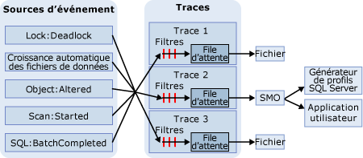

# Trace SQL
[!INCLUDE[appliesto-ss-xxxx-xxxx-xxx-md](../../includes/appliesto-ss-xxxx-xxxx-xxx-md.md)]
  Dans la trace SQL, les événements sont collectés si ce sont des instances de classes d'événements répertoriées dans la définition de la trace. Ces événements peuvent être extraits de la trace par filtrage ou placés dans la file d'attente de leur destination. La destination peut être un fichier ou des objets SMO ( [!INCLUDE[ssNoVersion](../../includes/ssnoversion-md.md)] Management Object), qui peuvent utiliser les informations de la trace dans les applications gérant [!INCLUDE[ssNoVersion](../../includes/ssnoversion-md.md)].  
  
> [!IMPORTANT]  
>  [!INCLUDE[ssNoteDepFutureAvoid](../../includes/ssnotedepfutureavoid-md.md)] Utilisez plutôt des événements étendus.  
  
## Avantages de Trace SQL  
 Microsoft [!INCLUDE[ssNoVersion](../../includes/ssnoversion-md.md)] fournit des procédures stockées système [!INCLUDE[tsql](../../includes/tsql-md.md)] pour créer des traces sur une instance du [!INCLUDE[ssDEnoversion](../../includes/ssdenoversion-md.md)]. Ces procédures stockées système permettent, à partir de vos propres applications, de créer des traces manuellement au lieu d'utiliser le [!INCLUDE[ssSqlProfiler](../../includes/sssqlprofiler-md.md)]. Vous pouvez ainsi écrire des applications personnalisées spécifiques des besoins de votre entreprise.  
  
## Architecture de Trace SQL  
 Les sources d'événement peuvent être n'importe quelle source produisant l'événement de trace, telle que des traitements [!INCLUDE[tsql](../../includes/tsql-md.md)] , ou bien des événements [!INCLUDE[ssNoVersion](../../includes/ssnoversion-md.md)] , comme des blocages par exemple. Pour plus d’informations sur les événements, consultez [Référence de classe d’événements SQL Server](../../relational-databases/event-classes/sql-server-event-class-reference.md). Dès qu'un événement se produit, si la classe d'événements a été incluse dans une définition de trace, les informations relatives à l'événement sont collectées par la trace. Si des filtres ont été définis pour la classe d'événements dans la définition de la trace, ils sont appliqués et les informations relatives aux événements de la trace sont transmises à une file d'attente. À partir de la file d'attente, les informations de la trace sont écrites dans un fichier ou peuvent être utilisées par un objet SMO dans des applications telles que le [!INCLUDE[ssSqlProfiler](../../includes/sssqlprofiler-md.md)]. Le schéma suivant montre comment la trace SQL collecte les événements lors d'un traçage.  
  
   
  
## Terminologie associée à Trace SQL  
 Les termes suivants décrivent les concepts fondamentaux de Trace SQL.  
  
 **Événement**  
 Action survenue dans une instance de [!INCLUDE[msCoName](../../includes/msconame-md.md)] [!INCLUDE[ssDEnoversion](../../includes/ssdenoversion-md.md)].  
  
 **Colonne de données**  
 Attribut d'un événement.  
  
 **Classe d’événements**  
 Type d'événement pouvant être tracé. La classe d'événements contient toutes les colonnes de données qu'un événement peut signaler.  
  
 **Catégorie d’événement**  
 Groupe de classes d'événements liées.  
  
 **Trace** (nom)  
 Collection d'événements et de données retournés par le [!INCLUDE[ssDE](../../includes/ssde-md.md)].  
  
 **Trace** (verbe)  
 Recueillir et surveiller les événements d'une instance de [!INCLUDE[ssNoVersion](../../includes/ssnoversion-md.md)].  
  
 **Tracedefinition**  
 Collection de classes d'événements, de colonnes de données et de filtres qui identifient les types d'événements à recueillir pendant une trace.  
  
 **Filter**  
 Critères qui limitent les événements recueillis dans la trace.  
  
 **Fichier de trace**  
 Fichier créé lors de l'enregistrement d'une trace.  
  
 **Modèle**  
 Dans le [!INCLUDE[ssSqlProfiler](../../includes/sssqlprofiler-md.md)], fichier définissant les classes d'événements et les colonnes de données à recueillir dans la trace.  
  
 **Table de trace**  
 Dans [!INCLUDE[ssSqlProfiler](../../includes/sssqlprofiler-md.md)], table créée lorsqu'une trace est enregistrée dans une table.  
  
## Utiliser des colonnes de données pour décrire les événements renvoyés  
 La trace SQL utilise les colonnes de données du résultat de la trace pour décrire les événements qui sont renvoyés lors de son exécution. Le tableau suivant décrit les colonnes de données de [!INCLUDE[ssSqlProfiler](../../includes/sssqlprofiler-md.md)] , qui sont les mêmes que celles utilisées par la trace SQL, et indique les colonnes sélectionnées par défaut.  
  
|Colonne de données|Numéro de colonne|Description|  
|-----------------|-------------------|-----------------|  
|**ApplicationName***|10|Nom de l'application cliente qui a créé la connexion à une instance de [!INCLUDE[ssNoVersion](../../includes/ssnoversion-md.md)]. Cette colonne est remplie des valeurs transmises par l'application et non pas du nom du programme.|  
|**BigintData1**|52|Valeur (type de données**bigint** ), qui dépend de la classe d’événements spécifiée dans la trace.|  
|**BigintData2**|53|Valeur (type de données**bigint** ), qui dépend de la classe d’événements spécifiée dans la trace.|  
|**Binary Data**|2|Valeur binaire qui dépend de la classe d'événements capturée dans la trace.|  
|**ClientProcessID***|9|ID affecté par l'ordinateur hôte au processus dans lequel s'exécute l'application cliente. Cette colonne de données est remplie si l'ID du processus du client est fourni par le client.|  
|**ColumnPermissions**|44|Indique si une autorisation au niveau de la colonne a été définie. Vous pouvez analyser le texte de l'instruction pour déterminer quelles autorisations ont été appliquées à quelles colonnes.|  
|**Unité centrale**|18|Temps processeur (en millisecondes) utilisé par l'événement.|  
|**ID de la base de données***|3|ID de la base de données spécifiée par l’instruction USE de *nom_base_de_données* ou celui de la base de données par défaut si aucune instruction USE de *nom_base_de_données*n’a été spécifiée pour une instance donnée. [!INCLUDE[ssSqlProfiler](../../includes/sssqlprofiler-md.md)] affiche le nom de la base de données si la colonne de données **ServerName** du serveur est capturée dans la trace et que le serveur est disponible. Déterminez la valeur pour une base de données à l'aide de la fonction DB_ID.|  
|**DatabaseName**|35|Nom de la base de données dans laquelle l'instruction de l'utilisateur est exécutée.|  
|**DBUserName***|40|Nom d'utilisateur [!INCLUDE[ssNoVersion](../../includes/ssnoversion-md.md)] du client.|  
|**Duration**|13|Durée (en microsecondes) de l'événement.   Le serveur signale la durée d’un événement en microsecondes (un millionième, ou 10-6, de seconde) et le temps UC utilisé par l’événement en millisecondes (un millième, ou 10-3, de seconde). L'interface utilisateur graphique de [!INCLUDE[ssSqlProfiler](../../includes/sssqlprofiler-md.md)] affiche par défaut la colonne **Durée** en millisecondes. Cependant, quand la trace est enregistrée dans un fichier ou une table de base de données, la valeur de la colonne **Durée** est mentionnée en microsecondes.|  
|**EndTime**|15|Heure de fin de l'événement. Cette colonne n’est pas remplie pour les classes d’événements faisant référence au démarrage d’un événement, comme par exemple **SQL:BatchStarting** ou **SP:Starting**.|  
|**Erreur**|31|Numéro d'erreur d'un événement donné. Il s’agit souvent du numéro d’erreur stocké dans **sysmessages**.|  
|**EventClass***|27|Type de classe d'événements capturée.|  
|**EventSequence**|51|Numéro de séquence de cet événement.|  
|**EventSubClass***|21|Type de sous-classe d'événements, qui fournit des informations complémentaires concernant chaque classe d'événements. Par exemple, les valeurs de sous-classe d’événements pour la classe d’événements **Execution Warning** représentent le type d’avertissement pour l’exécution :   **1** = Attente de requête. La requête doit attendre les ressources (telles que la mémoire) pour s'exécuter.   **2** = Expiration du délai d’attente de requête. La requête a dépassé le délai d'attente d'obtention des ressources nécessaires pour s'exécuter. Cette colonne de données n'est pas remplie pour toutes les classes d'événements.|  
|**GUID**|54|Valeur de type GUID qui dépend de la classe d'événements spécifiée dans la trace.|  
|**FileName**|36|Nom logique du fichier modifié.|  
|**Handle**|33|Entier utilisé par ODBC, OLE DB ou DB-Library pour coordonner l'exécution du serveur.|  
|**HostName***|8|Nom de l'ordinateur sur lequel s'exécute le client. Cette colonne de données est remplie si le nom de l'hôte est fourni par le client. Pour déterminer le nom de l'hôte, utilisez la fonction HOST_NAME.|  
|**IndexID**|24|ID d'index de l'objet affecté par l'événement. Pour déterminer l’ID d’index d’un objet, utilisez la colonne **indid** de la table système **sysindexes** .|  
|**IntegerData**|25|Valeur entière qui dépend de la classe d'événements capturée dans la trace.|  
|**IntegerData2**|55|Valeur entière qui dépend de la classe d'événements capturée dans la trace.|  
|**IsSystem**|60|Indique si l'événement s'est produit sur un processus système ou sur un processus utilisateur :   **1** = système   **0** = utilisateur|  
|**LineNumber**|5|Indique le numéro de la ligne qui contient l'erreur. Pour les événements qui impliquent des instructions [!INCLUDE[tsql](../../includes/tsql-md.md)] , comme **SP:StmtStarting**, la colonne **LineNumber** contient le numéro de ligne de l’instruction dans la procédure stockée ou le lot.|  
|**LinkedServerName**|45|Nom du serveur lié.|  
|**LoginName**|11|Nom de la connexion de l'utilisateur (soit la connexion de sécurité SQL Server, soit les informations d'identification de connexion Windows sous la forme DOMAINE\Nom_utilisateur).|  
|**LoginSid***|41|Numéro d'identification de sécurité (SID) de l'utilisateur connecté. Ces informations se trouvent dans la vue **sys.server_principals** de la base de données **master** . Chaque connexion au serveur a un ID unique.|  
|**MethodName**|47|Nom de la méthode OLE DB.|  
|**Mode**|32|Entier utilisé par différents événements pour décrire un état que l'événement demande ou a reçu.|  
|**NestLevel**|29|Entier représentant les données retournées par @@NESTLEVEL.|  
|**NTDomainName***|7|Domaine Microsoft Windows auquel appartient l'utilisateur.|  
|**NTUserName***|6|Nom d'utilisateur Windows.|  
|**ObjectID**|22|ID affecté à l'objet par le système.|  
|**ObjectID2**|56|ID de l'objet ou de l'entité associé, s'il est disponible.|  
|**ObjectName**|34|Nom de l'objet référencé.|  
|**ObjectType***\*|28|Valeur représentant le type de l'objet impliqué dans l'événement. Cette valeur correspond à la colonne de **type** dans **sysobjects**.|  
|**Offset**|61|Décalage de départ de l'instruction dans la procédure stockée ou le traitement.|  
|**OwnerID**|58|Pour les événements de verrou uniquement. Type de l'objet qui possède un verrou.|  
|**OwnerName**|37|Nom d'utilisateur de base de données du propriétaire de l'objet.|  
|**ParentName**|59|Nom du schéma qui contient l'objet.|  
|**Autorisations**|19|Valeur entière représentant le type d'autorisations vérifiées. Valeurs possibles :   **1** = SELECT ALL   **2** = UPDATE ALL   **4** = REFERENCES ALL   **8** = INSERT   **16** = DELETE   **32** = EXECUTE (procédures uniquement)   **4096** = SELECT ANY (au moins une colonne)   **8192** = UPDATE ANY   **16384** = REFERENCES ANY|  
|**ProviderName**|46|Nom du fournisseur OLE DB.|  
|**Reads**|16|Nombre d'opérations de lecture sur le disque logique effectuées par le serveur pour l'événement. Ces opérations de lecture comprennent toutes les lectures des tables et des tampons pendant l'exécution de l'instruction.|  
|**RequestID**|49|ID de la demande qui contient l'instruction.|  
|**RoleName**|38|Nom du rôle d'application activé.|  
|**RowCounts**|48|Nombre de lignes du traitement.|  
|**ServerName***|26|Nom de l'instance [!INCLUDE[ssNoVersion](../../includes/ssnoversion-md.md)] tracée.|  
|**SessionLoginName**|64|Nom de connexion de l'utilisateur à l'origine de la session. Par exemple, si vous vous connectez à [!INCLUDE[ssNoVersion](../../includes/ssnoversion-md.md)] à l’aide de **Login1** et que vous exécutez une instruction en tant que **Login2**, **SessionLoginName** affiche **Login1**, tandis que **LoginName** affiche **Login2**. Cette colonne de données affiche les noms de connexion [!INCLUDE[ssNoVersion](../../includes/ssnoversion-md.md)] et Windows.|  
|**Severity**|20|Niveau de gravité de l'événement d'exception.|  
|**SourceDatabaseID**|62|ID de la base de données contenant la source de l'objet.|  
|**SPID**|12|ID de processus serveur (SPID) affecté par [!INCLUDE[ssNoVersion](../../includes/ssnoversion-md.md)] au processus associé au client.|  
|**SqlHandle**|63|Hachage 64 bits basé sur le texte d'une requête ad hoc ou sur l'ID de base de données et d'objet d'un objet SQL. Cette valeur peut être transmise à **sys.dm_exec_sql_text()** pour récupérer le texte SQL associé.|  
|**StartTime***|14|Heure de début de l'événement, le cas échéant.|  
|**État**|30|Code d'état d'erreur.|  
|**Réussi**|23|Indique si l'événement a réussi. Ces valeurs comprennent :   **1** = réussite   **0** = échec   Par exemple, **1** signifie la réussite de la vérification d’autorisations et **0** l’échec de cette vérification.|  
|**TargetLoginName**|42|Pour les actions qui ciblent une connexion, nom de la connexion ciblée, par exemple pour ajouter une nouvelle connexion.|  
|**TargetLoginSid**|43|Pour les actions qui ciblent une connexion, SID de la connexion ciblée, par exemple pour ajouter une nouvelle connexion.|  
|**TargetUserName**|39|Pour les actions qui ciblent un utilisateur de base de données, nom de cet utilisateur, par exemple pour accorder une autorisation à un utilisateur.|  
|**TextData**| 1|Valeur de texte qui dépend de la classe d'événements capturée dans la trace. Néanmoins, si vous tracez une requête paramétrable, les variables ne sont pas affichées avec les valeurs de données dans la colonne **TextData** .|  
|**ID de transaction**|4|ID affecté à la transaction par le système.|  
|**Type**|57|Valeur entière qui dépend de la classe d'événements capturée dans la trace.|  
|**Writes**|17|Nombre d'opérations d'écriture sur le disque physique effectuées par le serveur pour l'événement.|  
|**XactSequence**|50|Jeton servant à décrire la transaction en cours.|  
  
 *Ces colonnes de données sont remplies par défaut pour tous les événements.  
  
 \*\*Pour plus d’informations sur la colonne de données **ObjectType**, consultez [Colonne d’événements de trace ObjectType](../../relational-databases/event-classes/objecttype-trace-event-column.md).  
  
## Tâches de la trace SQL  
  
|Description de la tâche|Rubrique|  
|----------------------|-----------|  
|Explique comment créer et exécuter des traces à l'aide de procédures stockées Transact-SQL.|[Créer et exécuter des traces à l’aide de procédures stockées Transact-SQL](../../relational-databases/sql-trace/create-and-run-traces-using-transact-sql-stored-procedures.md)|  
|Explique comment créer des traces manuelles à l'aide de procédures stockées sur une instance du [!INCLUDE[ssDEnoversion](../../includes/ssdenoversion-md.md)].|[Créer des traces manuelles à l’aide de procédures stockées](../../relational-databases/sql-trace/create-manual-traces-using-stored-procedures.md)|  
|Explique comment enregistrer les résultats de trace dans le fichier où les résultats de trace sont écrits.|[Enregistrer les résultats de trace dans un fichier](../../relational-databases/sql-trace/save-trace-results-to-a-file.md)|  
|Explique comment améliorer l’accès aux données de trace à l’aide de l’espace disponible dans le répertoire **temp** .|[Améliorer l’accès aux données de trace](../../relational-databases/sql-trace/improve-access-to-trace-data.md)|  
|Explique comment utiliser des procédures stockées pour créer une trace.|[Créer une trace &#40;Transact-SQL&#41;](../../relational-databases/sql-trace/create-a-trace-transact-sql.md)|  
|Explique comment utiliser des procédures stockées pour créer un filtre qui n'extrait que les informations requises lors d'un événement en cours de traçage.|[Définir un filtre de trace &#40;Transact-SQL&#41;](../../relational-databases/sql-trace/set-a-trace-filter-transact-sql.md)|  
|Explique comment utiliser des procédures stockées pour modifier une trace existante.|[Modifier une trace existante &#40;Transact-SQL&#41;](../../relational-databases/sql-trace/modify-an-existing-trace-transact-sql.md)|  
|Explique comment utiliser des fonctions intégrées pour afficher une trace enregistrée.|[Afficher une trace enregistrée &#40;Transact-SQL&#41;](../../relational-databases/sql-trace/view-a-saved-trace-transact-sql.md)|  
|Explique comment utiliser les fonctions intégrées pour afficher les informations de filtrage de traces.|[Afficher des informations de filtrage &#40;Transact-SQL&#41;](../../relational-databases/sql-trace/view-filter-information-transact-sql.md)|  
|Explique comment utiliser des procédures stockées pour supprimer une trace.|[Supprimer une trace &#40;Transact-SQL&#41;](../../relational-databases/sql-trace/delete-a-trace-transact-sql.md)|  
|Explique comment limiter la baisse de performances induite par une trace.|[Optimiser Trace SQL](../../relational-databases/sql-trace/optimize-sql-trace.md)|  
|Explique comment filtrer une trace pour réduire la charge qui est générée pendant une trace.|[Filtrer une trace](../../relational-databases/sql-trace/filter-a-trace.md)|  
|Explique comment réduire la quantité de données collectées par la trace.|[Limiter les tailles de fichier et de table de trace](../../relational-databases/sql-trace/limit-trace-file-and-table-sizes.md)|  
|Décrit les deux façons de planifier le traçage dans Microsoft [!INCLUDE[ssNoVersion](../../includes/ssnoversion-md.md)].|[Planifier les traces](../../relational-databases/sql-trace/schedule-traces.md)|  
  
##  Voir aussi  
 [Modèles et autorisations du générateur de SQL Server Profiler](../../tools/sql-server-profiler/sql-server-profiler-templates-and-permissions.md)   
 [Guide de programmation SQL Server Management Objects &#40;SMO&#41;](../../relational-databases/server-management-objects-smo/sql-server-management-objects-smo-programming-guide.md)  
  
  
