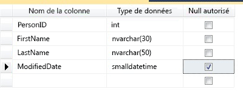
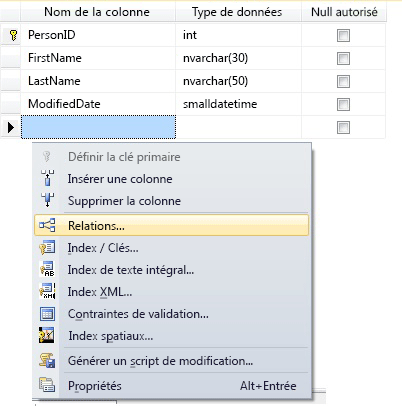
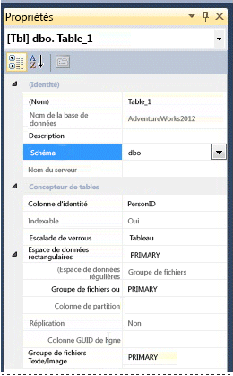

# <a name="create-tables-database-engine"></a>Créer des tables (moteur de base de données)
[!INCLUDE [sqlserver2016-asdb-asdbmi-asa-pdw](../../includes/applies-to-version/sqlserver2016-asdb-asdbmi-asa-pdw.md)]

  Vous pouvez créer une table, la nommer et l’ajouter à une base de données existante à l’aide de [!INCLUDE[ssManStudioFull](../../includes/ssmanstudiofull-md.md)] ou [!INCLUDE[tsql](../../includes/tsql-md.md)].  
  

  
##  <a name="check-your-permissions-first"></a><a name="Permissions"></a> Vérifiez d’abord les autorisations dont vous bénéficiez.  
Cette tâche nécessite une autorisation CREATE TABLE dans la base de données et une autorisation ALTER pour le schéma dans lequel la table est créée.  
  
 Si des colonnes dans l’instruction CREATE TABLE sont définies comme type CLR défini par l’utilisateur, la propriété du type ou une autorisation REFERENCES sont nécessaires.  
  
 Si des colonnes dans l'instruction CREATE TABLE sont associées à une collection de schémas XML, la propriété de la collection de schémas XML ou une autorisation REFERENCES pour le type est nécessaire.  
  
 
## <a name="using-table-designer"></a>Utilisation du Concepteur de tables  
  
1.  Dans SSMS, dans **l’Explorateur d’objets** , connectez-vous à l’instance du [!INCLUDE[ssDE](../../includes/ssde-md.md)] qui contient la base de données à modifier.  
  
2.  Dans l' **Explorateur d'objets** , développez le nœud **Bases de données** , puis la base de données qui va contenir la nouvelle table.  
  
3.  Cliquez avec le bouton droit sur le nœud **Tables** de votre base de données dans l’Explorateur d’objets, puis cliquez sur **Nouvelle table**.  
  
4.  Tapez les noms des colonnes, choisissez des types de données et spécifiez si les valeurs null sont autorisées pour chaque colonne, comme indiqué dans l’illustration suivante :  
  
       
  
5.  Pour spécifier davantage de propriétés pour une colonne, par exemple des valeurs d'identité ou de colonne calculée, cliquez sur la colonne et choisissez les propriétés appropriées dans l'onglet des propriétés de la colonne. Pour plus d’informations sur les propriétés des colonnes, consultez [Propriétés des colonnes de table &#40;SQL Server Management Studio&#41;](../../relational-databases/tables/table-column-properties-sql-server-management-studio.md).  
  
6.  Pour spécifier une colonne comme clé primaire, cliquez avec le bouton droit sur la colonne et sélectionnez **Définir la clé primaire**. Pour plus d’informations, consultez [Create Primary Keys](../../relational-databases/tables/create-primary-keys.md).  
  
7.  Pour créer des relations de clé étrangère, des contraintes de validation ou des index, cliquez avec le bouton droit dans le volet Concepteur de tables et sélectionnez un objet dans la liste, comme indiqué dans l’illustration suivante :  
  
       
  
     Pour plus d'informations sur ces objets, consultez [Create Foreign Key Relationships](../../relational-databases/tables/create-foreign-key-relationships.md), [Create Check Constraints](../../relational-databases/tables/create-check-constraints.md) et [Indexes](../../relational-databases/indexes/indexes.md).  
  
8.  Par défaut, la table est contenue dans le schéma **dbo** . Pour spécifier un schéma différent pour la table, cliquez avec le bouton droit dans le volet Concepteur de tables et sélectionnez **Propriétés** , comme indiqué dans l’illustration suivante. Dans la liste déroulante **Schémas** , sélectionnez le schéma approprié.  
  
       
  
     Pour plus d'informations sur les schémas, consultez [Create a Database Schema](../../relational-databases/security/authentication-access/create-a-database-schema.md).  
  
9. Dans le menu **Fichier** , choisissez **Enregistrer** *nom de la table*.  
  
10. Dans la boîte de dialogue **Choisir un nom** , tapez un nom pour la table et cliquez sur **OK**.  
  
11. Pour afficher la nouvelle table, dans l' **Explorateur d'objets** , développez le nœud **Tables** et appuyez sur la touche **F5** pour actualiser la liste d'objets. La nouvelle table s'affiche dans la liste des tables.  
  
##  <a name="using-transact-sql"></a><a name="TsqlProcedure"></a> Utilisation de Transact-SQL  
  
## <a name="using-query-editor"></a>Utilisation de l’Éditeur de requête  
  
1.  Dans l' **Explorateur d'objets** , connectez-vous à une instance du [!INCLUDE[ssDE](../../includes/ssde-md.md)].  
  
2.  Dans la barre d'outils standard, cliquez sur **Nouvelle requête**.  
  
3.  Copiez et collez l'exemple suivant dans la fenêtre de requête, puis cliquez sur **Exécuter**.  
  
    ```  
    CREATE TABLE dbo.PurchaseOrderDetail  
    (  
        PurchaseOrderID int NOT NULL  
        ,LineNumber smallint NOT NULL  
        ,ProductID int NULL  
        ,UnitPrice money NULL  
        ,OrderQty smallint NULL  
        ,ReceivedQty float NULL  
        ,RejectedQty float NULL  
        ,DueDate datetime NULL  
    );  
    ```  
  
 Pour obtenir d’autres exemples, consultez [CREATE TABLE &#40;Transact-SQL&#41;](../../t-sql/statements/create-table-transact-sql.md).  
  
  
