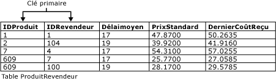

# Contraintes de clé primaire et de clé étrangère
[!INCLUDE[tsql-appliesto-ss2016-asdb-xxxx-xxx-md](../../includes/tsql-appliesto-ss2016-asdb-xxxx-xxx-md.md)]

  Les clés primaires et les clés étrangères sont deux types de contraintes qui peuvent être utilisées pour appliquer l'intégrité des données dans des tables [!INCLUDE[ssNoVersion](../../includes/ssnoversion-md.md)] . Ce sont des objets de base de données importants.  
  
 Cette rubrique contient les sections suivantes.  
  
 [Contraintes de clé primaire](../../relational-databases/tables/primary-and-foreign-key-constraints.md#PKeys)  
  
 [Foreign Key Constraints](../../relational-databases/tables/primary-and-foreign-key-constraints.md#FKeys)  
  
 [Tâches associées](../../relational-databases/tables/primary-and-foreign-key-constraints.md#Tasks)  
  
##   Contraintes de clé primaire  
 Une table contient généralement une colonne ou une combinaison de colonnes dont les valeurs identifient de façon unique chaque ligne dans la table. Cette colonne (ou ces colonnes), appelée clé primaire (PK, Primary Key), assure l'intégrité de l'entité de la table. Les contraintes de clé primaire garantissent des données uniques, c'est pourquoi elles sont souvent définies pour une colonne d'identité.  
  
 Lorsque vous spécifiez une contrainte de clé primaire pour une table, le [!INCLUDE[ssDE](../../includes/ssde-md.md)] garantit l'unicité des données en créant automatiquement un index unique pour les colonnes de clé primaire. Cet index permet également l'accès rapide aux données lorsque la clé primaire est utilisée dans des requêtes. Si une contrainte de clé primaire est définie sur plusieurs colonnes, des valeurs peuvent apparaître en double dans une colonne, mais chaque combinaison de valeurs issues de toutes les colonnes de la définition de contrainte de clé primaire doit être unique.  
  
 Comme illustré ci-dessous, les colonnes **ProductID** et **VendorID** de la table **Purchasing.ProductVendor** constituent une contrainte de clé primaire composite pour cette table. Cela garantit que chaque ligne dans la table **ProductVendor** possède une combinaison unique de **ProductID** et **VendorID**. Cela empêche l'insertion de lignes en double.  
  
   
  
-   Une table ne peut contenir qu'une seule contrainte de clé primaire.  
  
-   Une clé primaire ne peut pas dépasser 16 colonnes et une longueur de clé totale de 900 octets.  
  
-   L'index généré par une contrainte de clé primaire ne peut avoir pour conséquence une augmentation du nombre d'index dans la table à plus de 999 index non cluster et un index cluster.  
  
-   Si vous ne spécifiez pas cluster ni non cluster pour une contrainte de clé primaire, cluster est utilisé s'il n'y a pas d'index cluster sur la table.  
  
-   Toutes les colonnes définies dans une contrainte de clé primaire doivent avoir une valeur autre que Null. Si vous ne spécifiez pas la possibilité de valeur NULL, toutes les colonnes participant à une contrainte de clé primaire ont des valeurs autres que Null.  
  
-   Si une clé primaire est définie sur une colonne avec le type de données CLR défini par l'utilisateur, l'implémentation du type doit prendre en charge le tri binaire.  
  
##   Foreign Key Constraints  
 On appelle « clé étrangère » une colonne ou une combinaison de colonnes utilisée pour établir et conserver une liaison entre les données de deux tables pour contrôler les données qui peuvent être stockées dans la table de clés étrangères. Dans une référence de clé étrangère, la création d'une liaison entre deux tables s'effectue lors du référencement de la ou des colonnes contenant les valeurs de clé primaire d'une table dans la ou les colonnes de l'autre table. Cette colonne devient alors une clé étrangère dans la seconde table.  
  
 Par exemple, la table **Sales.SalesOrderHeader** possède une liaison de clé étrangère avec la table **Sales.SalesPerson** car il existe une relation logique entre les commandes et les vendeurs. La colonne **SalesPersonID** de la table **SalesOrderHeader** correspond à la colonne clé primaire de la table **SalesPerson** . La colonne **SalesPersonID** de la table **SalesOrderHeader** est donc la clé étrangère de la table **SalesPerson** . Lors de la création de cette relation de clé étrangère, une valeur pour **SalesPersonID** ne peut pas être insérée dans la table **SalesOrderHeader** si elle n'existe pas déjà dans la table **SalesPerson** .  
  
 Une table peut référencer au maximum 253 autres tables et colonnes en tant que clés étrangères (références sortantes). [!INCLUDE[ssSQL15](../../includes/sssql15-md.md)] fait passer de 253 à 10 000 le nombre limite des autres tables et colonnes pouvant référencer des colonnes dans une table unique (références entrantes). (Cela nécessite au minimum le niveau de compatibilité 130). Cette augmentation est soumise aux restrictions suivantes :  
  
-   Les références de clés étrangères supérieures à 253 sont uniquement prises en charge pour les opérations DELETE DML. Les opérations UPDATE et MERGE ne sont pas prises en charge.  
  
-   Une table comportant une clé étrangère référencée vers elle-même est toujours limitée à 253 références de clés étrangères.  
  
-   Les références de clés étrangères supérieures à 253 ne sont actuellement disponibles ni pour les index columnstore, ni pour les tables optimisées en mémoire, ni pour Stretch Database, ni pour les tables de clés étrangères partitionnées.  
  
### Index de contraintes de clé étrangère  
 Contrairement aux contraintes de clé primaire, la création d'une contrainte de clé étrangère ne crée pas automatiquement un index correspondant. Toutefois, la création manuelle d'un index pour une clé étrangère s'avère souvent utile pour les raisons suivantes :  
  
-   Les colonnes de clé étrangère sont souvent employées dans les critères de jointure lorsque les données de tables associées sont combinées dans des requêtes grâce à la correspondance de la ou des colonnes de la contrainte de clé étrangère d'une table avec la ou les colonnes de clé primaire ou unique de l'autre table. L'index permet au [!INCLUDE[ssDE](../../includes/ssde-md.md)] de rechercher rapidement des données associées dans la table de clés étrangères. La création de cet index n'est toutefois pas obligatoire. Les données des deux tables associées peuvent être combinées même si aucune contrainte de clé primaire ou étrangère n'est définie entre les tables. La présence d'une relation de clé étrangère entre deux tables indique que toutes deux ont été optimisées en vue de leur combinaison dans une requête utilisant les clés comme critères.  
  
-   Les modifications apportées aux contraintes de clé primaire sont vérifiées parallèlement aux contraintes de clé étrangère des tables associées.  
  
### Intégrité référentielle  
 Bien que la principale utilité d'une contrainte de clé étrangère consiste à contrôler les données qui peuvent être stockées dans la table de clés étrangères, elle contrôle également les modifications apportées aux données de la table de clés primaires. Par exemple, si la ligne d'un vendeur est supprimée de la table **Sales.SalesPerson** et que l'ID de ce vendeur est utilisé pour les commandes de la table **Sales.SalesOrderHeader** , l'intégrité relationnelle entre les deux tables est rompue. Les commandes du vendeur supprimé deviennent des enregistrements orphelins dans la table **SalesOrderHeader** dépourvus de tout lien vers des données de la table **SalesPerson** .  
  
 Une contrainte de clé étrangère empêche une telle situation. La contrainte conserve l'intégrité référentielle en garantissant qu'aucune modification ne peut être apportée aux données de la table de clés primaires si ces modifications rendent non valide la liaison avec les données de la table de clés étrangères. En cas de tentative de suppression de la ligne d'une table de clés primaires ou de modification d'une valeur de clé primaire, l'action échoue si la valeur de clé primaire supprimée ou modifiée correspond à une valeur de la contrainte de clé étrangère d'une autre table. Pour parvenir à modifier ou à supprimer une ligne d'une contrainte de clé étrangère, vous devez d'abord supprimer ou modifier les données de clé étrangère de la table de clés étrangères, ce qui crée une liaison entre la clé étrangère et d'autres données de clé primaire.  
  
#### Intégrité référentielle en cascade  
 Les contraintes d'intégrité référentielle en cascade définissent les actions exécutées par le [!INCLUDE[ssDE](../../includes/ssde-md.md)] lorsqu'un utilisateur tente de supprimer ou de mettre à jour une clé vers laquelle pointent des clés étrangères existantes. Les actions en cascade suivantes peuvent être définies.  
  
 NO ACTION  
 Le [!INCLUDE[ssDE](../../includes/ssde-md.md)] déclenche une erreur et la suppression ou la mise à jour de la ligne dans la table parente est restaurée.  
  
 CASCADE  
 Les lignes correspondantes sont mises à jour ou supprimées dans la table de référence si la ligne de la table parent est mise à jour ou supprimée. La valeur CASCADE ne peut pas être spécifiée si une colonne **timestamp** fait partie de la clé étrangère ou de la clé référencée. L'action ON DELETE CASCADE ne peut pas être spécifiée pour une table possédant un déclencheur INSTEAD OF DELETE. L'action ON UPDATE CASCADE ne peut pas être spécifiée pour les tables possédant des déclencheurs INSTEAD OF UPDATE.  
  
 SET NULL  
 Toutes les valeurs composant la clé étrangère sont définies sur NULL si la ligne correspondante se trouvant dans la table parente est mise à jour ou supprimée. Pour que cette contrainte s'applique, les colonnes clés étrangères doivent pouvoir cependant être définies sur NULL. Les actions suivantes ne peuvent pas être spécifiées pour les tables possédant des déclencheurs INSTEAD OF UPDATE.  
  
 SET DEFAULT  
 Toutes les valeurs qui composent la clé étrangère sont celles par défaut si la ligne correspondante dans la table parente est mise à jour ou supprimée. Pour que cette contrainte s'applique, les colonnes clés étrangères doivent disposer cependant de valeur par défaut. Si une colonne peut être affectée de la valeur NULL et qu'aucune valeur par défaut n'est définie, NULL constitue alors la valeur par défaut de la colonne de façon implicite. Les actions suivantes ne peuvent pas être spécifiées pour les tables possédant des déclencheurs INSTEAD OF UPDATE.  
  
 Il est possible de combiner CASCADE, SET NULL, SET DEFAULT et NO ACTION pour des tables liées par des relations référentielles. Si le moteur [!INCLUDE[ssDE](../../includes/ssde-md.md)] rencontre NO ACTION, il s’interrompt et restaure les actions CASCADE, SET NULL et SET DEFAULT. Lorsqu'une instruction DELETE génère une combinaison d'actions CASCADE, SET NULL, SET DEFAULT et NO ACTION, les actions CASCADE, SET NULL et SET DEFAULT sont appliquées par le [!INCLUDE[ssDE](../../includes/ssde-md.md)] avant toute recherche de NO ACTION.  
  
### Déclencheurs et actions d'intégrité référentielle en cascade  
 Les actions d'intégrité référentielle en cascade activent les déclencheurs AFTER UPDATE ou AFTER DELETE de la manière suivante :  
  
-   Toutes les actions d'intégrité référentielle en cascade générées directement par l'instruction DELETE ou UPDATE initiale sont exécutées en premier.  
  
-   Si des déclencheurs AFTER sont définis sur les tables affectées, ils sont activés une fois réalisées toutes les actions en cascade. Ces déclencheurs sont activés dans l'ordre inverse de l'action en cascade. Si une table possède plusieurs déclencheurs dont aucun n'est un premier ni un dernier déclencheur dédié, ils sont activés dans un ordre aléatoire. Cet ordre est spécifié à l’aide de [sp_settriggerorder](../../relational-databases/system-stored-procedures/sp-settriggerorder-transact-sql.md).  
  
-   Si plusieurs chaînes d'actions en cascade proviennent de la table qui était la cible directe d'une action UPDATE ou DELETE, l'ordre dans lequel ces chaînes activent leurs déclencheurs respectifs n'est pas spécifié. Toutefois, une chaîne active toujours tous ses déclencheurs avant qu'une autre chaîne ne soit activée.  
  
-   Si la table qui est la cible directe d'une action UPDATE ou DELETE possède un déclencheur AFTER, celui-ci est activé, que des lignes soient ou non affectées. Dans ce cas, aucune autre table n'est affectée par les actions en cascade.  
  
-   Si l'un des déclencheurs précédents effectue des opérations UPDATE ou DELETE sur d'autres tables, ces actions peuvent démarrer des chaînes d'actions en cascade secondaires. Ces chaînes secondaires sont traitées pour chaque opération UPDATE ou DELETE une fois activés tous les déclencheurs de toutes les chaînes primaires. Ce processus peut être répété de façon récursive pour des opérations UPDATE ou DELETE ultérieures.  
  
-   La réalisation d'opérations CREATE, ALTER, DELETE ou d'autres opérations DDL (Data Definition Language) dans les déclencheurs peut activer les déclencheurs DDL. Cela peut ensuite activer des opérations DELETE ou UPDATE qui démarrent des chaînes d'actions en cascade et des déclencheurs supplémentaires.  
  
-   Si une erreur est générée dans une chaîne spécifique d'actions d'intégrité référentielle en cascade, une erreur se produit, aucun déclencheur AFTER n'est activé dans cette chaîne et l'opération DELETE ou UPDATE qui a créé la chaîne est restaurée.  
  
-   En outre, une table possédant un déclencheur INSTEAD OF ne peut pas détenir de clause REFERENCES spécifiant une action en cascade. Cependant, un déclencheur AFTER d'une table impliquée dans une action en cascade peut exécuter une instruction INSERT, UPDATE ou DELETE sur une autre table ou vue, qui active un déclencheur INSTEAD OF défini sur cet objet.  
  
##   Tâches associées  
 Le tableau suivant répertorie les tâches courantes associées aux contraintes de clé primaire et de clé étrangère.  
  
|Tâche|Rubrique|  
|----------|-----------|  
|Décrit comment créer une clé primaire.|[Créer des clés primaires](../../relational-databases/tables/create-primary-keys.md)|  
|Décrit comment supprimer une clé primaire.|[Supprimer des clés primaires](../../relational-databases/tables/delete-primary-keys.md)|  
|Explique comment modifier une clé primaire.|[Modifier des clés primaires](../../relational-databases/tables/modify-primary-keys.md)|  
|Explique comment créer des relations de clé étrangère|[Créer les relations entre les clés étrangères](../../relational-databases/tables/create-foreign-key-relationships.md)|  
|Décrit comment modifier les relations de clé étrangère.|[Modifier des relations de clé étrangère](../../relational-databases/tables/modify-foreign-key-relationships.md)|  
|Décrit comment supprimer des relations de clé étrangère.|[Supprimer les relations entre les clés étrangères](../../relational-databases/tables/delete-foreign-key-relationships.md)|  
|Décrit comment afficher les propriétés de clé étrangère.|[Afficher les propriétés de clés étrangères](../../relational-databases/tables/view-foreign-key-properties.md)|  
|Décrit comment désactiver les contraintes de clé étrangère pour la réplication.|[Désactiver des contraintes de clé étrangère pour la réplication](../../relational-databases/tables/disable-foreign-key-constraints-for-replication.md)|  
|Décrit comment désactiver les contraintes de clé étrangère pendant une instruction INSERT ou UPDATE.|[Désactiver les contraintes de clé étrangère avec des instructions INSERT et UPDATE](../../relational-databases/tables/disable-foreign-key-constraints-with-insert-and-update-statements.md)|  
  
  
