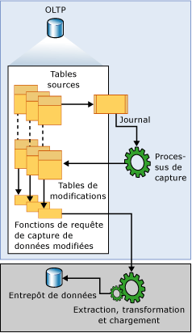

# <a name="about-change-data-capture-sql-server"></a>À propos de la capture de données modifiées (SQL Server)
[!INCLUDE[tsql-appliesto-ss2008-xxxx-xxxx-xxx-md](../../includes/tsql-appliesto-ss2008-xxxx-xxxx-xxx-md.md)]
  La capture de données modifiées enregistre les activités d'insertion, de mise à jour et de suppression appliquées à une table [!INCLUDE[ssNoVersion](../../includes/ssnoversion-md.md)] . Elle rend disponibles les détails des modifications dans un format relationnel simple à utiliser. Les informations sur les colonnes et les métadonnées nécessaires à l'application des modifications à un environnement cible sont capturées pour les lignes modifiées et stockées dans des tables de modification qui reflètent la structure de colonne des tables sources suivies. Des fonctions table sont fournies afin de procurer aux consommateurs un accès systématique aux données modifiées.  
  
 Les consommateurs de données auxquels s'adresse cette technologie sont par exemple les applications d'extraction, de transformation et de chargement (ETL). Une application ETL charge de façon incrémentielle les données modifiées à partir de tables sources [!INCLUDE[ssNoVersion](../../includes/ssnoversion-md.md)] vers un entrepôt de données ou un mini-Data Warehouse. Même si la représentation des tables sources dans l'entrepôt de données doit refléter les modifications apportées aux tables sources, une technologie de bout en bout qui actualise un réplica de la source n'est pas appropriée. Au lieu de cela, il faut un flux de données modifiées fiable, structuré de sorte que les consommateurs puissent l'appliquer aux différentes représentations cibles des données. [!INCLUDE[ssNoVersion](../../includes/ssnoversion-md.md)] apporte cette technologie.  
  
## <a name="change-data-capture-data-flow"></a>Flux de données de capture de données modifiées  
 L'illustration suivante décrit le flux de données principal pour la capture de données modifiées.  
  
   
  
 La source des données modifiées pour la capture de données modifiées est le journal des transactions [!INCLUDE[ssNoVersion](../../includes/ssnoversion-md.md)] . À mesure que des insertions, des mises à jour et des suppressions sont appliquées aux tables sources suivies, les entrées qui décrivent ces modifications sont ajoutées au journal. Le journal sert d’entrée au processus de capture. Le journal est lu et les informations relatives aux modifications sont ajoutées à la table de modifications associée à la table faisant l’objet d’un suivi. Des fonctions sont fournies afin d'énumérer les modifications qui apparaissent dans les tables de modifications sur une plage spécifiée ; ces fonctions retournent les informations sous la forme d'un jeu de résultats filtré. Le jeu de résultats filtré est utilisé en général par un processus d'application pour mettre à jour une représentation de la source dans un environnement externe.  
  
## <a name="understanding-change-data-capture-and-the-capture-instance"></a>Fonctionnement de la capture de données modifiées et de l'instance de capture  
 Pour que les modifications apportées à une table d'une base de données puissent être suivies, la capture de données modifiées doit être activée explicitement pour la base de données. Pour cela, utilisez la procédure stockée [sys.sp_cdc_enable_db](../../relational-databases/system-stored-procedures/sys-sp-cdc-enable-db-transact-sql.md). Lorsque la base de données est activée, les tables sources peuvent être identifiées en tant que tables faisant l’objet d’un suivi à l’aide de la procédure stockée [sys.sp_cdc_enable_table](../../relational-databases/system-stored-procedures/sys-sp-cdc-enable-table-transact-sql.md). Lorsqu'une table est activée pour la capture de données modifiées, une instance de capture associée est créée afin de prendre en charge la dissémination des données modifiées dans la table source. L'instance de capture se compose d'une table de modifications et de deux fonctions de requête maximum. Les métadonnées qui décrivent les détails de configuration de l’instance de capture sont conservées dans les tables de métadonnées de capture de données modifiées, **cdc.change_tables**, **cdc.index_columns**et **cdc.captured_columns**. Ces informations peuvent être extraites en utilisant la procédure stockée [sys.sp_cdc_help_change_data_capture](../../relational-databases/system-stored-procedures/sys-sp-cdc-help-change-data-capture-transact-sql.md).  
  
 Tous les objets associés à une instance de capture sont créés dans le schéma de capture de données modifiées de la base de données activée. Le nom d'instance de capture doit être un nom d'objet valide et doit être unique parmi les instances de capture de base de données. Par défaut, le nom est \<*nom schéma*_*nom table*> de la table source. Sa table de modifications associée est nommée en ajoutant **_CT** au nom d’instance de capture. La fonction utilisée pour vérifier la présence de modifications est nommée en ajoutant le préfixe **fn_cdc_get_all_changes_** au nom d’instance de capture. Si l’instance de capture est configurée pour prendre en charge **net changes**, la fonction de requête **net_changes** est également créée et nommée en ajoutant le préfixe **fn_cdc_get_net_changes\_** au nom d’instance de capture.  
  
## <a name="change-table"></a>Table de modifications  
 Les cinq premières colonnes de la table de modifications de capture de données modifiées sont des colonnes de métadonnées. Elles fournissent des informations supplémentaires pertinentes à la modification enregistrée. Les autres colonnes reflètent les colonnes capturées de la table source, identifiées par nom et généralement par type. Ces colonnes contiennent les données de colonne capturées recueillies à partir de la table source.  
  
 Chaque opération d'insertion ou de suppression appliquée à une table source apparaît comme une ligne unique dans la table de modifications. Les colonnes de données de la ligne qui résulte d'une opération d'insertion contiennent les valeurs de colonne après l'insertion. Les colonnes de données de la ligne qui résulte d'une opération de suppression contiennent les valeurs de colonne avant la suppression. Une opération de mise à jour requiert une entrée de ligne pour identifier les valeurs de colonne avant la mise à jour et une deuxième entrée de ligne pour identifier les valeurs de colonne après la mise à jour.  
  
 Chaque ligne d'une table de modifications contient également des métadonnées supplémentaires permettant d'interpréter l'activité de changement. La colonne __$start_lsn identifie le numéro séquentiel dans le journal de validation affecté à la modification. Ce numéro identifie les modifications qui ont été validées dans la même transaction et il ordonne ces transactions. La colonne \_\_$seqval peut être utilisée pour ordonner davantage de modifications qui ont lieu dans la même transaction. La colonne \_\_$operation enregistre l’opération associée à la modification : 1 = suppression, 2 = insertion, 3 = mise à jour (image avant) et 4 = mise à jour (image après). La colonne \_\_$update_mask est un masque de bits variable avec un bit défini pour chaque colonne capturée. Pour les entrées d'insertion et de suppression, tous les bits du masque de mise à jour sont toujours définis. Toutefois, pour les lignes de mise à jour, seuls les bits correspondant aux colonnes modifiées sont définis.  
  
## <a name="change-data-capture-validity-interval-for-a-database"></a>Intervalle de validité de capture de données modifiées pour une base de données  
 L'intervalle de validité de capture de données modifiées pour une base de données est la durée pendant laquelle les données modifiées sont disponibles pour les instances de capture. L'intervalle de validité commence lorsque la première instance de capture est créée pour une table de base de données et il se poursuit jusqu'au moment présent.  
  
 La taille des données déposées dans les tables de modifications augmentera de manière ingérable si vous n'effectuez pas un nettoyage périodique et systématique de ces données. Le processus de nettoyage de capture de données modifiées est responsable de l'application de la stratégie de nettoyage par rétention. En premier lieu, il déplace le point de terminaison inférieur de l'intervalle de validité afin de satisfaire la restriction temporelle. Ensuite, il supprime les entrées de table de modifications périmées. Par défaut, trois jours de données sont conservés.  
  
 À mesure que le processus de capture valide chaque nouveau lot de données modifiées, de nouvelles entrées sont ajoutées à **cdc.lsn_time_mapping** pour chaque transaction qui a des entrées de table de modifications. Dans la table de mappages, un numéro séquentiel dans le journal de validation et une durée de validation de transaction (colonnes start_lsn et tran_end_time, respectivement) sont conservés. La valeur de numéro séquentiel dans le journal maximale indiquée dans **cdc.lsn_time_mapping** représente la limite supérieure de la fenêtre de validation de la base de données. Sa durée de validation correspondante est utilisée comme base à partir de laquelle le nettoyage par rétention calcule une nouvelle limite inférieure.  
  
 Dans la mesure où le processus de capture extrait les données modifiées du fichier journal de transactions, il existe une latence inhérente entre le moment où une modification est validée dans une table source et le moment où cette modification apparaît dans sa table de modifications associée. Bien que cette latence soit en général assez faible, il est néanmoins important de se souvenir que les données modifiées ne sont disponibles qu'une fois que le processus de capture a traité les entrées de journal connexes.  
  
## <a name="change-data-capture-validity-interval-for-a-capture-instance"></a>Intervalle de validité de capture de données modifiées pour une instance de capture  
 Bien qu'il soit courant que l'intervalle de validité de base de données et l'intervalle de validité d'instance de capture coïncident, ce n'est pas toujours le cas. L'intervalle de validité de l'instance de capture démarre lorsque le processus de capture reconnaît l'instance de capture et commence à enregistrer les modifications associées dans sa table de modifications. En conséquence, si des instances de capture sont créées à différents moments, chacune aura initialement un point de terminaison inférieur différent. La colonne start_lsn du jeu de résultats retourné par [sys.sp_cdc_help_change_data_capture](../../relational-databases/system-stored-procedures/sys-sp-cdc-help-change-data-capture-transact-sql.md) indique le point d’arrêt inférieur actuel pour chaque instance de capture définie. Lorsque le processus de nettoyage nettoie des entrées de table de modifications, il ajuste les valeurs start_lsn pour toutes les instances de capture afin de refléter la nouvelle limite inférieure pour les données modifiées disponibles. Seules les instances de capture qui ont des valeurs start_lsn actuellement inférieures à la nouvelle limite inférieure sont ajustées. Avec le temps, si aucune nouvelle instance de capture n'est créée, les intervalles de validité de toutes les instances auront tendance à coïncider avec l'intervalle de validité de base de données.  
  
 L'intervalle de validité est important pour les consommateurs de données modifiées car l'intervalle d'extraction pour une demande doit être couvert entièrement par l'intervalle de validité de capture de données modifiées actuel de l'instance de capture. Si le point de terminaison inférieur de l'intervalle d'extraction se situe à gauche du point de terminaison inférieur de l'intervalle de validité, certaines données modifiées pourraient être manquantes en raison d'un nettoyage agressif. Si le point de terminaison supérieur de l'intervalle d'extraction se situe à droite du point de terminaison supérieur de l'intervalle de validité, cela signifie que le processus de capture n'a pas encore effectué de traitement sur toute la durée représentée par l'intervalle d'extraction, auquel cas des données modifiées pourraient également être manquantes.  
  
 La fonction [sys.fn_cdc_get_min_lsn](../../relational-databases/system-functions/sys-fn-cdc-get-min-lsn-transact-sql.md) est utilisée pour extraire la valeur LSN minimale actuelle pour une instance de capture, alors que [sys.fn_cdc_get_max_lsn](../../relational-databases/system-functions/sys-fn-cdc-get-max-lsn-transact-sql.md) permet d’extraire la valeur LSN maximale actuelle. Lors de l'interrogation de données modifiées, si la plage de numéros séquentiels dans le journal spécifiée n'est pas comprise entre ces deux valeurs de numéros séquentiels dans le journal, les fonctions de requête de capture de données modifiées échouent.  
  
## <a name="handling-changes-to-source-tables"></a>Gestion des modifications apportées aux tables sources  
 La gestion des modifications de colonnes dans les tables sources pour lesquelles un suivi est effectué est un problème délicat pour les consommateurs en aval. Bien que l'activation de la capture de données modifiées sur une table source n'empêche pas de telles modifications DDL d'avoir lieu, la capture de données modifiées aide à atténuer l'effet sur les consommateurs en permettant aux jeux de résultats remis retournés par le biais de l'API de rester inchangés même lorsque la structure de colonne de la table source sous-jacente change. Cette structure de colonne fixe est également répercutée dans la table de modifications sous-jacente à laquelle les fonctions de requête définies accèdent.  
  
 Pour gérer une table de modifications à structure de colonne fixe, le processus de capture responsable du remplissage de la table de modifications ignore toute nouvelle colonne qui n'a pas été identifiée pour la capture lorsque la table source a été activée pour la capture de données modifiées. Si une colonne suivie est supprimée, des valeurs NULL sont fournies pour la colonne dans les entrées de modification suivantes. Toutefois, si une colonne existante subit une modification de son type de données, la modification est propagée à la table de modifications afin de s'assurer que le mécanisme de capture n'introduit pas de perte de données dans les colonnes suivies. Le processus de capture publie également dans la table cdc.ddl_history toutes les modifications de structure de colonne détectées pour les tables faisant l'objet d'un suivi. Les consommateurs souhaitant être informés des ajustements qui peuvent se révéler nécessaires dans les applications en aval doivent utiliser la procédure stockée [sys.sp_cdc_get_ddl_history](../../relational-databases/system-stored-procedures/sys-sp-cdc-get-ddl-history-transact-sql.md).  
  
 En général, l'instance de capture actuelle conserve sa forme lorsque des modifications DDL sont appliquées à sa table source associée. Toutefois, il est possible de créer pour la table une deuxième instance de capture qui reflète la nouvelle structure de colonne. Cela permet au processus de capture d'apporter des modifications à la même table source dans deux tables de modifications distinctes qui ont deux structures de colonne différentes. Par conséquent, tandis qu'une table de modifications peut continuer à servir les programmes actuellement opérationnels, la deuxième peut être affectée à un environnement de développement qui tente d'incorporer les nouvelles données de colonnes. Le fait d'autoriser le mécanisme de capture à remplir les deux tables de modifications en tandem signifie qu'une transition de l'une à l'autre peut être accomplie sans perte de données de modifications. Cela peut arriver à tout moment où les deux chronologies de capture de données modifiées se chevauchent. Lorsque la transition est terminée, l'instance de capture obsolète peut être supprimée.  
  
> [!NOTE]  
>  La quantité maximale d'instances de capture qui peuvent être associées simultanément à une table source unique est de deux.  
  
## <a name="relationship-between-the-capture-job-and-the-transactional-replication-logreader"></a>Relation entre le travail de capture et le lecteur de journal de réplication transactionnelle  
 La logique du processus de capture de données modifiées est incorporée à la procédure stockée [sp_replcmds](../../relational-databases/system-stored-procedures/sp-replcmds-transact-sql.md), une fonction de serveur interne intégrée à sqlservr.exe et utilisée également par la réplication transactionnelle pour la collecte des modifications depuis le journal des transactions. Lorsque seule la capture de données modifiées est activée pour une base de données, vous devez créer le travail de capture de SQL Server Agent en tant que véhicule pour l'appel de sp_replcmds. Lorsque la réplication est également présente, le lecteur de journal transactionnel seul est utilisé pour répondre aux besoins en données modifiées pour ces deux consommateurs. Cette stratégie réduit considérablement les contentions de journaux lorsque la réplication et la capture de données modifiées sont toutes deux activées pour la même base de données.  
  
 Le basculement entre ces deux modes opérationnels de capture de données modifiées se produit automatiquement à chaque modification de l'état de réplication d'une base de données activée pour la capture de données modifiées.  
  
> [!IMPORTANT]  
>  Pour que le processus s'exécute, les deux instances de la logique de capture exigent que l'Agent [!INCLUDE[ssNoVersion](../../includes/ssnoversion-md.md)] soit en cours d'exécution.  
  
 La principale tâche du processus de capture consiste à analyser le journal et à écrire des données de colonnes et des informations relatives aux transactions dans les tables de modifications de capture de données modifiées. Pour garantir une limite transactionnellement cohérente parmi toutes les tables de modifications de capture de données modifiées qu'il remplit, le processus de capture ouvre et valide sa propre transaction à chaque cycle d'analyse. Il détecte lorsque des tables sont activées pour la capture de données modifiées et les inclut automatiquement dans le jeu de tables pour lesquelles un contrôle actif est effectué pour les entrées de modification dans le journal. De la même façon, la désactivation de la capture de données modifiées est également détectée et provoque la suppression de la table source du jeu de tables contrôlé de manière active. Lorsque le traitement d'une section du journal est terminé, le processus de capture en informe la logique de troncation de journal du serveur, qui utilise ces informations pour identifier les entrées de journal éligibles pour la troncation.  
  
> [!NOTE]  
>  Lorsqu'une base de données est activée pour la capture de données modifiées, même si le mode de récupération est défini sur la récupération simple le point de troncation de journal n'avancera pas tant que toutes les modifications marquées pour la capture n'ont pas été collectées par le processus de capture. Si le processus de capture ne s'exécute pas et que des modifications doivent être collectées, l'exécution de CHECKPOINT ne tronquera pas le journal.  
  
 Le processus de capture est également utilisé pour conserver l'historique des modifications DDL pour les tables faisant l'objet d'un suivi. Les instructions DDL qui sont associées à la capture de données modifiées créent des entrées dans le journal des transactions de base de données chaque fois qu'une base de données ou une table prenant en charge la capture de données modifiées est supprimée ou chaque fois que des colonnes d'une table prenant en charge la capture de données modifiées sont ajoutées, modifiées ou supprimées. Ces entrées de journal sont traitées par le processus de capture, qui publie ensuite les événements DDL associés dans la table cdc.ddl_history. Vous pouvez obtenir des informations sur les événements DDL qui affectent les tables faisant l’objet d’un suivi à l’aide de la procédure stockée [sys.sp_cdc_get_ddl_history](../../relational-databases/system-stored-procedures/sys-sp-cdc-get-ddl-history-transact-sql.md).  
  
## <a name="change-data-capture-agent-jobs"></a>Travaux de l'agent de capture de données modifiées  
 Deux travaux de l'Agent [!INCLUDE[ssNoVersion](../../includes/ssnoversion-md.md)] sont en général associés à une base de données activée pour la capture de données modifiées : l'un est utilisé pour remplir les tables de modifications de base de données et l'autre est chargé de les nettoyer. Ces deux travaux sont constitués d'une seule étape qui exécute une commande [!INCLUDE[tsql](../../includes/tsql-md.md)] . La commande [!INCLUDE[tsql](../../includes/tsql-md.md)] appelée est une procédure stockée définie par la capture de données modifiées qui implémente la logique du travail. Les travaux sont créés lorsque la première table de la base de données est activée pour la capture de données modifiées. Le travail de nettoyage est toujours créé. Le travail de capture est créé seulement si aucune publication transactionnelle n'est définie pour la base de données. Le travail de capture est créé également lorsque la capture de données modifiées et la réplication transactionnelle sont toutes deux activées pour une base de données, et le travail du lecteur de journal est supprimé car aucune publication n'est plus définie pour la base de données.  
  
 Les travaux de capture et de nettoyage sont tous deux créés à l'aide de paramètres par défaut. Le travail de capture est démarré immédiatement. Il s'exécute continuellement et traite un maximum de 1000 transactions par cycle d'analyse, avec une attente de 5 secondes entre les cycles. Le travail de nettoyage s'exécute tous les jours à deux heures du matin. Il conserve les entrées de table de modifications pendant 4 320 minutes (trois jours) et supprime un maximum de 5 000 entrées avec une instruction de suppression unique.  
  
 Les travaux de l'agent de capture de données modifiées sont supprimés lorsque la capture de données modifiées est désactivée pour une base de données. Le travail de capture peut également être supprimé lorsque la première publication est ajoutée à une base de données et que la capture de données modifiées et la réplication transactionnelle sont toutes deux activées.  
  
 En interne, les travaux de l’agent de capture de données modifiées sont créés et supprimés à l’aide des procédures stockées [sys.sp_cdc_add_job](../../relational-databases/system-stored-procedures/sys-sp-cdc-add-job-transact-sql.md) et [sys.sp_cdc_drop_job](../../relational-databases/system-stored-procedures/sys-sp-cdc-drop-job-transact-sql.md), respectivement. Ces procédures stockées sont également exposées afin que les administrateurs puissent contrôler la création et la suppression de ces travaux.  
  
 Un administrateur n'a aucun contrôle explicite sur la configuration par défaut des travaux de l'agent de capture de données modifiées. La procédure stockée [sys.sp_cdc_change_job](../../relational-databases/system-stored-procedures/sys-sp-cdc-change-job-transact-sql.md) est fournie afin de permettre la modification des paramètres de configuration par défaut. En outre, la procédure stockée [sys.sp_cdc_help_jobs](../../relational-databases/system-stored-procedures/sys-sp-cdc-help-jobs-transact-sql.md) permet d’afficher les paramètres de configuration actuels. Le travail de capture et le travail de nettoyage extraient des paramètres de configuration de la table msdb.dbo.cdc_jobs lors du démarrage. Toute modification apportée à ces valeurs à l’aide de [sys.sp_cdc_change_job](../../relational-databases/system-stored-procedures/sys-sp-cdc-change-job-transact-sql.md) ne prend effet qu’après l’arrêt et le redémarrage du travail.  
  
 Deux procédures stockées supplémentaires sont fournies afin de permettre le démarrage et l’arrêt des travaux de l’agent de capture de données modifiées : [sys.sp_cdc_start_job](../../relational-databases/system-stored-procedures/sys-sp-cdc-start-job-transact-sql.md) et [sys.sp_cdc_stop_job](../../relational-databases/system-stored-procedures/sys-sp-cdc-stop-job-transact-sql.md).  
  
> [!NOTE]  
>  Le démarrage et l'arrêt du travail de capture ne provoque pas de perte des données modifiées. Il empêche seulement le processus de capture d'analyser activement le journal à la recherche d'entrées de modification à déposer dans les tables de modifications. Une stratégie raisonnable visant à empêcher l'analyse du journal d'ajouter une charge durant les périodes de demande de pointe consiste à arrêter le travail de capture et à le redémarrer lorsque la demande est réduite.  
  
 Les deux travaux de l'Agent [!INCLUDE[ssNoVersion](../../includes/ssnoversion-md.md)] ont été conçus pour être suffisamment flexibles et configurables afin de répondre aux besoins élémentaires des environnements de capture de données modifiées. Dans les deux cas, toutefois, les procédures stockées sous-jacentes qui fournissent la fonctionnalité principale ont été exposées afin qu'une personnalisation supplémentaire soit possible.  
  
 La capture de données modifiées ne peut pas fonctionner correctement lorsque le service Moteur de base de données ou le service SQL Server Agent s'exécute sous la compte SERVICE RÉSEAU. Cela peut entraîner l'erreur 22832.  
 
## <a name="working-with-database-and-table-collation-differences"></a>Différences de classement entre la base de données et la table

Il est important de noter que, dans certains cas, les classements peuvent ne pas être les mêmes dans la base de données et dans les colonnes d’une table configurée pour la capture des changements de données. La capture des changements de données utilise le stockage temporaire pour remplir les tables côté. Si une table comprend des colonnes CHAR ou VARCHAR avec des classements différents de ceux de la base de données, et si ces colonnes stockent des caractères non ASCII (par exemple, des caractères DBCS codés sur deux octets), la capture des changements de données peut ne pas être en mesure de maintenir la cohérence entre les données modifiées et les données des tables de base. Cela est dû au fait que les variables de stockage temporaire ne peuvent pas être associées à des classements.

Envisagez plutôt l’une des approches suivantes pour vérifier que les données modifiées sont cohérentes avec celles des tables de base :

- Utilisez le type de données NCHAR ou NVARCHAR pour les colonnes qui contiennent des données non ASCII.

- Vous pouvez également utiliser le même classement pour les colonnes et pour la base de données.

Par exemple, si vous avez une base de données qui utilise le classement SQL_Latin1_General_CP1_CI_AS, regardez le tableau suivant :

```tsql
CREATE TABLE T1( 
     C1 INT PRIMARY KEY, 
     C2 VARCHAR(10) collate Chinese_PRC_CI_AI)
```

La capture des changements de données peut échouer à capturer les données binaires de la colonne C2, car son classement est différent (Chinese_PRC_CI_AI). Utilisez NVARCHAR pour éviter ce problème :

```tsql
CREATE TABLE T1( 
     C1 INT PRIMARY KEY, 
     C2 NVARCHAR(10) collate Chinese_PRC_CI_AI --Unicode data type, CDC works well with this data type)
```

## <a name="see-also"></a> Voir aussi  
 [Suivi des modifications de données &#40;SQL Server&#41;](../../relational-databases/track-changes/track-data-changes-sql-server.md)   
 [Activer et désactiver la capture de données modifiées &#40;SQL Server&#41;](../../relational-databases/track-changes/enable-and-disable-change-data-capture-sql-server.md)   
 [Utiliser les données modifiées &#40;SQL Server&#41;](../../relational-databases/track-changes/work-with-change-data-sql-server.md)   
 [Administrer et surveiller la capture de données modifiées &#40;SQL Server&#41;](../../relational-databases/track-changes/administer-and-monitor-change-data-capture-sql-server.md)  
  
  
