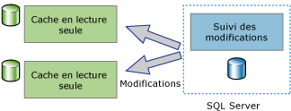
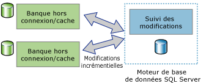

# À propos du suivi des modifications (SQL Server)
[!INCLUDE[tsql-appliesto-ss2008-asdb-xxxx-xxx-md](../../includes/tsql-appliesto-ss2008-asdb-xxxx-xxx-md.md)]

  Le suivi des modifications est une solution légère qui fournit un mécanisme efficace de suivi des modifications pour les applications. En règle générale, les développeurs d’applications devaient implémenter des mécanismes personnalisés de suivi des modifications pour permettre aux applications d’effectuer des requêtes portant sur les modifications apportées aux données d’une base de données et d’accéder aux informations liées à ces modifications. La création de ces mécanismes demandait souvent un effort important et l’utilisation d’une combinaison de déclencheurs, de colonnes **timestamp** , de nouvelles tables pour le stockage des informations de suivi et de processus de nettoyage personnalisés.  
  
 La quantité d'informations relatives aux modifications varie selon les types d'applications. Les applications peuvent utiliser le suivi des modifications pour répondre aux questions suivantes sur les modifications apportées à une table utilisateur :  
  
-   Quelles lignes ont changé pour une table utilisateur ?  
  
    -   Seul le fait qu'une ligne a changé est requis, et non le nombre de fois que la ligne a été modifiée ou les valeurs des modifications intermédiaires.  
  
    -   Les données les plus récentes peuvent être obtenues directement à partir de la table qui fait l'objet du suivi.  
  
-   Est-ce qu'une ligne a changé ?  
  
    -   Le fait qu'une ligne a changé et les informations sur la modification doivent être disponibles et enregistrées au moment où la modification a été apportée dans la même transaction.  
  
> [!NOTE]  
>  Si une application requiert des informations sur toutes les modifications apportées et les valeurs intermédiaires des données modifiées, il peut être plus approprié d'utiliser la capture de données modifiées plutôt que le suivi des modifications. Pour plus d’informations, consultez [À propos de la capture de données modifiées &#40;SQL Server&#41;](../../relational-databases/track-changes/about-change-data-capture-sql-server.md).  
  
## Applications de synchronisation monodirectionnelle et bidirectionnelle  
 Les applications qui doivent synchroniser des données avec une instance du [!INCLUDE[ssDEnoversion](../../includes/ssdenoversion-md.md)] doivent être en mesure de rechercher les modifications. Le suivi des modifications peut servir de base aux applications de synchronisation monodirectionnelle et bidirectionnelle.  
  
### Applications de synchronisation monodirectionnelle  
 Il est possible de créer des applications de synchronisation monodirectionnelle, comme les applications clientes ou de mise en cache de couche intermédiaire, qui utilisent le suivi des modifications. Comme le montre l’illustration suivante, une application de mise en cache requiert que les données soient stockées dans le [!INCLUDE[ssDE](../../includes/ssde-md.md)] et mises en cache dans d’autres banques de données. L'application doit être en mesure de maintenir le cache à jour avec toutes les modifications apportées aux tables de la base de données. Il n'y a pas de modifications à retransmettre au [!INCLUDE[ssDE](../../includes/ssde-md.md)].  
  
   
  
### Applications de synchronisation bidirectionnelle  
 Il est aussi possible de créer des applications de synchronisation bidirectionnelle qui utilisent le suivi des modifications. Dans ce scénario, les données d'une instance du [!INCLUDE[ssDE](../../includes/ssde-md.md)] sont synchronisées avec une ou plusieurs banques de données. Les données de ces banques peuvent être mises à jour et les modifications doivent être resynchronisées avec le [!INCLUDE[ssDE](../../includes/ssde-md.md)].  
  
   
  
 Un bon exemple d'application de synchronisation bidirectionnelle est une application qui n'est connectée que de manière occasionnelle. Dans ce type d'application, une application cliente interroge et met à jour une banque locale. Lorsqu'une connexion est disponible entre un client et un serveur, l'application effectue une synchronisation avec le serveur et les données modifiées circulent dans les deux directions.  
  
 Les applications de synchronisation bidirectionnelle doivent être en mesure de détecter les conflits. Un conflit peut se produire si les mêmes données ont été modifiées dans les deux banques de données entre deux synchronisations. Dotée d'une fonctionnalité de détection des conflits, une application peut faire en sorte que les modifications ne soient pas perdues.  
  
## Mode de fonctionnement du suivi des modifications  
 Pour configurer le suivi des modifications, vous pouvez utiliser des instructions DDL ou [!INCLUDE[ssManStudioFull](../../includes/ssmanstudiofull-md.md)]. Pour plus d’informations, consultez [Activer et désactiver le suivi des modifications &#40;SQL Server&#41;](../../relational-databases/track-changes/enable-and-disable-change-tracking-sql-server.md). Pour effectuer le suivi des modifications, il est nécessaire de l'activer d'abord pour la base de données, puis pour les tables à suivre au sein de cette base de données. Aucune modification de la définition de table n’est requise et aucun déclencheur n’est créé.  
  
 À l'issue de la configuration du suivi des modifications pour une table, toute instruction DML qui affecte des lignes dans la table provoquera l'enregistrement d'informations de suivi des modifications pour chaque ligne modifiée. Pour rechercher les lignes qui ont changé et obtenir des informations sur les modifications, vous pouvez utiliser des [fonctions de suivi des modifications](../../relational-databases/system-functions/change-tracking-functions-transact-sql.md).  
  
 Les valeurs de la colonne clé primaire sont les seules informations de la table faisant l'objet d'un suivi à être enregistrées avec les informations de modification. Ces valeurs identifient les lignes qui ont été modifiées. Pour obtenir les données les plus récentes pour ces lignes, une application peut utiliser les valeurs de la colonne clé primaire pour joindre la table source à la table faisant l'objet du suivi.  
  
 Les informations sur la modification apportée à chaque ligne peuvent également être obtenues en utilisant le suivi des modifications. Il peut s'agir du type d'opération DML qui a provoqué la modification (insertion, mise à jour ou suppression) ou des colonnes modifiées dans le cadre d'une opération de mise à jour. 
 
## Nettoyage du suivi des modifications
Le suivi des informations pour toutes les tables (celles pour lesquelles le suivi des modifications est activé) est stocké dans un rowstore en mémoire. Les données de suivi des modifications associées à chaque table activée pour le suivi des modifications sont vidées à chaque point de contrôle, du rowstore en mémoire vers la table interne sur disque correspondante. Durant le point de contrôle, le rowstore en mémoire est également purgé une fois que les lignes ont été déplacées vers les tables sur disque.

Chaque table activée pour le suivi des modifications a une table sur disque interne utilisée par les fonctions de suivi des modifications pour déterminer la version de modification et les lignes qui ont changé depuis une version particulière. Chaque fois que le thread de **nettoyage automatique** se réveille, il analyse toutes les bases de données utilisateur sur l’instance de SQL Server pour identifier les bases de données activées pour le suivi des modifications. En fonction du paramètre de période de rétention de la base de données, chaque table sur disque interne est purgée de ses enregistrements ayant expiré.

Une procédure stockée a été ajoutée aux Service Packs pour [!INCLUDE[ssSQL14](../../includes/sssql14-md.md)] et [!INCLUDE[ssSQL15](../../includes/sssql15-md.md)] afin d’effectuer un nettoyage manuel des tables internes de suivi des modifications. Vous trouverez plus d’informations sur cette procédure stockée dans l’article [KB173157](https://support.microsoft.com/help/3173157/adds-a-stored-procedure-for-the-manual-cleanup-of-the-change-tracking-side-table-in-sql-server-2014-sp2-or-2016-sp1). 
  
##  Voir aussi  
 [Activer et désactiver le suivi des modifications &#40;SQL Server&#41;](../../relational-databases/track-changes/enable-and-disable-change-tracking-sql-server.md)   
 [Utiliser le suivi des modifications &#40;SQL Server&#41;](../../relational-databases/track-changes/work-with-change-tracking-sql-server.md)   
 [Gérer le suivi des modifications &#40;SQL Server&#41;](../../relational-databases/track-changes/manage-change-tracking-sql-server.md)   
 [Suivi des modifications de données &#40;SQL Server&#41;](../../relational-databases/track-changes/track-data-changes-sql-server.md)  
  
  
