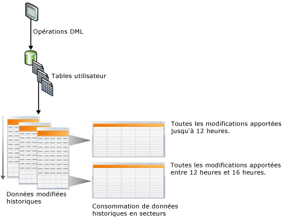
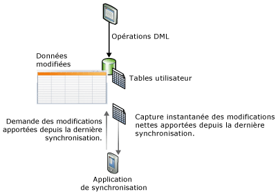

# Suivre les modifications de données (SQL Server)
[!INCLUDE[tsql-appliesto-ss2008-asdb-xxxx-xxx-md](../../includes/tsql-appliesto-ss2008-asdb-xxxx-xxx-md.md)]
  [!INCLUDE[ssCurrent](../../includes/sscurrent-md.md)] fournit deux fonctionnalités qui suivent les modifications apportées aux données d'une base de données : [Capture de données modifiées](#Capture) et [Suivi des modifications](#Tracking). Ces fonctionnalités permettent aux applications de déterminer les modifications de DML (opérations d’insertion, de mise à jour et de suppression) apportées aux tables utilisateur dans une base de données. La capture de données modifiées et le suivi des modifications peuvent être activés sur la même base de données ; aucune attention particulière n'est requise. Pour connaître les éditions de [!INCLUDE[ssNoVersion](../../includes/ssnoversion-md.md)] qui prennent en charge la capture de données et le suivi des modifications, consultez [Fonctionnalités prises en charge par les éditions de SQL Server 2016](~/sql-server/editions-and-supported-features-for-sql-server-2016.md). Lorsque le suivi des modifications est pris en charge par [!INCLUDE[ssSDS_md](../../includes/sssds-md.md)].
  
## Avantages liés à l'utilisation de la capture de données modifiées ou du suivi des modifications  
 Certaines applications doivent, pour être efficaces, être en mesure de rechercher les données qui ont été modifiées dans une base de données. En règle générale, les développeurs d'applications doivent, pour identifier les données modifiées, implémenter une méthode de suivi personnalisée dans leurs applications en utilisant une combinaison de déclencheurs, de colonnes d'horodateur et de tables supplémentaires. La création de ces applications demande généralement un effort considérable, aboutit à des mises à jour de schéma et se traduit souvent par une importante diminution des performances.  
  
 L'utilisation de la capture de données modifiées ou du suivi des modifications dans les applications pour suivre les modifications dans une base de données présente les avantages suivants par rapport au développement d'une solution personnalisée :  
  
-   Durée de développement réduite. [!INCLUDE[ssCurrent](../../includes/sscurrent-md.md)]proposant cette fonctionnalité, vous n'avez pas à développer de solution personnalisée.  
  
-   Aucune modification de schéma n'est requise. Vous n'avez pas à ajouter de colonnes ou de déclencheurs ni à créer une table latérale dans laquelle suivre les lignes supprimées ou stocker des informations de suivi des modifications si les colonnes ne peuvent pas être ajoutées aux tables utilisateur.  
  
-   Il existe un mécanisme de nettoyage intégré. Le nettoyage du suivi des modifications s'effectue automatiquement en arrière-plan. Un nettoyage personnalisé pour des données stockées dans une table annexe n'est pas requis.  
  
-   Des fonctions sont fournies pour l'obtention des informations de modification.  
  
-   Faible charge de traitement des opérations DML. Le suivi synchrone des modifications entraîne toujours une charge de traitement. Toutefois, le recours au suivi des modifications peut contribuer à réduire cette charge. La charge de traitement est souvent inférieure à celle qu’entraînent des solutions alternatives, en particulier lorsque celles-ci demandent d’utiliser des déclencheurs.  
  
-   Le suivi des modifications est basé sur des transactions validées. L'ordre des modifications est basé sur l'heure de validation des transactions. Cela favorise l'obtention de résultats fiables lorsque sont impliquées des transactions longues ou qui se chevauchent. Les solutions personnalisées qui utilisent des valeurs **timestamp** doivent être conçues spécifiquement pour gérer ces scénarios.  
  
-   Les outils standard sont disponibles pour les opérations de configuration et de gestion. [!INCLUDE[ssCurrent](../../includes/sscurrent-md.md)] fournit des instructions DDL standard, [!INCLUDE[ssManStudioFull](../../includes/ssmanstudiofull-md.md)], des affichages catalogue et des autorisations de sécurité.  
  
## Différences de fonctionnalités entre la capture de données modifiées et le suivi des modifications  
 Le tableau suivant répertorie les différences de fonctionnalités entre la capture de données modifiées et le suivi des modifications. Le mécanisme de suivi de la capture de données modifiées implique une capture asynchrone des modifications à partir du journal des transactions afin que les modifications soient disponibles après l'opération DML. Dans le suivi des modifications, le mécanisme de suivi implique le suivi synchrone des modifications en parallèle avec les opérations DML, afin que les informations relatives aux modifications soient disponibles immédiatement.  
  
|Fonctionnalité|Capture des données modifiées|Suivi des modifications|  
|-------------|-------------------------|---------------------|  
|**Modifications suivies**|||  
|Modifications DML|Oui|Oui|  
|**Informations suivies**|||  
|Données historiques|Oui|non|  
|Si la colonne a été modifiée|Oui|Oui|  
|Type DML|Oui|Oui|  
  
##   Change Data Capture  
 La capture de données modifiées fournit des informations de modification historiques pour une table utilisateur en capturant à la fois le fait que des modifications DML aient été apportées et les données effectivement modifiées. Les modifications sont capturées à l'aide d'un processus asynchrone qui lit le journal des transactions et n'a qu'un faible impact sur le système.  
  
 Comme indiqué dans l'illustration suivante, les modifications apportées aux tables utilisateur sont capturées dans des tables de modifications correspondantes. Ces tables de modifications fournissent une vue historique des modifications au fil du temps. Les fonctions de [capture des changements de données](../../relational-databases/system-functions/change-data-capture-functions-transact-sql.md) fournies par [!INCLUDE[ssNoVersion](../../includes/ssnoversion-md.md)] permettent de consommer facilement et systématiquement les changements de données.  
  
   
  
### Modèle de sécurité  
 Cette section décrit le modèle de sécurité de la capture de données modifiées.  
  
 **Configuration et administration**  
 Pour activer ou désactiver la capture de données modifiées pour une base de données, l’appelant de [sys.sp_cdc_enable_db &#40;Transact-SQL&#41;](../../relational-databases/system-stored-procedures/sys-sp-cdc-enable-db-transact-sql.md) ou [sys.sp_cdc_disable_db &#40;Transact-SQL&#41;](../../relational-databases/system-stored-procedures/sys-sp-cdc-disable-db-transact-sql.md) doit être membre du rôle serveur fixe **sysadmin**. Activer et désactiver la capture de données modifiées au niveau de la table exigent que l’appelant de [sys.sp_cdc_enable_table &#40;Transact-SQL&#41;](../../relational-databases/system-stored-procedures/sys-sp-cdc-enable-table-transact-sql.md) et [sys.sp_cdc_disable_table &#40;Transact-SQL&#41;](../../relational-databases/system-stored-procedures/sys-sp-cdc-disable-table-transact-sql.md) soit membre du rôle sysadmin ou du rôle de base de données **db_owner**.  
  
 L’utilisation de procédures stockées pour prendre en charge l’administration des travaux de capture de données modifiées est limitée aux membres du rôle serveur **sysadmin** et du rôle de base de données **db_owner** .  
  
 **Énumération des modifications et requêtes de métadonnées**  
 Pour accéder aux données modifiées associées à une instance de capture, l'utilisateur doit pouvoir accéder à toutes les colonnes capturées de la table source associée. De plus, si un rôle de régulation est spécifié lors de la création de l'instance de capture, l'appelant doit également être membre du rôle de régulation spécifié. Les autres fonctions de capture de données modifiées générales pour accéder aux métadonnées seront accessibles à tous les utilisateurs de base de données par le biais du rôle public, bien que l'accès aux métadonnées retournées soit en général également régulé par le biais de l'accès choisi aux tables sources sous-jacentes et par l'appartenance aux rôles de régulation définis.  
  
 **Opérations DDL pour modifier les tables sources activées pour la capture de données modifiées**  
 Lorsqu’une table est activée pour la capture de données modifiées, des opérations DDL peuvent être appliquées à la table uniquement par un membre du rôle serveur fixe **sysadmin**, un membre du **rôle de base de données db_owner**ou un membre du **rôle de base de données db_ddladmin**. Les utilisateurs autorisés de manière explicite à effectuer des opérations DDL sur la table recevront l'erreur 22914 s'ils tentent d'effectuer ces opérations.  
  
### Considérations relatives aux types de données pour la capture de données modifiées  
 Tous les types de colonne de base sont pris en charge par la capture de données modifiées. Le tableau suivant indique le comportement et les limites de plusieurs types de colonne.  
  
|Type de colonne|Modifications capturées dans les tables de modifications|Limitations|  
|--------------------|---------------------------------------|-----------------|  
|Colonnes éparses|Oui|Ne prend pas en charge la capture des modifications lors de l'utilisation d'un jeu de colonnes.|  
|Colonnes calculées|non|Les modifications apportées aux colonnes calculées ne sont pas suivies. La colonne apparaîtra dans la table de modifications avec le type approprié, mais aura une valeur NULL.|  
|XML|Oui|Les modifications apportées aux éléments XML individuels ne sont pas suivies.|  
|timestamp|Oui|Le type de données dans la table des modifications est converti en binaire.|  
|types de données BLOB|Oui|L'image précédente de la colonne BLOB est stockée uniquement si la colonne elle-même est modifiée.|  
  
### Capture de données modifiées et autres fonctionnalités de SQL Server  
 Cette section décrit comment les fonctionnalités suivantes interagissent avec la capture de données modifiées :  
  
-   Mise en miroir de bases de données  
  
-   Réplication transactionnelle  
  
-   Restauration ou attachement de base de données  
  
#### Mise en miroir de bases de données  
 Une base de données prenant en charge la capture de données modifiées peut être mise en miroir. Pour faire en sorte que la capture et le nettoyage s'exécutent automatiquement sur le miroir, suivez ces étapes :  
  
1.  Vérifiez que l'Agent [!INCLUDE[ssNoVersion](../../includes/ssnoversion-md.md)] s'exécute sur le miroir.  
  
2.  Créez le travail de capture et le travail de nettoyage sur le miroir le basculement de l'unité principale sur l'unité miroir. Pour créer les travaux, utilisez la procédure stockée [sys.sp_cdc_add_job &#40;Transact-SQL&#41;](../../relational-databases/system-stored-procedures/sys-sp-cdc-add-job-transact-sql.md).  
  
 Pour plus d’informations sur la mise en miroir des bases de données, consultez [Mise en miroir de bases de données &#40;SQL Server&#41;](../../database-engine/database-mirroring/database-mirroring-sql-server.md).  
  
#### Réplication transactionnelle  
 La capture de données modifiées et la réplication transactionnelle peuvent coexister dans la même base de données, mais le remplissage des tables de modifications est géré différemment lorsque les deux fonctionnalités sont activées. La capture de données modifiées et la réplication transactionnelle utilisent toujours la même procédure, [sp_replcmds](../../relational-databases/system-stored-procedures/sp-replcmds-transact-sql.md), pour lire les modifications dans le journal des transactions. Quand la capture de données modifiées est la seule fonctionnalité activée, un travail de [!INCLUDE[ssNoVersion](../../includes/ssnoversion-md.md)] Agent appelle **sp_replcmds**. Quand les deux fonctionnalités sont activées sur la même base de données, l’Agent de lecture du journal appelle **sp_replcmds**. Cet agent remplit à la fois les tables de modifications et les tables de bases de données de distribution. Pour plus d’informations, voir [Replication Log Reader Agent](../../relational-databases/replication/agents/replication-log-reader-agent.md).  
  
 Considérez un scénario dans lequel la capture de données modifiées est activée sur la base de données [!INCLUDE[ssSampleDBobject](../../includes/sssampledbobject-md.md)] , et deux tables sont activées pour la capture. Pour remplir les tables de modifications, le travail de capture appelle **sp_replcmds**. La base de données est activée pour la réplication transactionnelle, et une publication est créée. Ensuite, l'Agent de lecture du journal est créé pour la base de données et le travail de capture est supprimé. L'Agent de lecture du journal continue à analyser le journal à partir du dernier numéro séquentiel dans le journal qui été validé dans la table de modifications. Cela garantit la cohérence des données dans les tables de modifications. Si la réplication transactionnelle est désactivée dans cette base de données, l'Agent de lecture du journal est supprimé et le travail de capture est recréé.  
  
> [!NOTE]  
>  Lorsque l'Agent de lecture du journal est utilisé à la fois pour la capture de données modifiées et la réplication transactionnelle, les modifications répliquées sont écrites en premier dans la base de données de distribution. Puis, les modifications capturées sont écrites dans les tables de modifications. Les deux opérations sont validées ensemble. Si l'écriture dans la base de données de distribution s'effectue avec une latence, la même latence est observée avant l'affichage des modifications dans les tables de modifications.  
  
#### Restauration ou attachement d'une base de données activée pour la capture de données modifiées  
 [!INCLUDE[ssNoVersion](../../includes/ssnoversion-md.md)] utilise la logique suivante pour déterminer si la capture de données modifiées reste activée après qu'une base de données a été restaurée ou attachée :  
  
-   Si une base de données est restaurée sur le même serveur avec le même nom de base de données, la capture de données modifiées reste activée.  
  
-   Si une base de données est restaurée sur un autre serveur, par défaut, la capture de données modifiées est désactivée et toutes les métadonnées connexes sont supprimées.  
  
     Pour conserver la fonction de capture de données modifiées, utilisez l’option **KEEP_CDC** lors de la restauration de la base de données. Pour plus d'informations sur cette option, consultez [RESTORE](../../t-sql/statements/restore-statements-transact-sql.md).  
  
-   Si une base de données est détachée puis attachée au même serveur ou à un autre serveur, la capture de données modifiées reste activée.  
  
-   Si une base de données est attachée ou restaurée avec l’option **KEEP_CDC** à toute édition autre qu’Enterprise, l’opération est bloquée parce que la capture de données modifiées requiert [!INCLUDE[ssNoVersion](../../includes/ssnoversion-md.md)] Enterprise. Le message d'erreur 932 est affiché :  
  
     `SQL Server cannot load database '%.*ls' because change data capture is enabled. The currently installed edition of SQL Server does not support change data capture. Either disable change data capture in the database by using a supported edition of SQL Server, or upgrade the instance to one that supports change data capture.`  
  
 Vous pouvez utiliser [sys.sp_cdc_disable_db](../../relational-databases/system-stored-procedures/sys-sp-cdc-disable-db-transact-sql.md) pour supprimer la capture de données modifiées d’une base de données restaurée ou attachée.  
  
##   Change Tracking  
 Le suivi des modifications capture le fait que des lignes d'une table ont été modifiées, mais ne capture pas les données modifiées. Cela permet aux applications de déterminer les lignes qui ont changé, les données de ligne les plus récentes étant obtenues directement à partir des tables utilisateur. Le suivi des modifications est par conséquent plus limité dans les questions historiques auxquelles il peut répondre, comparé à la capture de données modifiées. Toutefois, pour les applications qui ne requièrent pas d'informations historiques, la charge de stockage est largement inférieure puisque les données modifiées ne sont pas capturées. Un mécanisme de suivi synchrone est utilisé pour assurer le suivi des modifications. Ce mécanisme a été conçu pour imposer une charge minimale sur les opérations DML.  
  
 L'illustration suivante montre un scénario de synchronisation qui pourrait tirer parti du suivi des modifications. Dans ce scénario, une application requiert les informations suivantes : toutes les lignes de la table qui ont été modifiées depuis la dernière synchronisation de la table et uniquement les données de la ligne actuelle. Étant donné qu'un mécanisme synchrone est utilisé pour assurer le suivi des modifications, une application peut effectuer la synchronisation bidirectionnelle et détecter de manière fiable tout conflit pouvant survenir.  
  
   
  
### Suivi des modifications et Sync Services for ADO.NET  
 [!INCLUDE[sql_sync_long](../../includes/sql-sync-long-md.md)] permet la synchronisation entre des bases de données, ce qui fournit une API intuitive et flexible qui vous permet de générer des applications qui ciblent des scénarios hors connexion et collaboratifs. [!INCLUDE[sql_sync_long](../../includes/sql-sync-long-md.md)] fournit une API pour synchroniser les modifications, mais ne suit pas réellement des modifications du serveur ou de la base de données d'homologues. Vous pouvez créer un système de suivi des modifications personnalisé, mais cela entraîne généralement un coût élevé au niveau de la complexité et des performances. Pour effectuer le suivi des modifications sur un serveur ou dans une base de données d'homologues, nous recommandons d'utiliser le suivi des modifications dans [!INCLUDE[ssCurrent](../../includes/sscurrent-md.md)] car il est facile à configurer et procure un excellent suivi des performances.  
  
 Pour plus d'informations sur le suivi des modifications et [!INCLUDE[sql_sync_long](../../includes/sql-sync-long-md.md)], utilisez les liens suivants :  
  
-   [À propos du suivi des modifications &#40;SQL Server&#41;](../../relational-databases/track-changes/about-change-tracking-sql-server.md)  
  
     Décrit le suivi des modifications, fournit une vue d'ensemble de haut niveau du mode de fonctionnement du suivi des modifications et décrit la manière dont le suivi des modifications interagit avec d'autres fonctionnalités du [!INCLUDE[ssDEnoversion](../../includes/ssdenoversion-md.md)] .  
  
-   [Centre de développement Microsoft Sync Framework](http://go.microsoft.com/fwlink/?LinkId=108054)  
  
     Fournit une documentation complète pour [!INCLUDE[ssSyncFrameLong](../../includes/sssyncframelong-md.md)] et [!INCLUDE[sql_sync_short](../../includes/sql-sync-short-md.md)]. Dans la documentation relative à [!INCLUDE[sql_sync_short](../../includes/sql-sync-short-md.md)], la rubrique de procédure traitant de l’utilisation du suivi des modifications SQL Server contient des informations détaillées et des exemples de code.  
  
## Tâches associées (obligatoires)  
  
|||  
|-|-|  
|**Tâche**|**Rubrique**|  
|Fournit une vue d'ensemble de la capture de données modifiées.|[À propos de la capture de données modifiées &#40;SQL Server&#41;](../../relational-databases/track-changes/about-change-data-capture-sql-server.md)|  
|Explique comment activer et désactiver la capture de données modifiées sur une base de données ou une table.|[Activer et désactiver la capture de données modifiées &#40;SQL Server&#41;](../../relational-databases/track-changes/enable-and-disable-change-data-capture-sql-server.md)|  
|Indique comment administrer et analyser la capture de données modifiées.|[Administrer et surveiller la capture de données modifiées &#40;SQL Server&#41;](../../relational-databases/track-changes/administer-and-monitor-change-data-capture-sql-server.md)|  
|Décrit comment utiliser les données modifiées qui sont à la disposition des utilisateurs de capture de données modifiées. Cette rubrique traite de la validation des limites LSN, des fonctions de requête et des scénarios de fonction de requête.|[Utiliser les données modifiées &#40;SQL Server&#41;](../../relational-databases/track-changes/work-with-change-data-sql-server.md)|  
|Fournit une vue d'ensemble du suivi des modifications.|[À propos du suivi des modifications &#40;SQL Server&#41;](../../relational-databases/track-changes/about-change-tracking-sql-server.md)|  
|Explique comment activer et désactiver le suivi des modifications sur une base de données ou une table.|[Activer et désactiver le suivi des modifications &#40;SQL Server&#41;](../../relational-databases/track-changes/enable-and-disable-change-tracking-sql-server.md)|  
|Explique comment gérer le suivi des modifications, configurer la sécurité et déterminer l'impact de l'utilisation du suivi des modifications sur le stockage et les performances.|[Gérer le suivi des modifications &#40;SQL Server&#41;](../../relational-databases/track-changes/manage-change-tracking-sql-server.md)|  
|Décrit comment les applications qui utilisent le suivi des modifications peuvent obtenir les modifications suivies, appliquer ces modifications à une autre banque de données et mettre à jour la base de données source. Cette rubrique décrit également le rôle joué par le suivi des modifications lorsqu'un basculement se produit et qu'une base de données doit être restaurée à partir d'une sauvegarde.|[Utiliser le suivi des modifications &#40;SQL Server&#41;](../../relational-databases/track-changes/work-with-change-tracking-sql-server.md)|  
  
##  Voir aussi  
 [Fonctions de capture de données modifiées &#40;Transact-SQL&#41;](../../relational-databases/system-functions/change-data-capture-functions-transact-sql.md)   
 [Fonctions de suivi des modifications &#40;Transact-SQL&#41;](../../relational-databases/system-functions/change-tracking-functions-transact-sql.md)   
 [Procédures stockées de capture des données modifiées &#40;Transact-SQL&#41;](../../relational-databases/system-stored-procedures/change-data-capture-stored-procedures-transact-sql.md)   
 [Tables de capture des données modifiées &#40;Transact-SQL&#41;](../../relational-databases/system-tables/change-data-capture-tables-transact-sql.md)   
 [Vues de gestion dynamique liées à la capture des données modifiées &#40;Transact-SQL&#41;](http://msdn.microsoft.com/library/2a771d7d-693a-4f56-9227-02cd00e0e200)  
  
  

