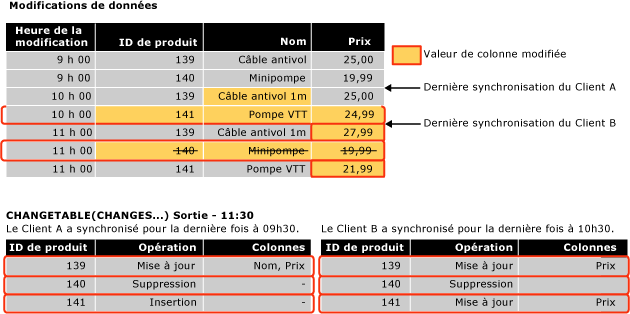

# <a name="work-with-change-tracking-sql-server"></a>Utiliser le suivi des modifications (SQL Server)
[!INCLUDE[tsql-appliesto-ss2008-asdb-xxxx-xxx-md](../../includes/tsql-appliesto-ss2008-asdb-xxxx-xxx-md.md)]

  Les applications qui utilisent le suivi des modifications doivent être en mesure d'obtenir les modifications suivies, d'appliquer ces modifications à une autre banque de données et de mettre à jour la base de données source. Cette rubrique explique comment effectuer ces tâches et le rôle joué par le suivi des modifications lorsqu'un basculement se produit et qu'une base de données doit être restaurée à partir d'une sauvegarde.  
  
##  <a name="Obtain"></a> Obtenir les modifications à l'aide des fonctions de suivi des modifications  
 Explique comment utiliser les fonctions de suivi des modifications pour obtenir des modifications et les informations sur les modifications apportées à une base de données.  
  
### <a name="about-the-change-tracking-functions"></a>À propos des fonctions de suivi des modifications  
 Les applications peuvent utiliser les fonctions suivantes pour obtenir les modifications apportées à une base de données et les informations concernant ces modifications.  
  
 Fonction CHANGETABLE(CHANGES...)  
 Cette fonction d'ensemble de lignes permet d'exécuter des requêtes d'informations de modifications. Elle interroge les données stockées dans les tables de suivi des modifications internes. Elle renvoie un jeu de résultats qui contient les clés primaires des lignes qui ont changé, ainsi que d'autres informations de modification telles que l'opération, les colonnes mises à jour et la version de la ligne.  
  
 La fonction CHANGETABLE(CHANGES...) prend une dernière version de synchronisation en tant qu'argument. La dernière version de synchronisation est obtenue à l'aide de la variable `@last_synchronization_version` . La sémantique de la dernière version de synchronisation est la suivante :  
  
-   Le client appelant a obtenu les modifications et connaît toutes les modifications jusqu'à la dernière version de synchronisation comprise.  
  
-   La fonction CHANGETABLE(CHANGES ...) retourne par conséquent toutes les modifications qui se sont produites après la dernière version de synchronisation.  
  
     L'illustration suivante montre comment CHANGETABLE(CHANGES…) est utilisée pour obtenir des modifications.  
  
       
  
 Fonction CHANGE_TRACKING_CURRENT_VERSION()  
 Permet d'obtenir la version actuelle qui sera utilisée la prochaine fois lorsque l'interrogation change. Cette version représente la version de la dernière transaction validée.  
  
 Fonction CHANGE_TRACKING_MIN_VALID_VERSION()  
 Permet d'obtenir la version valide minimale qu'un client doit avoir pour obtenir des résultats valides à partir de CHANGETABLE(). Le client doit vérifier la dernière version de synchronisation par rapport à la valeur renvoyée par cette fonction. Si la dernière version de synchronisation est inférieure à la version retournée par cette fonction, le client ne pourra pas obtenir de résultats valides de CHANGETABLE() et devra effectuer une réinitialisation.  
  
### <a name="obtaining-initial-data"></a>Obtention des données initiales  
 Pour pouvoir obtenir des modifications pour la première fois, une application doit envoyer une requête afin d'obtenir les données initiales et la version de synchronisation. L'application doit obtenir les données appropriées directement à partir de la table, puis utiliser CHANGE_TRACKING_CURRENT_VERSION() pour obtenir la version initiale. Cette version sera passée à CHANGETABLE (CHANGES…) la première fois que des modifications seront obtenues.  
  
 L'exemple suivant montre comment obtenir la version de synchronisation initiale et le jeu de données initial.  
  
```sql  
    -- Obtain the current synchronization version. This will be used next time that changes are obtained.  
    SET @synchronization_version = CHANGE_TRACKING_CURRENT_VERSION();  
  
    -- Obtain initial data set.  
    SELECT  
        P.ProductID, P.Name, P.ListPrice  
    FROM  
        SalesLT.Product AS P  
```  
  
### <a name="using-the-change-tracking-functions-to-obtain-changes"></a>Utilisation de fonctions de suivi des modifications pour obtenir des modifications  
 Pour obtenir les lignes modifiées d'une table ainsi que des informations sur les modifications, utilisez CHANGETABLE(CHANGES…). Par exemple, la requête suivante obtient les modifications pour la table `SalesLT.Product` .  
  
```sql  
SELECT  
    CT.ProductID, CT.SYS_CHANGE_OPERATION,  
    CT.SYS_CHANGE_COLUMNS, CT.SYS_CHANGE_CONTEXT  
FROM  
    CHANGETABLE(CHANGES SalesLT.Product, @last_synchronization_version) AS CT  
  
```  
  
 Habituellement, un client souhaite obtenir les données les plus récentes d'une ligne plutôt qu'uniquement les clés primaires de la ligne. Par conséquent, une application doit joindre les résultats de CHANGETABLE(CHANGES…) aux données de la table utilisateur. Par exemple, la requête suivante établit une jointure avec la table `SalesLT.Product` afin d'obtenir les valeurs des colonnes `Name` et `ListPrice` . Notez l'utilisation de `OUTER JOIN`. Cela est nécessaire afin de s'assurer que les informations relatives aux modifications sont retournées pour les lignes qui ont été supprimées de la table utilisateur.  
  
```sql  
SELECT  
    CT.ProductID, P.Name, P.ListPrice,  
    CT.SYS_CHANGE_OPERATION, CT.SYS_CHANGE_COLUMNS,  
    CT.SYS_CHANGE_CONTEXT  
FROM  
    SalesLT.Product AS P  
RIGHT OUTER JOIN  
    CHANGETABLE(CHANGES SalesLT.Product, @last_synchronization_version) AS CT  
ON  
    P.ProductID = CT.ProductID  
```  
  
 Pour obtenir la version à utiliser dans l'énumération de modification suivante, utilisez CHANGE_TRACKING_CURRENT_VERSION(), comme indiqué dans l'exemple suivant.  
  
```sql  
SET @synchronization_version = CHANGE_TRACKING_CURRENT_VERSION()  
```  
  
 Lorsqu'une application obtient des modifications, elle doit utiliser à la fois CHANGETABLE(CHANGES…) et CHANGE_TRACKING_CURRENT_VERSION(), comme indiqué dans l'exemple suivant.  
  
```sql  
-- Obtain the current synchronization version. This will be used the next time CHANGETABLE(CHANGES...) is called.  
SET @synchronization_version = CHANGE_TRACKING_CURRENT_VERSION();  
  
-- Obtain incremental changes by using the synchronization version obtained the last time the data was synchronized.  
SELECT  
    CT.ProductID, P.Name, P.ListPrice,  
    CT.SYS_CHANGE_OPERATION, CT.SYS_CHANGE_COLUMNS,  
    CT.SYS_CHANGE_CONTEXT  
FROM  
    SalesLT.Product AS P  
RIGHT OUTER JOIN  
    CHANGETABLE(CHANGES SalesLT.Product, @last_synchronization_version) AS CT  
ON  
    P.ProductID = CT.ProductID  
```  
  
### <a name="version-numbers"></a>Numéros de versions  
 Une base de données pour laquelle le suivi des modifications est activé possède un compteur de version qui s'incrémente à mesure que des modifications sont apportées afin de modifier des tables faisant l'objet d'un suivi. Chaque ligne modifiée comporte un numéro de version associé. Lorsqu'une demande est envoyée à une application afin de connaître les modifications, une fonction fournissant un numéro de version est appelée. La fonction retourne des informations à propos de toutes les modifications apportées depuis cette version. À certains égards, le concept de version de suivi des modifications est semblable au type de données **rowversion** .  
  
### <a name="validating-the-last-synchronized-version"></a>Validation de la dernière version synchronisée  
 Les informations relatives aux modifications sont maintenues pour une durée limitée. Cette durée est contrôlée par le paramètre CHANGE_RETENTION qui peut être spécifié dans le cadre d'ALTER DATABASE.  
  
 Notez que la durée spécifiée pour CHANGE_RETENTION détermine la fréquence à laquelle toutes les applications doivent demander des modifications à la base de données. Si une application a une valeur de *last_synchronization_version* antérieure à la version de synchronisation minimale valide pour une table, cette application ne peut pas effectuer d’énumération de modification valide. Cela est dû au fait que certaines informations de modification ont pu être nettoyées. Avant d’obtenir des modifications à l’aide de CHANGETABLE(CHANGES…), l’application doit valider la valeur de *last_synchronization_version* qu’elle prévoie de passer à CHANGETABLE(CHANGES…). Si la valeur de *last_synchronization_version* n’est pas valide, cette application doit réinitialiser toutes les données.  
  
 L'exemple suivant montre vérifier la validité de la valeur de `last_synchronization_version` pour chaque table.  
  
```sql  
-- Check individual table.  
IF (@last_synchronization_version < CHANGE_TRACKING_MIN_VALID_VERSION(  
                                   OBJECT_ID('SalesLT.Product')))  
BEGIN  
  -- Handle invalid version and do not enumerate changes.  
  -- Client must be reinitialized.  
END  
```  
  
 Comme l'exemple suivant le montre, la validation de la valeur de `last_synchronization_version` peut être vérifiée par rapport à toutes les tables de la base de données.  
  
```sql  
-- Check all tables with change tracking enabled  
IF EXISTS (  
  SELECT COUNT(*) FROM sys.change_tracking_tables  
  WHERE min_valid_version > @last_synchronization_version )  
BEGIN  
  -- Handle invalid version & do not enumerate changes  
  -- Client must be reinitialized  
END  
```  
  
### <a name="using-column-tracking"></a>Utilisation du suivi de colonne  
 Le suivi de colonne permet aux applications d'obtenir les données relatives uniquement aux colonnes qui ont changé, plutôt que la ligne entière. Par exemple, considérez le scénario dans lequel une table possède une ou plusieurs grandes colonnes qui sont rarement modifiées et d'autres colonnes qui changent fréquemment. Sans le suivi de colonne, une application peut déterminer uniquement qu'une ligne a changé et elle doit synchroniser toutes les données, y compris celles des grandes colonnes. Grâce au suivi de colonne, une application peut déterminer si les données des grandes colonnes ont changé et synchroniser les données uniquement si elles ont changé.  
  
 Les informations de suivi de colonne apparaissent dans la colonne SYS_CHANGE_COLUMNS retournée par la fonction CHANGETABLE(CHANGES ...).  
  
 Le suivi de colonne peut être utilisé de sorte que NULL soit retourné pour une colonne qui n'a pas changé. Si la colonne peut prendre la valeur NULL, une colonne séparée doit être retournée afin d'indiquer si la colonne a changé.  
  
 Dans l'exemple suivant, la colonne `CT_ThumbnailPhoto` sera `NULL` si elle n'a pas changé. Elle pourrait également être `NULL` si elle a pris la valeur `NULL` ; l'application peut utiliser `CT_ThumbNailPhoto_Changed` afin de déterminer si la colonne a changé.  
  
```sql  
DECLARE @PhotoColumnId int = COLUMNPROPERTY(  
    OBJECT_ID('SalesLT.Product'),'ThumbNailPhoto', 'ColumnId')  
  
SELECT  
    CT.ProductID, P.Name, P.ListPrice, -- Always obtain values.  
    CASE  
           WHEN CHANGE_TRACKING_IS_COLUMN_IN_MASK(  
                     @PhotoColumnId, CT.SYS_CHANGE_COLUMNS) = 1  
            THEN ThumbNailPhoto  
            ELSE NULL  
      END AS CT_ThumbNailPhoto,  
      CHANGE_TRACKING_IS_COLUMN_IN_MASK(  
                     @PhotoColumnId, CT.SYS_CHANGE_COLUMNS) AS  
                                   CT_ThumbNailPhoto_Changed  
     CT.SYS_CHANGE_OPERATION, CT.SYS_CHANGE_COLUMNS,  
     CT.SYS_CHANGE_CONTEXT  
FROM  
     SalesLT.Product AS P  
INNER JOIN  
     CHANGETABLE(CHANGES SalesLT.Product, @last_synchronization_version) AS CT  
ON  
     P.ProductID = CT.ProductID AND  
     CT.SYS_CHANGE_OPERATION = 'U'  
```  
  
### <a name="obtaining-consistent-and-correct-results"></a>Obtention de résultats cohérents et corrects  
 L'obtention des données modifiées pour une table requiert plusieurs étapes. Sachez que des résultats incohérents ou incorrects peuvent être retournés si certains problèmes ne sont pas pris en compte et résolus.  
  
 Par exemple, pour obtenir les modifications apportées à une table Sales et une table SalesOrders, une application doit effectuer les étapes suivantes :  
  
1.  Valider la dernière version synchronisée à l'aide de CHANGE_TRACKING_MIN_VALID_VERSION().  
  
2.  Obtenir la version qui peut être utilisée pour obtenir les modifications lors de la prochaine interrogation à l'aide de CHANGE_TRACKING_CURRENT_VERSION().  
  
3.  Obtenir les modifications de la table Sales à l'aide de CHANGETABLE(CHANGES…).  
  
4.  Obtenir les modifications de la table SalesOrders à l'aide de CHANGETABLE(CHANGES…).  
  
 Deux processus qui se produisent dans la base de données peuvent affecter les résultats retournés par les étapes précédentes :  
  
-   Le processus de nettoyage s'exécute en arrière-plan et supprime les informations de suivi des modifications antérieures à la période de rétention spécifiée.  
  
     Le processus de nettoyage est un processus d'arrière-plan distinct qui utilise la période de rétention spécifiée lorsque vous configurez le suivi des modifications pour la base de données. Le problème réside dans le fait que le processus de nettoyage peut se produire entre la validation de la dernière version de synchronisation et l'appel à CHANGETABLE(CHANGES…). Une dernière version de synchronisation qui était juste valide peut ne plus l'être au moment où les modifications sont obtenues. Par conséquent, des résultats incorrects peuvent être retournés.  
  
-   Des opérations DML sont en cours dans les tables Sales et SalesOrders, telles que les suivantes :  
  
    -   Des modifications peuvent être apportées aux tables après que la version pour la prochaine fois a été obtenue à l'aide de CHANGE_TRACKING_CURRENT_VERSION(). Par conséquent, le nombre de modifications retournées peut être plus important que prévu.  
  
    -   Une transaction pourrait être validée entre l'appel visant à obtenir les modifications de la table Sales et l'appel visant à obtenir les modifications de la table SalesOrders. Par conséquent, les résultats de la table SalesOrder pourraient avoir une valeur de clé étrangère qui n'existe pas dans la table Sales.  
  
 Pour éviter de rencontrer les problèmes mentionnés ci-dessus, nous vous recommandons d'utiliser le niveau d'isolement d'instantané. Cela contribue à garantir la cohérence des informations de modification et à éviter les conditions de concurrence liées à la tâche de nettoyage en arrière-plan. Si vous n'utilisez pas de transactions d'instantané, le développement d'une application qui utilise le suivi des modifications peut nécessiter davantage d'efforts.  
  
#### <a name="using-snapshot-isolation"></a>Utilisation du niveau d'isolement d'instantané  
 Le suivi des modifications a été conçu pour une bonne intégration au niveau d'isolement d'instantané. Le niveau d'isolement d'instantané doit être activé pour la base de données. Toutes les étapes requises pour obtenir des modifications doivent être incluses à l'intérieur d'une transaction d'instantané. Cela permet de s'assurer que toutes les modifications apportées aux données durant l'obtention de modifications seront invisibles aux requêtes à l'intérieur de la transaction d'instantané.  
  
 Pour obtenir des données à l'intérieur d'une transaction d'instantané, procédez comme suit :  
  
1.  Définissez le niveau d'isolation de la transaction à « instantané » et démarrez une transaction.  
  
2.  Validez la dernière version de synchronisation à l'aide de CHANGE_TRACKING_MIN_VALID_VERSION().  
  
3.  Obtenez la version à utiliser lors de la prochaine interrogation à l'aide de CHANGE_TRACKING_CURRENT_VERSION().  
  
4.  Obtenez les modifications de la table Sales à l'aide de CHANGETABLE(CHANGES…).  
  
5.  Obtenez les modifications de la table SalesOrders à l'aide de CHANGETABLE(CHANGES…).  
  
6.  Validez la transaction.  
  
 Quelques points à noter étant donné que toutes les étapes d'obtention de modifications ont lieu à l'intérieur d'une transaction d'instantané :  
  
-   Si le nettoyage se produit après la validation de la dernière version de synchronisation, les résultats de CHANGETABLE(CHANGES…) seront tout de même valides car les opérations de suppression effectuées par le nettoyage ne seront pas visibles à l'intérieur de la transaction.  
  
-   Toute modification apportée à la table Sales ou SalesOrders après l'obtention de la version de synchronisation suivante sera invisible et les appels à CHANGETABLE(CHANGES…) ne retourneront jamais de modifications avec une version ultérieure à celle retournée par CHANGE_TRACKING_CURRENT_VERSION(). La cohérence entre la table Sales et la table SalesOrders sera également maintenue car les transactions validées entre les appels à CHANGETABLE(CHANGES…) ne seront pas visibles.  
  
 L'exemple ci-dessous montre comment le niveau d'isolement d'instantané est activé pour une base de données.  
  
```sql  
-- The database must be configured to enable snapshot isolation.  
ALTER DATABASE AdventureWorksLT  
    SET ALLOW_SNAPSHOT_ISOLATION ON;  
```  
  
 Une transaction d'instantané est utilisée comme suit :  
  
```sql  
SET TRANSACTION ISOLATION LEVEL SNAPSHOT;  
BEGIN TRAN  
  -- Verify that version of the previous synchronization is valid.  
  -- Obtain the version to use next time.  
  -- Obtain changes.  
COMMIT TRAN  
```  
  
 Pour plus d’informations sur les transactions d’instantanés, consultez [SET TRANSACTION ISOLATION LEVEL &#40;Transact-SQL&#41;](../../t-sql/statements/set-transaction-isolation-level-transact-sql.md).  
  
#### <a name="alternatives-to-using-snapshot-isolation"></a>Alternatives à l'utilisation du niveau d'isolement d'instantané  
 Il existe des alternatives à l'utilisation du niveau d'isolement d'instantané, mais elles nécessitent davantage de travail afin de s'assurer que toutes les spécifications d'applications sont satisfaites. Pour vérifier que le paramètre *last_synchronization_version* est valide et qu’aucune donnée n’est supprimée par le processus de nettoyage avant l’obtention des modifications, procédez comme suit :  
  
1.  Vérifiez *last_synchronization_version* après les appels à CHANGETABLE().  
  
2.  Vérifiez *last_synchronization_version* dans le cadre de chaque requête d’obtention de modifications à l’aide de CHANGETABLE().  
  
 Des modifications peuvent se produire après l'obtention de la version de synchronisation pour l'énumération suivante. Il existe deux manières de gérer cette situation. L'option utilisée dépend de l'application et de la façon dont elle peut gérer les effets secondaires de chaque approche :  
  
-   Ignorer les modifications dont la version est ultérieure à la nouvelle version de synchronisation.  
  
     Cette approche a comme effet secondaire qu'une ligne nouvelle ou mise à jour est ignorée si elle a été créée ou mise à jour avant la nouvelle version de synchronisation, mais qu'elle a été mise à jour par la suite. S'il y a une nouvelle ligne, un problème d'intégrité référentielle peut se produire s'il existe une ligne dans une autre table créée qui référence la ligne omise. S'il y a une ligne existante mise à jour, la ligne est ignorée et synchronisée uniquement la prochaine fois.  
  
-   Inclure toutes les modifications, même celles dont la version est ultérieure à la nouvelle version de synchronisation.  
  
     Les lignes qui ont une version ultérieure à la nouvelle version de synchronisation seront encore obtenues lors de la synchronisation suivante. Cela doit être attendu et géré par l'application.  
  
 En plus des deux options précédentes, vous pouvez imaginer une approche qui combine ces deux options, selon l'opération. Par exemple, vous pourriez souhaiter avoir une application pour laquelle il vaut mieux ignorer les modifications plus récentes que la version de synchronisation suivante dans laquelle la ligne a été créée ou supprimée, mais où les mises à jour ne sont pas ignorées.  
  
> [!NOTE]  
>  Le choix de l'approche la mieux adaptée à l'application lorsque vous utilisez le suivi des modifications (ou tout mécanisme de suivi personnalisé) requiert une analyse approfondie. Il est par conséquent beaucoup plus simple d'utiliser le niveau d'isolement d'instantané.  
  
##  <a name="Handles"></a> Comment le suivi des modifications gère les modifications apportées à une base de données  
 Certaines applications qui utilisent le suivi des modifications effectuent une synchronisation bidirectionnelle avec une autre banque de données. Autrement dit, les modifications apportées à la base de données [!INCLUDE[ssNoVersion](../../includes/ssnoversion-md.md)] sont mises à jour dans l'autre banque de données et les modifications apportées à l'autre banque sont mises à jour dans la base de données [!INCLUDE[ssNoVersion](../../includes/ssnoversion-md.md)] .  
  
 Lorsqu'une application met à jour la base de données locale avec les modifications d'une autre banque de données, elle doit effectuer les opérations suivantes :  
  
-   Recherche de conflits.  
  
     Un conflit se produit lorsque les mêmes données sont modifiées simultanément dans les deux banques de données. L'application doit être en mesure de vérifier s'il existe un conflit et d'obtenir suffisamment d'informations pour permettre la résolution du conflit.  
  
-   Stockage d'informations de contexte d'application.  
  
     L'application stocke des données qui contiennent les informations de suivi des modifications. Ces informations (ainsi que d'autres informations de suivi des modifications) sont disponibles lorsque les modifications sont obtenues à partir de la base de données locale. Un exemple courant d'information contextuelle de ce type est un identificateur pour la banque de données qui était la source de la modification.  
  
 Pour effectuer les opérations précédentes, une application de synchronisation peut utiliser les fonctions suivantes :  
  
-   CHANGETABLE(VERSION…)  
  
     Lorsqu'une application apporte des modifications, elle peut utiliser cette fonction pour vérifier s'il existe des conflits. Cette fonction obtient les informations de suivi des modifications les plus récentes pour une ligne spécifiée dans une table sujette au suivi des modifications. Les informations de suivi des modifications incluent la version de la dernière ligne modifiée. Ces informations permettent à une application de déterminer si la ligne a été modifiée après la dernière synchronisation de l'application.  
  
-   WITH CHANGE_TRACKING_CONTEXT  
  
     Une application peut utiliser cette clause pour stocker des données de contexte.  
  
### <a name="checking-for-conflicts"></a>Recherche de conflits  
 Dans un scénario de synchronisation bidirectionnelle, l'application cliente doit déterminer si une ligne n'a pas été mise à jour depuis la dernière obtention des modifications.  
  
 L'exemple suivant montre comment utiliser la fonction CHANGETABLE(VERSION …) pour vérifier l'existence de conflits de la manière la plus efficace, sans requête distincte. Dans l'exemple, `CHANGETABLE(VERSION …)` détermine `SYS_CHANGE_VERSION` pour la ligne spécifiée par `@product id`. `CHANGETABLE(CHANGES …)` peut obtenir les mêmes informations, mais il est moins efficace. Si la valeur de `SYS_CHANGE_VERSION` pour la ligne est supérieure à la valeur de `@last_sync_version`, il existe un conflit. En cas de conflit, la ligne ne sera pas mise à jour. Le contrôle `ISNULL()` est nécessaire car il se peut qu'il n'y ait aucune information de modification disponible pour la ligne. Aucune information de modification n'existe si la ligne n'a pas été mise à jour depuis l'activation du suivi des modifications ou depuis le nettoyage des informations de modification.  
  
```sql  
-- Assumption: @last_sync_version has been validated.  
  
UPDATE  
    SalesLT.Product  
SET  
    ListPrice = @new_listprice  
FROM  
    SalesLT.Product AS P  
WHERE  
    ProductID = @product_id AND  
    @last_sync_version >= ISNULL (  
        SELECT CT.SYS_CHANGE_VERSION  
        FROM CHANGETABLE(VERSION SalesLT.Product,  
                        (ProductID), (P.ProductID)) AS CT),  
        0)  
```  
  
 Le code suivant peut vérifier le nombre de lignes mises à jour et identifier davantage d'informations relatives au conflit.  
  
```sql  
-- If the change cannot be made, find out more information.  
IF (@@ROWCOUNT = 0)  
BEGIN  
    -- Obtain the complete change information for the row.  
    SELECT  
        CT.SYS_CHANGE_VERSION, CT.SYS_CHANGE_CREATION_VERSION,  
        CT.SYS_CHANGE_OPERATION, CT.SYS_CHANGE_COLUMNS  
    FROM  
        CHANGETABLE(CHANGES SalesLT.Product, @last_sync_version) AS CT  
    WHERE  
        CT.ProductID = @product_id;  
  
    -- Check CT.SYS_CHANGE_VERSION to verify that it really was a conflict.  
    -- Check CT.SYS_CHANGE_OPERATION to determine the type of conflict:  
    -- update-update or update-delete.  
    -- The row that is specified by @product_id might no longer exist   
    -- if it has been deleted.  
END  
```  
  
### <a name="setting-context-information"></a>Définition des informations de contexte  
 Avec la clause WITH CHANGE_TRACKING_CONTEXT, une application peut stocker des informations de contexte avec les informations de modifications. Ces informations peuvent ensuite être obtenues à partir de la colonne SYS_CHANGE_CONTEXT retournée par CHANGETABLE(CHANGES …).  
  
 Les informations de contexte sont utilisées en général pour identifier la source des modifications. Si la source de la modification peut être identifiée, ces informations peuvent être utilisées par une banque de données afin d'éviter d'obtenir les modifications lors de la synchronisation suivante.  
  
```sql  
  -- Try to update the row and check for a conflict.  
  WITH CHANGE_TRACKING_CONTEXT (@source_id)  
  UPDATE  
     SalesLT.Product  
  SET  
      ListPrice = @new_listprice  
  FROM  
      SalesLT.Product AS P  
  WHERE  
     ProductID = @product_id AND  
     @last_sync_version >= ISNULL (  
         (SELECT CT.SYS_CHANGE_VERSION FROM CHANGETABLE(VERSION SalesLT.Product,  
         (ProductID), (P.ProductID)) AS CT),  
         0)  
```  
  
### <a name="ensuring-consistent-and-correct-results"></a>Garantie de résultats cohérents et corrects  
 Une application doit prendre en compte le processus de nettoyage lorsqu’elle valide la valeur de @last_sync_version. car des données peuvent avoir été supprimées après l'appel à CHANGE_TRACKING_MIN_VALID_VERSION() mais avant la mise à jour.  
  
> [!IMPORTANT]  
>  Nous vous recommandons d'utiliser le niveau d'isolement d'instantané et d'effectuer les modifications dans une transaction d'instantané.  
  
```sql  
-- Prerequisite is to ensure ALLOW_SNAPSHOT_ISOLATION is ON for the database.  
  
SET TRANSACTION ISOLATION LEVEL SNAPSHOT;  
BEGIN TRAN  
    -- Verify that last_sync_version is valid.  
    IF (@last_sync_version <  
CHANGE_TRACKING_MIN_VALID_VERSION(OBJECT_ID(‘SalesLT.Product’)))  
    BEGIN  
       RAISERROR (N’Last_sync_version too old’, 16, -1);  
    END  
    ELSE  
    BEGIN  
        -- Try to update the row.  
        -- Check @@ROWCOUNT and check for a conflict.  
    END  
COMMIT TRAN  
```  
  
> [!NOTE]  
>  Il est possible que la ligne mise à jour dans le cadre de la transaction d'instantané ait été mise à jour dans une autre transaction après le démarrage de la transaction d'instantané. Dans ce cas, un conflit de mise à jour du niveau d'isolement d'instantané se produit et provoque la fin de la transaction. Si cela se produit, réessayez d'effectuer la mise à jour. Cette tentative génère alors la détection d'un conflit de suivi des modifications et aucune ligne n'est modifiée.  
  
##  <a name="DataRestore"></a> Suivi des modifications et restauration de données  
 Les applications qui nécessitent une synchronisation doivent considérer le cas où une base de données pour laquelle le suivi des modifications est activé rétablit une version antérieure des données. Ce cas peut se produire après la restauration d'une base de données à partir d'une sauvegarde, lors d'un basculement vers un miroir de base de données asynchrone ou lors d'un échec pendant l'utilisation de la copie des journaux de transaction. Le scénario suivant illustre ce problème :  
  
1.  La table T1 fait l'objet d'un suivi des modifications et sa version valide minimale est 50.  
  
2.  Une application cliente synchronise les données à la version 100 et obtient des informations sur toutes les modifications entre les versions 50 et 100.  
  
3.  Des modifications supplémentaires sont apportées à la table T1 après la version 100.  
  
4.  À la version 120, une défaillance se produit et l'administrateur de la base de données restaure la base de données avec la perte de données. Après l'opération de restauration, la table contient des données allant jusqu'à la version 70 et la version synchronisée minimale reste encore 50.  
  
     Cela signifie que la banque de données synchronisée comporte des données qui n'existent plus dans la banque de données primaire.  
  
5.  T1 est mise à jour de nombreuses fois, ce qui porte la version actuelle à 130.  
  
6.  L'application cliente se synchronise de nouveau et fournit une dernière version synchronisée de 100. Le client valide ce numéro avec succès parce que 100 est supérieur à 50.  
  
     Le client obtient les modifications entre les versions 100 et 130. À ce stade, le client n'est pas informé que les modifications entre 70 et 100 ne sont pas les mêmes qu'avant. Les données sur le client et le serveur ne sont pas synchronisées.  
  
 Notez que si la base de données avait été récupérée à un point ultérieur à la version 100, il n'y aurait pas de problème de synchronisation. Le client et le serveur synchroniseraient correctement les données pendant l'intervalle de synchronisation suivant.  
  
 Le suivi des modifications ne prend pas en charge la récupération d'une perte de données. Toutefois, il existe deux possibilités pour détecter ces types de problèmes de synchronisation :  
  
-   Stockez un ID de version de la base de données sur le serveur, puis mettez à jour cette valeur chaque fois qu'une base de données est récupérée ou perd des données. Chaque application cliente stocke l'ID et chaque client doit valider cet ID lorsqu'il synchronise des données. En cas de perte de données, les ID ne correspondront pas et les clients se réinitialiseront. Un inconvénient est que si la perte de données n'a pas dépassé la dernière limite synchronisée, le client risque d'effectuer une réinitialisation inutile.  
  
-   Lorsqu'un client interroge les modifications, enregistrez le numéro de version de la dernière synchronisation pour chaque client sur le serveur. En cas de problème avec les données, les derniers numéros de versions synchronisées ne correspondent pas. Ils indiquent qu'une réinitialisation est requise.  
  
## <a name="see-also"></a> Voir aussi  
 [Suivi des modifications de données &#40;SQL Server&#41;](../../relational-databases/track-changes/track-data-changes-sql-server.md)   
 [À propos du suivi des modifications &#40;SQL Server&#41;](../../relational-databases/track-changes/about-change-tracking-sql-server.md)   
 [Gérer le suivi des modifications &#40;SQL Server&#41;](../../relational-databases/track-changes/manage-change-tracking-sql-server.md)   
 [Activer et désactiver le suivi des modifications &#40;SQL Server&#41;](../../relational-databases/track-changes/enable-and-disable-change-tracking-sql-server.md)   
 [CHANGETABLE &#40;Transact-SQL&#41;](../../relational-databases/system-functions/changetable-transact-sql.md)   
 [CHANGE_TRACKING_MIN_VALID_VERSION &#40;Transact-SQL&#41;](../../relational-databases/system-functions/change-tracking-min-valid-version-transact-sql.md)   
 [CHANGE_TRACKING_CURRENT_VERSION &#40;Transact-SQL&#41;](../../relational-databases/system-functions/change-tracking-current-version-transact-sql.md)   
 [WITH CHANGE_TRACKING_CONTEXT &#40;Transact-SQL&#41;](../../relational-databases/system-functions/with-change-tracking-context-transact-sql.md)  
  
  
