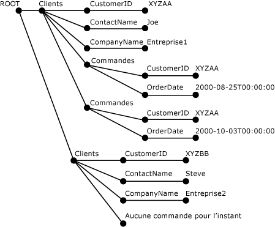

# <a name="openxml-sql-server"></a>OPENXML (SQL Server)
[!INCLUDE[tsql-appliesto-ss2008-xxxx-xxxx-xxx-md](../../includes/tsql-appliesto-ss2008-xxxx-xxxx-xxx-md.md)]
  OPENXML, un mot clé [!INCLUDE[tsql](../../includes/tsql-md.md)] , fournit un ensemble de lignes sur des documents XML en mémoire qui est similaire à une table ou à une vue. OPENXML permet l'accès aux données XML comme s'il s'agissait d'un ensemble de lignes relationnelles. Pour cela, il fournit une vue sous forme d'un ensemble de lignes de la représentation interne d'un document XML. Les enregistrements de l'ensemble de lignes peuvent être stockés dans des tables de base de données.  
  
 OPENXML peut être utilisé dans des instructions SELECT et SELECT INTO, partout où des fournisseurs d'ensemble de lignes, une vue ou OPENROWSET peuvent apparaître comme source. Pour plus d’informations sur la syntaxe d’OPENXML, consultez [OPENXML &#40;Transact-SQL&#41;](../../t-sql/functions/openxml-transact-sql.md).  
  
 Pour écrire des requêtes sur un document XML en utilisant OPENXML, vous devez commencer par appeler **sp_xml_preparedocument**. Cela permet d'analyser le document XML et de retourner un descripteur au document analysé qui est prêt à être utilisé. Le document analysé est une représentation sous forme d'arborescence de modèle DOM (document model) de différents nœuds dans le document XML. Ce descripteur de document est transmis à OPENXML. OPENXML fournit alors une vue sous forme d'ensemble de lignes du document, en fonction des paramètres transmis.  
  
> [!NOTE]  
>  **sp_xml_preparedocument** utilise une version SQL mise à jour de l’analyseur MSXML, Msxmlsql.dll. Cette version de l'analyseur MSXML a été conçue pour prendre en charge [!INCLUDE[ssNoVersion](../../includes/ssnoversion-md.md)] et offre une compatibilité descendante avec MSXML version 2.6.  
  
 Pour libérer de la mémoire, vous devez supprimer la représentation interne d’un document XML de la mémoire en appelant la procédure stockée système **sp_xml_removedocument** .  
  
 L'illustration ci-dessous montre ce processus.  
  
   
  
 Notez que pour comprendre le fonctionnement de OPENXML, vous devez connaître les requêtes XPath et les données XML. Pour plus d’informations sur la prise en charge de XPath dans SQL Server, consultez [Utilisation des requêtes XPath dans SQLXML 4.0](../../relational-databases/sqlxml-annotated-xsd-schemas-xpath-queries/using-xpath-queries-in-sqlxml-4-0.md).  
  
> [!NOTE]  
>  OpenXML permet de paramétrer sous forme de variables les modèles XPath de ligne et de colonne. Un tel paramétrage peut mener à des injections d'expressions XPath, si le programmeur expose le paramétrage à des utilisateurs extérieurs (par exemple, si les paramètres sont fournis via une procédure stockée appelée de manière externe). Pour éviter de tels problèmes potentiels de sécurité, il est conseillé de ne jamais exposer les paramètres XPath à des appelants externes.  
  
## <a name="example"></a> Exemple  
 L'exemple ci-dessous montre l'utilisation de `OPENXML` dans une instruction `INSERT` et une instruction `SELECT` . L'exemple de document XML comprend les éléments `<Customers>` et `<Orders>` .  
  
 D'abord, la procédure stockée `sp_xml_preparedocument` analyse le document XML. Le document analysé est une représentation sous forme d'arborescence des différents nœuds du document XML : éléments, attributs, textes, commentaires, et ainsi de suite. `OPENXML` fait ensuite référence à ce document XML analysé et fournit une vue sous forme d'ensemble de lignes de tout ou partie de ce document XML. Une instruction `INSERT` utilisant `OPENXML` peut ainsi insérer des données dans une table de base de données à partir de ce type d'ensemble de lignes. Vous pouvez utiliser plusieurs appels à `OPENXML` pour fournir une vue d'un ensemble de lignes provenant de différentes parties du document XML puis traiter celles-ci en les insérant par exemple dans différentes tables. Cette opération est également qualifiée de fragmentation de données XML dans des tables.  
  
 Dans l'exemple suivant, un document XML est fragmenté de telle sorte que les éléments `<Customers>` sont stockés dans la table `Customers` et les éléments `<Orders>` sont stockés dans la table `Orders` à l'aide de deux instructions `INSERT` . Cet exemple illustre également une instruction `SELECT` associée à `OPENXML` qui récupère les données des colonnes `CustomerID` et `OrderDate` du document XML. Dans la dernière étape du processus, la procédure stockée `sp_xml_removedocument`est appelée. Ceci permet en effet de libérer la mémoire allouée à la représentation en arborescence XML interne créée lors de la phase d'analyse.  
  
```  
-- Create tables for later population using OPENXML.  
CREATE TABLE Customers (CustomerID varchar(20) primary key,  
                ContactName varchar(20),   
                CompanyName varchar(20));  
GO  
CREATE TABLE Orders( CustomerID varchar(20), OrderDate datetime;)  
GO  
DECLARE @docHandle int;  
DECLARE @xmlDocument nvarchar(max); -- or xml type  
SET @xmlDocument = N'<ROOT>  
<Customers CustomerID="XYZAA" ContactName="Joe" CompanyName="Company1">  
<Orders CustomerID="XYZAA" OrderDate="2000-08-25T00:00:00"/>  
<Orders CustomerID="XYZAA" OrderDate="2000-10-03T00:00:00"/>  
</Customers>  
<Customers CustomerID="XYZBB" ContactName="Steve"  
CompanyName="Company2">No Orders yet!  
</Customers>  
</ROOT>';  
EXEC sp_xml_preparedocument @docHandle OUTPUT, @xmlDocument;  
-- Use OPENXML to provide rowset consisting of customer data.  
INSERT Customers   
SELECT *   
FROM OPENXML(@docHandle, N'/ROOT/Customers')   
  WITH Customers;  
-- Use OPENXML to provide rowset consisting of order data.  
INSERT Orders   
SELECT *   
FROM OPENXML(@docHandle, N'//Orders')   
  WITH Orders;  
-- Using OPENXML in a SELECT statement.  
SELECT * FROM OPENXML(@docHandle, N'/ROOT/Customers/Orders') WITH (CustomerID nchar(5) '../@CustomerID', OrderDate datetime);  
-- Remove the internal representation of the XML document.  
EXEC sp_xml_removedocument @docHandle;   
```  
  
 L'illustration suivante montre l'arborescence XML analysée du document XML précédent créé à l'aide de sp_xml_preparedocument.  
  
   
  
## <a name="openxml-parameters"></a>Paramètres OPENXML  
 Les paramètres OPENXML comprennent :  
  
-   Un descripteur de document XML (*idoc*)  
  
-   Une expression XPath identifiant les nœuds à mapper avec les lignes (*rowpattern*)  
  
-   Une description de l'ensemble de lignes à générer  
  
-   Un mappage entre les colonnes de l'ensemble de lignes et les nœuds XML  
  
### <a name="xml-document-handle-idoc"></a>Descripteur de document XML (idoc)  
 Ce descripteur de document est retourné par la procédure stockée **sp_xml_preparedocument** .  
  
### <a name="xpath-expression-to-identify-the-nodes-to-be-processed-rowpattern"></a>Expression XPath identifiant les nœuds à traiter (rowpattern)  
 L'expression XPath spécifiée comme paramètre *rowpattern* identifie un ensemble de nœuds dans le document XML. Chaque nœud identifié par *rowpattern* correspond à une ligne unique de l'ensemble de lignes généré par OPENXML.  
  
 Les nœuds identifiés par l'expression XPath peuvent être des nœuds XML quelconques dans le document XML. Si *rowpattern* identifie un ensemble d'éléments dans le document XML, il existe une seule ligne dans l'ensemble de lignes pour chaque nœud d'élément identifié. Par exemple, si *rowpattern* s'achève au niveau d'un attribut, une ligne est créée pour chaque nœud d'attribut sélectionné par *rowpattern*.  
  
### <a name="description-of-the-rowset-to-be-generated"></a>Description de l'ensemble de lignes à générer  
 Un schéma d'ensemble de lignes est utilisé par OPENXML pour générer l'ensemble de lignes résultant. Vous pouvez utiliser les options suivantes lorsque vous spécifiez un schéma d'ensemble de lignes.  
  
#### <a name="using-the-edge-table-format"></a>Utilisation du format de table du bord  
 Vous devez utiliser le format de table du bord pour spécifier un schéma d'ensemble de lignes. N'utilisez pas la clause WITH.  
  
 Lorsque vous procédez ainsi, OPENXML retourne un ensemble de lignes dans le format de table du bord. Ce format est appelé ainsi parce que chaque bord de l'arborescence du document XML analysé est mappé avec une ligne de l'ensemble de lignes.  
  
 Les tables du bord représentent au sein d'une table unique la structure à granularité fine d'un document XML. Cette structure inclut les noms des éléments et attributs, la hiérarchie du document, les espaces de noms et les instructions de traitement. Le format de table du bord vous permet d'obtenir des informations supplémentaires non présentées par le biais des métapropriétés. Pour plus d'informations sur les métapropriétés, consultez [Specify Metaproperties in OPENXML](../../relational-databases/xml/specify-metaproperties-in-openxml.md).  
  
 Les informations supplémentaires fournies par une table du bord vous permettent de stocker et d'interroger le type de données d'un élément et d'un attribut, le type de nœud, ainsi que de stocker et d'interroger les informations sur la structure d'un document XML. Ces informations supplémentaires peuvent également vous permettre d'élaborer votre propre système de gestion de documents XML.  
  
 En utilisant une table du bord, vous pouvez écrire des procédures stockées qui acceptent des documents XML comme entrée de type BLOB (Binary Large Object), qui génèrent la table du bord, puis extraient et analysent le document à un niveau plus détaillé. Ce niveau détaillé peut inclure la recherche de la hiérarchie du document, des noms des éléments et des attributs, des espaces de noms et des instructions de traitement.  
  
 La table du bord peut également faire office de format de stockage pour les documents XML, lorsque le mappage avec d'autres formats relationnels n'est pas logique et qu'un champ ntext ne fournit pas suffisamment d'informations structurelles.  
  
 Dans les situations où vous pouvez utiliser un analyseur XML pour examiner un document XML, vous pouvez utiliser une table du bord à la place pour obtenir les mêmes informations.  
  
 Le tableau ci-dessous décrit la structure de la table du bord.  
  
|Nom de colonne|Type de données|Description|  
|-----------------|---------------|-----------------|  
|**id**|**bigint**|ID unique du nœud du document.<br /><br /> L'ID de l'élément racine a pour valeur 0. Les valeurs négatives d'ID sont réservées.|  
|**parentid**|**bigint**|Identifie le parent du nœud. Le parent identifié par cet ID n'est pas nécessairement l'élément parent. Toutefois, cela dépend du NodeType du nœud dont le parent est identifié par cet ID. Par exemple, si le nœud est un nœud texte, son parent peut être un nœud d'attribut.<br /><br /> Si le nœud se situe au niveau supérieur du document XML, son **ParentID** a pour valeur NULL.|  
|**node type**|**Int**|Identifie le type de nœud et est un entier qui correspond à la numérotation des types de nœud XML de modèle d'objet XML (DOM).<br /><br /> Valeurs susceptibles d'apparaître dans cette colonne pour indiquer le type de nœud :<br /><br /> **1** = Nœud d’élément<br /><br /> **2** = Nœud d’attribut<br /><br /> **3** = Nœud texte<br /><br /> **4** = Nœud de section CDATA<br /><br /> **5** = Nœud de référence d’entité<br /><br /> **6** = Nœud d’entité<br /><br /> **7** = Nœud d’instructions de traitement<br /><br /> **8** = Nœud de commentaire<br /><br /> **9** = Nœud de document<br /><br /> **10** = Nœud de type de document<br /><br /> **11** = Nœud de fragment de document<br /><br /> **12** = Nœud de notation<br /><br /> Pour plus d'informations, consultez la rubrique « Propriété nodeType » dans le Kit de développement logiciel Microsoft XML (MSXML).|  
|**localname**|**nvarchar(max)**|Fournit le nom local de l'élément ou de l'attribut. A pour valeur NULL si l'objet DOM est dépourvu de nom.|  
|**prefix**|**nvarchar(max)**|Préfixe de l'espace de noms du nom de nœud.|  
|**namespaceuri**|**nvarchar(max)**|URI de l'espace de noms du nœud. Si la valeur est NULL, aucun espace de noms n'est présent.|  
|**datatype**|**nvarchar(max)**|Type de données réel de la ligne d'élément ou d'attribut, NULL sinon. Le type de données est déduit de la DTD en ligne ou du schéma en ligne.|  
|**prev**|**bigint**|ID XML de l'élément frère précédent. Vaut NULL en l'absence de frère précédent direct.|  
|**texte**|**ntext**|Contient la valeur d'attribut ou le contenu de l'élément dans sa forme textuelle. Ou a pour valeur NULL, si l'entrée de la table du bord ne nécessite pas de valeur.|  
  
#### <a name="using-the-with-clause-to-specify-an-existing-table"></a>Utilisation de la clause WITH pour spécifier une table existante  
 Vous pouvez utiliser la clause WITH pour spécifier le nom d'une table existante. Pour cela, spécifiez simplement le nom d'une table existante dont le schéma permet à OPENXML de générer l'ensemble de lignes.  
  
#### <a name="using-the-with-clause-to-specify-a-schema"></a>Utilisation de la clause WITH pour spécifier un schéma  
 Vous pouvez utiliser la clause WITH pour spécifier un schéma complet. Lors de la spécification du schéma d'ensemble de lignes, vous définissez les noms de colonnes et leurs types de données, ainsi que leur mappage avec le document XML.  
  
 Vous pouvez spécifier le modèle de colonne à l'aide du paramètre ColPattern dans SchemaDeclaration. Le modèle de colonne spécifié permet de mapper une colonne d'un ensemble de lignes avec le nœud XML identifié par rowpattern et de déterminer le type de mappage.  
  
 Si ColPattern n'est spécifié pour aucune colonne, la colonne de l'ensemble de lignes est mappée avec le nœud XML portant le même nom, en fonction du mappage défini par le paramètre *flags* . Cependant, si ColPattern est spécifié dans le cadre de la définition de schéma dans la clause WITH, il remplace le mappage défini dans le paramètre *flags* .  
  
### <a name="mapping-between-the-rowset-columns-and-the-xml-nodes"></a>Un mappage entre les colonnes de l'ensemble de lignes et les nœuds XML  
 Dans l’instruction OPENXML, vous pouvez éventuellement spécifier le type de mappage, tel que centré sur les attributs ou centré sur les éléments, entre les colonnes de l’ensemble de lignes et les nœuds XML identifiés par *rowpattern*. Cette information est utilisée dans la transformation entre les nœuds XML et les colonnes de l'ensemble de lignes.  
  
 Vous pouvez spécifier le mappage de deux façons et vous pouvez également spécifier cela :  
  
-   en utilisant le paramètre *flags*   
  
     Le mappage spécifié par le paramètre *flags* suppose une correspondance de nom dans laquelle les nœuds XML sont mappés avec les colonnes correspondantes du même nom dans l'ensemble de lignes.  
  
-   en utilisant le paramètre *ColPattern*   
  
     L'expression XPath*ColPattern*est spécifiée dans le paramètre *SchemaDeclaration* de la clause WITH. Le mappage spécifié dans *ColPattern* remplace celui défini par le paramètre *flags* .  
  
     Vous pouvez utiliser*ColPattern* pour spécifier le type de mappage, tel que centré sur les attributs ou centré sur les éléments, qui remplace ou améliore le mappage par défaut indiqué par le paramètre *flags*.  
  
     *ColPattern* est spécifié dans les circonstances suivantes :  
  
    -   le nom de colonne de l'ensemble de lignes est différent du nom d'élément ou d'attribut avec lequel il est mappé. Dans ce cas, *ColPattern* permet d'identifier le nom d'élément ou d'attribut XML avec lequel la colonne de l'ensemble de lignes est mappée.  
  
    -   vous souhaitez mapper un attribut de métapropriété avec la colonne. Dans ce cas, *ColPattern* permet d'identifier la métapropriété avec laquelle la colonne de l'ensemble de lignes est mappée. Pour plus d’informations sur les métapropriétés, consultez [Spécifier des métapropriétés dans OPENXML](../../relational-databases/xml/specify-metaproperties-in-openxml.md).  
  
 Les deux paramètres *flags* et *ColPattern* sont facultatifs. Si aucun mappage n'est spécifié, le mappage centré sur les attributs est supposé. Le mappage centré sur les attributs est la valeur par défaut du paramètre *flags* .  
  
#### <a name="attribute-centric-mapping"></a>mappage centré sur les attributs  
 L’affectation de la valeur 1 au paramètre *flags* dans OPENXML (XML_ATTRIBUTES) permet de spécifier le mappage **centré sur les attributs** . Si le paramètre *flags* contient XML_ATTRIBUTES, l’ensemble de lignes exposé fournit ou utilise des lignes où chaque élément XML est représenté sous la forme de ligne. Les attributs XML sont mappés avec les attributs définis dans SchemaDeclaration ou fournis par le paramètre Tablename de la clause WITH, en fonction de la correspondance de noms. La correspondance de noms indique une situation dans laquelle les attributs XML d'un nom donné sont stockés dans une colonne de l'ensemble de lignes portant le même nom.  
  
 Si le nom de colonne diffère du nom d'attribut avec lequel il est mappé, *ColPattern* doit être spécifié.  
  
 Si l'attribut XML possède un qualificateur d'espace de nom, le nom de colonne dans l'ensemble de lignes doit également comprendre le qualificateur.  
  
#### <a name="element-centric-mapping"></a>Mappage centré sur les éléments  
 L’affectation de la valeur 2 au paramètre *flags* dans OPENXML (XML_ELEMENTS) permet de spécifier le mappage **centré sur les éléments** . Il diffère du mappage **centré sur les attributs** sur les points suivants :  
  
-   La correspondance de noms de l'exemple de mappage, le mappage d'une colonne avec un élément XML de même nom, choisit les sous-éléments non complexes, à moins qu'un modèle de niveau colonne soit spécifié. Dans le processus de récupération, si le sous-élément est complexe car il contient des sous-éléments supplémentaires, la colonne a pour valeur NULL. Les valeurs d'attribut des sous-éléments sont alors ignorées.  
  
-   Pour plusieurs sous-éléments du même nom, le premier nœud est retourné.  
  
## <a name="see-also"></a> Voir aussi  
 [sp_xml_preparedocument &#40;Transact-SQL&#41;](../../relational-databases/system-stored-procedures/sp-xml-preparedocument-transact-sql.md)   
 [sp_xml_removedocument &#40;Transact-SQL&#41;](../../relational-databases/system-stored-procedures/sp-xml-removedocument-transact-sql.md)   
 [OPENXML &#40;Transact-SQL&#41;](../../t-sql/functions/openxml-transact-sql.md)   
 [Données XML &#40;SQL Server&#41;](../../relational-databases/xml/xml-data-sql-server.md)  
  
  
