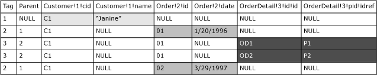

# <a name="use-explicit-mode-with-for-xml"></a>Utiliser le mode EXPLICIT avec FOR XML
[!INCLUDE[tsql-appliesto-ss2008-xxxx-xxxx-xxx-md](../../includes/tsql-appliesto-ss2008-xxxx-xxxx-xxx-md.md)]
  Comme indiqué dans la rubrique traitant de la [Construction de code XML à l’aide de FOR XML](../../relational-databases/xml/for-xml-sql-server.md), les modes RAW et AUTO ne permettent pas de contrôler de façon précise la forme du document XML généré à partir du résultat d’une requête. Toutefois, le mode EXPLICIT offre la plus grande souplesse pour générer le document XML à partir du résultat d'une requête.  
  
 La requête en mode EXPLICIT doit être écrite de telle sorte que les informations supplémentaires sur le document XML, telles que l'imbrication attendue dans celui-ci, soient explicitement spécifiées comme une partie de la requête. Suivant le document XML demandé, l'écriture de requêtes en mode EXPLICIT peut s'avérer peu pratique. L’ [utilisation du mode PATH](../../relational-databases/xml/use-path-mode-with-for-xml.md) avec imbrication peut vous apparaître comme une solution plus simple pour écrire des requêtes en mode EXPLICIT.  
  
 Étant donné que vous décrivez en mode EXPLICIT le document XML souhaité dans le cadre de la requête, vous devez veiller à ce que sa forme générée soit correcte et valide.  
  
## <a name="rowset-processing-in-explicit-mode"></a>Traitement de l'ensemble de lignes en mode EXPLICIT  
 Le mode EXPLICIT transforme l'ensemble de lignes issu de l'exécution de la requête en un document XML. Pour cela, l'ensemble de lignes doit être d'un format spécifique. Cela suppose que vous écriviez la requête SELECT qui génère l’ensemble de lignes, la **table universelle**, dans un format spécifique afin que la logique de traitement puisse produire le document XML souhaité.  
  
 Dans un premier temps, la requête doit générer les deux colonnes de métadonnées suivantes :  
  
-   La première colonne doit fournir le numéro de balise, de type entier, de l’élément actuel et le nom de la colonne doit être **Tag**. La requête doit fournir un numéro de balise unique pour chaque élément à construire à partir de l'ensemble de lignes.  
  
-   La seconde colonne doit fournir un numéro de balise de l’élément parent et porter le nom **Parent**. Ainsi, les colonnes Tag et Parent fournissent les informations de hiérarchie.  
  
 Ces valeurs de colonnes de métadonnées, associées aux informations des noms de colonnes, permettent de générer le document XML souhaité. La requête doit fournir les noms de colonnes d'une manière spécifique. En outre, la valeur 0 ou NULL dans la colonne **Parent** . indique que l’élément correspondant n’a pas de parent. L'élément est ajouté au document XML en tant qu'élément de niveau supérieur.  
  
 Pour comprendre comment la table universelle générée par une requête est traitée en vue de produire un document XML, supposons que vous ayez écrit une requête qui génère la table universelle suivante :  
  
   
  
 Notez les points suivants à propos de cette table universelle :  
  
-   Les deux premières colonnes sont **Tag** et **Parent** et sont des colonnes de métadonnées. Ces valeurs déterminent la hiérarchie.  
  
-   Les noms de colonnes sont spécifiés d'une certaine manière, décrite plus loin dans cette rubrique.  
  
-   Lors de la génération du document XML à partir de cette table universelle, les données de celle-ci sont partitionnées verticalement en groupes de colonnes. Le regroupement est déterminé en fonction de la valeur **Tag** et des noms de colonnes. Lors de la construction du document XML, la logique de traitement sélectionne un groupe de colonnes par ligne et construit un élément. Cet exemple repose sur les données suivantes :  
  
    -   Pour la valeur de colonne **Tag** 1 de la première ligne, les colonnes dont le nom comprend le même numéro de balise, **Customer!1!cid** et **Customer!1!name**, forment un groupe. Ces colonnes sont utilisées dans le traitement de la ligne et vous avez peut-être remarqué que l'élément généré présente la forme <`Customer id=... name=...`>. Le format des noms de colonnes est décrit plus loin dans cette rubrique.  
  
    -   Pour les lignes possédant la valeur de colonne **Tag** 2, les colonnes **Order!2!id** et **Order!2!date** forment un groupe qui permet de construire les éléments <`Order id=... date=... /`>.  
  
    -   Pour les lignes possédant la valeur de colonne **Tag** 3, les colonnes **OrderDetail!3!id!id** et **OrderDetail!3!pid!idref** forment un groupe. Chacune de ces lignes génère un élément, <`OrderDetail id=... pid=...`>, à partir de ces colonnes.  
  
-   Lors de la génération de la hiérarchie XML, les lignes sont traitées dans l'ordre. La hiérarchie XML est déterminée comme suit :  
  
    -   La première ligne spécifie la valeur **Tag** 1 et la valeur **Parent** NULL. Par conséquent, l'élément correspondant, <`Customer`>, est ajouté en tant qu'élément de niveau supérieur au document XML.  
  
        ```  
        <Customer cid="C1" name="Janine">  
        ```  
  
    -   La deuxième ligne identifie la valeur **Tag** 2 et la valeur **Parent** 1. Par conséquent, l'élément <`Order`> est ajouté en tant qu'enfant de l'élément <`Customer`>.  
  
        ```  
        <Customer cid="C1" name="Janine">  
           <Order id="O1" date="1/20/1996">  
        ```  
  
    -   La ligne suivante identifie la valeur **Tag** 3 et la valeur **Parent** 2. Les deux éléments <`OrderDetail`> sont donc ajoutés en tant qu'enfants de l'élément <`Order`>.  
  
        ```  
        <Customer cid="C1" name="Janine">  
           <Order id="O1" date="1/20/1996">  
              <OrderDetail id="OD1" pid="P1"/>  
              <OrderDetail id="OD2" pid="P2"/>  
        ```  
  
    -   La dernière ligne identifie la valeur 2 comme numéro **Tag** et la valeur 1 comme numéro de balise **Parent**. Par conséquent, un autre élément enfant <`Order`> est ajouté à l'élément parent <`Customer`>.  
  
        ```  
        <Customer cid="C1" name="Janine">  
           <Order id="O1" date="1/20/1996">  
              <OrderDetail id="OD1" pid="P1"/>  
              <OrderDetail id="OD2" pid="P2"/>  
           </Order>  
           <Order id="O2" date="3/29/1997">  
        </Customer>  
        ```  
  
 En résumé, les valeurs des colonnes de métadonnées **Tag** et **Parent**, les informations fournies dans les noms de colonnes et le classement correct des lignes génèrent le document XML souhaité lorsque vous utilisez le mode EXPLICIT.  
  
### <a name="universal-table-row-ordering"></a>Classement des lignes de la table universelle  
 Lors de la construction du document XML, les lignes de la table universelle sont traitées dans l'ordre. Par conséquent, pour extraire les instances enfants adéquates associées à leur parent, vous devez trier les lignes de l'ensemble de lignes de manière à ce que chaque nœud parent soit immédiatement suivi de ses enfants.  
  
## <a name="specifying-column-names-in-a-universal-table"></a>Spécification de noms de colonnes dans une table universelle  
 Lors de l'écriture des requêtes en mode EXPLICIT, les noms de colonnes de l'ensemble de lignes obtenu doivent être spécifiés à l'aide du format ci-après. Ils fournissent des informations de transformation, dont les noms d'éléments et d'attributs, spécifiées à l'aide de directives.  
  
 Voici le format général :  
  
```  
  
ElementName!TagNumber!AttributeName!Directive  
```  
  
 Voici la description des parties du format :  
  
 *ElementName*  
 Identificateur générique obtenu de l'élément. Par exemple, si **Customers** est spécifié en tant que *ElementName*, l’élément \<Customers> est généré.  
  
 *TagNumber*  
 Valeur de balise unique affectée à un élément. Cette valeur, associée aux deux colonnes de métadonnées **Tag** et **Parent**, détermine l’imbrication des éléments dans le document XML obtenu.  
  
 *AttributeName*  
 Fournit le nom de l’attribut à construire dans l’option *ElementName*spécifiée. Ce comportement est appliqué si l’option *Directive* n’est pas spécifiée.  
  
 Si l’option *Directive* est spécifiée et que sa valeur est **xml**, **cdata**ou **element**, cette valeur est utilisée pour construire un élément enfant de *ElementName*et la valeur de la colonne est ajoutée à cet élément.  
  
 Si vous spécifiez l’option *Directive*, l’option *AttributeName* peut être vide. Par exemple, ElementName!TagNumber!!Directive. Dans ce cas, la valeur de la colonne est directement contenue dans l’option *ElementName*.  
  
 *Directive*  
 L’option*Directive* est facultative et permet de fournir des informations supplémentaires pour la construction du document XML. La finalité de*Directive* est double.  
  
 D'une part, elle permet d'encoder les valeurs sous la forme de mots clés ID, IDREF et IDREFS. Vous pouvez spécifier les mots clés **ID**, **IDREF**et **IDREFS** en tant que *Directives*. Ces directives remplacent les types d'attributs. Cela vous permet de créer des liens à l'intérieur du document.  
  
 D’autre part, l’option *Directive* vous permet d’indiquer comment vous souhaitez mapper les données de chaîne au document XML. Les mots clés **hide**, **element, elementxsinil**, **xml**, **xmltext**et **cdata** peuvent être utilisés comme *Directive*. La directive **hide** masque le nœud. Cela peut s'avérer utile pour extraire des valeurs à des fins de tri sans qu'elles apparaissent dans le document XML obtenu.  
  
 La directive **element** génère un élément contenu au lieu d’un attribut. Les données contenues sont encodées comme une entité. Par exemple, le caractère **<** devient &lt;. Dans le cas des valeurs de colonne NULL, aucun élément n'est généré. Si vous souhaitez qu’un élément soit généré pour les valeurs de colonne NULL, vous pouvez spécifier la directive **elementxsinil** . Cette opération génère un élément ayant l'attribut xsi:nil=TRUE.  
  
 La directive **xml** est identique à une directive **element** , sauf qu’aucun encodage d’entité ne se produit. Notez que la directive **element** peut être combinée avec le mot clé **ID**, **IDREF**ou **IDREFS**, tandis que la directive **xml** n’est autorisée avec aucune autre directive, sauf **hide**.  
  
 La directive **cdata** englobe les données à l’aide d’une section CDATA. Le contenu n'est pas encodé par entité. Le type de données d’origine doit être un type texte tel que **varchar**, **nvarchar**, **text**ou **ntext**. Cette directive ne peut être utilisée qu’avec **hide**. Quand cette directive est utilisée, *AttributeName* ne doit pas être spécifié.  
  
 La combinaison de directives entre ces deux groupes est autorisée dans la plupart des cas, contrairement à la combinaison entre elles-mêmes.  
  
 Si les options *Directive* et *AttributeName* ne sont pas spécifiées, par exemple **Customer!1**, une directive **element** est définie de manière implicite, telle que **Customer!1!!element**, et les données de colonnes figurent dans l’option *ElementName*.  
  
 Si la directive **xmltext** est spécifiée, le contenu des colonnes est englobé dans une balise unique intégrée au reste du document. Cette directive est utile pour extraire des données XML non consommées, en excès, stockées dans une colonne à l'aide de OPENXML. Pour plus d’informations, consultez [OPENXML &#40;SQL Server&#41;](../../relational-databases/xml/openxml-sql-server.md).  
  
 Si l’option *AttributeName* est définie, le nom de balise est remplacé par le nom spécifié. Sinon, l'attribut est ajouté à la liste actuelle des attributs des éléments d'encadrement par placement du contenu au début de l'imbrication sans encodage d'entité. La colonne à laquelle cette directive est associée doit être d’un type texte, tel que **varchar**, **nvarchar**, **char**, **nchar**, **text**ou **ntext**. Cette directive ne peut être utilisée qu’avec **hide**. Elle est utile pour extraire des données en excès stockées dans une colonne. Si le contenu ne présente pas un format XML correct, le comportement n'est pas défini.  
  
## <a name="in-this-section"></a>Dans cette section  
 Les exemples suivants illustrent l'utilisation du mode EXPLICIT.  
  
-   [Exemple : extraction d'informations sur les employés](../../relational-databases/xml/example-retrieving-employee-information.md)  
  
-   [Exemple : spécification de la directive ELEMENT](../../relational-databases/xml/example-specifying-the-element-directive.md)  
  
-   [Exemple : spécification de la directive ELEMENTXSINIL](../../relational-databases/xml/example-specifying-the-elementxsinil-directive.md)  
  
-   [Exemple : construction de frères à l'aide du mode EXPLICIT](../../relational-databases/xml/example-constructing-siblings-with-explicit-mode.md)  
  
-   [Exemple : spécification des directives ID et IDREF](../../relational-databases/xml/example-specifying-the-id-and-idref-directives.md)  
  
-   [Exemple : spécification des directives ID et IDREFS](../../relational-databases/xml/example-specifying-the-id-and-idrefs-directives.md)  
  
-   [Exemple : spécification de la directive HIDE](../../relational-databases/xml/example-specifying-the-hide-directive.md)  
  
-   [Exemple : spécification de la directive ELEMENT et de l'encodage d'entité](../../relational-databases/xml/example-specifying-the-element-directive-and-entity-encoding.md)  
  
-   [Exemple : spécification de la directive CDATA](../../relational-databases/xml/example-specifying-the-cdata-directive.md)  
  
-   [Exemple : spécification de la directive XMLTEXT](../../relational-databases/xml/example-specifying-the-xmltext-directive.md)  
  
## <a name="see-also"></a> Voir aussi  
 [Utiliser le mode RAW avec FOR XML](../../relational-databases/xml/use-raw-mode-with-for-xml.md)   
 [UTiliser le mode AUTO avec FOR XML](../../relational-databases/xml/use-auto-mode-with-for-xml.md)   
 [Utiliser le mode PATH avec FOR XML](../../relational-databases/xml/use-path-mode-with-for-xml.md)   
 [SELECT &#40;Transact-SQL&#41;](../../t-sql/queries/select-transact-sql.md)   
 [FOR XML &#40;SQL Server&#41;](../../relational-databases/xml/for-xml-sql-server.md)  
  
  
