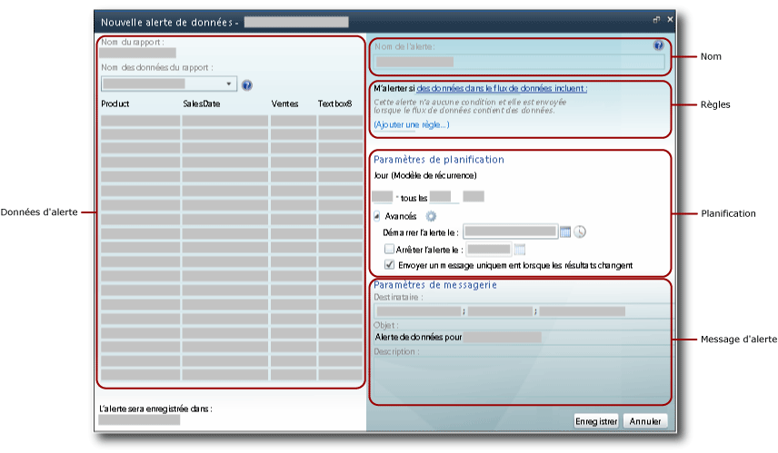
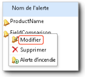

# Concepteur d’alertes de données

[!INCLUDE [ssrs-appliesto](../includes/ssrs-appliesto.md)] [!INCLUDE [ssrs-appliesto-2016](../includes/ssrs-appliesto-2016.md)] [!INCLUDE [ssrs-appliesto-not-2017](../includes/ssrs-appliesto-not-2017.md)] [!INCLUDE[ssrs-appliesto-sharepoint-2013-2016i](../includes/ssrs-appliesto-sharepoint-2013-2016.md)] [!INCLUDE [ssrs-appliesto-not-pbirs](../includes/ssrs-appliesto-not-pbirs.md)]

[!INCLUDE [ssrs-previous-versions](../includes/ssrs-previous-versions.md)]

Vous pouvez créer et modifier les définitions d'alerte de données dans le Concepteur d'alertes de données. Une définition d'alerte est une collection de métadonnées, comprenant les données de rapport qui vous intéressent, les règles que les données de rapport doivent satisfaire pour créer des instances d'alerte de données et pour envoyer des messages d'alerte de données, les destinataires du message d'alerte, etc.  

> [!NOTE]
> L’intégration de Reporting Services à SharePoint n’est plus disponible après SQL Server 2016.

 Pour créer une définition d'alerte, plusieurs tâches sont associées :  
  
-   Sélectionnez le rapport et le flux de données de rapport qui inclut les données que vous souhaitez utiliser.  
  
-   Définissez la règles et les clauses qui provoquent le déclenchement d'une alerte. Les règles peuvent être simples ou complexes, car elles utilisent plusieurs clauses combinées par des opérateurs AND.  
  
-   Définissez la fréquence à laquelle le message d'alerte est envoyé et la date et l'heure auxquelles l'alerte démarre et s'arrête. Il est possible d'envoyer les messages d'alerte uniquement lorsque les résultats changent.  
  
-   Spécifiez les adresses de messagerie des destinataires du message d'alerte.  
  
-   Personnalisez la ligne **Objet** du message d’alerte.  
  
-   Fournit une description de l'alerte à inclure dans le message d'alerte.  
  
> [!NOTE]  
>  Les alertes de données [!INCLUDE[ssRSnoversion](../includes/ssrsnoversion-md.md)] sont disponibles uniquement si vous installez [!INCLUDE[ssRSnoversion](../includes/ssrsnoversion-md.md)] en mode SharePoint. Le rapport qui fait l’objet de l’alerte doit donc être enregistré, déployé ou chargé dans une bibliothèque de documents SharePoint.  
>   
>  Les alertes de données ne peuvent pas être créées sur des rapports qui utilisent l'authentification intégrée Windows ou les invites pour les informations d'identification. Les rapports doivent utiliser des informations d'identification stockées. Pour plus d’informations, consultez [Spécifier des informations d’identification et de connexion pour les sources de données de rapport](../reporting-services/report-data/specify-credential-and-connection-information-for-report-data-sources.md).  
  
 Pour ouvrir le Concepteur d’alertes de données, cliquez sur l’option **Nouvelle alerte de données** dans le menu **Actions** de la barre d’outils Rapport. Si vous ne voyez pas l’option **Nouvelle alerte de données** , cela signifie que le rapport n’est pas configuré pour utiliser les informations d’identification stockées. Vous pouvez mettre à jour le type d'informations d'identification en mettant à jour la source des données de rapport depuis la bibliothèque SharePoint.  
  
##   Interface utilisateur du Concepteur d'alertes de données  
 Le Concepteur d'alertes de données est divisé en zones. La zone où vous sélectionnez le flux des données de rapport, la zone où vous créez des conditions simples ou complexes en ajoutant des règles aux conditions, et ainsi de suite. L'image suivante affiche les zones du Concepteur d'alertes de données.  
  
   
  
  
### Données d'alerte  
 Quand vous ouvrez le Concepteur d’alertes de données, il génère et met à disposition tous les flux de données du rapport. La liste déroulante **Nom des données du rapport** affiche les noms des flux. Les flux de données sont mis en cache dans la mémoire pendant que vous créez la définition d'alerte, et la table qui affiche les données du flux de données est remplie rapidement lorsque vous passez d'un flux de données à l'autre pour explorer les données de rapport.  
  
 La première étape pour la création d'une définition d'alerte de données consiste à sélectionner le flux de données de rapport qui contient les données que vous souhaitez surveiller au moyen de l'alerte. Les rapports peuvent avoir zéro ou plusieurs flux de données. Si un rapport n'a pas de flux de données, vous ne pouvez pas créer d'alertes sur ses données. Un flux de données peut être généré par toute région de données, notamment tous les types de graphiques, jauges, indicateurs ainsi que tables, matrices et listes.  
  
 Si le rapport est paramétré et vous ne voyez pas les données et les colonnes attendues dans le flux de données du rapport, réexécutez le rapport avec des valeurs de paramètre appropriées. Les colonnes et les valeurs doivent être présentes dans le rapport à inclure dans le flux de données.  
  
 Selon la mise en page du rapport, il peut être difficile de déterminer combien de flux de données il contient, ou quelles données sont incluses dans quel flux de données. L’extension de rendu Atom de [!INCLUDE[ssRSnoversion](../includes/ssrsnoversion-md.md)]génère les flux de données que vous utilisez avec les alertes. L'extension de rendu Atom présente les données de rapport comme des ensembles de lignes aplatis, un format tabulaire dans lequel toutes les colonnes ont le même nombre de lignes. Ces ensembles de lignes sont le contenu des flux de données. Étant donné que le modèle de mise en page de rapport est souvent complexe et contient plusieurs régions de données homologues ou imbriquées, plusieurs flux de données sont nécessaires pour que toutes les données du rapport soient disponibles. Pour plus d’informations sur la façon dont les flux de données sont générés à partir des rapports, consultez [Génération de flux de données à partir de rapports &#40;Générateur de rapports et SSRS&#41;](../reporting-services/report-builder/generating-data-feeds-from-reports-report-builder-and-ssrs.md) et [Générer des flux de données à partir d’un rapport &#40;Générateur de rapports et SSRS&#41;](../reporting-services/report-builder/generate-data-feeds-from-a-report-report-builder-and-ssrs.md).  
  
 Lorsque vous choisissez un flux de données, ses données s'affichent dans une table avec des lignes et des colonnes dans le volet des données d'alerte du Concepteur d'alertes de données. Les métadonnées de la source de données que le rapport utilise, ou bien le rapport lui-même, spécifient les noms de colonne ; le flux de données remplit la liste de champs que vous utilisez pour définir des règles dans les conditions de données. Le flux de données fournit également des métadonnées telles que les types de données des colonnes de la table qui restreignent les valeurs et les opérateurs de comparaison que vous pouvez utiliser avec les champs lorsque vous créez les règles.  
  
 Certains rapports comportent des millions de lignes de données. Le tableau montre uniquement les 100 premières lignes de données dans le flux.  
  
### Nom de l'alerte  
 Par défaut, la définition d'alerte a le même nom que le rapport. Vous pouvez remplacer le nom de l'alerte par un autre nom plus explicite. Cela permet de simplifier la gestion de vos alertes et de déterminer quelles alertes doivent être mises à jour, supprimées et ainsi de suite.  
  
 Vous pouvez créer plusieurs alertes sur un rapport. Il est possible d'avoir plusieurs définitions d'alerte avec le même nom, mais il est recommandé de donner un nom unique à l'alerte. Cela facilite la différenciation et la gestion des définitions d'alerte. Vous pouvez consulter la liste de toutes les alertes que vous avez créées dans le Gestionnaire des alertes de données. Pour plus d’informations, consultez [Gestionnaire des alertes de données pour les administrateurs d’alertes](../reporting-services/data-alert-manager-for-alerting-administrators.md) et [Gérer mes alertes de données dans le Gestionnaire des alertes de données](../reporting-services/manage-my-data-alerts-in-data-alert-manager.md).  
  
### Règles et clauses  
 L'étendue des modifications apportées aux données et les règles de l'alerte définissent les modifications qui déclenchent l'alerte. Les types de modifications apportées aux données sont les suivants :  
  
-   **Au moins une donnée a**indique qu’au moins une valeur dans les données suit les règles spécifiées dans la condition.  
  
-   **Aucune donnée n’a**indique qu’aucune valeur ne suit les règles spécifiées dans la condition.  
  
 Une règle contient zéro, une, ou plusieurs clauses. Plusieurs règles sont combinées par l'opérateur logique AND. Une règle peut inclure plusieurs clauses combinées par l'opérateur OR si la colonne a le type de données de chaîne. Voici des règles de base qui utilisent une seule clause, plusieurs règles combinées à l'aide de l'opérateur AND et plusieurs règles ayant une ou plusieurs clauses OR.  
  
 **Règles simples**  
  
-   Le montant net des ventes **est supérieur à** 100 000  
  
-   La date des ventes **est après le** 6/1/2010  
  
-   Le nom de la société **n’est pas** Contoso  
  
 **Règles combinées par l'opérateur AND**  
  
-   Le montant des ventes **est supérieur à** 1 500,00  
  
     **et** le nombre d’unités vendues **est inférieur à** 500  
  
     La date de retour **est avant le** 1/1/2010  
  
-   Le montant des ventes **est supérieur ou égal à** 1 500,00  
  
     **et** la date de retour **est après le** 1/1/2010  
  
     **et** le nombre d’unités vendues **est supérieur à** 500  
  
-   Le nom de la promotion **contient** la chaîne Spring  
  
     **et** le nombre d’unités vendues **est supérieur à** 500  
  
     **et** le nombre d’invendus **est**  0  
  
 **Règles avec clauses OR**  
  
-   Le nom **est** Blythe  
  
     **Ou**  Petulescu  
  
     **Ou**  Martin  
  
-   La date de retour **est après le** 1/1/2010  
  
     **et** le secteur de vente **est**  Centre  
  
     **Ou**  Sud  
  
     **Ou**  Nord  
  
 Selon le type de données du champ, le Concepteur d'alertes de données propose différentes comparaisons. Le Concepteur d'alertes de données fournit les comparaisons adaptées au type de données du champ auquel les valeurs sont comparées. Voici les comparaisons disponibles pour les différents types de données. Le type de données **Booléen** n’est pas pris en charge dans les règles.  
  
-   Comparaisons des types de données date/heure : **est**, **n’est pas**, **est avant**et **est après**  
  
-   Comparaisons des types de données numériques : **est**, **n’est pas**, **est inférieur à**, **est inférieur ou égal à**, **est supérieur à**et **est supérieur ou égal à**  
  
-   Comparaisons des types de données de chaîne : **est**, **n’est pas**et **contient**  
  
 Quand vous créez une règle, vous spécifiez s’il faut utiliser une valeur ou un champ dans la comparaison en choisissant **Mode de saisie de valeur** ou **Mode de sélection de champ**. Si vous choisissez **Mode de saisie de valeur**, vous devez fournir une liste de valeurs à comparer. Une comparaison qui inclut plusieurs clauses OR est très similaire à la comparaison logique IN dans [!INCLUDE[tsql](../includes/tsql-md.md)], qui est une liste de valeurs à tester pour trouver une correspondance. Pour plus d’informations, consultez [IN &#40;Transact-SQL&#41;](../t-sql/language-elements/in-transact-sql.md).  
  
 Si vous choisissez **Mode de sélection de champ**, la comparaison se fait entre deux champs, ligne par ligne. Les deux champs doivent être compatibles (par exemple, deux champs numériques) ou la comparaison ne sera pas valide. Une liste de champs s’affiche automatiquement quand vous choisissez **Mode de sélection de champ**.  
  
 Les alertes de données sans règles sont également valides. Ce type d'alerte peut être très utile. Imaginez un scénario dans lequel vous souhaitez uniquement être notifié lorsque le flux de données du rapport contient des données. Le flux de données contient des informations sur les participants et reste vide jusqu'à ce qu'un participant annule sa participation. Dans ce scénario, vous devriez recevoir une alerte dès la première annulation.  
  
 Vous pouvez supprimer individuellement des règles et des clauses.  
  
 Les règles et les clauses sont incluses dans le message d'alerte de données.  
  
### Paramètres de planification  
 La planification que vous définissez pour l'alerte de données définit la périodicité d'envoi du message d'alerte et le début et la fin de l'envoi des messages d'alerte. Les modèles sont : une seule fois, toutes les minutes, une fois par jour et une fois par semaine. Bien qu'une alerte n'ait q'une seule planification possible, vous pouvez créer des périodicités complexes répondant à la plupart des exigences opérationnelles à l'aide de ces intervalles. Voici quelques exemples de périodicités communément utilisées dans les planifications :  
  
-   **Une fois par jour, tous les 10 jours** — Envoie une alerte une fois par jour, tous les 10 jours.  
  
-   **Une fois par semaine, toutes les 2 semaines, le lundi** — Envoie une alerte toutes les deux semaines, uniquement le lundi.  
  
-   **Toutes les 12 heures** — Envoie une alerte toutes les 12 heures.  
  
-   **Toutes les 30 minutes** — Envoie une alerte toutes les 30 minutes.  
  
 La périodicité spécifie quand l'alerte est envoyée. Si les règles sont satisfaites au cours de l'intervalle spécifié par le modèle, l'alerte n'est envoyée qu'à la fil de l'intervalle.  
  
 Si vous souhaitez recevoir un message d'alerte de données dès que possible lorsque les données du rapport suivent les règles spécifiées, vous pouvez planifier l'alerte pour qu'elle s'exécute plus souvent. Lorsque les données du rapport ne changent pas, vous-même et les autres destinataires pouvez recevoir de nombreux messages redondants. Si vous souhaitez recevoir des messages uniquement en cas de changement des résultats après l’application des règles, sélectionnez l’option **Envoyer un message seulement si les résultats changent** .  
  
> [!IMPORTANT]  
>  Il est recommandé de ne pas utiliser une périodicité plus fréquente que la périodicité quotidienne, sauf si cela est requis par votre entreprise. Le traitement de la définition d'alerte de données en temps réel n'est pas un scénario pris en charge. Si le traitement des définitions d’alerte de données est trop fréquent, cela peut affecter les performances du serveur de rapports et du déploiement global de [!INCLUDE[ssRSnoversion](../includes/ssrsnoversion-md.md)] .  
  
### Paramètres de messagerie  
 Utilisez l’option **Destinataire(s)** pour spécifier les adresses e-mail des destinataires à qui envoyer les messages d’alerte de données par e-mail. Séparez les adresses de messagerie par des points-virgules, comme vous le feriez dans un courrier électronique Microsoft Office Outlook. Vous pouvez également spécifier des groupes de distribution comme destinataires, pour simplifier et accélérer la gestion de la liste des destinataires. Si SharePoint peut déterminer votre adresse de messagerie lorsque vous créez une définition d'alerte, celle-ci est ajoutée automatiquement aux destinataires répertoriés ; sinon, vous devez vous ajouter explicitement comme destinataire.  
  
 L’objet par défaut de l’e-mail est **Alerte de données pour \<nom_alerte>**. Vous pouvez changer l'objet selon vos besoins.  
  
 Vous pouvez aussi fournir une description à l’aide de l’option **Description** . Cette description sera incluse dans le message d’alerte de données. En incluant une description, surtout si vous avez créé des alertes de données similaires, vous aidera à différencier rapidement les messages d'alerte et à mieux les comprendre. En plus du message d'alerte envoyé lorsque les données du rapport suivent les règles spécifiées, un message d'alerte est envoyé à tous les destinataires lorsqu'une erreur se produit. Pour plus d’informations, consultez [Data Alert Messages](../reporting-services/data-alert-messages.md).  
  
 Pour plus d’informations sur la façon dont l’e-mail est généré, consultez [Alertes de données Reporting Services](../reporting-services/reporting-services-data-alerts.md).  
  
##   Créer une définition d'alerte de données  
 Si vous avez accordé des autorisations permettant de consulter des éléments et de créer des alertes dans SharePoint, vous pouvez créer une définition d'alerte de données pour tout rapport que vous êtes autorisé à afficher, tant que le rapport utilise des informations d'identification stockées ou bien aucune information d'identification. Vous exécutez le rapport à partir d'une bibliothèque SharePoint. Les données que vous pouvez utiliser dans le Concepteur d'alertes de données proviennent du rapport. Si le rapport est paramétré, vous devrez peut-être exécuter le rapport en utilisant des valeurs de paramètre différentes pour vous assurer que les données qui vous intéressent s'affichent dans le rapport. Après avoir ouvert le rapport, cliquez sur l’option **Nouvelle alerte de données** dans le menu **Actions** de la barre d’outils Rapport pour ouvrir le Concepteur d’alertes de données. L'image suivante vous indique comment ouvrir le Concepteur d'alertes de données.  
  
   
  
 Pour plus d’informations, consultez [Créer une alerte de données dans le Concepteur d’alertes](../reporting-services/create-a-data-alert-in-data-alert-designer.md).  
  
  
##   Enregistrer une définition d'alerte de données  
 Le Concepteur d'alertes de données affiche l'URL du site où la définition d'alerte de données sera enregistrée. Les définitions d'alerte de données sont toujours enregistrées sur le même site en tant que rapports.  
  
> [!NOTE]  
>  Les valeurs de paramètre choisies pour exécuter le rapport sont enregistrées dans la définition d'alerte et seront utilisées lorsque le rapport sera exécuté une nouvelle fois dans le cadre d'une étape de traitement de la définition d'alerte. Pour utiliser des valeurs de paramètre différentes, vous devez créer une nouvelle définition d'alerte.  
  
 Avant que la définition d'alerte soit enregistrée, elle est validée. Vous devez corriger toutes les erreurs avant de pouvoir enregistrer la définition d'alerte. Pour plus d’informations, consultez [Créer une alerte de données dans le Concepteur d’alertes](../reporting-services/create-a-data-alert-in-data-alert-designer.md).  
  
  
##   Modifier une définition d'alerte de données  
 Une fois que vous avez enregistré votre définition d'alerte de données, vous pouvez la rouvrir pour la modifier dans le Concepteur d'alertes de données. Vous pouvez ajouter, modifier ou supprimer des règles et des clauses et modifier la planification et les paramètres des courriers électroniques. Si le flux de données du rapport utilisé par l'alerte a changé et ne contient plus les champs référencés par les règles de l'alerte, ou si les types de données ou d'autres métadonnées des champs ont été modifiés, la définition d'alerte n'est plus valide et vous devez la corriger avant de pouvoir l'enregistrer de nouveau. Si vous souhaitez utiliser un flux de données différent, vous devez créer une nouvelle définition d'alerte.  
  
 Pour modifier une définition d’alerte de données, cliquez avec le bouton droit dans le Gestionnaire des alertes de données et sélectionnez **Modifier**. L'image suivante montre le menu contextuel d'une alerte de données dans le Gestionnaire des alertes de données.  
  
   
  
 Pour plus d’informations, consultez [Modifier une alerte de données dans le Concepteur d’alertes](../reporting-services/edit-a-data-alert-in-alert-designer.md).  
  
  
##   Tâches associées  
 Cette section répertorie les procédures qui vous indiquent comment créer et modifier des alertes.  
  
-   [Modifier une alerte de données dans le Concepteur d’alertes](../reporting-services/edit-a-data-alert-in-alert-designer.md)  
  
-   [Créer une alerte de données dans le concepteur d’alertes de données](../reporting-services/create-a-data-alert-in-data-alert-designer.md)  

##  Voir aussi

[Alertes de données Reporting Services](../reporting-services/reporting-services-data-alerts.md)   
[Gestionnaire des alertes de données pour les administrateurs d'alertes](../reporting-services/data-alert-manager-for-alerting-administrators.md)  

D’autres questions ? [Essayez de poser une question dans le forum Reporting Services](http://go.microsoft.com/fwlink/?LinkId=620231)
