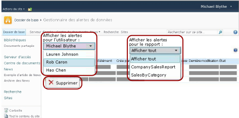

# Gestionnaire des alertes de données pour les administrateurs d'alertes

[!INCLUDE [ssrs-appliesto](../includes/ssrs-appliesto.md)] [!INCLUDE [ssrs-appliesto-2016](../includes/ssrs-appliesto-2016.md)] [!INCLUDE [ssrs-appliesto-not-2017](../includes/ssrs-appliesto-not-2017.md)] [!INCLUDE[ssrs-appliesto-sharepoint-2013-2016i](../includes/ssrs-appliesto-sharepoint-2013-2016.md)] [!INCLUDE [ssrs-appliesto-not-pbirs](../includes/ssrs-appliesto-not-pbirs.md)]

[!INCLUDE [ssrs-previous-versions](../includes/ssrs-previous-versions.md)]

SQL Server Reporting Services fournit le Gestionnaire des alertes de données pour permettre aux administrateurs d’alertes SharePoint de gérer les alertes de données. Les administrateurs d'alertes peuvent consulter les informations relatives à toutes les alertes enregistrées sur le site et supprimer des alertes. L'image suivante affiche les fonctionnalités disponibles aux gestionnaires d'alertes SharePoint dans le Gestionnaire des alertes de données.

> [!NOTE]
> L’intégration de Reporting Services à SharePoint n’est plus disponible après SQL Server 2016.

 Lorsque le site autorise les alertes de données, deux pages SharePoint, MyDataAlerts.aspx et SiteDataAlerts.aspx sont créées et ajoutées au site SharePoint. SiteDataAlerts.aspx est le Gestionnaire des alertes de données utilisé par les administrateurs d'alertes. Les administrateurs d'alertes peuvent ouvrir le Gestionnaire des alertes de données dans la page Paramètres du site SharePoint. Ils doivent avoir l'autorisation SharePoint de gérer les alertes pour ouvrir le Gestionnaire des alertes de données.  
  
 Vous pouvez également ouvrir directement le Gestionnaire des alertes de données à l'aide d'une URL. L'exemple suivant indique la syntaxe de l'URL.  
  
 `http: //<site name>/_layouts/ReportServer/ SiteDataAlerts.aspx`  
  
> [!NOTE]  
>  En tant qu’administrateur d’alertes, vous pouvez autoriser les travailleurs de l’information à accéder aux fonctionnalités d’alerte de données de [!INCLUDE[ssRSnoversion](../includes/ssrsnoversion-md.md)] . Pour plus d’informations sur les autorisations nécessaires, consultez [Alertes de données Reporting Services](../reporting-services/reporting-services-data-alerts.md).  
  
##   Consulter les informations relatives aux alertes de données  
 Quand Reporting Services est installé et configuré dans SharePoint, la page Paramètres du site SharePoint inclut les options **Reporting Services** . Les administrateurs d’alertes cliquent sur l’option **Gérer les alertes de données** dans Reporting Service pour ouvrir le Gestionnaire des alertes de données. L'image suivante montre à quel endroit de la page Paramètres du site vous ouvrez le Gestionnaire des alertes de données.  
  
   
  
 Le Gestionnaire des alertes de données inclut une table qui répertorie le nom de l'alerte, le nom du rapport, le nom de la personne qui a créé l'alerte, le nombre de messages d'alerte envoyés, la dernière fois que la définition d'alerte a été exécutée, la dernière fois qu'elle a été modifiée et l'état du message d'alerte. Si l'alerte de données ne peut pas être générée ou envoyée, la colonne d'état contient des informations sur l'erreur et vous aide à dépanner l'alerte. Pour plus d’informations, consultez [Gérer toutes les alertes de données sur un site SharePoint dans le Gestionnaire des alertes de données](../reporting-services/manage-all-data-alerts-on-a-sharepoint-site-in-data-alert-manager.md).  
  
 Le tableau suivant présente des exemples de données d'une table dans le Gestionnaire des alertes de données. Quand une erreur se produit, le message d’erreur et l’identificateur de l’entrée du journal (GUID) sont inclus dans le champ **État** de la table.  
  
|Nom de l'alerte|Nom du rapport|Date de création|Alertes envoyées|Dernière exécution|Dernière modification|État|  
|----------------|-----------------|----------------|-----------------|--------------|-------------------|------------|  
|SalesQTR|SalesByTerritoryAndQTR|Lauren Johnson|4|6/12/2011|6/1/2011|La dernière alerte a été exécutée avec succès et l'alerte a été envoyée.|  
|UnitsSold|ProductsSalesByQTR|Michael Blythe|2|7/1/2011|6/28/2011|La dernière alerte a été exécutée avec succès, mais aucune donnée n'a été modifiée et aucune alerte n'a été envoyée.|  
|InventoryCount|StockStatusByQTR|Lauren Johnson|7|7/10/2011|7/2/2011|\<message d’erreur> Le fichier journal contient des informations détaillées sur l’erreur. Consultez l’entrée du journal portant l’identificateur : \<GUID>.|  
|TopPromotion|PromotionTracking|Cristian Petculescu|0||5/23/2011|Alerte créée.|  
  
 Pour plus d’informations, consultez [Gérer toutes les alertes de données sur un site SharePoint dans le Gestionnaire des alertes de données](../reporting-services/manage-all-data-alerts-on-a-sharepoint-site-in-data-alert-manager.md).  
  
 Vous pouvez consulter toutes les alertes créées par les utilisateurs du site. Choisissez un utilisateur puis indiquez s'il faut consulter toutes ses alertes ou uniquement celles pour un rapport spécifique.  
  
  
##   Supprimer des alertes de données  
 Vous pouvez supprimer des définitions d'alerte dans le Gestionnaire des alertes de données. Chaque définition d'alerte de données a un propriétaire, l'utilisateur SharePoint qui l'a créée. Les propriétaires peuvent supprimer uniquement les définitions d'alerte qu'ils ont créées. Pour plus d’informations, consultez [Gérer mes alertes de données dans le Gestionnaire des alertes de données](../reporting-services/manage-my-data-alerts-in-data-alert-manager.md).  
  
 Un administrateurs d'alertes SharePoint peut répertorier puis supprimer des définitions d'alerte créées par tous les utilisateurs du site. Pour plus d’informations, consultez [Gérer toutes les alertes de données sur un site SharePoint dans le Gestionnaire des alertes de données](../reporting-services/manage-all-data-alerts-on-a-sharepoint-site-in-data-alert-manager.md).  
  
 Une fois que vous avez supprimé la définition d'alerte, aucune alerte supplémentaire n'est envoyée. Toutefois, si vous interrogez la base de données des alertes, vous constaterez que la définition d'alerte existe encore. Le service d'alertes effectue un nettoyage planifié qui supprimera définitivement la définition d'alerte lors du nettoyage suivant. L'intervalle de nettoyage par défaut est de 20 minutes. Cet intervalle, ainsi que d'autres paramètres de nettoyage, sont configurables. Pour plus d’informations, consultez [Alertes de données Reporting Services](../reporting-services/reporting-services-data-alerts.md).  
  
  
##   Tâches associées  
 Cette section décrit la procédure qui vous explique comment gérer vos alertes.  
  
-   [Gérer toutes les alertes de données sur un site SharePoint dans le gestionnaire des alertes de données](../reporting-services/manage-all-data-alerts-on-a-sharepoint-site-in-data-alert-manager.md)  

##  Voir aussi

[Alertes de données Reporting Services](../reporting-services/reporting-services-data-alerts.md)  

D’autres questions ? [Essayez de poser une question dans le forum Reporting Services](http://go.microsoft.com/fwlink/?LinkId=620231)
