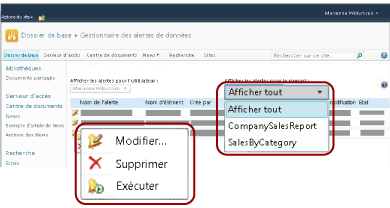
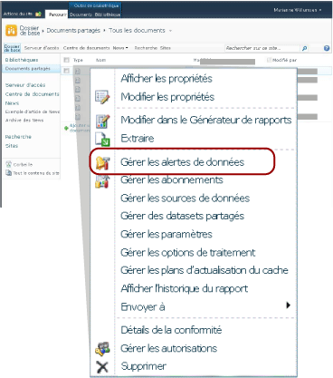

# Gestionnaire des alertes de données pour les utilisateurs SharePoint

[!INCLUDE [ssrs-appliesto](../includes/ssrs-appliesto.md)] [!INCLUDE [ssrs-appliesto-2016](../includes/ssrs-appliesto-2016.md)] [!INCLUDE [ssrs-appliesto-not-2017](../includes/ssrs-appliesto-not-2017.md)] [!INCLUDE[ssrs-appliesto-sharepoint-2013-2016i](../includes/ssrs-appliesto-sharepoint-2013-2016.md)] [!INCLUDE [ssrs-appliesto-not-pbirs](../includes/ssrs-appliesto-not-pbirs.md)]

[!INCLUDE [ssrs-previous-versions](../includes/ssrs-previous-versions.md)]

[!INCLUDE[ssRSnoversion](../includes/ssrsnoversion-md.md)] fournit le Gestionnaire des alertes de données pour permettre aux travailleurs de l’information SharePoint de gérer les alertes de données. Ces derniers peuvent afficher les informations relatives aux alertes qu'ils ont créées, supprimer des alertes, ouvrir les définitions d'alerte pour les modifier et exécuter des alertes à la demande. Il peuvent choisir de consulter les alertes d'un seul rapport ou les alertes de tous les rapports. L'illustration suivante montre les fonctionnalités dont les travailleurs de l'information disposent dans le Gestionnaire des alertes de données.

  

> [!NOTE]
> L’intégration de Reporting Services à SharePoint n’est plus disponible après SQL Server 2016.

Quand le site SharePoint autorise les alertes de données, deux pages SharePoint, MyDataAlerts.aspx et SiteDataAlerts.aspx sont créées et ajoutées au site SharePoint. MyDataAlerts.aspx est le Gestionnaire des alertes de données pour les travailleurs de l'information SharePoint. Les travailleurs de l'information peuvent ouvrir le Gestionnaire des alertes de données d'un clic droit sur les rapports sur lesquels ils ont créé des alertes.  

 Vous pouvez également ouvrir directement le Gestionnaire des alertes de données à l'aide d'une URL. L'exemple suivant indique la syntaxe de l'URL.  
  
 `http://<site name>/_layouts/ReportServer/MyDataAlerts.aspx`  
  
> [!NOTE]  
>  Avant de pouvoir utiliser les fonctionnalités d’alerte de [!INCLUDE[ssRSnoversion](../includes/ssrsnoversion-md.md)] , un administrateur doit vous accorder des autorisations. Pour plus d’informations sur les autorisations nécessaires, consultez [Alertes de données Reporting Services](../reporting-services/reporting-services-data-alerts.md).  
  
##   Consulter les informations relatives aux alertes de données  
 Vous pouvez afficher la liste des alertes de données que vous avez créées dans le Concepteur d'alertes de données. Pour ouvrir le Gestionnaire des alertes de données, cliquez avec le bouton droit sur un rapport publié dans une bibliothèque SharePoint. L’image suivante présente l’option **Gérer les alertes de données** dans le menu contextuel du rapport.  
  
   
  
 Le Gestionnaire des alertes de données inclut une table qui répertorie le nom de l'alerte, le nom du rapport, votre nom en tant que créateur de la définition d'alerte, le nombre de messages d'alerte envoyés, la dernière fois que la définition d'alerte a été exécutée, la dernière fois qu'elle a été modifiée et l'état du dernier message d'alerte. Si le message d'alerte ne peut pas être généré ou envoyé, la colonne d'état contient des informations sur l'erreur et vous aide à dépanner l'alerte. Pour plus d’informations, consultez [Gérer mes alertes de données dans le Gestionnaire des alertes de données](../reporting-services/manage-my-data-alerts-in-data-alert-manager.md).  
  
 Le tableau suivant présente des exemples de données d'une table dans le Gestionnaire des alertes de données. Quand une erreur se produit, le message d’erreur et l’identificateur de l’entrée du journal (GUID) sont inclus dans le champ **État** de la table.  
  
|Nom de l'alerte|Nom du rapport|Date de création|Alertes envoyées|Dernière exécution|Dernière modification|État|  
|----------------|-----------------|----------------|-----------------|--------------|-------------------|------------|  
|SalesQTR|SalesByTerritoryAndQTR|Lauren Johnson|4|6/12/2011|6/1/2011|La dernière alerte a été exécutée avec succès et l'alerte a été envoyée.|  
|UnitsSold|ProductsSalesByQTR|Lauren Johnson|2|7/1/2011|6/28/2011|La dernière alerte a été exécutée avec succès, mais aucune donnée n'a été modifiée et aucune alerte n'a été envoyée.|  
|TopPromotion|PromotionTracking|Lauren Johnson|0||5/23/2011|Alerte créée.|  
  
  
##   Supprimer des alertes de données  
 Vous pouvez supprimer des définitions d'alerte dans le Gestionnaire des alertes de données. En tant que travailleur de l'information, vous pouvez supprimer les définitions d'alerte que vous avez créées. Vous ne pouvez pas supprimer des définitions d'alerte créées par d'autres. Pour plus d’informations, consultez [Gérer mes alertes de données dans le Gestionnaire des alertes de données](../reporting-services/manage-my-data-alerts-in-data-alert-manager.md).  
  
 Lorsque vous supprimez une définition d'alerte, elle est supprimée définitivement. Si vous souhaitez uniquement suspendre les messages d'alerte, vous pouvez modifier la périodicité ou bien la date de démarrage ou d'arrêt dans la définition de l'alerte. Pour plus d’informations, consultez [Modifier une alerte de données dans le Concepteur d’alertes](../reporting-services/edit-a-data-alert-in-alert-designer.md).  
  
  
##   Modifier des alertes de données  
 En tant que travailleur de l'information, vous ouvrez vos définitions d'alerte pour les modifier dans le Gestionnaire des alertes de données. Vous pouvez modifier les définitions d'alerte que vous avez créées, mais pas celles créées par d'autres. Quand vous cliquez avec le bouton droit sur la définition d’alerte et cliquez sur **Modifier** , le Concepteur d’alertes de données s’ouvre, affichant la définition d’alerte. Pour plus d’informations, consultez [Concepteur d’alertes de données](../reporting-services/data-alert-designer.md) et [Modifier une alerte de données dans le Concepteur d’alertes](../reporting-services/edit-a-data-alert-in-alert-designer.md).  
  
  
##   Exécuter des alertes de données  
 Le Gestionnaire des alertes de données contient des informations sur la dernière exécution par le service d'alerte de la définition d'alerte de données et le nombre de fois que des messages d'alerte de données ont été envoyés. Vous pouvez exécuter et envoyer le message d'alerte immédiatement, au lieu d'attendre l'heure spécifiée par la planification. Lorsque vous exécutez une alerte du Gestionnaire des alertes de données, la planification de l'alerte est supprimée et le traitement commence après un délai d'une à cinq minutes, en fonction du temps nécessaire pour exécuter le rapport et selon que le serveur de rapports est occupé ou non au moment où vous avez choisi d'exécuter l'alerte. Toutefois, si vous avez spécifié qu'un message soit envoyé uniquement si les résultats changent, aucun message ne sera créé ou envoyé si les résultats ne changent pas. Pour plus d’informations, consultez [Gérer mes alertes de données dans le Gestionnaire des alertes de données](../reporting-services/manage-my-data-alerts-in-data-alert-manager.md).  
  
> [!NOTE]  
>  Après avoir cliqué sur l’option **Exécuter**  , un délai de quelques secondes est nécessaire avant la mise à jour de la valeur de la colonne **État** indiquant que l’alerte est en cours de traitement. Si vous cliquez plusieurs fois sur l’option **Exécuter**  , l’alerte est traitée plusieurs fois. Cette opération consomme inutilement des ressources sur le serveur de rapports et peut affecter les performances de celui-ci. Pour afficher des informations d'alerte à jour, cliquez sur le bouton d'actualisation du navigateur Web pour rechercher les mises à jour d'état ainsi que d'autres informations sur l'alerte.  
  
  
##   Tâches associées  
 Cette section inclut les procédures qui vous expliquent comment gérer vos alertes et modifier vos définitions d'alerte.  
  
-   [Gérer mes alertes de données dans le Gestionnaire des alertes de données](../reporting-services/manage-my-data-alerts-in-data-alert-manager.md)  
  
-   [Modifier une alerte de données dans le concepteur d'alertes](../reporting-services/edit-a-data-alert-in-alert-designer.md)  

##  Voir aussi

[Concepteur d’alertes de données](../reporting-services/data-alert-designer.md)   
[Créer une alerte de données dans le Concepteur d'alertes](../reporting-services/create-a-data-alert-in-data-alert-designer.md)   
[Alertes de données Reporting Services](../reporting-services/reporting-services-data-alerts.md)  

D’autres questions ? [Essayez de poser une question dans le forum Reporting Services](http://go.microsoft.com/fwlink/?LinkId=620231)
