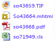

# <a name="lesson-3-defining-a-data-driven-subscription"></a>Leçon 3 : Définition d’un abonnement piloté par les données
Au cours de cette leçon du didacticiel [!INCLUDE[ssRSnoversion_md](../includes/ssrsnoversion-md.md)] , vous utilisez les pages d’abonnement pilotées par les données des portails web [!INCLUDE[ssRSnoversion](../includes/ssrsnoversion-md.md)] pour vous connecter à une source de données d’abonnement, créer une requête qui extrait des données d’abonnement et mapper le jeu de résultats aux options de remise et de rapport.  
  
> [!NOTE]  
> Avant de commencer, vérifiez que le service **[!INCLUDE[ssNoVersion](../includes/ssnoversion-md.md)] Agent** est en cours d’exécution. Sans ce service, vous ne pouvez pas enregistrer l'abonnement.  Une méthode de vérification consiste à ouvrir le [Gestionnaire de configuration SQL Server](../relational-databases/sql-server-configuration-manager.md).
Cette leçon suppose que vous avez terminé les leçons 1 et 2, et que la source de données du rapport utilise des informations d'identification stockées.  Pour plus d’informations, consultez la [Leçon 2 : Modification des propriétés d’une source de données de rapport](../reporting-services/lesson-2-modifying-the-report-data-source-properties.md).  
  
## <a name="start-the-data-driven-subscription-wizard"></a><a name="bkmk_startwizard"></a>Démarrer l'Assistant Abonnement piloté par les données  
  
1.  Dans le portail web [!INCLUDE[ssRSnoversion_md](../includes/ssrsnoversion-md.md)] cliquez sur **Accueil**, puis accédez au dossier contenant le rapport **Sales Orders** .  
  
2.  Dans le menu contextuel  du rapport, cliquez sur **Gérer**, puis cliquez sur **Abonnements** dans le volet gauche.  
  
3. Cliquez sur **Nouvel abonnement**. Si ce bouton n'apparaît pas, il se peut que vous n'ayez pas les autorisations relatives au Gestionnaire de contenu.
  
## <a name="define-a-description"></a>Définir une description  
1.  Tapez **Sales Order delivery** comme description.

## <a name="type"></a>Type
1.  cliquez sur **Abonnement piloté par les données**.  

## <a name="schedule"></a>Planifier
1. Dans la section Planification, cliquez sur **Planification spécifique aux rapports**.
2. Cliquez sur **Modifier la planification**.
3. Dans **Détails de la planification**, cliquez sur **Une fois**.  
4. Spécifiez une heure de début quelques minutes avant l'heure actuelle.  
5. Définissez les **dates de début et de fin**.
6. Sélectionnez **Appliquer**.

## <a name="destination"></a>Destination  
1.  Dans la section Destination, sélectionnez **Partage de fichiers Windows** pour la méthode de remise.  

## <a name="dataset"></a>Dataset
1. Cliquez sur **Modifier le dataset**.
2. Sélectionnez l'option **Source de données personnalisée**.
3. Sélectionnez **Microsoft SQL Server** comme type de **Connexion** de source de données.
4. Dans Chaîne de connexion, tapez la chaîne de connexion suivante. *Subscribers* est la base de données que vous avez créée dans la leçon 1. 
  
    ```  
    data source=localhost; initial catalog=Subscribers
    ```
    
## <a name="credentials"></a>Informations d'identification
1. Sélectionnez **À l’aide des informations d’identification suivantes**.
2. Sélectionnez **Nom d’utilisateur et mot de passe de Windows**.
3.  Dans les zones **Nom d'utilisateur** et **Mot de passe**, tapez le nom d'utilisateur et le mot de passe de votre domaine. Prenez en compte à la fois le domaine et le compte d'utilisateur au moment de définir le **Nom d'utilisateur**.

> [!NOTE]  
> Les informations d'identification utilisées pour la connexion à la source de données d'un abonné ne sont pas renvoyées à [!INCLUDE[ssManStudio](../includes/ssmanstudio-md.md)]. Si vous modifiez l'abonnement ultérieurement, vous devrez retaper le mot de passe utilisé pour la connexion à la source de données.

## <a name="query"></a>Requête      
1.  Dans la zone de requête, tapez la requête suivante :  
  
    ```
    Select * from OrderInfo  
    ```  
  
2.  Spécifiez un délai d'expiration de 30 secondes.  
  
3.  Cliquez sur **Valider la requête**, puis sur **Appliquer**.

## <a name="delivery-options"></a>Options de remise
Renseignez les valeurs suivantes :

Paramètre  |Source de la valeur  | Valeur/champ  
---------|---------|---------
**Nom de fichier**     |Obtenir la valeur à partir du dataset | JSON     
**Chemin d’accès**     | Entrez la valeur  | Dans Valeur, tapez le nom d’un partage de fichiers public pour lequel vous disposez d’autorisations en écriture (par exemple, `\\mycomputer\public\myreports`). 
**Format du rendu** | Obtenir la valeur à partir du dataset | Format
**Mode écriture**| Entrez la valeur| Auto-incrément    
**Extension de fichier** |Entrez la valeur |True
**Nom d’utilisateur** | Entrez la valeur | Tapez votre compte d'utilisateur de domaine Entrez-le au format suivant : \<domain>\\\<account>. Le compte d’utilisateur doit avoir des autorisations sur le chemin que vous avez configuré. 
**Mot de passe** | Entrez la valeur | Tapez votre mot de passe
**Utiliser le compte de partage de fichiers** | Entrez la valeur | False

## <a name="report-parameters"></a>Paramètres du rapport
 1. Dans le champ **OrderNumber** , sélectionnez **Obtenir la valeur du dataset**. Dans Valeur, sélectionnez **Ordre**. 
 2. Sélectionnez **Créer l'abonnement**.
   
## <a name="next-steps"></a>Étapes suivantes  
Lors de l'exécution de l'abonnement, quatre fichiers de rapport sont remis au partage de fichiers que vous avez défini, un pour chaque commande dans la source de données *Abonnés* . Chaque remise doit être unique en termes de données (les données doivent être propres à chaque commande), de format de rendu et de format de fichier. Vous pouvez ouvrir chaque rapport à partir du dossier partagé pour vérifier que chaque version est personnalisée en fonction des options d'abonnement que vous avez définies.  
  
  
  
La page des abonnements dans le portail web contiendra la date de **Dernière exécution** et **l’État** de l’abonnement. 
> [!NOTE]
> Actualisez la page après l'exécution de l'abonnement pour consulter les informations mises à jour.  
    
  
  
Cette étape est la dernière du didacticiel « Définir un abonnement piloté par les données ».   
  
## <a name="see-also"></a>Voir aussi  
[Abonnements et remise &#40;Reporting Services&#41;](../reporting-services/subscriptions/subscriptions-and-delivery-reporting-services.md)  
[Abonnements pilotés par les données](../reporting-services/subscriptions/data-driven-subscriptions.md)  
[Créer, modifier ou supprimer des abonnements pilotés par les données](../reporting-services/subscriptions/create-modify-and-delete-data-driven-subscriptions.md)  
[Utiliser une source de données externe pour les données des abonnés &#40;abonnements pilotés par les données&#41;](../reporting-services/subscriptions/use-an-external-data-source-for-subscriber-data-data-driven-subscription.md)  
  
