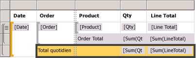
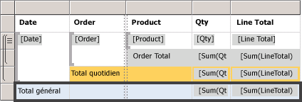
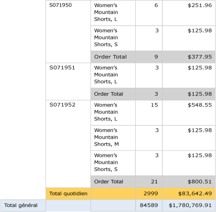

# Lesson 6: Adding Grouping and Totals (Reporting Services)
Dans cette leçon du didacticiel, vous allez ajouter un regroupement et des totaux à votre rapport [!INCLUDE[ssRSnoversion](../includes/ssrsnoversion-md.md)] pour organiser et synthétiser vos données.  
  
  
## Pour regrouper des données dans un rapport  
  
1.  Cliquez sur l'onglet **Conception** .  
  
2.  Si vous ne voyez pas le volet **Groupes de lignes** , cliquez avec le bouton droit sur l’aire de conception, puis sélectionnez **Vue** et cliquez sur **Regroupement**.  
  
3.  Faites glisser le champ **Date** du volet des **données de rapport** vers le volet **Groupes de lignes** . Placez-le au-dessus de la ligne appelée **(Details)**.
  
    Notez que le descripteur de ligne comporte maintenant un crochet, qui indique un groupe. En outre, le tableau présente désormais deux colonnes Date, placées de part et d'autre d'une ligne verticale en pointillé.  
  
      
  
4.  Faites glisser le champ **Order** du volet des **données de rapport** vers le volet **Groupes de lignes** . Placez-le au-dessous du champ Date et au-dessus de la ligne **(Details)**.

   
  
    Note that the row handle now has two brackets in it , to show two groups. The table now has two **Order** columns, too.  
  
5.  Supprimez les colonnes **Date** et **Order** d’origine, à **droite** du double trait. Cette opération supprime les différentes valeurs d'enregistrement afin que seule la valeur de groupe soit affichée. Sélectionnez les descripteurs des deux colonnes, cliquez avec le bouton droit, puis cliquez sur **Supprimer les colonnes**.  
  
      
  
6.  Pour mettre en forme la nouvelle colonne de dates, cliquez avec le bouton droit sur la cellule qui contient l’expression de champ `[Date]` , puis sélectionnez **Propriétés de la zone de texte**.  
  
7.  Cliquez sur **Nombre**puis, dans le champ **Catégorie** , cliquez sur **Date**.  
  
8.  Dans la zone **Type** , sélectionnez **January 31, 2000**.  
  
9.  [!INCLUDE[clickOK](../includes/clickok-md.md)].  
  
10.  Sélectionnez l'onglet **Aperçu** pour afficher un aperçu du rapport. Il doit présenter un aspect similaire à l'illustration suivante :  
     
  
## Pour ajouter des totaux à un rapport  
  
1.  Basculez en mode Conception.  
  
2.  Cliquez avec le bouton droit dans la cellule de région de données qui contient le champ `[LineTotal]`, puis sélectionnez **Ajouter un total**.  
  
    Cette opération ajoute une ligne avec la somme des montants en dollars de chaque commande.  
  
3.  Cliquez avec le bouton droit dans la cellule qui contient le champ `[Qty]`, puis cliquez sur **Ajouter un total**.  
  
    Cette opération ajoute la somme des quantités de chaque commande à la ligne des totaux.  
  
4.  Dans la cellule vide à gauche de `Sum[Qty]`, tapez l'étiquette «**Total des commandes**».  
  
5.  Vous pouvez ajouter une couleur d'arrière-plan à la ligne des totaux. Sélectionnez les deux cellules de somme et la cellule d'étiquette.  
  
6.  Dans le menu **Format** , cliquez sur **Couleur d'arrière-plan**, sur **Gris clair**, puis sur **OK**.  
  
      
  
## Pour ajouter un total quotidien à un rapport  
  
1.  Cliquez avec le bouton droit dans la cellule **Order** , pointez sur **Ajouter un total**, puis cliquez sur **Après**.  
  
    Cette opération ajoute une nouvelle ligne contenant la somme des quantités et la somme des montants en dollars pour chaque jour, et l’étiquette «**Total**» en bas de la colonne Order.  
  
2.  Tapez le mot **quotidien** après le mot **Total** dans la même cellule. Vous obtenez : **Total quotidien**.  
  
3.  Sélectionnez la cellule **Total quotidien** , les deux cellules de **somme** et la cellule vide qui les sépare.  
  
4.  Dans le menu **Format** , cliquez sur **Couleur d'arrière-plan**, sur **Orange**, puis sur **OK**.  
  
      
  
## Pour ajouter un total général à un rapport  
  
1.  Cliquez avec le bouton droit dans la cellule Date, pointez sur **Ajouter un total**, puis cliquez sur **Après**.  
  
    Cette opération ajoute une nouvelle ligne contenant la somme des quantités et la somme des montants en dollars pour l'intégralité du rapport, et l'étiquette **Total** dans la colonne **Date** .  
  
2.  Tapez le mot **général** après le mot **Total** dans la même cellule. Vous obtenez : **Total général**.  
  
3.  Sélectionnez la cellule **Total général** , les deux cellules de **somme** et les cellules vides qui les séparent.  
  
4.  Dans le menu **Format** , cliquez sur **Couleur d'arrière-plan**, sur **Bleu clair**, puis sur **OK**.  
  
      
  
5.  Cliquez sur **Aperçu**.  
  
    La dernière page doit ressembler à l’image suivante. Dans la barre d’outils, cliquez sur le bouton Dernière page .   
  
      
  
## Pour publier le rapport sur le serveur de rapports (facultatif)  
  
1.  Une étape facultative consiste à publier le rapport terminé sur le serveur de rapports en mode natif afin de pouvoir consulter le rapport à partir du Gestionnaire de rapports.  
  
2.  Cliquez sur le menu **Projet** , puis sur **Propriétés du didacticiel...**  
  
3.  Dans **TargetServerURL** , tapez le nom de votre serveur de rapports ; par exemple,   
- `http:/<servername>/reportserver`  
   
- `http://localhost/reportserver` fonctionne si vous concevez le rapport sur le serveur de rapports.  
  
  
4. Notez que TargetReportFolder a pour valeur tutorial, le nom du projet.  Il s’agit du nom du dossier sur lequel le rapport se déploiera au cours des prochaines étapes.  
5. Cliquez sur **OK**  
  
6.  Cliquez sur le menu **Générer** , puis cliquez sur **Déployer tutorial**.  
  
    Si vous voyez un message semblable à ce qui suit dans la fenêtre de sortie, c'est que le déploiement a été réalisé avec succès.  
  
    > ------ Début de la génération : Projet : tutorial, Configuration : Débogage ------  
    > 'Sales Orders.rdl' ignoré. L’élément est à jour.  
    > Fin de la génération -- 0 erreur, 0 avertissement  
    > ------ Début du déploiement : Projet : tutorial, Configuration : Débogage ------  
    > Déploiement vers http://[nom serveur]/reportserver  
    > Déploiement du rapport '/tutorial/Sales Orders'.  
    > Fin du déploiement -- 0 erreur, 0 avertissement  
    > ========== Génération : 1 a réussi ou est à jour, 0 a échoué, 0 a été ignoré ====================  
    > ========== Déploiement : 1 a réussi, 0 a échoué, 0 a été ignoré ==========  
  
    Si un message d'erreur semblable au suivant s'affiche, vérifiez que vous disposez d'autorisations sur le serveur de rapports et que vous avez démarré [!INCLUDE[ssBIDevStudio](../includes/ssbidevstudio-md.md)] avec des privilèges d'administrateur.  
  
    > Les autorisations accordées à l’utilisateur « XXXXXXXX\\[votre nom d’utilisateur] » ne sont pas suffisantes pour effectuer cette opération. »  
  
7.  Accédez au portail web avec des privilèges d’administrateur ; cliquez, par exemple, avec le bouton droit sur l’icône d’Internet Explorer et sélectionnez **Exécuter en tant qu’administrateur**.  
  
    Accédez à l’URL du portail web [!INCLUDE[ssRSnoversion_md](../includes/ssrsnoversion-md.md)] .   
    **Remarque :** L’URL du *portail* est « Reports », pas l’URL du *serveur* de rapports « Reportserver ».  Exemple :   
    - `http://<server name>/reports`.  
     - `http://localhost/reports` fonctionne si vous concevez le rapport sur le serveur de rapports.  
  
8.  Accédez au dossier contenant le rapport. Le nom par défaut est *tutorial*, le nom du projet ou le nom que vous avez tapé dans le champ TargetReportFolder dans les propriétés du projet.   
Cliquez sur le nom du rapport **Sales Orders** afin de consulter le rapport rendu dans le navigateur.  
  
      
 
** Vous avez correctement mené à terme le didacticiel de création d’un rapport de tableau de base.**  
  
##  Voir aussi  
[Filtrer, regrouper et trier des données &#40;Générateur de rapports et SSRS&#41;](../reporting-services/report-design/filter-group-and-sort-data-report-builder-and-ssrs.md)  
  
  
  

