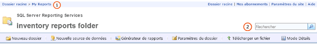

# Recherche et affichage de rapports dans le portail web (Générateur de rapports et SSRS)
  Le Gestionnaire de rapports est un outil Web qui intègre des fonctionnalités d'affichage et de gestion des rapports. Il fait partie d'une installation du serveur de rapports. Pour ce faire, tapez l'URL du Gestionnaire de rapports dans une fenêtre du navigateur. Pour plus d’informations sur la configuration de navigateur requise, consultez [Browser Support for Reporting Services and Power View](../../reporting-services/browser-support-for-reporting-services-and-power-view.md)(Planification de la prise en charge des navigateurs pour Reporting Services et Power View). Pour plus d'informations sur la façon de configurer une URL de Gestionnaire de rapports sur votre serveur de rapports, contactez votre administrateur système. Pour plus d’informations, consultez [Configurer le Gestionnaire de rapports &#40;mode natif&#41;](../../reporting-services/report-server/configure-report-manager-native-mode.md).  
  
 Les autorisations définies par l'administrateur système sur le serveur de rapports déterminent ce que vous pouvez voir lorsque vous utilisez le Gestionnaire de rapports. Les autorisations sont accordées via une attribution de rôle. Pour rechercher et afficher des rapports, votre attribution de rôle doit inclure la tâche Afficher les rapports. Pour rechercher un rapport sur un serveur de rapports, recherchez son nom ou sa description, ou bien parcourez les dossiers du serveur de rapports. Vous ne pouvez rechercher ou parcourir que les rapports qui ont été publiés ou téléchargés sur le serveur de rapports. Pour plus d’informations sur la recherche d’un rapport, consultez [Recherche de rapports et d’autres éléments &#40;Générateur de rapports et SSRS&#41;](../../reporting-services/report-builder/searching-for-reports-and-other-items-report-builder-and-ssrs.md)(Planification de la prise en charge des navigateurs pour Reporting Services et Power View).  
  
> [!NOTE]  
>  [!INCLUDE[ssRBRDDup](../../includes/ssrbrddup-md.md)]  
  
## Navigation dans l'arborescence des dossiers du Gestionnaire de rapports  
 Pour parcourir les rapports que vous souhaitez exécuter, vous pouvez utiliser la page d'accueil, qui s'affiche automatiquement lorsque vous démarrez le Gestionnaire de rapports et lorsque vous ouvrez un dossier dans l'arborescence des dossiers. La page d'accueil affiche uniquement les éléments que vous êtes autorisé à afficher. Le chemin d'accès de dossier est affiché sous la forme d'une ligne de liens en haut de la page d'accueil. Les noms des dossiers sont répertoriés en séquence, en commençant par le dossier racine (dossier de base). Chaque fois que vous ouvrez un dossier supplémentaire, son nom est ajouté au chemin d'accès de dossier en haut de la page. **(1)** dans l’illustration ci-dessous. Lorsque vous ouvrez un rapport, le nom du rapport est également ajouté au chemin d'accès de dossier.  
  
   
Ruban du Gestionnaire de rapports  
  
 Utilisez les méthodes suivantes pour parcourir une arborescence des dossiers :  
  
-   Pour afficher le contenu d'un dossier, cliquez sur son nom dans la page d'accueil. Une page de dossier s'ouvre et présente le contenu du dossier.  
  
-   Pour vous déplacer vers le bas de l'arborescence des dossiers, ouvrez un sous-dossier du dossier en cours. Les dossiers contiennent des rapports, des ressources, des éléments de sources de données partagées et d'autres dossiers. Un clic sur une icône de dossier ouvre le dossier correspondant et affiche le contenu du niveau inférieur de l'arborescence.  
  
-   Pour vous déplacer vers le haut de l'arborescence des dossiers, dans la ligne de liens en haut de la page, cliquez sur le nom du dossier dont vous voulez afficher le contenu. **(1)** dans l’illustration ci-dessus.  
  
## Ouverture d'un rapport  
 Une fois le rapport trouvé, cliquez sur son nom pour l'ouvrir. Le rapport est rendu en HTML et s'affiche dans la page Contenu du Gestionnaire de rapports. Les rapports sont toujours mis en cache par la session du navigateur, de sorte que si vous ouvrez un rapport, vous pouvez généralement y revenir en cliquant sur le bouton **Précédent** . Ceci est vrai même s'il vous a été demandé de fournir un nom d'utilisateur et un mot de passe pour exécuter le rapport. Vous ne pouvez pas véritablement fermer un rapport rendu tant que le navigateur n'est pas fermé.  
  
 Tous les rapports visibles dans l'arborescence des dossiers ne sont pas accessibles immédiatement. Certains rapports peuvent exiger la saisie d'un nom d'utilisateur et d'un mot de passe afin de déterminer si vous êtes autorisé ou non à accéder à la source de données du rapport. Pour plus d’informations sur l’ouverture des rapports dans le Gestionnaire de rapports, consultez [Ouvrir et fermer un rapport &#40;Gestionnaire de rapports&#41;](../../reporting-services/reports/open-and-close-a-report-report-manager.md).  
  
 Vous pouvez également accéder à un rapport du serveur de rapports et l'ouvrir directement à partir du Générateur de rapports. Pour plus d’informations, consultez [Recherche de rapports et d’autres éléments &#40;Générateur de rapports et SSRS&#41;](../../reporting-services/report-builder/searching-for-reports-and-other-items-report-builder-and-ssrs.md)(Planification de la prise en charge des navigateurs pour Reporting Services et Power View).  
  
## Pour rechercher des éléments  
  
-   Pour rechercher des éléments dans le Gestionnaire de rapports, tapez une chaîne dans la zone de texte **Rechercher** en haut de la page. **(2)** dans l’illustration ci-dessus. La recherche débute par le nœud supérieur de l'arborescence des dossiers et se poursuit dans tous les niveaux. Si vous ne disposez pas des autorisations requises pour accéder à un niveau particulier, ce niveau est ignoré. Ceci concerne les dossiers Mes rapports qui appartiennent à d'autres utilisateurs et également ceux des autres dossiers qui ne sont généralement pas disponibles. Seuls les rapports et les éléments que vous êtes autorisé à visualiser sont inclus dans les résultats de la recherche.  
  
-   Pour rechercher un élément en fonction de son nom ou de sa description, spécifiez tout ou partie du texte recherché. La fonction de recherche ne distingue pas les majuscules des minuscules. Vous ne pouvez pas utiliser des opérateurs de recherche comme les symboles plus (+) ou moins (-) pour intégrer ou exclure des critères de recherche.  
  
-   Pour rechercher un texte spécifique dans un rapport, utilisez la barre d'outils située dans la partie supérieure du rapport.  
  
##  Voir aussi  
 [Recherche de rapports et d’autres éléments &#40;Générateur de rapports et SSRS&#41;](../../reporting-services/report-builder/searching-for-reports-and-other-items-report-builder-and-ssrs.md)   
 [Recherche, affichage et gestion de rapports &#40;Générateur de rapports et SSRS&#41;](../../reporting-services/report-builder/finding-viewing-and-managing-reports-report-builder-and-ssrs.md)  
  
  
