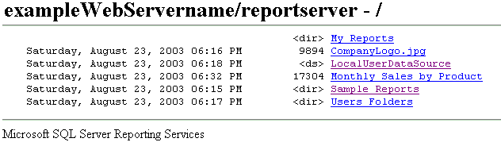

# Recherche et affichage de rapports à l'aide d'un navigateur (Générateur de rapports et SSRS)
  Vous pouvez utiliser n'importe quel navigateur Web pris en charge pour afficher un rapport par le biais d'une connexion directe avec le serveur de rapports. Sur un serveur de rapports, tous les rapports ont une adresse URL. Vous pouvez entrer l'adresse Web d'un rapport pour l'ouvrir dans une fenêtre de navigateur indépendamment d'une application Web. Le rapport s'ouvre au format HTML et comprend la barre d'outils Rapport afin que vous puissiez naviguer entre les pages ou effectuer des recherches sur les valeurs de données dans le rapport. Dans l'URL, vous pouvez définir des paramètres pour masquer la barre d'outils ou sélectionner le format de sortie du rapport.  
  
 L'ouverture d'un rapport via son adresse Web est appropriée pour consulter un rapport, mais pas pour le gérer. Vous ne pouvez pas accéder aux pages de propriétés d'un élément ou aux pages de définition de l'abonnement. Vous devez utiliser le Gestionnaire de rapports ou un site SharePoint pour ces tâches.  
  
 Si vous ne connaissez pas l'adresse Web d'un rapport, vous pouvez ouvrir l'adresse Web du serveur de rapports puis parcourir l'arborescence des dossiers du serveur de rapports pour sélectionner le rapport vous souhaitez afficher. Le diagramme qui suit représente une arborescence des dossiers telle qu'elle apparaît dans la fenêtre d'un navigateur.  
  
   
Dossiers dans un navigateur  
  
> [!NOTE]  
>  Si vous accédez à un rapport à partir d'un ordinateur de poche, vous devez utiliser un navigateur pour ouvrir le rapport en question. Le Gestionnaire de rapports n'est pas conçu pour l'affichage des rapports sur les ordinateurs de poche.  
  
 Pour plus d'informations sur les types de navigateurs que vous pouvez utiliser, consultez « Types de navigateurs pris en charge par Reporting Services » dans la [documentation de Reporting Services](http://go.microsoft.com/fwlink/?linkid=121312) dans la documentation en ligne de SQL Server.  
  
> [!NOTE]  
>  [!INCLUDE[ssRBRDDup](../../includes/ssrbrddup-md.md)]  
  
## Navigation dans les dossiers du serveur de rapports dans un navigateur Web  
 Vous pouvez utiliser un navigateur Web pour parcourir les dossiers du serveur de rapports et exécuter des rapports. Les rapports et les éléments associés sont affichés sous forme de liens dans l'arborescence des dossiers. Vous pouvez cliquer sur les liens pour ouvrir un rapport, une ressource ou un dossier, ou afficher le contenu d'une source de données partagée. Il est utile de pouvoir naviguer dans l'arborescence des dossiers si vous ne connaissez pas l'URL d'un rapport. Vous pouvez spécifier l'adresse Web du serveur de rapports pour ouvrir une connexion via un navigateur au niveau du nœud racine de l'arborescence des dossiers, puis cliquer sur les liens des dossiers pour parcourir l'arborescence.  
  
 Lorsque vous accédez au répertoire virtuel d'un serveur de rapports, vous voyez uniquement les dossiers, les rapports et les éléments téléchargés auxquels vous avez accès. L'interface utilisateur affiche uniquement l'arborescence des dossiers et les informations de base, telles que la date de création ou de modification, la taille du fichier et le type d'élément de chaque élément :  
  
-   Un lien sans autre indicateur signale un rapport ou un modèle.  
  
-   La balise \<ds> indique une source de données partagée.  
  
-   La balise \<dir> indique un élément de dossier.  
  
-   Une extension de nom de fichier indique une ressource. L'extension de nom de fichier identifie le type MIME de la ressource. Par exemple, l'extension .jpg indique une image au format JPEG.  
  
## Saisie de l'adresse URL d'un rapport  
 [!INCLUDE[ssRSnoversion](../../includes/ssrsnoversion-md.md)] prend en charge l'accès URL à des éléments spécifiques sur un serveur de rapports. L'URL doit inclure un chemin d'accès complet au rapport et les commandes pour rendre le rapport. Si le rapport inclut des paramètres, vous devez également spécifier les valeurs requises pour ouvrir le rapport. Si vous tapez une URL pour un rapport qui comprend des espaces dans le chemin d'accès, des valeurs de paramètres ou une extension de rendu, vous devez intégrer des caractères encodés dans l'URL pour obtenir les résultats attendus. L'exemple suivant représente une URL de rapport qui contient, dans son chemin d'accès, l'encodage des espaces, des paramètres et une extension de rendu :  
  
 `http://<Webservername>/reportserver?/<reportfolder>/employee+sales+summary&ReportYear=2004&ReportMonth=06&EmpID=24&rs:Command=Render&rs:Format=HTML4.0`  
  
 La limite maximale pour une URL dans Internet Explorer est 2 083 caractères. Pour plus d'informations, consultez [Longueur maximale d'une URL dans Internet Explorer](http://support.microsoft.com/kb/208427).  
  
 Pour plus d'informations sur l'accès à un rapport via une URL, notamment des informations sur la construction d'une URL, consultez « Accès URL » dans la [documentation de Reporting Services](http://go.microsoft.com/fwlink/?linkid=121312) dans la documentation en ligne de SQL Server.  
  
  
