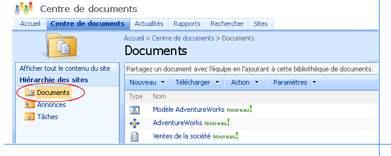
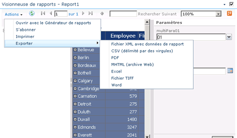
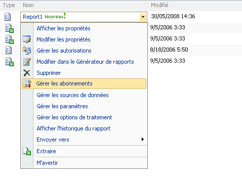

# Recherche, affichage et gestion des rapports (Générateur de rapports et SSRS)
  Le Générateur de rapports vous permet de parcourir les dossiers d'un serveur de rapports ou site SharePoint pour y rechercher des rapports, des sources de données partagées, des modèles et d'autres éléments de rapport connexes, ainsi que de parcourir votre ordinateur pour trouver des rapports en local. Pour faciliter la recherche de rapports, le Générateur de rapports gère une liste de serveurs et sites récemment utilisés, et fournit l'accès direct aux dossiers Bureau, Mes documents et Poste de travail dans le système de fichiers de votre ordinateur.  
  
 Dans le Concepteur de rapports, vous pouvez également parcourir votre ordinateur pour rechercher les rapports locaux. Après avoir déployé des rapports sur un serveur de rapports ou un site SharePoint, vous pouvez parcourir le serveur de rapports à l'aide du Gestionnaire de rapports ou rechercher des rapports sur le site SharePoint. Les rapports et les éléments associés restent disponibles localement après leur déploiement.  
  
> [!NOTE]  
>  Vous pouvez utiliser le Générateur de rapports en mode local ou connecté à un serveur de rapports. Certaines limitations sont applicables lorsque vous ne disposez pas d'une connexion active à un serveur de rapports.  
  
 Pour rechercher un rapport sur un serveur de rapports ou le site SharePoint à partir du Générateur de rapports, vous devez fournir l'URL vers le serveur de rapports ou le site SharePoint. Lorsque vous installez le Générateur de rapports pour la première fois, vous pouvez spécifier l'URL à utiliser. Il s'agit du serveur ou site auquel le Générateur de rapports se connecte par défaut lorsque vous enregistrez ou ouvrez des rapports.  
  
 Un aperçu des rapports peut être affiché dans le Générateur de rapports et le Concepteur de rapports lorsque vous créez ou mettez à jour des rapports, et affiché et géré sur un serveur de rapports en utilisant le Gestionnaire de rapports ou sur un site SharePoint intégré avec Reporting Services à l'aide des fonctionnalités et outils SharePoint intégrés après la publication des rapports. Pour plus d’informations, consultez [Aperçu des rapports dans le Générateur de rapports](../../reporting-services/report-builder/previewing-reports-in-report-builder.md) et [Aperçu des rapports](../../reporting-services/reports/previewing-reports.md).  
  
 Lorsque vous affichez un aperçu des rapports dans le Générateur de rapports et le Concepteur de rapports, ou que vous affichez des rapports dans le Gestionnaire de rapports ou sur un site SharePoint, les données sont actualisées et les rapports affichent les données actuelles de la source de données que le rapport utilise. Si vous souhaitez consulter un rapport sans actualiser ses données, vous pouvez utiliser l'historique de rapport et les données mises en cache avec les rapports publiés. Vous ne pouvez pas utiliser ces fonctionnalités lors de l'affichage d'un aperçu des rapports dans le Générateur de rapports et le Concepteur de rapports.  
  
> [!NOTE]  
>  [!INCLUDE[ssRBRDDup](../../includes/ssrbrddup-md.md)]  
  
##   Recherche et affichage de rapports dans le Générateur de rapports  
 Pour rechercher un rapport que vous souhaitez utiliser ou pour sélectionner une source de données partagée, une image ou un sous-état à utiliser dans un rapport, parcourez votre ordinateur, les dossiers sur un serveur de rapports ou un site SharePoint intégré avec Reporting Services.  
  
 Pour rechercher des rapports sur un serveur de rapports, vous devez spécifier une URL pour le serveur de rapports et disposer des autorisations appropriées sur les dossiers afin de lire et d'enregistrer des éléments de rapports. Pour obtenir les autorisations et URL appropriées, contactez l'administrateur système du serveur de rapports.  
  
 Après avoir trouvé et ouvert le rapport dans le Générateur de rapports, vous pouvez en afficher un aperçu et apporter des modifications. Lorsque vous en affichez un aperçu, vous voyez les données actuelles. Pour plus d'informations, consultez [Aperçu des rapports dans le Générateur de rapports](../../reporting-services/report-builder/previewing-reports-in-report-builder.md).  
  
 Le Générateur de rapports peut vous aider pour les tâches suivantes :  
  
-   **Recherche de rapports** Lorsque vous recherchez un rapport, vous pouvez utiliser la boîte de dialogue familière de style Microsoft Office **Ouvrir un fichier** personnalisée pour le Générateur de rapports. Vous pouvez parcourir les dossiers sur un serveur de rapports ou un système de fichiers, y compris Mes rapports, Sites et serveurs, Bureau, Mes documents et Poste de travail. Sites et serveurs donne accès à une liste de serveurs récemment utilisés.  
  
-   **Recherche de sources de données partagées** Lorsque vous recherchez une source de données partagée, vous pouvez choisir parmi une liste de sources récemment utilisées ou accéder à un autre dossier sur le même serveur de rapports.  
  
-   **Affichage de rapports** Vous affichez un aperçu d'un rapport dans le Générateur de rapports lors de la création ou mise à jour des rapports. Lorsque le Générateur de rapports est connecté à un serveur de rapports, le serveur de rapports charge et traite le rapport ; sinon, les rapports sont traités localement. La visionneuse de rapports du Générateur de rapports affiche le rapport rendu.  
  
 
##   Affichage et gestion de rapports sur un serveur de rapports  
 Le Gestionnaire de rapports permet d'afficher et de gérer des rapports sur le serveur de rapports. Parcourez les dossiers sur le serveur pour trouver des rapports, exécutez les rapports pour les consulter dans un navigateur et effectuez des tâches de gestion.  
  
 Le Gestionnaire de rapports peut vous aider pour les tâches de gestion suivantes :  
  
-   afficher et mettre à jour les propriétés des rapports, les sources de données partagées et les autres éléments de rapport ;  
  
-   télécharger des rapports et créer des sources de données partagées pour les rapports ;  
  
-   créer des planifications pour exécuter des rapports à des heures et fréquences spécifiées ;  
  
-   créer, modifier ou supprimer des abonnements aux rapports ;  
  
-   créer l'historique de rapport et spécifier le nombre d'instantanés de rapport à conserver dans l'historique de rapport ;  
  
-   créer des dossiers sur le serveur pour organiser vos rapports comme vous le souhaitez.  
  
 Certaines de ces tâches peuvent être effectuées pour vous par l'administrateur du serveur de rapports. Pour en savoir plus sur les tâches effectuées sur un serveur de rapports, consultez [Serveur de rapports Reporting Services &#40;mode natif&#41;](../../reporting-services/report-server/reporting-services-report-server-native-mode.md).  
  
 Le Gestionnaire de rapports contient en général des dossiers, des rapports, des sources de données et des modèles de rapport, ainsi que le dossier Mes rapports. Le dossier Mes rapports est un espace de travail personnel où vous pouvez stocker et utiliser les rapports dont vous êtes propriétaire. Les autres dossiers du serveur de rapports sont publics et nécessitent généralement que les utilisateurs disposent d'autorisations avancées pour ajouter ou modifier du contenu. Vous pouvez créer des dossiers dans Mes rapports pour organiser davantage vos rapports. Pour plus d’informations, consultez [Utilisation du dossier Mes rapports &#40;Générateur de rapports et SSRS&#41;](../../reporting-services/report-builder/using-my-reports-report-builder-and-ssrs.md).  
  
 Le Gestionnaire de rapports affiche les rapports dans la visionneuse HTML Reporting Services. La visionneuse HTML fournit une infrastructure pour l'affichage des rapports au format HTML et inclut une barre d'outils Rapports, une section de paramétrage, une section sur les informations d'identification et un explorateur de documents. La barre d'outils Rapports fournit les fonctions de navigation entre les pages, de zoom, d'actualisation, de recherche, d'exportation, d'impression et de flux de données. La barre d'outils Rapport apparaît également dans les fenêtres des navigateurs, en haut des rapports, lorsque vous accédez aux rapports au moyen d'une URL. La fonction d'impression est facultative et doit être activée par votre administrateur. Lorsqu'elle est disponible, l'icône Imprimante s'affiche dans la barre d'outils. Les illustrations suivantes montrent la barre d'outils Rapport dans une fenêtre du Gestionnaire de rapports et un agrandissement des fonctionnalités de la barre d'outils Rapport.  
  
   
Fenêtre Gestionnaire de rapports  
  
   
Barre d'outils Rapports  
  
 Après avoir exécuté un rapport, vous pouvez l'exporter sous un autre format, tel que [!INCLUDE[msCoName](../../includes/msconame-md.md)] Excel ou PDF. Vous pouvez également exporter le rapport à l'aide d'une extension de rendu de données, telle que l'extension CSV (Comma-Separated Value), puis utiliser le fichier de données CSV comme entrée pour une autre application. Pour plus d’informations sur l’exportation de rapports, consultez [Exporter des rapports &#40;Générateur de rapports et SSRS&#41;](../../reporting-services/report-builder/export-reports-report-builder-and-ssrs.md) et [Exporter un rapport dans un autre type de fichier &#40;Générateur de rapports et SSRS&#41;](http://msdn.microsoft.com/library/b577568b-ecbd-44c3-be88-31dab6fc38a2).  
  
 La méthode la plus simple pour sélectionner et exécuter un rapport consiste à ouvrir le Gestionnaire de rapports, puis à rechercher le rapport à afficher. Pour obtenir des instructions détaillées sur l’ouverture des rapports, consultez [Ouvrir et fermer un rapport &#40;Gestionnaire de rapports&#41;](../../reporting-services/reports/open-and-close-a-report-report-manager.md).  
  
 Après avoir exécuté un rapport, vous pouvez l'actualiser pour afficher les nouvelles données.  
  
### Actualisation des rapports  
 Les données des rapports changent fréquemment et vous pouvez actualiser le rapport pour afficher les données les plus récentes. Vous pouvez actualiser les données d'un rapport de trois façons différentes.  
  
|Option|Résultats|  
|------------|------------|  
|Bouton**Actualiser** de la fenêtre du navigateur|Affiche le rapport stocké dans le cache de sessions. Un cache de session est créé lorsqu'un utilisateur ouvre un rapport. [!INCLUDE[ssRSnoversion](../../includes/ssrsnoversion-md.md)] utilise des sessions de navigateur pour assurer un affichage cohérent lorsqu'un rapport est ouvert.|  
||Quand vous cliquez dans la barre d’outils Rapports sur le bouton **Actualiser** , le serveur de rapports réexécute la requête et met à jour les données du rapport si ce dernier s’exécute à la demande. Si le rapport est mis en cache ou s'il s'agit d'un instantané, la commande **Actualiser** permet d'afficher le rapport stocké dans la base de données du serveur de rapports.|  
|Combinaison de touches CTRL+F5|Produit le même résultat qu'un clic sur le bouton **Actualiser** dans la barre d'outils Rapports.|  
  
  
##   Affichage et gestion d'éléments de serveur de rapports à partir d'un site SharePoint  
 Lorsque l'administrateur système configure un serveur de rapports pour qu'il s'exécute en mode intégré SharePoint, vous pouvez afficher et gérer des rapports et d'autres éléments de serveur de rapports à partir d'un site SharePoint.  
  
 Le site SharePoint inclut des pages vous permettant de définir les propriétés des sources de données, l'historique de rapport, les options de traitement de rapport, les planifications, les abonnements et les paramètres de rapport, ainsi que de créer des planifications partagées. Vous pouvez gérer les éléments de serveur de rapports sur un site SharePoint de la même manière que vous les créez et gérez à partir d'autres outils dans [!INCLUDE[ssNoVersion](../../includes/ssnoversion-md.md)].  
  
 Pour accéder aux pages d'application, sélectionnez des actions spécifiques à l'élément dans un menu déroulant sur un rapport ou autre élément de serveur de rapports que vous avez ajouté précédemment à une bibliothèque SharePoint. Selon l'élément et vos autorisations, vous pouvez être également en mesure de créer des rapports dans le Générateur de rapports, de générer des modèles et de définir la sécurité des éléments de modèle.  
  
 Pour plus d’informations sur la technologie Reporting Services et SharePoint, consultez [Configuration et administration d’un serveur de rapports &#40;mode SharePoint de Reporting Services&#41;](../../reporting-services/report-server-sharepoint/configuration-and-administration-of-a-report-server.md) dans la documentation [!INCLUDE[ssNoVersion](../../includes/ssnoversion-md.md)] [en ligne](http://go.microsoft.com/fwlink/?LinkId=154888) sur msdn.microsoft.com.  
  
### Recherche d'éléments de serveur de rapports sur un site SharePoint  
 Avant de pouvoir définir des propriétés, vous devez être en mesure de localiser l'élément. Les éléments de serveur de rapports sont toujours stockés dans des bibliothèques ou dans un dossier d'une bibliothèque.  
  
 Lorsque vous accédez au site SharePoint, vous voyez la page Parcourir et l'onglet Outils de bibliothèque. La page Parcourir répertorie les bibliothèques et le contenu de la bibliothèque sélectionnée. Vous pouvez afficher le rapport, les modèles de rapport et d'autres éléments de la bibliothèque, explorer des dossiers et effectuer des recherches sur le site pour trouver des éléments.  
  
 Pour distinguer les éléments de serveur de rapports d'autres éléments sur un site SharePoint, vous pouvez utiliser l'icône pour identifier visuellement un élément ou placer le curseur de la souris sur le type et examiner l'extension du fichier. L'image suivante montre des dossiers, un modèle de rapport et une définition de rapport dans la bibliothèque **Rapports** :  
  
   
  
### Affichage de rapports  
 Les définitions de rapport (fichiers .rdl) que vous téléchargez vers une bibliothèque SharePoint sont affichées par le biais d'un composant WebPart de visionneuse de rapports qui est installé par le complément Reporting Services. Une association aux fichiers .rdl est définie automatiquement lorsque vous installez le complément. Lorsque vous sélectionnez un rapport, il s'ouvre automatiquement dans le composant WebPart. Une fois le rapport ouvert, vous pouvez utiliser la barre d'outils de rapport qui est incluse dans le composant WebPart pour imprimer le rapport, parcourir les pages du rapport, ainsi qu'effectuer des recherches et zoomer dans le rapport. La barre d'outils inclut l'option Exporter vers un flux, qui permet d'exporter le rapport en tant que flux Atom ; elle comprend également un menu **Actions** avec des options permettant d'imprimer, de s'abonner et d'exporter le rapport vers divers formats tels que PDF, Word et Excel. À partir du menu **Actions** , vous pouvez également ouvrir le rapport dans le Générateur de rapports. L'image suivante montre un rapport et les options d'exportation du menu **Action** .  
  
   
  
### Gestion des éléments par le biais d'actions  
 Les tâches de gestion sont prises en charge par le biais des actions proposées dans un menu déroulant pour chaque élément. Selon vos autorisations, chaque élément possède des actions communes qui sont standard pour des éléments stockés dans une bibliothèque SharePoint. **Afficher les propriétés** et **Modifier les propriétés** sont des exemples d'actions communes. Les actions personnalisées fournissent des fonctionnalités de gestion spécifiques aux éléments. L'image ci-dessous montre les actions possibles pour une définition de rapport. **Gérer les abonnements** et **Gérer les options de traitement**sont des exemples d'actions personnalisées proposées pour une définition de rapport :  
  
   
  
  
##   Affichage des rapports dans une application bureautique  
 Vous pouvez ne pas recourir au navigateur et utiliser une application bureautique (telle que [!INCLUDE[msCoName](../../includes/msconame-md.md)] Excel) comme visionneuse de rapports. Pour ce faire, vous devez définir un abonnement qui spécifie un format d'application bureautique et un partage de fichiers comme destination. Le serveur de rapports génère votre rapport sous la forme d'un fichier d'application, y ajoute une extension de nom de fichier et l'enregistre en tant que fichier sur votre disque dur. Vous pouvez ensuite utiliser [!INCLUDE[msCoName](../../includes/msconame-md.md)] Excel (ou une autre application) à la place d’un navigateur pour visualiser votre rapport.  
  
  
##   À propos des sessions utilisateur  
 [!INCLUDE[ssRSnoversion](../../includes/ssrsnoversion-md.md)] utilise des sessions de navigateur pour assurer une certaine uniformité pendant l'affichage des rapports. Les sessions sont basées sur des connexions navigateur et non sur des utilisateurs authentifiés. Une session est créée chaque fois qu'un utilisateur ouvre un rapport dans une nouvelle fenêtre de navigateur. Une fois qu'une session est établie dans un navigateur, vous pouvez continuer à utiliser la version du rapport qui a été ouvert au début de la session, même si le rapport est modifié sur le serveur de rapports. Par exemple, si vous ouvrez un rapport à 23h00 et que l'auteur du rapport republie le même rapport à 23h01, votre session contiendra, pendant la durée de la session, la version que vous avez ouverte.  
  
 Si vous actualisez un rapport au cours de la même session en cliquant sur le bouton **Actualiser** du navigateur, la version de session d'origine du rapport s'affiche. Si vous actualisez un rapport à la demande en cliquant sur le bouton **Actualiser** dans la barre d’outils de rapport, le rapport est réexécuté et les nouvelles données, si elles existent, sont affichées.  
  
 Les informations de session sont stockées dans la base de données temporaire du serveur de rapports. Le serveur de rapports n'utilise pas la gestion de sessions [!INCLUDE[vstecasp](../../includes/vstecasp-md.md)] . Si vous redémarrez le serveur ou que vous effectuez une opération de récupération de la base de données, l'état de la session n'est pas restauré. Pour plus d’informations sur la gestion de sessions, consultez [Identification de l’état d’exécution](../../reporting-services/report-server-web-service-net-framework-soap-headers/identifying-execution-state.md).  
  
 
##   Dans cette section  
 Les rubriques suivantes fournissent des informations supplémentaires sur l'affichage et la gestion des rapports.  
  
  [Rechercher, afficher et gérer des rapports](../../reporting-services/report-builder/finding-viewing-and-managing-reports-report-builder-and-ssrs.md)
  
 [Recherche et affichage de rapports à l’aide d’un navigateur &#40;Générateur de rapports et SSRS&#41;](../../reporting-services/report-builder/finding-and-viewing-reports-with-a-browser-report-builder-and-ssrs.md)  
 Explique comment utiliser une URL pour rechercher et afficher un rapport.  
  
 [Recherche de rapports et d’autres éléments &#40;Générateur de rapports et SSRS&#41;](../../reporting-services/report-builder/searching-for-reports-and-other-items-report-builder-and-ssrs.md)  
 Explique comment utiliser la fonctionnalité de recherche dans le Gestionnaire de rapports pour rechercher des éléments sur le serveur de rapports.  
  
 [Utilisation du dossier Mes rapports &#40;Générateur de rapports et SSRS&#41;](../../reporting-services/report-builder/using-my-reports-report-builder-and-ssrs.md)  
 Explique comment utiliser le dossier Mes rapports comme espace de travail personnel pour stocker et utiliser les rapports dont vous êtes propriétaire.  
  
 [Aperçu des rapports dans le Générateur de rapports](../../reporting-services/report-builder/previewing-reports-in-report-builder.md)  
 Décrit comment afficher un aperçu des rapports lorsque vous les créez ou les mettez à jour.  
  
##  Voir aussi  
 [Enregistrement des rapports &#40;Générateur de rapports&#41;](../../reporting-services/report-builder/saving-reports-report-builder.md)   
 [Générateur de rapports dans SQL Server 2016](../../reporting-services/report-builder/report-builder-in-sql-server-2016.md)   
 [Installer et désinstaller le Générateur de rapports](http://msdn.microsoft.com/library/2c9a5814-17bf-4947-8fb3-6269e7caa416)  
  
  
