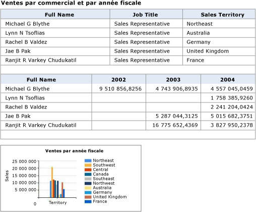
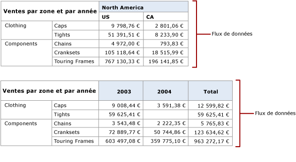
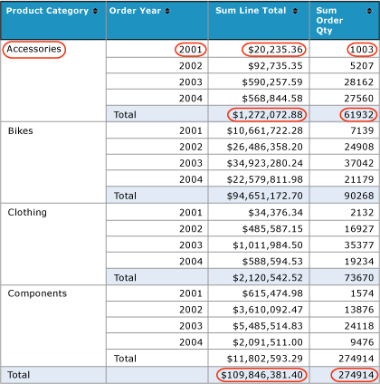

# Génération de flux de données à partir de rapports (Générateur de rapports et SSRS)

  L’extension de rendu [!INCLUDE[ssRSnoversion](../../includes/ssrsnoversion-md.md)] Atom génère un document de service Atom qui répertorie les flux de données disponibles d’un rapport paginé et les flux de données des régions de données d’un rapport. Cette extension est utilisée pour générer des flux de données compatibles avec Atom pouvant être lus et échangés avec des applications qui prennent en charge les flux de données générés à partir de rapports. Par exemple, vous pouvez utiliser l’extension de rendu Atom pour générer des flux de données que vous pourrez ensuite utiliser dans Power Pivot ou Power BI.  
  
 Le document de service Atom répertorie au moins un flux de données pour chaque région de données d'un rapport. Selon le type de région de données et les données affichées par cette région, [!INCLUDE[ssRSnoversion](../../includes/ssrsnoversion-md.md)] peut générer plusieurs flux de données à partir d'une région de données. Par exemple, une matrice ou un graphique peut fournir plusieurs flux de données. Lorsque l'extension de rendu Atom crée le document de service Atom, un identificateur unique est créé pour chaque flux de données et vous utilisez cet identificateur dans l'URL pour accéder au contenu du flux de données.  
  
 La façon dont l'extension de rendu Atom génère des données pour un flux de données est semblable à la façon dont l'extension de rendu à valeurs séparées par des virgules (CSV) restitue des données dans un fichier CSV. Comme un fichier CSV, un flux de données est une représentation aplatie des données de rapport. Par exemple, un tableau comprenant un groupe de lignes qui additionne les chiffres des ventes au sein d'un groupe répète la somme dans chaque ligne de données et il n'existe aucune ligne séparée contenant uniquement la somme.  
  
 Vous pouvez générer des documents de service Atom et des flux de données à l’aide du portail web [!INCLUDE[ssRSnoversion](../../includes/ssrsnoversion-md.md)] , du service Report Server ou d’un site SharePoint intégré à [!INCLUDE[ssRSnoversion](../../includes/ssrsnoversion-md.md)].  
  
 Atom applique deux normes connexes. Le document de service Atom est conforme à la spécification de protocole de publication Atom RFC 5023 et les flux de données sont conformes à la spécification de protocole de format de syndication Atom RFC 4287.  
  
 Les sections suivantes présentent des informations supplémentaires concernant l'utilisation de l'extension de rendu Atom :  
  
 [!INCLUDE[ssRBRDDup](../../includes/ssrbrddup-md.md)]  
  
##   Rapports en tant que flux de données  
 Vous pouvez exporter un rapport de production en tant que flux de données ou créer un rapport dont l'objectif principal est de fournir des données, sous forme de flux de données, aux applications. L'utilisation de rapports en tant que flux de données vous offre une méthode supplémentaire pour fournir des données aux applications lorsque ces données ne sont pas facilement accessibles via des fournisseurs de données clients, ou lorsque vous préférez masquer la complexité de la source de données et faciliter l'utilisation des données. Un autre avantage de l’utilisation des données de rapport en tant que flux de données est que vous pouvez utiliser des fonctionnalités [!INCLUDE[ssRSnoversion](../../includes/ssrsnoversion-md.md)] telles que la sécurité, la planification et les instantanés de rapport pour gérer les rapports à l’origine des flux de données.  
  
 Pour tirer au mieux profit de l'extension de rendu Atom, vous devez comprendre comment le rapport est restitué dans des flux de données. Si vous utilisez des rapports existants, il est utile de pouvoir prévoir quels flux de données seront générés par les rapports ; si vous écrivez un rapport spécifiquement en vue d'une utilisation en tant que flux de données, la capacité d'inclure les données et d'ajuster la mise en page du rapport pour optimiser l'utilité des flux de données constitue également un avantage précieux.  
  
 Pour plus d’informations, consultez [Générer des flux de données à partir d’un rapport &#40;Générateur de rapports et SSRS&#41;](../../reporting-services/report-builder/generate-data-feeds-from-a-report-report-builder-and-ssrs.md).  
  
  
##   Document de service Atom (fichier .atomsvc)  
 Un document de service Atom spécifie une connexion à un ou plusieurs flux de données. Au minimum, la connexion est une URL simple vers le service de données qui génère le flux.  
  
 Lorsque vous restituez les données de rapport à l'aide de l'extension de rendu Atom, le document de service Atom répertorie les flux de données disponibles pour un rapport. Le document répertorie au moins un flux de données pour chaque région de données du rapport. Les tables et jauges génèrent chacune un seul flux de données, mais les matrices, listes et graphiques peuvent en générer plusieurs en fonction des données qu'ils affichent.  
  
 Le diagramme ci-dessous illustre un rapport utilisant deux tables et un graphique.  
  
   
  
 Le document de service Atom généré à partir de ce rapport inclut trois flux de données, un pour chaque table et un pour le graphique.  
  
 Les régions de données de matrice peuvent avoir plusieurs flux de données, selon la structure de la matrice. Le diagramme ci-dessous illustre un rapport utilisant une matrice qui génère deux flux de données.  
  
   
  
 Le document de service Atom généré à partir de ce rapport inclut deux flux, un pour chacune des colonnes homologues dynamiques : Territory et Year. Le diagramme ci-dessous illustre le contenu de chaque flux.  
  
   
  
  
##   Flux de données  
 Un flux est un fichier XML ayant un format tabulaire cohérent qui ne varie pas dans le temps et des données variables qui peuvent être différentes chaque fois que le rapport est exécuté. Les flux de données générés par [!INCLUDE[ssRSnoversion](../../includes/ssrsnoversion-md.md)] ont le même format que ceux générés par ADO.NET Data Services.  
  
 Un flux de données contient deux sections : l'en-tête et les données. La spécification Atom définit les éléments de chaque section. L'en-tête inclut des informations telles que le schéma d'encodage de caractères à utiliser avec les flux de données.  
  
### Section d'en-tête  
 Le code XML suivant illustre la section d'en-tête d'un flux de données.  
  
 `<?xml version="1.0" encoding="utf-8" standalone="yes"?><feed xmlns:d="http://schemas.microsoft.com/ado/2007/08/dataservices" xmlns:m="http://schemas.microsoft.com/ado/2007/08/dataservices/metadata" xmlns="http://www.w3.org/2005/Atom">`  
  
 `<title type="text"></title>`  
  
 `<id>uuid:1795992c-a6f3-40ec-9243-fbfd0b1a5be3;id=166321</id>`  
  
 `<updated>2009-05-08T23:09:58Z</updated>`  
  
### Section de données  
 La section de données des flux de données contient un élément \<**entry**> pour chaque ligne de l’ensemble de lignes aplati généré par l’extension de rendu Atom.  
  
 Le diagramme suivant illustre un rapport utilisant des groupes et des totaux.  
  
   
  
 Le code XML suivant illustre un élément \<**entry**> de ce rapport dans un flux de données. Notez que l’élément \<**entry**> inclut les totaux des chiffres des ventes et des commandes pour le groupe et les totaux des chiffres des ventes et des commandes pour tous les groupes. L’élément \<**entry**> inclut toutes les valeurs dans le rapport.  
  
 `<entry><id>uuid:1795992c-a6f3-40ec-9243-fbfd0b1a5be3;id=166322</id><title type="text"></title><updated>2009-05-08T23:09:58Z</updated><author /><content type="application/xml"><m:properties>`  
  
 `<d:ProductCategory_Value>Accessories</d:ProductCategory_Value>`  
  
 `<d:OrderYear_Value m:type="Edm.Int32">2001</d:OrderYear_Value>`  
  
 `<d:SumLineTotal_Value m:type="Edm.Decimal">20235.364608</d:SumLineTotal_Value>`  
  
 `<d:SumOrderQty_Value m:type="Edm.Int32">1003</d:SumOrderQty_Value>`  
  
 `<d:SumLineTotal_Total_2_1 m:type="Edm.Decimal">1272072.883926</d:SumLineTotal_Total_2_1>`  
  
 `<d:SumOrderQty_Total_2_1 m:type="Edm.Double">61932</d:SumOrderQty_Total_2_1>`  
  
 `<d:SumLineTotal_Total_2_2 m:type="Edm.Decimal">109846381.399888</d:SumLineTotal_Total_2_2>`  
  
 `<d:SumOrderQty_Total_2_2 m:type="Edm.Double">274914</d:SumOrderQty_Total_2_2></m:properties></content>`  
  
 `</entry>`  
  
### Utilisation des flux de données  
 Tous les flux de données générés par le rapport incluent les éléments de rapport situés dans l'étendue du parent de la région de données qui génère les flux de données. . Prenons l'exemple d'un rapport contenant plusieurs tables et un graphique. Les zones de texte dans le corps du rapport fournissent un texte descriptif pour chaque région de données. Chaque entrée dans chaque flux de données généré par le rapport inclut la valeur de la zone de texte. Par exemple, si le texte est « Le graphique affiche les moyennes des ventes mensuelles par région de ventes », les trois flux de données incluront ce texte sur chaque ligne.  
  
 Si la mise en page du rapport inclut des relations de données hiérarchiques, comme par exemple des régions de données imbriquées, ces relations seront incluses dans l'ensemble de lignes aplati des données de rapport.  
  
 Les lignes de données pour les régions de données imbriquées sont en général larges, particulièrement si les tables et matrices imbriquées incluent des groupes et des totaux. Vous souhaiterez peut-être exporter le rapport vers un flux de données et afficher celui-ci pour vérifier que les données générées correspondent bien à vos attentes.  
  
 Lorsque l'extension de rendu Atom crée le document de service Atom, un identificateur unique est créé pour le flux de données et vous utilisez cet identificateur dans l'URL pour afficher le contenu du flux de données. L’exemple de document de service Atom ci-dessus inclut l’URL `http://ServerName/ReportServer?%2fProduct+Sales+Summary&rs%3aCommand=Render&rs%3aFormat=ATOM&rc%3aDataFeed=xAx0x1`. L'URL identifie le rapport (Product Sales Summary), le format de rendu Atom (ATOM) et le nom du flux de données (xAx0x1).  
  
 Les noms des éléments de rapport sont par défaut les noms d'élément RDL (Report Definition Language) des éléments de rapport et, souvent, ils ne sont pas intuitifs ni faciles à mémoriser. Par exemple, le nom par défaut de la première matrice placés dans un rapport est Tablix 1. Les flux de données utilisent ces noms.  
  
 Pour simplifier l’utilisation du flux de données, vous pouvez utiliser la propriété DataElementName de la région de données pour attribuer des noms conviviaux. Si vous fournissez une valeur pour DataElementName, le sous-élément du flux de données \<**d**> l’utilisera à la place du nom par défaut de la région de données. Par exemple, si le nom par défaut d’une région de données est Tablix1 et que DataElementName a défini SalesByTerritoryYear, le sous-élément \<**d**> dans le flux de données utilise SalesByTerritoryYear. Si les régions de données ont deux flux de données tels que le rapport de matrice décrit ci-dessus, les noms utilisés dans les flux de données seront SalesByTerritoryYear _Territory et SalesByTerritoryYear _Year.  
  
 Si vous comparez les données affichées dans le rapport à celles du flux de données, vous remarquerez certainement quelques différences. Les rapports affichent souvent les données numériques et d'heure/date avec une mise en forme, tandis que le flux de données contient des données non mises en forme.  
  
 Un flux de données est enregistré avec l'extension de nom de fichier .atom. Vous pouvez utiliser un éditeur de texte ou XML tel que le Bloc-notes ou Éditeur XML pour afficher la structure de fichiers et leur contenu.  
  
  
##   Données de rapport aplaties  
 L'extension de rendu Atom fournit les données de rapport sous forme d'ensembles de lignes aplatis au format XML. Les règles pour aplatir des tables de données sont identiques à celles de l'extension de rendu CSV, avec quelques exceptions :  
  
-   Les éléments dans l'étendue sont aplatis au niveau de détail. Contrairement au rendu CSV, les zones de texte du niveau supérieur s'affichent dans chaque entrée écrite dans le flux de données.  
  
-   Les valeurs du paramètre de rapport sont restituées sur chaque ligne de la sortie.  
  
 Les données hiérarchiques et groupées doivent être aplaties pour être représentées au format compatible Atom. L'extension de rendu aplatit le rapport en arborescence qui représente les groupes imbriqués dans la région de données. Pour aplatir le rapport :  
  
-   Une hiérarchie de ligne est aplatie avant une hiérarchie de colonne.  
  
-   Les membres de la hiérarchie de ligne sont restitués dans le flux de données avant les membres de la hiérarchie de colonne.  
  
-   Les colonnes sont ordonnées comme suit : zones de texte dans le corps ordonnées de gauche à droite et de haut en bas, suivies des régions de données ordonnées de gauche à droite et de haut en bas.  
  
-   Dans une région de données, les colonnes sont ordonnées comme suit : membres d'angle, membres de hiérarchie de ligne, membres de hiérarchie de colonne et enfin cellules.  
  
-   Les régions de données d'homologue sont des régions de données ou des groupes dynamiques qui partagent une région de données commune ou un ancêtre dynamique commun. Les données d'homologue sont identifiées par une création de branche au niveau de l'arborescence aplatie.  
  
 Pour plus d’informations, consultez [Tables, matrices et listes &#40;Générateur de rapports et SSRS&#41;](../../reporting-services/report-design/tables-matrices-and-lists-report-builder-and-ssrs.md).  
  
  
##   Règles de rendu Atom  
 L'extension de rendu Atom ignore les informations suivantes lors du rendu d'un flux de données :  
  
-   mise en forme et mise en page ;  
  
-   En-tête de page  
  
-   Pied de page  
  
-   Éléments de rapport personnalisés  
  
-   Rectangles  
  
-   Lignes  
  
-   Images  
  
-   Sous-totaux automatiques  
  
 Les autres éléments de rapport sont triés, de haut en bas, puis de gauche à droite. Chaque élément est ensuite rendu dans une colonne. Si le rapport comporte des éléments de données imbriqués comme des listes ou des tableaux, les éléments parents sont répétés sur chaque ligne.  
  
 Le tableau suivant indique l'apparence des éléments de rapport lors du rendu :  
  
|Élément|Comportement de rendu|  
|----------|------------------------|  
|Table de charge de travail|Effectue le rendu en développant la table et en créant une ligne et une colonne pour chaque ligne et colonne au niveau de détails le plus bas. Les colonnes et les lignes de sous-total ne comprennent pas de titres de colonne ou de ligne. Les rapports d'extraction ne sont pas pris en charge.|  
|Matrice|Effectue le rendu en développant la matrice et en créant une ligne et une colonne pour chaque ligne et colonne au niveau de détails le plus bas. Les colonnes et les lignes de sous-total ne comprennent pas de titres de colonne ou de ligne.|  
|Liste|Effectue le rendu d'un enregistrement pour chaque instance ou ligne de détails dans la liste.|  
|Sous-rapport|L'élément parent est répété pour chaque instance du contenu.|  
|Graphique|Effectue le rendu d'un enregistrement avec toutes les étiquettes de graphiques pour chaque valeur de graphique. Les étiquettes de séries et de catégories dans les hiérarchies sont aplaties et incluses dans la ligne pour une valeur de graphique.|  
|Barre de données|Effectue le rendu comme un graphique. En règle générale, une barre de données n'inclut pas de hiérarchies ou d'étiquettes.|  
|Graphique sparkline|Effectue le rendu comme un graphique. En règle générale, un graphique sparkline n'inclut pas de hiérarchies ou d'étiquettes.|  
|Jauge|Effectue le rendu en tant qu'enregistrement unique avec les valeurs maximale et minimale de l'échelle linéaire, les valeurs de début et de fin de la plage et la valeur du pointeur.|  
|Indicateur|Effectue le rendu en tant qu'enregistrement unique avec le nom de l'état actif, les états disponibles et la valeur de données.|  
|Carte|Génère un flux de données pour chaque région de données cartographiques. Si plusieurs couches utilisent la même région de données, le flux de données les inclut toutes. Le flux de données inclut un enregistrement avec les étiquettes et les valeurs pour chaque membre cartographique de la couche.|  
  
  
##   Paramètres d'informations de périphérique  
 Vous pouvez modifier certains paramètres par défaut pour ce convertisseur, notamment le schéma d'encodage à utiliser. Pour plus d'informations, consultez [ATOM Device Information Settings](../../reporting-services/atom-device-information-settings.md).  

## Étapes suivantes

[Exportation vers un fichier CSV](../../reporting-services/report-builder/exporting-to-a-csv-file-report-builder-and-ssrs.md)   
[Exporter des rapports](../../reporting-services/report-builder/export-reports-report-builder-and-ssrs.md)  

D’autres questions ? [Essayez de poser une question dans le forum Reporting Services](http://go.microsoft.com/fwlink/?LinkId=620231)
