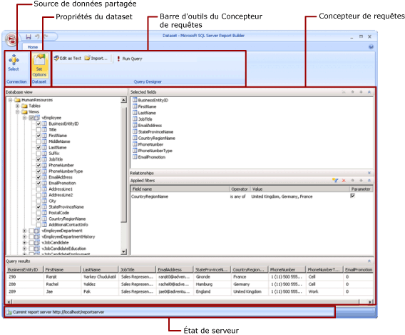

# Mode création de dataset partagé (Générateur de rapports)
  Dans un rapport, un dataset représente des données de rapport retournées comme résultat de l'exécution d'une requête sur une source de données externe. Les datasets partagés sont publiés sur un serveur de rapports et peuvent être utilisés par plusieurs rapports. Vous pouvez créer des datasets à partager avec d’autres utilisateurs. Dans la fenêtre Dataset partagé, vous pouvez sélectionner une source de données partagée, spécifier des propriétés pour le dataset partagé et créer une requête dans le concepteur de requêtes.  
  
   
  
 Pour plus d’informations sur l’utilisation des données dans un rapport, consultez [Jeux de données du rapport &#40;SSRS&#41;](../../reporting-services/report-data/report-datasets-ssrs.md).  
  
##   Ruban  
 Le ruban vous permet de trouver rapidement les commandes dont vous avez besoin pour effectuer une tâche. Les commandes sont organisées selon les groupes logiques suivants : Connexion, Dataset et Concepteur de requêtes.  
  
### Connexion  
 Utilisez le bouton **Sélectionner** dans le groupe Connexion pour sélectionner une source de données partagée dans votre rapport, ou naviguez jusqu’à une source de données partagée sur le serveur de rapports.  
  
> [!NOTE]  
>  Un dataset partagé doit être basé sur une source de données partagée. Si la source de données dont vous avez besoin n’est pas disponible, vous devez en créer une sur le serveur de rapports. Pour plus d’informations, consultez [Créer, modifier et supprimer des sources de données partagées &#40;SSRS&#41;](../../reporting-services/report-data/create-modify-and-delete-shared-data-sources-ssrs.md).  
  
 Pour plus d'informations, consultez [Data Connections, Data Sources, and Connection Strings in Report Builder](http://msdn.microsoft.com/library/7e103637-4371-43d7-821c-d269c2cc1b34).  
  
### Dataset  
 Utilisez le bouton **Définir les options** pour définir les propriétés de dataset partagé. Ces options en question sont les suivantes :  
  
-   Champs. Vous pouvez ajouter ou modifier un champ dans la collection de champs.  
  
-   Options de données. Vous pouvez définir des options qui affectent les critères de correspondance et l'ordre de tri, par exemple le respect de la casse et classement.  
  
-   Filtres. Vous pouvez définir des filtres qui limitent les données d'un rapport une fois qu'elles ont été récupérées à partir de la connexion de données.  
  
-   Paramètres. Vous pouvez ajouter un paramètre ou modifier des options de paramètre. Par exemple, vous pouvez spécifier une valeur par défaut pour chaque paramètre afin de créer un plan d'actualisation du cache pour ce dataset partagé sur le serveur de rapports.  
  
 Les valeurs que vous définissez deviennent partie intégrante de la définition de dataset partagé sur le serveur de rapports. Lorsqu'un auteur de rapport inclut ce dataset partagé dans un rapport, les options que vous spécifiez s'appliquent à cette instance de dataset.  
  
 Après avoir ajouté un dataset partagé à un rapport, un auteur de rapport peut substituer les options suivantes : classement, respect de la casse, respect des accents, respect du jeu de caractères Kana, respect de la largeur, sous-totaux. Il peut également créer des filtres de dataset supplémentaires pour limiter les données du rapport.  
  
 Pour plus d’informations, consultez [Datasets incorporés dans le rapport et datasets partagés &#40;Générateur de rapports et SSRS&#41;](../../reporting-services/report-data/report-embedded-datasets-and-shared-datasets-report-builder-and-ssrs.md).  
  
 Pour plus d’informations sur les plans d’actualisation du cache, consultez [Mettre en cache les datasets partagés &#40;SSRS&#41;](../../reporting-services/report-server/cache-shared-datasets-ssrs.md).  
  
### Concepteur de requêtes  
 Utilisez la barre d'outils du concepteur de requêtes pour générer une requête qui spécifie les données à récupérer à partir de la connexion de données. La barre d'outils que vous voyez dépend du concepteur de requêtes associé au type de source de données de la connexion de données.  
  
 Pour plus d’informations, consultez la rubrique qui correspond au type de source de données dans [Ajouter des données à partir de sources de données externes &#40;SSRS&#41;](../../reporting-services/report-data/add-data-from-external-data-sources-ssrs.md).  
  
  
##   Aire du concepteur de requêtes  
 Un concepteur de requêtes vous permet de générer une requête dans la syntaxe requise par la source de données externe.  
  
 Certains types de sources de données fournissent un concepteur de requêtes graphique que vous pouvez utiliser pour explorer les métadonnées d'une source de données externe. Vous pouvez faire glisser de manière interactive des noms du volet de métadonnées vers l'aire de conception de requêtes, ou sélectionner de manière interactive les noms à utiliser.  
  
 Certains types de sources de données prennent en charge un concepteur de requêtes textuel que vous pouvez utiliser pour coller des requêtes que vous avez créées dans d’autres outils, tels que [!INCLUDE[ssManStudioFull](../../includes/ssmanstudiofull-md.md)].  
  
 Chaque type de source de données a des besoins spécifiques pour la requête basée sur la source de données externe. Pour plus d’informations, consultez la rubrique qui correspond au type de source de données dans [Ajouter des données à partir de sources de données externes &#40;SSRS&#41;](../../reporting-services/report-data/add-data-from-external-data-sources-ssrs.md) et [Sources de données prises en charge par Reporting Services &#40;SSRS&#41;](../../reporting-services/report-data/data-sources-supported-by-reporting-services-ssrs.md).  
  
  
##   Affichage des résultats de requête  
 En mode création de dataset partagé, vous générez une requête qui doit récupérer des données à partir de la connexion de données, lorsque le rapport est traité.  
  
 Exécutez la requête pour consulter des exemples de données à partir de la connexion de données afin de vérifier que la requête retourne le type de données attendu. Les colonnes du jeu de résultats proviennent des métadonnées des schémas de données de la connexion de données. Les noms de colonnes deviennent la collection de champs de dataset. Les valeurs des données que vous voyez dans le jeu de résultats de la requête sont des données au moment de la conception. Une fois que vous avez enregistré le dataset partagé en tant que définition de dataset partagé sur le serveur de rapports, seul le texte de la requête est enregistré. Les données du jeu de résultats de la requête ne sont pas enregistrées.  
  
 Lorsqu'un auteur de rapport ajoute ce dataset partagé à un rapport, un pointeur vers la définition de dataset située sur le serveur de rapports est ajouté. Dans le rapport, la collection de champs de dataset s'affiche dans le volet des données de rapport. Le texte de la requête n'est pas disponible.  
  
 Les informations d'identification que vous utilisez pour exécuter une requête se distinguent des informations d'identification utilisées pour afficher l'aperçu d'un rapport ou pour exécuter un rapport à partir du serveur de rapports. Pour plus d’informations, consultez [Spécifier des informations d’identification et de connexion pour les sources de données de rapport](../../reporting-services/report-data/specify-credential-and-connection-information-for-report-data-sources.md).  
  
### Exécution d'un rapport avec des paramètres  
 Lorsque votre requête inclut des variables de requête, les paramètres de dataset sont créés automatiquement. Ensuite, lorsque vous terminez de générer la requête de dataset, les paramètres de rapport qui ont la valeur des paramètres de dataset sont créés automatiquement.  
  
 Si un rapport contient des paramètres, ils doivent tous avoir des valeurs par défaut pour que le rapport puisse s'exécuter automatiquement. Si un paramètre n’a pas de valeur par défaut, vous devez choisir une valeur pour chaque paramètre lors de l’exécution du rapport, puis cliquer sur **Afficher le rapport** sous l’onglet **Exécuter** .  
  
 Pour plus d’informations, consultez [Paramètres de rapport &#40;Générateur de rapports et Concepteur de rapports&#41;](../../reporting-services/report-design/report-parameters-report-builder-and-report-designer.md).  
  
  
##   Enregistrement du dataset partagé  
 Pour enregistrer la requête que vous avez générée, sur le bouton **Générateur de rapports** , cliquez sur **Enregistrer** ou **Enregistrer sous**. Naviguez jusqu'au dossier approprié sur le serveur de rapports, puis enregistrez la définition de dataset partagé. Le dataset partagé n'est pas accessible aux autres utilisateurs tant que vous ne l'avez pas enregistré sur le serveur de rapports.  
  
  
##  Voir aussi  
 [Jeux de données du rapport &#40;SSRS&#41;](../../reporting-services/report-data/report-datasets-ssrs.md)   
 [Filtrer, regrouper et trier des données &#40;Générateur de rapports et SSRS&#41;](../../reporting-services/report-design/filter-group-and-sort-data-report-builder-and-ssrs.md)   
 [Paramètres de rapport &#40;Générateur de rapports et Concepteur de rapports&#41;](../../reporting-services/report-design/report-parameters-report-builder-and-report-designer.md)  
  
  
