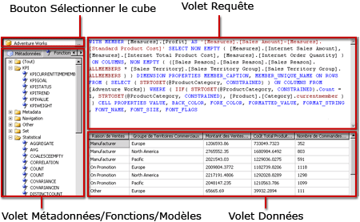

# Interface utilisateur du Concepteur de requêtes MDX Analysis Services
  [!INCLUDE[ssRSnoversion](../../includes/ssrsnoversion-md.md)] fournit des concepteurs de requêtes graphiques pour la création de requêtes MDX (Multidimensional Expression) et DMX (Data Mining Expression) pour une source de données [!INCLUDE[ssASnoversion](../../includes/ssasnoversion-md.md)] . Cette rubrique offre une description du Concepteur de requêtes MDX. Pour plus d’informations sur le Concepteur de requêtes DMX, consultez [Type de connexion Analysis Services pour DMX &#40;SSRS&#41;](../../reporting-services/report-data/analysis-services-connection-type-for-dmx-ssrs.md).  
  
 Le concepteur de requêtes graphique MDX comporte deux modes : le mode Création et le mode Requête. Chaque mode fournit un volet Métadonnées à partir duquel vous pouvez faire glisser des membres de cubes sélectionnés pour créer une requête MDX qui récupère des données lors du traitement du rapport.  
  
> [!IMPORTANT]  
>  Les utilisateurs accèdent aux sources de données lorsqu'ils créent et exécutent des requêtes. Vous devez accorder des autorisations minimales sur les sources de données, telles que des autorisations en lecture seule.  
  
> [!NOTE]  
>  L'importation d'une requête .mdx à partir d'un fichier n'est pas prise en charge.  
  
## Concepteur de requêtes MDX graphique en mode Création  
 Lorsque vous modifiez une requête MDX pour un dataset de rapport, le concepteur de requêtes MDX graphique s'ouvre en mode Création.  
  
 La figure suivante présente les différents volets du mode Création.  
  
   
  
 Le tableau suivant répertorie les volets disponibles dans ce mode :  
  
|Volet|Fonction|  
|----------|--------------|  
|Bouton Sélection de cube (**...**)|Affiche le cube actuellement sélectionné.|  
|Volet Métadonnées|Affiche une liste hiérarchique des mesures, des indicateurs de performance clés (KPI) et des dimensions définis dans le cube sélectionné.|  
|Volet Membres calculés|Affiche les membres calculés actuellement définis et disponibles pour être utilisés dans la requête.|  
|Volet Filtre|Utilisez ce volet pour choisir des dimensions et hiérarchies associées afin de filtrer des données à la source et de limiter la quantité de données retournée dans le rapport.|  
|Volet Données|Affiche les en-têtes de colonne pour le jeu de résultats au fur et à mesure que vous faites glisser des éléments des volets Métadonnées et Membres calculés. Met automatiquement à jour le jeu de résultats si le bouton **Exécution automatique** est sélectionné. .|  
  
 Vous pouvez faire glisser des dimensions, des mesures et des indicateurs de performance clés à partir du volet Métadonnées, ainsi que des membres calculés à partir du volet Membres calculés, dans le volet Données. Dans le volet Filtre, vous pouvez sélectionner des dimensions et des hiérarchies associées et définir des expressions de filtres pour limiter les données disponibles à rechercher. Si le **exécution automatique** () sur la barre d’outils bouton bascule est sélectionnée, le Concepteur de requêtes exécute la requête chaque fois que vous supprimez un objet de métadonnées dans le volet données. Vous pouvez exécuter manuellement la requête à l’aide de la **exécuter** () dans la barre d’outils.  
  
 Lorsque vous créez une requête MDX dans ce mode, les propriétés supplémentaires suivantes sont automatiquement incluses dans la requête :  
  
 **Propriétés de membre** MEMBER_CAPTION, MEMBER_UNIQUE_NAME  
  
 **Propriétés de cellule** VALUE, BACK_COLOR, FORE_COLOR, FORMATTED_VALUE, FORMAT_STRING, FONT_NAME, FONT_SIZE, FONT_FLAGS  
  
 Pour spécifier vos propres propriétés supplémentaires, vous devez modifier manuellement la requête MDX en mode Requête.  
  
### Barre d'outils du Concepteur de requêtes graphique MDX en mode Création  
 La barre d'outils du Concepteur de requêtes fournit des boutons qui vous aident à concevoir des requêtes MDX à l'aide de l'interface graphique. Le tableau suivant répertorie ces boutons et leurs fonctions.  
  
|Bouton|Description|  
|------------|-----------------|  
|**Modifier en tant que texte**|Non activé pour ce type de source de données.|  
|**Importer**|Importe une requête existante à partir d'un fichier de définition de rapport (.rdl) sur le système de fichiers. Pour plus d’informations, consultez [Datasets incorporés dans le rapport et datasets partagés &#40;Générateur de rapports et SSRS&#41;](../../reporting-services/report-data/report-embedded-datasets-and-shared-datasets-report-builder-and-ssrs.md).|  
||Bascule vers le type de commande MDX.|  
||Bascule vers le type de commande DMX.|  
||Actualise les métadonnées à partir de la source de données.|  
||Affiche la boîte de dialogue **Générateur de membres calculés** .|  
||Affiche ou masque les cellules vides dans le volet Données. (Cela revient à utiliser la clause NON EMPTY dans MDX.)|  
||Exécute automatiquement la requête et affiche le résultat chaque fois qu'une modification est effectuée. Les résultats s'affichent dans le volet Données.|  
||Affiche les agrégations dans le volet Données.|  
||Supprime de la requête la colonne sélectionnée dans le volet Données.|  
||Affiche la boîte de dialogue **Paramètres de la requête** . Lorsque vous spécifiez des valeurs pour un paramètre de requête, un paramètre de rapport du même nom est automatiquement créé. Le paramètre de requête prend pour valeur une expression qui fait référence au paramètre de rapport.|  
||Prépare la requête.|  
||Exécute la requête et affiche les résultats dans le volet Données.|  
||Annule la requête.|  
||Bascule entre le mode Création et le mode Requête.|  
  
## Concepteur de requêtes graphique MDX en mode Requête  
 Pour basculer en mode **Requête** dans le concepteur de requêtes graphique, cliquez sur le bouton bascule **Mode Création** dans la barre d'outils.  
  
 La figure suivante présente les différents volets du mode Requête.  
  
   
  
 Le tableau suivant répertorie les volets disponibles dans ce mode :  
  
|Volet|Fonction|  
|----------|--------------|  
|Bouton Sélection de cube (**...**)|Affiche le cube actuellement sélectionné.|  
|Volet Métadonnées/Fonctions/Modèles|Affiche une liste hiérarchique des mesures, des indicateurs de performance clés (KPI) et des dimensions définis dans le cube sélectionné.|  
|Volet Requête|Affiche le texte de la requête.|  
|Volet Résultat|Affiche les résultats de l'exécution de la requête.|  
  
 Le volet Métadonnées affiche les onglets **Métadonnées**, **Fonctions**et **Modèles**. À partir de l'onglet **Métadonnées** , vous pouvez faire glisser des dimensions, des hiérarchies et des valeurs de performance clés dans le volet Requête MDX. À partir de l'onglet **Fonctions** , vous pouvez faire glisser des fonctions dans le volet Requête MDX. À partir de l'onglet **Modèles** , vous pouvez ajouter des modèles MDX dans le volet Requête MDX. Lorsque vous exécutez la requête, le volet Résultat affiche les résultats pour la requête MDX.  
  
 Vous pouvez étendre la requête MDX par défaut générée en mode Création de façon à inclure des propriétés de membre et de cellule supplémentaires. Lorsque vous exécutez la requête, ces valeurs n'apparaissent pas dans le jeu de résultats. Toutefois, elles sont renvoyées à [!INCLUDE[ssRSnoversion](../../includes/ssrsnoversion-md.md)] et vous pouvez utiliser ces valeurs dans un rapport. Pour plus d’informations, consultez [Propriétés de champ étendues pour une base de données Analysis Services &#40;SSRS&#41;](../../reporting-services/report-data/extended-field-properties-for-an-analysis-services-database-ssrs.md).  
  
### Barre d'outils du concepteur de requêtes graphique en mode Requête  
 La barre d'outils du Concepteur de requêtes fournit des boutons qui vous aident à concevoir des requêtes MDX à l'aide de l'interface graphique.  
  
 Les boutons de la barre d'outils sont identiques en mode Création et en mode Requête, mais les boutons suivants ne sont pas activés en mode Requête :  
  
-   **Modifier en tant que texte**  
  
-   **Ajouter un membre calculé** ()  
  
-   **Afficher les cellules vides** ()  
  
-   **Exécution automatique** ()  
  
-   **Afficher les agrégations** ()  
  
## Voir aussi  
 [Définir des paramètres dans le Concepteur de requêtes MDX pour Analysis Services &#40; Le Générateur de rapports et SSRS &#41;](../../reporting-services/report-data/define-parameters-in-the-mdx-query-designer-for-analysis-services.md)   
 [Créer un Dataset partagé ou Dataset incorporé &#40; Le Générateur de rapports et SSRS &#41;](../../reporting-services/report-data/create-a-shared-dataset-or-embedded-dataset-report-builder-and-ssrs.md)   
 [Type de connexion Analysis Services pour DMX &#40; SSRS &#41;](../../reporting-services/report-data/analysis-services-connection-type-for-dmx-ssrs.md)   
 [Fichier de Configuration RSReportDesigner](../../reporting-services/report-server/rsreportdesigner-configuration-file.md)   
 [Type de connexion Analysis Services pour MDX &#40; SSRS &#41;](../../reporting-services/report-data/analysis-services-connection-type-for-mdx-ssrs.md)  
  
  
