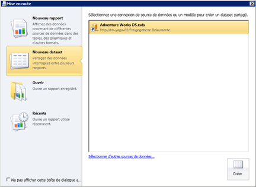

# Créer un dataset partagé ou incorporé (Générateur de rapports et SSRS)
Les jeux de données incorporés doivent être utilisés dans un seul rapport [!INCLUDE[ssRSnoversion_md](../../includes/ssrsnoversion-md.md)] . Les jeux de données partagés d’un serveur de rapports peuvent être utilisés par plusieurs rapports, mobiles et paginés. Pour créer un jeu de données, vous devez disposer d’une source de données incorporée ou partagée.  
  
 Utilisez le **Générateur de rapports** pour effectuer les tâches suivantes :  
  
1.  Créez un dataset partagé en mode création de dataset. Les datasets partagés doivent utiliser des sources de données partagées publiées.  
  
2.   Créez un dataset incorporé en mode création de rapport.  
  
3.   Enregistrez le dataset directement sur le serveur de rapports ou le site SharePoint.  
  
 Dans **, utilisez le** Concepteur de rapports [!INCLUDE[ssBIDevStudioFull](../../includes/ssbidevstudiofull-md.md)] pour effectuer les tâches suivantes :  
  
1.  Créez un dataset partagé dans l'Explorateur de solutions. Les datasets partagés doivent utiliser les sources de données du dossier Sources de données partagées dans l'Explorateur de solutions.  
  
2.  Créez un dataset incorporé dans le volet des données de rapport.  
  
3.  Éventuellement déployez des datasets partagés et la source de données partagées avec le rapport. Pour chaque type d'élément, utilisez les propriétés du projet pour spécifier les chemins d'accès aux dossiers sur le serveur de rapports ou le site SharePoint.  
  
 Pour plus d’informations, consultez [Datasets incorporés dans le rapport et datasets partagés &#40;Générateur de rapports et SSRS&#41;](../../reporting-services/report-data/report-embedded-datasets-and-shared-datasets-report-builder-and-ssrs.md).  
  
> [!NOTE]  
>  [!INCLUDE[ssRBRDDup](../../includes/ssrbrddup-md.md)]  
  
## Pour ouvrir le Générateur de rapports et créer un dataset partagé  
  
1.  Ouvrez le Générateur de rapports. Le volet **Nouveau rapport ou dataset** s'ouvre, comme indiqué dans l'illustration suivante :  
  
       
  
    > [!NOTE]  
    >  Si le volet **Nouveau rapport ou dataset** ne s’affiche pas, à partir du bouton Générateur de rapports, cliquez sur **Nouveau**.  
  
2.  Dans le volet gauche, sous **Créer un dataset**, cliquez sur **Dataset partagé**.  
  
3.  Dans le volet droit, cliquez sur **Parcourir** pour sélectionner une source de données partagée sur le serveur de rapports, puis cliquez sur **Créer**. Le concepteur de requêtes associé à la source de données partagée s'ouvre.  
  
4.  Dans le Concepteur de requêtes, spécifiez les champs à inclure au dataset.  
  
5.  Cliquez sur **Exécuter** (**!**) pour exécuter la requête.  
  
6.  Sur le bouton **Générateur de rapports** , cliquez sur **Enregistrer** ou **Enregistrer sous** pour enregistrer le dataset partagé sur le serveur de rapports.  
  
7.  Pour quitter le Générateur de rapports, cliquez sur **Générateur de rapports**, puis sur **Quitter le Générateur de rapports**. Pour utiliser des rapports, cliquez sur **Générateur de rapports**, puis sur **Nouveau** ou **Ouvrir**.  
  
## Pour définir des options de paramètre de requête  
  
1.  Ouvrez le Générateur de rapports.  
  
2.  Cliquez sur **Ouvrir**.  
  
3.  Accédez au serveur de rapports et sélectionnez le dossier pour la source de données partagée.  
  
4.  Dans **Éléments de type**, cliquez sur Datasets (*.rsd) dans la liste déroulante.  
  
5.  Sélectionnez le dataset partagé, puis cliquez sur **Ouvrir**. Le concepteur de requêtes associé s'ouvre.  
  
6.  Sur le ruban, cliquez sur **Propriétés du dataset**.  
  
7.  Cliquez sur **Paramètres**. Dans cette page, définissez une valeur par défaut sur une constante ou une expression, marquez le paramètre en lecture seule, nullable ou **Omettre de la requête**. Pour plus d’informations, consultez [Paramètres de rapport](../../reporting-services/report-design/report-parameters-report-builder-and-report-designer.md).  
  
8.  [!INCLUDE[clickOK](../../includes/clickok-md.md)]  

  
## Pour créer un dataset à partir d'une base de données relationnelle SQL Server  
  
1.  Dans le volet Données du rapport, cliquez avec le bouton droit sur le nom de la source de données, puis cliquez sur **Ajouter un dataset**. La page **Requête** de la boîte de dialogue **Propriétés du dataset** s'ouvre.  
  
2.  Dans **Nom**, tapez un nom pour le dataset ou acceptez le nom par défaut.  
  
    > [!NOTE]  
    >  Le nom du dataset est utilisé en interne dans le rapport. Par souci de clarté, il est recommandé d'utiliser un nom de dataset qui décrit les données retournées par la requête.  
  
3.  Dans **Source de données**, recherchez et sélectionnez le nom d'une source de données partagée existante ou cliquez sur **Nouveau** pour créer une source de données incorporée.  
  
4.  Sélectionnez une option pour le **Type de requête** . Les options disponibles dépendent du type de source de données.  
  
    -   Sélectionnez **Texte** pour rédiger une requête adoptant le langage de requête de la source de données.  
  
    -   Sélectionnez **Table** pour retourner tous les champs dans une table de base de données relationnelle.  
  
    -   Sélectionnez **StoredProcedure** pour exécuter une procédure stockée par nom.  
  
5.  Dans la zone **Requête**, tapez le nom de la requête, de la procédure stockée ou de la table. Vous pouvez aussi cliquer sur **Concepteur de requêtes** pour ouvrir le concepteur de requêtes graphique ou textuel, ou sur **Importer** pour importer la requête depuis un rapport existant.  
  
     Dans certains cas, la collection de champs spécifiée par la requête ne peut être déterminée qu'en exécutant la requête sur la source de données. Par exemple, une procédure stockée peut retourner un jeu variable de champs dans le jeu de résultats. Cliquez sur **Actualiser les champs** pour exécuter la requête sur la source de données et récupérer les noms de champs qui sont requis pour remplir la collection de champs de dataset dans le volet des données de rapport. La collection de champs s'affiche sous le nœud de dataset une fois que vous avez fermé la boîte de dialogue **Propriétés du dataset** .  
  
6.  Dans la zone **Délai d'expiration**, tapez le nombre de secondes pendant lequel le serveur de rapports attend une réponse de la base de données. La valeur par défaut est 0 seconde. Lorsque la valeur du délai d'expiration est de 0 secondes, la requête n'expire pas.  
  
7.  [!INCLUDE[clickOK](../../includes/clickok-md.md)]  
  
     Le dataset et sa collection de champs s'affichent dans le volet des données de rapport sous le nœud de source de données.  
  
##  Voir aussi  
 [Datasets incorporés dans le rapport et datasets partagés &#40;Générateur de rapports et SSRS&#41;](../../reporting-services/report-data/report-embedded-datasets-and-shared-datasets-report-builder-and-ssrs.md)   
 [Collection de champs de dataset &#40;Générateur de rapports et SSRS&#41;](../../reporting-services/report-data/dataset-fields-collection-report-builder-and-ssrs.md)   
 [Jeux de données du rapport &#40;SSRS&#41;](../../reporting-services/report-data/report-datasets-ssrs.md)   
 [Connexions de données, sources de données et chaînes de connexion &#40;Générateur de rapports et SSRS&#41;](http://msdn.microsoft.com/library/7e103637-4371-43d7-821c-d269c2cc1b34)   
 [Datasets incorporés et partagés &#40;Générateur de rapports et SSRS&#41;](../../reporting-services/report-data/embedded-and-shared-datasets-report-builder-and-ssrs.md)  
  
  
