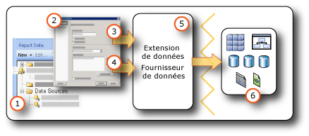

# <a name="data-connections-data-sources-and-connection-strings-report-builder-and-ssrs"></a>Connexions de données, sources de données et chaînes de connexion (Générateur de rapports et SSRS)

[!INCLUDE [ssrs-appliesto](../../includes/ssrs-appliesto.md)] [!INCLUDE [ssrs-appliesto-2016-and-later](../../includes/ssrs-appliesto-2016-and-later.md)] [!INCLUDE[ssrs-appliesto-pbirsi](../../includes/ssrs-appliesto-pbirs.md)] [!INCLUDE[ssrs-appliesto-sharepoint-2013-2016i](../../includes/ssrs-appliesto-sharepoint-2013-2016.md)])

[!INCLUDE [ssrs-previous-versions](../../includes/ssrs-previous-versions.md)]

  Pour inclure les données dans des rapports paginés du [!INCLUDE[ssRBnoversion](../../includes/ssrbnoversion-md.md)] et  [!INCLUDE[ssRSnoversion](../../includes/ssrsnoversion-md.md)] , vous devez commencer par créer des *sources de données* et des *jeux de données*. Cette rubrique explique le type des sources de données, comment créer les sources de données et les informations importantes liées aux informations d'identification de source de données. Une source de données inclut le type de source de données, les informations de connexion et le type d'informations d'identification à utiliser. Il existe deux types de sources de données : incorporée et partagée. Une source de données incorporée est définie dans le rapport et utilisée uniquement par ce rapport. Une source de données partagée est définie indépendamment d'un rapport et peut être utilisée par plusieurs rapports. Pour plus d’informations, consultez [Datasets incorporés et partagés &#40;Générateur de rapports et SSRS&#41;](../../reporting-services/report-data/embedded-and-shared-datasets-report-builder-and-ssrs.md).  

> [!NOTE]  
>  [!INCLUDE[ssRBRDDup](../../includes/ssrbrddup-md.md)]
  
##  <a name="bkmk_data_sources"></a> Sources de données incorporées et partagées  
 Les sources de données partagées sont utiles lorsque vous disposez de sources de données que vous utilisez souvent. Il est recommandé d'utiliser des sources de données partagées dans la mesure du possible. Celles-ci permettent de gérer plus facilement les rapports et l'accès aux rapports, et de sécuriser davantage les rapports et les sources de données auxquelles ils accèdent. Si vous avez besoin d'une source de données partagée, demandez à votre administrateur système d'en créer une pour vous.  
  
 Une source de données incorporée est une connexion de données enregistrée dans la définition de rapport. Les informations de connexion à la source de données incorporée peuvent être utilisées uniquement par le rapport dans lequel elles sont incorporées. Pour définir et gérer des sources de données incorporées, utilisez la boîte de dialogue **Propriétés de la source de données** .  
  
 La différence entre les deux sources de données réside dans leur mode de création, de stockage et de gestion.  
  
-   Dans le Concepteur de rapports, créez des sources de données incorporées ou partagées dans le cadre d'un projet [!INCLUDE[ssBIDevStudioFull](../../includes/ssbidevstudiofull-md.md)] . Vous pouvez choisir de les utiliser localement pour l'aperçu ou de les déployer dans le cadre du projet sur un serveur de rapports ou sur un site SharePoint. Vous pouvez utiliser les extensions de données personnalisées qui ont été installées sur votre ordinateur et sur le serveur de rapports ou le site SharePoint sur lequel vous déployez vos rapports.  
  
     Les administrateurs système peuvent installer et configurer des extensions supplémentaires pour le traitement des données, ainsi que des fournisseurs de données .NET Framework. Pour plus d’informations, consultez [Extensions pour le traitement des données et fournisseurs de données .NET Framework &#40;SSRS&#41;](../../reporting-services/report-data/data-processing-extensions-and-net-framework-data-providers-ssrs.md).  
  
     Les développeurs peuvent utiliser l’API <xref:Microsoft.ReportingServices.DataProcessing> pour créer des extensions pour le traitement des données permettant de prendre en charge d’autres types de sources de données.  
  
-   Dans le [!INCLUDE[ssRBnoversion](../../includes/ssrbnoversion-md.md)], accédez à un serveur de rapports ou à un site SharePoint et sélectionnez les sources de données partagées ou créez des sources de données incorporées dans le rapport. Vous ne pouvez pas créer de sources de données partagées dans le [!INCLUDE[ssRBnoversion](../../includes/ssrbnoversion-md.md)]. Vous ne pouvez pas utiliser les extensions de données personnalisées dans le [!INCLUDE[ssRBnoversion](../../includes/ssrbnoversion-md.md)].  
  
 Le tableau ci-après récapitule les différences entre les sources de données incorporées et partagées :  
  
|Description|Source de données<br /><br /> Source de données|Partagés<br /><br /> Data Source|  
|-----------------|------------------------------|----------------------------|  
|La connexion de données est incorporée dans la définition de rapport.|||  
|Le pointeur vers la connexion de données sur le serveur de rapports est incorporé dans la définition de rapport.|||  
|Gestion sur le serveur de rapports|||  
|Obligatoire pour les datasets partagés|||  
|Obligatoire pour les composants|||  
  
##  <a name="bkmk_DataConnections"></a> Extensions de données intégrées  
 Les extensions de données par défaut dans [!INCLUDE[ssRSnoversion](../../includes/ssrsnoversion-md.md)] comprennent les types de connexions de données suivants :  
  
-   Microsoft SQL Server et Microsoft Azure SQL Database
  
-   Microsoft SQL Server Analysis Services  
  
-   Liste Microsoft SharePoint  
  
-   [!INCLUDE[ssSDSFull](../../includes/sssdsfull-md.md)]  
  
-   Microsoft SQL Server Parallel Data Warehouse  
  
-   OLE DB  
  
-   Oracle  
  
-   SAP NetWeaver BI  
  
-   Hyperion Essbase  
  
-   Teradata  
  
-   XML  
  
-   ODBC  
  
-   Modèle sémantique Microsoft BI pour Power View : sur un site SharePoint configuré pour une galerie [!INCLUDE[ssGemini](../../includes/ssgemini-md.md)] et [!INCLUDE[ssCrescent](../../includes/sscrescent-md.md)], ce type de source de données est disponible. Ce type de source de données est utilisé uniquement pour les présentations [!INCLUDE[ssCrescent](../../includes/sscrescent-md.md)] . Pour plus d'informations, consultez [Création de modèles tabulaires sémantiques BI pour Power View parfaits](http://technet.microsoft.com/video/building-the-perfect-bi-semantic-tabular-models-for-power-view.aspx).  
  
 Pour obtenir la liste complète des sources de données et des versions prises en charge par [!INCLUDE[ssRSnoversion](../../includes/ssrsnoversion-md.md)], consultez [Sources de données prises en charge par Reporting Services &#40;SSRS&#41;](../../reporting-services/report-data/data-sources-supported-by-reporting-services-ssrs.md).  
  
## <a name="data-in-includessrbnoversionincludesssrbnoversion-mdmd"></a>Données dans le [!INCLUDE[ssRBnoversion](../../includes/ssrbnoversion-md.md)]  
   
  
1.  **Sources de données dans le volet des données de rapport** Une source de données s'affiche dans le volet des données de rapport une fois que vous avez créé une source de données incorporée ou que vous avez ajouté une source de données partagée.  
  
2.  **Boîte de dialogue Connexion** Utilisez la boîte de dialogue Connexion pour créer ou coller une chaîne de connexion.  
  
3.  **Informations de connexion de données** La chaîne de connexion est passée à l'extension de données.  
  
4.  **Informations d'identification** Les informations d'identification sont gérées indépendamment de la chaîne de connexion.  
  
5.  **Extension de données/Fournisseur de données** La connexion aux données peut s’effectuer via plusieurs couches d’accès aux données.  
  
6.  **Sources de données externes** Récupérez des données à partir de bases de données relationnelles, bases de données multidimensionnelles, listes SharePoint, services Web ou modèles de rapport.  
  
##  <a name="bkmk_connection_examples"></a> Exemples de chaîne de connexion courante  
 Les chaînes de connexion constituent la représentation textuelle des propriétés de connexion pour un fournisseur de données. Le tableau suivant présente des exemples de chaînes de connexion pour différents types de connexion de données.  
 
 > [!NOTE]  
>  [ConnectionStrings.com](http://www.connectionstrings.com/) est une autre ressource permettant d’obtenir des exemples de chaînes de connexion. 
  
|**Data source**|**Exemple**|**Description**|  
|---------------------|-----------------|---------------------|  
|Base de données SQL Server sur le serveur local|`data source="(local)";initial catalog=AdventureWorks`|Définissez **Microsoft SQL Server**comme type de source de données. Pour plus d’informations, consultez [Type de connexion SQL Server &#40;SSRS&#41;](../../reporting-services/report-data/sql-server-connection-type-ssrs.md).|  
|Instance SQL Server<br /><br /> base de données|`Data Source=localhost\MSSQL13.<InstanceName>; Initial Catalog=AdventureWorks`|Définissez **Microsoft SQL Server**comme type de source de données.|  
|Base de données SQL Server Express|`Data Source=localhost\MSSQL13.SQLEXPRESS; Initial Catalog=AdventureWorks`|Définissez **Microsoft SQL Server**comme type de source de données.|  
|Azure SQL Database|`Data Source=<host>;Initial Catalog=AdventureWorks; Encrypt=True`|Définissez **Microsoft Azure SQL Database** comme type de source de données. Pour plus d’informations, consultez [Type de connexion SQL Azure &#40;SSRS&#41;](../../reporting-services/report-data/sql-azure-connection-type-ssrs.md).|  
|SQL Server Parallel Data Warehouse|`HOST=<IP address>;database= AdventureWorks; port=<port>`|Définissez **Microsoft SQL Server Parallel Data Warehouse**comme type de source de données. Pour plus d’informations, consultez [Type de connexion SQL Server Parallel Data Warehouse &#40;SSRS&#41;](../../reporting-services/report-data/sql-server-parallel-data-warehouse-connection-type-ssrs.md).|  
|Base de données Analysis Services sur le serveur local|`data source=localhost;initial catalog=Adventure Works DW`|Définissez **Microsoft SQL Server Analysis Services**comme type de source de données. Pour plus d’informations, consultez [Type de connexion Analysis Services pour MDX &#40;SSRS&#41;](../../reporting-services/report-data/analysis-services-connection-type-for-mdx-ssrs.md) ou [Type de connexion Analysis Services pour DMX &#40;SSRS&#41;](../../reporting-services/report-data/analysis-services-connection-type-for-dmx-ssrs.md).|  
|Base de données de modèles tabulaires Analysis Services avec une perspective Ventes|`Data source=<servername>;initial catalog= Adventure Works DW;cube='Sales’`|Définissez **Microsoft SQL Server Analysis Services**comme type de source de données. Spécifiez le nom de la perspective dans le paramètre cube=. Pour plus d’informations, consultez [Perspectives &#40;SSAS Tabulaire&#41;](../../analysis-services/tabular-models/perspectives-ssas-tabular.md).|  
|Source de données de modèle de rapport sur un serveur de rapports configuré en mode natif|`Server=http://myreportservername/reportserver; datasource=/models/Adventure Works`|Spécifiez l'URL du serveur de rapports ou de la bibliothèque de documents, ainsi que le chemin d'accès au modèle publié dans l'espace de noms du dossier du serveur de rapports ou du dossier de la bibliothèque de documents. Pour plus d’informations, consultez [Connexion à un modèle de rapport &#40;SSRS&#41;](../../reporting-services/report-data/report-model-connection-ssrs.md).|  
|Source de données de modèle de rapport sur un serveur de rapports configuré en mode intégré SharePoint|`Server=http://server; datasource=http://server/site/documents/models/Adventure Works.smdl`|Spécifiez l'URL du serveur de rapports ou de la bibliothèque de documents, ainsi que le chemin d'accès au modèle publié dans l'espace de noms du dossier du serveur de rapports ou du dossier de la bibliothèque de documents.|  
|[!INCLUDE[ssNoVersion](../../includes/ssnoversion-md.md)] Serveur SQL Server 2000 [!INCLUDE[ssASnoversion](../../includes/ssasnoversion-md.md)]|`provider=MSOLAP.2;data source=<remote server name>;initial catalog=FoodMart 2000`|Définissez **OLE DB Provider for OLAP Services 8.0**comme type de source de données.<br /><br /> Vous pouvez obtenir une connexion plus rapide aux sources de données [!INCLUDE[ssNoVersion](../../includes/ssnoversion-md.md)] 2000 [!INCLUDE[ssASnoversion](../../includes/ssasnoversion-md.md)] en affectant à la propriété **ConnectTo** la valeur **8.0**. Pour définir cette propriété, utilisez l'onglet **Propriétés avancées** de la boîte de dialogue **Propriétés de connexion** .|  
|Serveur Oracle|`data source=myserver`|Définissez **Oracle**comme type de source de données. Les outils clients Oracle doivent être installés sur l'ordinateur hébergeant le Concepteur de rapports et sur le serveur de rapports. Pour plus d’informations, consultez [Type de connexion Oracle &#40;SSRS&#41;](../../reporting-services/report-data/oracle-connection-type-ssrs.md).|  
|Source de données SAP NetWeaver BI|`DataSource=http://mySAPNetWeaverBIServer:8000/sap/bw/xml/soap/xmla`|Définissez **SAP NetWeaver BI**comme type de source de données. Pour plus d’informations, consultez [Type de connexion SAP NetWeaver BI &#40;SSRS&#41;](../../reporting-services/report-data/sap-netweaver-bi-connection-type-ssrs.md).|  
|Source de données Hyperion Essbase|`Data Source=http://localhost:13080/aps/XMLA; Initial Catalog=Sample`|Définissez **Hyperion Essbase**comme type de source de données. Pour plus d’informations, consultez [Type de connexion Hyperion Essbase &#40;SSRS&#41;](../../reporting-services/report-data/hyperion-essbase-connection-type-ssrs.md).|  
|Source de données Teradata|`data source=`\<NNN>.\<NNN>.\<NNN>.\<NNN>`;`|Définissez **Teradata**comme type de source de données. La chaîne de connexion est une adresse IP (Internet Protocol) se présentant sous la forme de quatre champs, chaque champ pouvant comporter de un à trois chiffres. Pour plus d’informations, consultez [Type de connexion Teradata &#40;SSRS&#41;](../../reporting-services/report-data/teradata-connection-type-ssrs.md).|  
|Source de données Teradata|`Database=` *\<nom_base_de_données>* `; data source=` *\<NN*N *>.\<NNN>.\<NNN>.\<N*NN*>*`;Use X Views=False;Restrict to Default Database=True`|Définissez **Teradata**, comme type de source de données, comme dans l'exemple précédent. Utilisez uniquement la base de données par défaut spécifiée dans la balise Database, et ne découvrez pas automatiquement les relations entre les données.|  
|Source de données XML, service Web|`data source=http://adventure-works.com/results.aspx`|Définissez **XML**comme type de source de données. La chaîne de connexion est une URL pour un service Web prenant en charge le langage de définition de services Web (WSDL, Web Services Definition Language). Pour plus d’informations, consultez [Type de connexion XML &#40;SSRS&#41;](../../reporting-services/report-data/xml-connection-type-ssrs.md).|  
|Source de données XML, document XML|`http://localhost/XML/Customers.xml`|Définissez **XML**comme type de source de données. La chaîne de connexion est une URL vers le document XML.|  
|Source de données XML, document XML incorporé|*Vide*|Définissez **XML**comme type de source de données. Les données XML sont incorporées dans la définition de rapport.|  
|Liste SharePoint|`data source=http://MySharePointWeb/MySharePointSite/`|Définissez **SharePoint List**comme type de source de données.|  
  
 Si vous ne réussissez pas à vous connecter à un serveur de rapports en utilisant **localhost**, vérifiez que le protocole réseau du protocole TCP/IP est activé. Pour plus d'informations, consultez [Configure Client Protocols](../../database-engine/configure-windows/configure-client-protocols.md).  
  
 Pour plus d’informations sur les configurations nécessaires pour se connecter à ces types de sources de données, consultez la rubrique spécifique aux connexions de données sous [Ajouter des données à partir de sources de données externes &#40;SSRS&#41;](../../reporting-services/report-data/add-data-from-external-data-sources-ssrs.md) ou [Sources de données prises en charge par Reporting Services &#40;SSRS&#41;](../../reporting-services/report-data/data-sources-supported-by-reporting-services-ssrs.md).  
  
##  <a name="bkmk_special_password_characters"></a> Caractères spéciaux dans un mot de passe  
 Si vous configurez votre source de données ODBC ou SQL de manière à demander un mot de passe ou à inclure le mot de passe dans la chaîne de connexion, et si l'utilisateur entre le mot de passe avec des caractères spéciaux tels que des marques de ponctuation, certains pilotes de sources de données sous-jacents ne peuvent pas valider les caractères spéciaux. Lors du traitement du rapport, le message « Mot de passe non valide » peut s'afficher et signaler ce problème. Si le changement du mot de passe s'avère impossible, vous pouvez demander à votre administrateur de base de données de stocker les informations d'identification appropriées sur le serveur en tant que nom de sources de données (DSN) ODBC. Pour plus d'informations, consultez « OdbcConnection.ConnectionString » dans la documentation du Kit de développement logiciel (SDK) [!INCLUDE[dnprdnshort](../../includes/dnprdnshort-md.md)] .  
  
##  <a name="bkmk_Expressions_in_connection_strings"></a> Chaînes de connexion basées sur des expressions  
 Les chaînes de connexion basées sur des expressions sont évaluées au moment de l'exécution. Par exemple, vous pouvez spécifier la source de données comme paramètre, inclure la référence de paramètre dans la chaîne de connexion et permettre à l'utilisateur de choisir une source de données pour le rapport. Par exemple, supposons qu'une société multinationale possède des serveurs de données dans plusieurs pays. Grâce à une chaîne de connexion basée sur une expression, un utilisateur peut sélectionner une source de données pour un pays particulier avant d'exécuter un rapport de ventes.  
  
 L'exemple suivant illustre l'utilisation d'une expression de source de données dans une chaîne de connexion [!INCLUDE[ssNoVersion](../../includes/ssnoversion-md.md)] . Il repose sur l'hypothèse que vous avez créé un paramètre de rapport nommé `ServerName`:  
  
```  
="data source=" & Parameters!ServerName.Value & ";initial catalog=AdventureWorks"  
```  
  
 Les expressions de source de données sont traitées au moment de l'exécution ou lors de l'affichage de l'aperçu d'un rapport. L'expression doit être écrite en [!INCLUDE[vbprvb](../../includes/vbprvb-md.md)]. Suivez les règles suivantes lorsque vous définissez une expression de source de données :  
  
-   Créez le rapport à l'aide d'une chaîne de connexion statique. Une chaîne de connexion statique désigne une chaîne de connexion qui n'est pas définie par le biais d'une expression (ce qui est par exemple le cas lorsque vous suivez la procédure de création d'une source de données partagée ou spécifique aux rapports). L'utilisation d'une chaîne de connexion statique vous permet de vous connecter à la source de données dans le Concepteur de rapports afin d'obtenir les résultats de requête nécessaires à la création du rapport.  
  
-   Lorsque vous définissez la connexion de source de données, n'utilisez pas une source de données partagée. Vous ne pouvez pas utiliser une expression de source de données dans une source de données partagée. Vous devez définir une source de données incorporée pour le rapport.  
  
-   Spécifiez les informations d'identification indépendamment de la chaîne de connexion. Vous pouvez utiliser des informations d'identification stockées, des informations d'identification saisies ou la sécurité intégrée.  
  
-   Ajoutez un paramètre de rapport pour spécifier une source de données. Pour les valeurs du paramètre, vous pouvez fournir une liste statique de valeurs disponibles, qui doivent être des sources de données utilisables avec le rapport, ou définir une requête qui extrait une liste de sources de données au moment de l'exécution.  
  
-   Vérifiez que la liste de sources de données partage le même schéma de base de données. Toute conception de rapport commence par les informations relatives au schéma. Si le schéma permettant de définir le rapport ne correspond pas au schéma effectivement utilisé par le rapport au moment de l'exécution, celle-ci peut échouer.  
  
-   Avant de publier le rapport, remplacez la chaîne de connexion statique par une expression. N'effectuez cette opération qu'une fois la création du rapport achevée. Dès que vous utilisez une expression, vous ne pouvez pas exécuter la requête dans le Concepteur de rapports. De plus, la liste de champs du volet des données de rapport et la liste Paramètres ne sont pas automatiquement mises à jour.  

## <a name="next-steps"></a>Étapes suivantes

[Créer, modifier, puis supprimer des sources de données partagées](../../reporting-services/report-data/create-modify-and-delete-shared-data-sources-ssrs.md)   
[Créer et modifier des sources de données incorporées](../../reporting-services/report-data/create-and-modify-embedded-data-sources.md)   
[Définir des propriétés de déploiement](../../reporting-services/tools/set-deployment-properties-reporting-services.md)   
[Spécifier des informations d'identification et de connexion pour les sources de données de rapports](../../reporting-services/report-data/specify-credential-and-connection-information-for-report-data-sources.md)  

D’autres questions ? [Essayez de poser une question dans le forum Reporting Services](http://go.microsoft.com/fwlink/?LinkId=620231)
