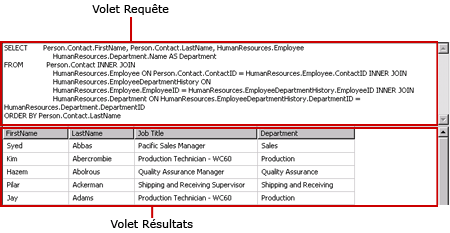
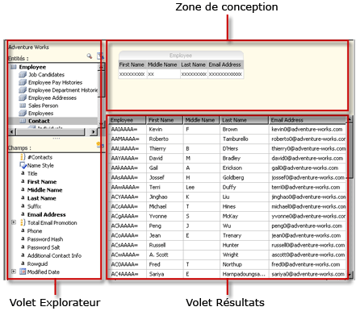
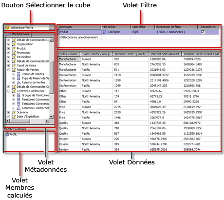
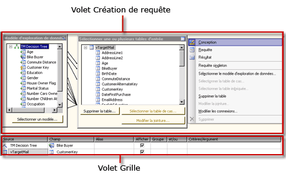
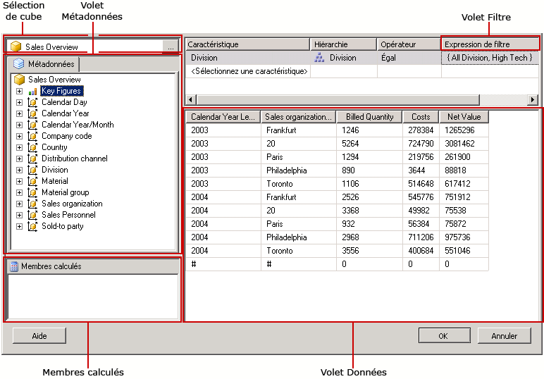
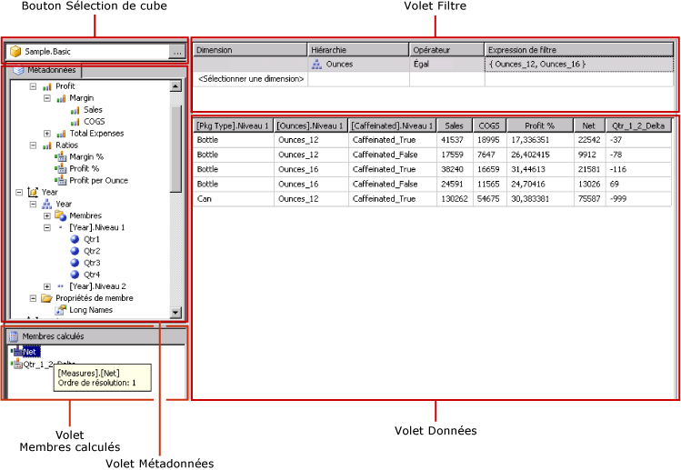

# Outils de création de requête (SSRS)
  [!INCLUDE[ssRSnoversion](../../includes/ssrsnoversion-md.md)] fournit différents outils de conception de requêtes que vous pouvez utiliser pour créer des requêtes de dataset dans le Concepteur de rapports. Certains concepteurs de requêtes offrent d’autres modes qui vous permettent de choisir s’il convient de travailler en mode visuel ou directement dans le langage de requête. Cette rubrique présente chaque outil et décrit le type de source de données que chacun prend en charge. Les outils suivants sont décrits dans cette rubrique :  
  
-   [Concepteur de requêtes textuel](#Textbased)  
  
-   [Concepteur de requêtes graphique](#Graphical)  
  
-   [Concepteur de requêtes Modèle de rapport](#Model)  
  
-   [Concepteur de requêtes MDX](#MDX)  
  
-   [Concepteur de requêtes DMX](#DMX)  
  
-   [Concepteur de requêtes SAP NetWeaver BI](#SAPBW)  
  
-   [Concepteur de requêtes Hyperion Essbase](#Hyperion)  
  
 Tous les outils de conception de requêtes fonctionnent dans l’environnement de conception de données de [!INCLUDE[ssBIDevStudioFull](../../includes/ssbidevstudiofull-md.md)] quand vous travaillez avec un modèle de projet de Report Server ou de l’Assistant Projet Report Server. Pour plus d’informations sur l’utilisation des concepteurs de requêtes, consultez [Concepteurs de requêtes Reporting Services](http://msdn.microsoft.com/library/07efd3f1-804f-45f7-b62a-3e727a3d9835).  
  
 Le type de source de données utilisé détermine la disponibilité d'un concepteur de requêtes particulier.  
  
 Les types de sources de données disponibles dans votre rapport sont déterminés par les extensions de données de [!INCLUDE[ssRSnoversion](../../includes/ssrsnoversion-md.md)] installées sur votre client ou serveur de rapports. Pour plus d’informations, consultez [Fichier de configuration RSReportDesigner](../../reporting-services/report-server/rsreportdesigner-configuration-file.md) et [Fichier de configuration RsReportServer.config](../../reporting-services/report-server/rsreportserver-config-configuration-file.md).  
  
 Une extension pour le traitement des données et son concepteur de requêtes associé peuvent être différents au niveau de la prise en charge des sources de données comme suit :  
  
-   **Par type de concepteur de requêtes.** Par exemple, une source de données [!INCLUDE[ssNoVersion](../../includes/ssnoversion-md.md)] prend en charge à la fois les concepteurs de requêtes graphiques et textuels.  
  
-   **Par variation de langage de requête.** Par exemple, un langage de requête comme [!INCLUDE[tsql](../../includes/tsql-md.md)] peut être différent du point de vue de la syntaxe selon le type de source de données. Le langage [!INCLUDE[msCoName](../../includes/msconame-md.md)] [!INCLUDE[tsql](../../includes/tsql-md.md)] et le langage Oracle SQL présentent des variantes de syntaxe pour une commande de requête.  
  
-   **Par prise en charge de la partie schéma d'un nom d'objet de base de données.** Lorsqu'une source de données utilise des schémas dans l'identificateur d'objets de la base de données, le nom du schéma doit être fourni dans la requête pour les noms qui ne font pas appel au schéma par défaut. Par exemple, `SELECT FirstName, LastName FROM [Person].[Person]`.  
  
-   **Par prise en charge des paramètres de requête.** La prise en charge des paramètres varie selon les fournisseurs de données. Certains fournisseurs de données prennent en charge des paramètres nommés ; par exemple, `SELECT Col1, Col2 FROM Table WHERE <parameter identifier><parameter name> = <value>`. Certains fournisseurs de données prennent en charge des paramètres sans nom ; par exemple, `SELECT Col1, Col2 FROM Table WHERE <column name> = ?`. L’identificateur de paramètre peut varier selon le fournisseur de données. Par exemple, [!INCLUDE[ssNoVersion](../../includes/ssnoversion-md.md)] utilise l’arobase (@), alors qu’Oracle utilise les deux-points (:). Certains fournisseurs de données ne prennent pas en charge les paramètres.  
  
-   **Par capacité à importer des requêtes.** Par exemple, pour une source de données de [!INCLUDE[ssNoVersion](../../includes/ssnoversion-md.md)] , vous pouvez importer une requête à partir d'un fichier de définition de rapport (.rdl) ou d'un fichier .sql.  
  
##   Concepteur de requêtes textuel  
 Le concepteur de requêtes textuel est l’outil de génération de requêtes adopté par défaut pour la plupart des sources de données relationnelles prises en charge, notamment [!INCLUDE[msCoName](../../includes/msconame-md.md)] [!INCLUDE[ssNoVersion](../../includes/ssnoversion-md.md)], Oracle, Teradata, OLE DB, XML et ODBC. Contrairement au concepteur de requêtes graphique, cet outil de conception de requêtes ne valide pas la syntaxe des requêtes lors de leur conception. L'image suivante présente le concepteur de requêtes textuel.  
  
   
  
 Le concepteur de requêtes textuel est recommandé pour la création de requêtes complexes, à l'aide de procédures stockées, d'interrogation de données XML et d'écriture de requêtes dynamiques. Selon la source de données, vous pouvez peut-être cliquer sur le bouton **Modifier en tant que texte** dans la barre d’outils pour basculer entre le concepteur de requêtes graphique et le concepteur de requêtes textuel. Pour plus d’informations, consultez [Interface utilisateur du Concepteur de requêtes textuel](http://msdn.microsoft.com/library/44b7c664-03aa-494e-a484-052b318e810c).  
  
##   Concepteur de requêtes graphique  
 Le concepteur de requêtes graphique permet de créer ou de modifier des requêtes [!INCLUDE[tsql](../../includes/tsql-md.md)] qui s’exécutent sur une base de données relationnelle. Cet outil de conception de requêtes est utilisé dans plusieurs produits [!INCLUDE[msCoName](../../includes/msconame-md.md)] et dans d'autres composants de [!INCLUDE[ssNoVersion](../../includes/ssnoversion-md.md)] . Selon le type de source de données, il prend en charge les modes Text, StoredProcedure et TableDirect. L'image suivante présente le concepteur de requêtes graphique.  
  
   
  
 Vous pouvez cliquer sur le bouton **Modifier en tant que texte** dans la barre d’outils pour basculer entre le concepteur de requêtes graphique et le concepteur de requêtes textuel. Pour plus d’informations, consultez [Interface utilisateur du concepteur de requêtes graphique](../../reporting-services/report-data/graphical-query-designer-user-interface.md).  
  
##   Concepteur de requêtes Modèle de rapport  
 Le concepteur de requêtes Modèle de rapport sert à créer ou à modifier des requêtes qui s'exécutent dans un modèle de rapport SMDL publié sur un serveur de rapports. Les rapports qui s'exécutent sur des modèles prennent en charge l'exploration de données consultables à l'aide de clics. La requête détermine le chemin de l'exploration des données au moment de l'exécution. L'image suivante présente le concepteur de requêtes Modèle de rapport.  
  
   
  
 Pour utiliser le concepteur de requêtes Modèle de rapport, vous devez définir une source de données qui pointe vers un modèle publié. Lorsque vous définissez un dataset pour la source de données, vous pouvez ouvrir la requête de dataset dans le concepteur de requêtes Modèle de rapport. Le concepteur de requêtes Modèle de rapport peut être utilisé en mode graphique ou textuel. Vous pouvez cliquer sur le bouton **Modifier en tant que texte** dans la barre d’outils pour basculer entre le concepteur de requêtes graphique et le concepteur de requêtes textuel. Pour plus d’informations, consultez [Interface utilisateur du concepteur de requêtes de modèle de rapport](../../reporting-services/report-data/report-model-query-designer-user-interface.md).  
  
##   Concepteur de requêtes MDX  
 Le concepteur de requêtes MDX (Multidimensional Expression) permet de créer ou de modifier des requêtes exécutées sur une source de données [!INCLUDE[ssASnoversion](../../includes/ssasnoversion-md.md)] avec des cubes multidimensionnels. L'image suivante présente le concepteur de requêtes MDX après définition de la requête et du filtre.  
  
   
  
 Pour utiliser le concepteur de requêtes MDX, vous devez définir une source de données possédant un cube Analysis Services disponible, valide et traité. Lorsque vous définissez un dataset pour la source de données, vous pouvez ouvrir la requête dans le concepteur de requêtes MDX. Si nécessaire, utilisez les boutons MDX et DMX sur la barre d'outils pour commuter entre les modes MDX et DMX. Pour plus d’informations, consultez [Interface utilisateur du Concepteur de requêtes MDX Analysis Services](../../reporting-services/report-data/analysis-services-mdx-query-designer-user-interface.md).  
  
##   Concepteur de requêtes DMX  
 Le concepteur de requêtes DMX (Data Mining Prediction Expression) permet de créer ou de modifier des requêtes exécutées sur une source de données [!INCLUDE[ssASnoversion](../../includes/ssasnoversion-md.md)] avec des modèles d'exploration de données. L'image suivante présente le concepteur de requêtes DMX après sélection du modèle et des tables d'entrée.  
  
   
  
 Pour utiliser le concepteur de requêtes DMX, vous devez définir une source de données possédant un modèle d'exploration de données disponible et valide. Lorsque vous définissez un dataset pour la source de données, vous pouvez ouvrir la requête dans le concepteur de requêtes DMX. Si nécessaire, utilisez les boutons MDX et DMX sur la barre d'outils pour commuter entre les modes MDX et DMX. Après la sélection du modèle, vous pouvez créer des requêtes de prédiction d'exploration de données qui fournissent des données à un rapport. Pour plus d’informations, consultez [Interface utilisateur du Concepteur de requêtes DMX Analysis Services](../../reporting-services/report-data/analysis-services-dmx-query-designer-user-interface.md).  
  
##   Concepteur de requêtes SAP NetWeaver BI  
 Le concepteur de requêtes [!INCLUDE[SAP_DPE_BW_1](../../includes/sap-dpe-bw-1-md.md)] permet de récupérer des données d’une base de données [!INCLUDE[SAP_DPE_BW_1](../../includes/sap-dpe-bw-1-md.md)] . Pour utiliser ce concepteur de requêtes, vous devez avoir une source de données [!INCLUDE[SAP_DPE_BW_1](../../includes/sap-dpe-bw-1-md.md)] possédant au moins une requête InfoCube, MultiProvider ou web définie. L'image suivante présente le concepteur de requêtes [!INCLUDE[SAP_DPE_BW_1](../../includes/sap-dpe-bw-1-md.md)] . Pour plus d’informations, consultez [Interface utilisateur du Concepteur de requêtes SAP NetWeaver BI](../../reporting-services/report-data/sap-netweaver-bi-query-designer-user-interface.md).  
  
   
  
##   Concepteur de requêtes Hyperion Essbase  
 Le concepteur de requêtes [!INCLUDE[extEssbase](../../includes/extessbase-md.md)] permet de récupérer des données à partir de bases de données et d'applications [!INCLUDE[extEssbase](../../includes/extessbase-md.md)] . L'image suivante présente le concepteur de requêtes [!INCLUDE[extEssbase](../../includes/extessbase-md.md)] .  
  
   
  
 Pour utiliser ce concepteur de requêtes, vous devez avoir une source de données [!INCLUDE[extEssbase](../../includes/extessbase-md.md)] possédant au moins une base de données.  
  
 Pour plus d’informations, consultez [Interface utilisateur du Concepteur de requêtes Hyperion Essbase](../../reporting-services/report-data/hyperion-essbase-query-designer-user-interface.md).  
  
##  Voir aussi  
 [Outils de Reporting Services](../../reporting-services/tools/reporting-services-tools.md)   
 [Jeux de données du rapport &#40;SSRS&#41;](../../reporting-services/report-data/report-datasets-ssrs.md)   
 [Connexions de données, sources de données et chaînes de connexion &#40;Générateur de rapports et SSRS&#41;](../../reporting-services/report-data/data-connections-data-sources-and-connection-strings-report-builder-and-ssrs.md)   
 [Didacticiels sur Reporting Services &#40;SSRS&#41;](../../reporting-services/reporting-services-tutorials-ssrs.md)   
 [Sources de données prises en charge par Reporting Services &#40;SSRS&#41;](../../reporting-services/report-data/data-sources-supported-by-reporting-services-ssrs.md)   
 [Créer une source de données incorporée ou partagée &#40;SSRS&#41;](http://msdn.microsoft.com/library/b111a8d0-a60d-4c8b-b00a-51644b19c34b)  
  
  
