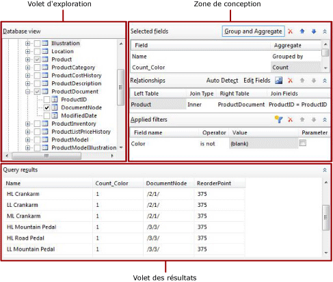
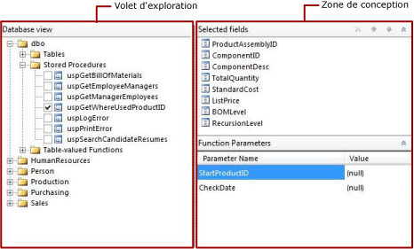

# Interface utilisateur du Concepteur de requêtes relationnelles (Générateur de rapports)
  Le Générateur de rapports et le Concepteur de rapports de [!INCLUDE[ssBIDevStudioFull](../../includes/ssbidevstudiofull-md.md)]fournissent un concepteur de requêtes graphique et un concepteur de requêtes textuel qui permettent de créer une requête spécifiant les données à récupérer auprès de bases de données relationnelles [!INCLUDE[msCoName](../../includes/msconame-md.md)] [!INCLUDE[ssNoVersion](../../includes/ssnoversion-md.md)] et [!INCLUDE[msCoName](../../includes/msconame-md.md)] [!INCLUDE[ssSDS](../../includes/sssds-md.md)] relational databases et [!INCLUDE[msCoName](../../includes/msconame-md.md)] [!INCLUDE[ssDWCurrentFull](../../includes/ssdwcurrentfull-md.md)] pour un dataset de rapport. Utilisez le Concepteur de requêtes graphique pour explorer les métadonnées, créer une requête de manière interactive et afficher les résultats de votre requête. Utilisez le Concepteur de requêtes textuel pour afficher la requête créée par le Concepteur de requêtes graphique ou pour modifier une requête. Vous pouvez également importer une requête existante à partir d'un fichier ou d'un rapport.  
  
> [!NOTE]  
>  Dans le Générateur de rapports, vous devez utiliser le Concepteur de requêtes textuel pour spécifier une requête pour les types de source de données Oracle, OLE DB, ODBC et Teradata. Pour plus d’informations, consultez [Interface utilisateur du Concepteur de requêtes textuel &#40;Générateur de rapports&#41;](../../reporting-services/report-data/text-based-query-designer-user-interface-report-builder.md).  
  
> [!IMPORTANT]  
>  Les utilisateurs accèdent aux sources de données lorsqu'ils créent et exécutent des requêtes. Vous devez accorder des autorisations minimales sur les sources de données, telles que des autorisations en lecture seule.  
  
## Concepteur de requêtes graphique  
 Le Concepteur de requêtes graphique vous permet d'explorer les tables et vues de base de données et de générer de manière interactive l'instruction SQL SELECT qui spécifie les tables et colonnes de base de données à partir desquelles récupérer les données pour un dataset. Vous choisissez les champs à inclure dans le dataset et spécifiez éventuellement les filtres qui limitent les données dans le dataset. Vous pouvez spécifier que les filtres soient utilisés comme paramètres et fournir la valeur du filtre au moment de l'exécution. Si vous choisissez plusieurs tables associées, le Concepteur de requêtes décrit la relation entre les jeux de deux tables.  
  
 Le concepteur de requêtes graphique est divisé en trois zones. La présentation du concepteur de requêtes varie selon que la requête utilise des tables/vues ou des fonctions table/procédures stockées.  
  
> [!NOTE]  
>  [!INCLUDE[ssDWCurrentFull](../../includes/ssdwcurrentfull-md.md)] ne prend pas en charge les procédures stockées, ni les fonctions table.  
  
 La figure suivante illustre le Concepteur de requêtes graphique lorsqu'il est utilisé avec des tables ou des vues.  
  
   
  
 La figure suivante illustre le concepteur de requêtes graphique lorsqu'il est utilisé avec des procédures stockées ou des fonctions table.  
  
   
  
 Le tableau ci-dessous décrit la fonction de chaque volet.  
  
 [Vue de base de données](#DatabaseView)  
 Affiche une vue hiérarchique des tables, des vues, des procédures stockées et des fonctions table qui sont organisées par schéma de base de données.  
  
 [Champs sélectionnés](#SelectedFields)  
 Affiche la liste des noms de champ de base de données à partir des éléments sélectionnés dans le volet Vue de base de données. Ces champs deviennent la collection de champs pour le dataset de rapport.  
  
 [Paramètres de fonction](#FunctionParameters)  
 Affiche la liste des paramètres d'entrée pour les procédures stockées ou les fonctions table dans le volet Vue de base de données.  
  
 [Relations](#Relationships)  
 Affiche une liste des relations déduites à partir des champs sélectionnés pour les tables ou les vues dans le volet Vue de base de données, ou à partir des relations que vous avez créées manuellement.  
  
 [Filtres appliqués](#AppliedFilters)  
 Affiche une liste des champs et des critères de filtre pour les tables ou vues dans le volet Vue de base de données.  
  
 [Résultats de la requête](#QueryResults)  
 Affiche des exemples de données pour le jeu de résultats de la requête générée automatiquement.  
  
###   Volet Vue de base de données  
 Le volet Vue de base de données affiche les métadonnées des objets de base de données que vous êtes autorisé à afficher, selon la connexion à la source de données et les informations d'identification. La vue hiérarchique affiche les objets de base de données organisés par le schéma de base de données. Développez le nœud de chaque schéma pour afficher les tables, les vues, les procédures stockées et les fonctions table. Développez une table ou une vue pour afficher les colonnes.  
  
###   Volet Champs sélectionnés  
 Le volet Champs sélectionnés affiche les champs du dataset de rapport, ainsi que les groupes et agrégats à inclure dans la requête.  
  
 Les options suivantes s'affichent :  
  
-   **Champs sélectionnés** : affiche les champs de base de données que vous sélectionnez pour les tables ou les vues, ou les paramètres d’entrée pour les procédures stockées ou les fonctions table. Les champs qui sont affichés dans ce volet deviennent la collection de champs du dataset de rapport.  
  
     Utilisez le volet des données de rapport pour afficher la collection de champs d'un dataset de rapport. Ces champs représentent les données que vous pouvez afficher dans les tables, graphiques et autres éléments de rapport lorsque vous examinez un rapport.  
  
-   **Groupe et agrégat** Active/désactive l'utilisation du regroupement et des agrégats dans la requête. Si vous désactivez la fonctionnalité relative au regroupement et aux agrégats après avoir ajouté un regroupement et des agrégats, ces derniers sont supprimés. Le texte, **(aucun)**, indique qu’aucun regroupement ou agrégat n’est utilisé. Si vous réactivez la fonctionnalité relative au regroupement et aux agrégats, le regroupement et les agrégats antérieurs sont restaurés.  
  
-   **Supprimer le champ** Supprime le champ sélectionné.  
  
#### Groupe et agrégat  
 Les requêtes exécutées sur les bases de données qui comportent une grande table peuvent retourner un nombre de lignes de données trop volumineux pour pouvoir être utile dans un rapport, ce qui a un impact sur les performances du réseau chargé de transporter cette grande quantité de données et du serveur de rapports qui traite le rapport. Pour limiter le nombre de lignes de données, la requête peut inclure des agrégats SQL qui synthétisent les données sur le serveur de base de données. Les agrégats SQL sont différents des agrégats côté client, appliqués lorsque le rapport est rendu.  
  
 Les agrégats fournissent des synthèses de données, lesquelles sont regroupées pour prendre en charge l'agrégat qui remet les données de synthèse. Lorsque vous utilisez un agrégat dans la requête, les autres champs retournés par la requête sont regroupés automatiquement ; par ailleurs, la requête inclut la clause SQL GROUP BY. Vous pouvez synthétiser les données sans ajouter d'agrégat en utilisant uniquement l'option **Regroupement par** de la liste **Groupe et agrégat** . De nombreux agrégats incluent une version qui utilise le mot clé DISTINCT. L'inclusion de DISTINCT élimine les valeurs dupliquées.  
  
 [!INCLUDE[msCoName](../../includes/msconame-md.md)] [!INCLUDE[ssNoVersion](../../includes/ssnoversion-md.md)] utilise [!INCLUDE[tsql](../../includes/tsql-md.md)] et [!INCLUDE[msCoName](../../includes/msconame-md.md)] [!INCLUDE[ssDWCurrentFull](../../includes/ssdwcurrentfull-md.md)] utilise [!INCLUDE[DWsql](../../includes/dwsql-md.md)]. Les deux dialectes du langage SQL prennent en charge la clause, le mot clé et les agrégats fournis par le Concepteur de requêtes.  
  
 Pour plus d’informations sur [!INCLUDE[tsql](../../includes/tsql-md.md)], consultez [Informations de référence sur Transact-SQL &#40;moteur de base de données&#41;](../../t-sql/transact-sql-reference-database-engine.md) dans la [documentation en ligne](http://go.microsoft.com/fwlink/?LinkId=141687) de [!INCLUDE[ssNoVersion](../../includes/ssnoversion-md.md)] sur msdn.microsoft.com.  
  
 Le tableau suivant répertorie les agrégats et fournit de brèves descriptions de ces derniers.  
  
|Agrégat|Description|  
|---------------|-----------------|  
|Avg|Retourne la moyenne des valeurs d'un groupe. Implémente l'agrégat SQL AVG.|  
|Compter|Retourne le nombre d'éléments figurant dans un groupe. Implémente l'agrégat SQL COUNT.|  
|Count Big|Retourne le nombre d'éléments figurant dans un groupe. Représente l'agrégat SQL COUNT_BIG. La différence entre COUNT et COUNT_BIG est que COUNT_BIG retourne toujours une valeur dont le type de données est **bigint** .|  
|Min|Renvoie la valeur minimale figurant dans un groupe. Implémente l'agrégat SQL MIN.|  
|Max|Renvoie la valeur maximale figurant dans un groupe. Implémente l'agrégat SQL MAX.|  
|StDev|Retourne l'écart type statistique de toutes les valeurs d'un groupe. Implémente l'agrégat SQL STDEV.|  
|StDevP|Retourne l'écart type de remplissage de toutes les valeurs de l'expression spécifiée d'un groupe. Implémente l'agrégat SQL STDEVP.|  
|SUM|Retourne la somme de toutes les valeurs du groupe. Implémente l'agrégat SQL SUM.|  
|Var|Retourne la variance statistique de toutes les valeurs du groupe. Implémente l'agrégat SQL VAR.|  
|VarP|Retourne la variance statistique du remplissage pour toutes les valeurs du groupe. Implémente l'agrégat SQL VARP.|  
|Avg Distinct|Retourne des moyennes uniques. Implémente une combinaison de l'agrégation AVG et du mot clé DISTINCT.|  
|Count Distinct|Retourne des nombres uniques. Implémente une combinaison de l'agrégat COUNT et du mot clé DISTINCT.|  
|Count Big Distinct|Retourne le nombre unique des éléments d'un groupe. Implémente une combinaison de l'agrégat COUNT_BIG et du mot clé DISTINCT.|  
|StDev Distinct|Retourne des écarts types statistiques uniques. Implémente une combinaison de l'agrégat STDEV et du mot clé DISTINCT.|  
|StDevP Distinct|Retourne des écarts types statistiques uniques. Implémente une combinaison de l'agrégat STDEVP et du mot clé DISTINCT.|  
|Sum Distinct|Retourne des sommes uniques. Implémente une combinaison de l'agrégat SUM et du mot clé DISTINCT.|  
|Var Distinct|Retourne des variances statistiques uniques. Implémente une combinaison de l'agrégat VAR et du mot clé DISTINCT.|  
|VarP Distinct|Retourne des variances statistiques uniques. Implémente une combinaison de l'agrégat VARP et du mot clé DISTINCT.|  
  
###   Volet Paramètres de fonction  
 Le volet Paramètres de fonction affiche les paramètres pour une procédure stockée ou une fonction table. Les colonnes suivantes sont affichées :  
  
-   **Nom du paramètre** : affiche le nom du paramètre défini par la procédure stockée ou la fonction table.  
  
-   **Valeur** : valeur à utiliser pour le paramètre quand la requête s’exécute pour récupérer les données à afficher dans le volet Résultats de la requête au moment de la conception. Cette valeur n'est pas utilisée lorsque le rapport s'exécute au moment de l'exécution.  
  
###   Volet Relations  
 Le volet Relations affiche les relations de jointure. Les relations peuvent être détectées automatiquement en fonction des relations de clé étrangère récupérées à partir des métadonnées de la base de données, mais vous pouvez également les créer manuellement.  
  
 Les options suivantes s'affichent :  
  
-   **Détection automatique** : active/désactive la fonctionnalité de détection automatique qui crée automatiquement les relations entre les tables. Si la détection automatique est activée, le Concepteur de requêtes crée les relations à partir des clés étrangères des tables ; sinon, vous devez créer les relations manuellement. Lorsque vous sélectionnez des tables dans le volet **Vue de base de données** , la fonctionnalité de détection automatique tente de créer les relations. Si vous activez la détection automatique après avoir créé des jointures manuellement, ces jointures sont ignorées.  
  
    > [!IMPORTANT]  
    >  Lors de l'utilisation de [!INCLUDE[ssDWCurrentFull](../../includes/ssdwcurrentfull-md.md)] , les métadonnées nécessaires à la création de jointures ne sont pas fournies ; en outre, les relations ne peuvent pas être détectées automatiquement. Si votre requête récupère les données à partir de [!INCLUDE[ssDWCurrentFull](../../includes/ssdwcurrentfull-md.md)], toutes les jointures de table doivent être créées manuellement.  
  
-   **Ajouter une relation** Ajoute une relation à la liste **Relation** .  
  
     Si la détection automatique est activée, les tables à partir desquelles les colonnes sont utilisées dans la requête sont ajoutées automatiquement à la liste **Relation** . Lorsque la détection automatique identifie que deux tables sont associées, une table est ajoutée à la colonne **Table de gauche** , l'autre est ajoutée à la colonne **Table de droite** , et une jointure interne est créée entre elles. Chaque relation génère une clause JOIN dans la requête. Si les tables ne sont pas associées, elles apparaissent toutes dans la colonne **Table de gauche** et la colonne **Type de jointure** indique que les tables ne sont pas associées à d'autres tables. Lorsque la détection automatique est activée, vous ne pouvez pas ajouter manuellement de relations entre les tables qui ne sont pas identifiées par la détection automatique comme étant associées.  
  
     Si la détection automatique est désactivée, vous pouvez ajouter et modifier des relations entre les tables. Cliquez sur **Modifier les champs** pour spécifier les champs à utiliser afin d'établir une jointure entre les deux tables.  
  
     L'ordre dans lequel les relations s'affichent dans la liste **Relation** est l'ordre dans lequel les jointures sont effectuées dans la requête. Vous pouvez modifier l'ordre des relations en déplaçant ces dernières vers le haut ou le bas de la liste.  
  
     Lors de l'utilisation de plusieurs relations dans une requête, l'une des tables de chaque relation, à l'exception de la première, doit être référencée dans une relation précédente.  
  
     Si les deux tables d'une relation sont référencées par une relation précédente, la relation ne génère pas de clause de jointure distincte ; à la place, une condition de jointure est ajoutée à la clause de jointure générée pour la relation précédente. Le type de jointure est déduit par la relation précédente qui a référencé les mêmes tables.  
  
-   **Modifier des champs** Ouvre la boîte de dialogue **Modifier les champs associés** dans laquelle vous pouvez ajouter et modifier des relations entre les tables. Vous avez choisi les champs dans les tables de droite et de gauche à joindre. Vous pouvez joindre plusieurs champs de la table de gauche et de la table de droite pour spécifier plusieurs conditions de jointure dans une relation. Les deux champs qui joignent les tables de droite et de gauche n'ont pas besoin d'avoir le même nom. Les champs joints doivent être compatibles.  
  
-   **Supprimer la relation**  Supprime la relation sélectionnée **.**  
  
-   **Monter** et **Descendre** Monte les relations vers le haut ou vers le bas de la liste **Relation** . L'ordre dans lequel les relations sont placées dans la requête peut avoir un impact sur les résultats de la requête. Les relations sont ajoutées à la requête dans l'ordre où elles s'affichent dans la liste **Relation** .  
  
 Les colonnes suivantes sont affichées :  
  
-   **Table de gauche** Affiche le nom de la première table qui fait partie d'une relation de jointure.  
  
-   **Type de jointure** Affiche le type d'instruction SQL JOIN utilisée dans la requête générée automatiquement. Par défaut, si une contrainte de clé étrangère est détectée, une jointure interne (INNER JOIN) est utilisée. D'autres types de jointures peuvent être des jointures gauches (LEFT JOIN) ou droites (RIGHT JOIN). Si aucun de ces types de jointures ne s'applique, la colonne **Type de jointure** affiche **Non lié**. Aucune jointure CROSS JOIN n'est créée pour les tables non associées ; à la place, vous devez créer manuellement les relations en joignant les colonnes des tables de gauche et de droite. Pour plus d'informations sur les types de jointures, consultez « Principes de base des jointures » dans la [!INCLUDE[ssNoVersion](../../includes/ssnoversion-md.md)] [de](http://go.microsoft.com/fwlink/?LinkId=141687) sur msdn.microsoft.com.  
  
-   **Table de droite** Affiche le nom de la deuxième table dans la relation de jointure.  
  
-   **Champs de jointure** : répertorie les paires de champs joints ; si une relation a plusieurs conditions de jointure, les paires de champs joints sont séparées par des virgules (,).  
  
###   Volet Filtres appliqués  
 Le volet Filtres appliqués affiche les critères utilisés pour limiter le nombre de lignes de données qui sont récupérées au moment de l'exécution. Les critères spécifiés dans ce volet sont utilisés pour générer une clause SQL WHERE. Lorsque vous sélectionnez l'option de paramètre, un paramètre de rapport est automatiquement créé. Les paramètres de rapport basés sur des paramètres de requête permettent à un utilisateur de spécifier des valeurs pour la requête afin de contrôler les données dans le rapport.  
  
 Les colonnes suivantes sont affichées :  
  
-   **Nom du champ** Affiche le nom du champ auquel appliquer les critères.  
  
-   **Opérateur** Affiche l'opération à utiliser dans l'expression de filtrage.  
  
-   **Valeur** Affiche la valeur à utiliser dans l'expression de filtrage.  
  
-   **Paramètre** Affiche l'option pour ajouter un paramètre de requête à la requête. Utilisez les propriétés de dataset pour afficher la relation entre le paramètre de requête et le paramètre de rapport.  
  
###   Volet Résultats de la requête  
 Le volet Résultats de la requête affiche les résultats pour la requête générée automatiquement qui est spécifiée par des sélections dans d'autres volets. Les colonnes dans le jeu de résultats sont les champs que vous spécifiez dans le volet Champs sélectionnés et les données de ligne sont limitées par les filtres que vous spécifiez dans le volet Filtres appliqués. Si la requête inclut des agrégats, le jeu de résultats inclut les nouvelles colonnes d'agrégat. Par exemple, si la colonne **Couleur** est agrégée à l'aide de l'agrégat de comptage, les résultats de la requête incluent une nouvelle colonne. Par défaut, cette colonne est nommée **Count_Color**.  
  
 Ces données représentent les valeurs de la source de données au moment de l'exécution de la requête. Les données ne sont pas enregistrées dans la définition du rapport. Les données réelles dans le rapport sont récupérées lors du traitement du rapport.  
  
 L'ordre de tri dans le jeu de résultats est déterminé par l'ordre dans lequel les données sont récupérées à partir de la source de données. Vous pouvez modifier l'ordre de tri en modifiant la requête ou une fois les données récupérées du rapport.  
  
### Barre d'outils du concepteur de requêtes graphique  
 La barre d'outils du concepteur de requêtes relationnelles fournit les boutons suivants pour vous permettre de spécifier ou d'afficher les résultats d'une requête.  
  
|Bouton|Description|  
|------------|-----------------|  
|**Modifier en tant que texte**|Bascule vers le Concepteur de requêtes textuel pour afficher la requête automatiquement générée ou pour modifier la requête.|  
|**Importer**|Importe une requête existante à partir d'un fichier ou d'un rapport. Les types de fichiers .sql et .rdl sont pris en charge.|  
|**Exécuter la requête**|Exécute la requête. Le volet Résultats de la requête affiche le jeu de résultats.|  
  
## Présentation des requêtes générées automatiquement  
 Lorsque vous sélectionnez des tables et des colonnes ou des procédures stockées et des vues dans le volet Vue de base de données, le Concepteur de requêtes récupère les relations de clé primaire et de clé étrangère sous-jacentes du schéma de la base de données. En analysant ces relations, le Concepteur de requêtes détecte des relations entre deux tables et ajoute des jointures à la requête. Vous pouvez modifier ensuite la requête en ajoutant des groupes et des agrégats, en ajoutant ou en modifiant des relations, et en ajoutant des filtres. Pour afficher le texte de requête qui montre les colonnes à partir desquelles les données doivent être récupérées, les jointures entre les tables, ainsi que tous les groupes ou agrégats, cliquez sur **Modifier en tant que texte**.  
  
## Concepteur de requêtes textuel  
 Pour bénéficier d'un contrôle optimal sur votre requête, utilisez le Concepteur de requêtes textuel. Pour basculer vers le Concepteur de requêtes textuel, cliquez sur **Modifier en tant que texte**dans la barre d’outils. Une fois que vous avez modifié une requête dans le Concepteur de requêtes textuel, vous ne pouvez plus utiliser le Concepteur de requêtes relationnelles. La requête sera ensuite toujours ouverte dans le Concepteur de requêtes textuel. Pour plus d’informations, consultez [Interface utilisateur du Concepteur de requêtes textuel &#40;Générateur de rapports&#41;](../../reporting-services/report-data/text-based-query-designer-user-interface-report-builder.md).  
  
##  Voir aussi  
 [Concepteurs de requêtes &#40;Générateur de rapports&#41;](http://msdn.microsoft.com/library/553f0d4e-8b1d-4148-9321-8b41a1e8e1b9)  
  
  
