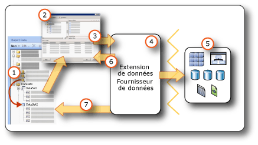

# <a name="report-embedded-datasets-and-shared-datasets-report-builder-and-ssrs"></a>Datasets incorporés dans le rapport et datasets partagés (Générateur de rapports et SSRS)
  Un dataset spécifie les données que vous souhaitez utiliser à partir d'une connexion de données. Un dataset est basé sur une connexion de données enregistrée dans le rapport en tant que source de données incorporée ou référence à une source de données partagée sur un serveur de rapports. Le dataset inclut une requête qui spécifie un ensemble de champs. Lorsque vous faites glisser ces champs vers l'aire de conception, vous créez des expressions qui correspondent aux données effectives lorsque le rapport s'exécute.  
  
 Il existe deux types de datasets :  
  
-   **Dataset partagé.** Un dataset partagé est défini sur le serveur de rapports. Vous pouvez accéder au serveur pour créer un dataset partagé ou sélectionner un dataset prédéfini à ajouter à votre rapport. Utilisez un dataset partagé pour fournir une requête qui peut être utilisée par plusieurs rapports. Les datasets partagés sont stockés sur le serveur de rapports et gérés séparément des rapports ou des sources de données partagées. Par exemple, un administrateur de serveur de rapports peut mettre à jour la requête pour tirer parti de l'indexation améliorée ou d'une autre optimisation des performances des requêtes.  
  
-   **Dataset incorporé.** Un dataset incorporé est uniquement défini dans et utilisé par le rapport dans lequel il est incorporé. Utilisez un dataset incorporé lorsque vous souhaitez obtenir des données d'une source de données externe à utiliser uniquement dans un rapport. Les datasets incorporés sont utiles lorsque vous souhaitez créer une requête qui n'a pas d'autres dépendances et que vous n'avez pas besoin d'utiliser pour plusieurs rapports.  
  
 Un dataset inclut également des paramètres, filtres et options de données qui spécifient des informations de classement, pour le respect de la casse, des caractères de type Kana, de la largeur des caractères et des accents.  
  
   
  
1.  **Datasets dans le volet Données du rapport** Un dataset s'affiche dans le volet Données du rapport une fois que vous avez créé un dataset incorporé ou que vous avez ajouté un dataset partagé. Un dataset repose sur une source de données.  
  
2.  **Concepteur de requêtes** Lorsque vous concevez une requête de dataset, le concepteur de requêtes associé au type de source de données s'ouvre.  
  
3.  **Commande de requête** Le concepteur de requêtes vous aide à générer une commande de requête. La syntaxe de commande est déterminée par le fournisseur de données.  
  
4.  **Extension de données/Fournisseur de données** : la connexion aux données peut s’effectuer via plusieurs couches d’accès aux données.  
  
5.  **Sources de données externes** Récupérez des données à partir de bases de données relationnelles, bases de données multidimensionnelles, listes SharePoint, services Web ou modèles de rapport.  
  
6.  **Résultats de la requête** Vous pouvez exécuter la requête et consulter un exemple de jeu de résultats. Vous devez disposer d'informations d'identification au moment de la conception pour exécuter une requête.  
  
7.  **Métadonnées du schéma** Le fournisseur de données exécute une commande de requête de schéma indépendamment de la requête afin de récupérer des métadonnées pour la collection de champs de dataset. Par exemple, une instruction [!INCLUDE[tsql](../../includes/tsql-md.md)] **SELECT** retourne les noms de colonnes d’une table de base de données. Utilisez le volet Données du rapport pour développer le dataset afin d'afficher la collection de champs de dataset.  
  
 Il est également possible d'inclure des données dans un rapport à l'aide de datasets partagés et de parties de rapports partagées. Ces éléments possèdent déjà les informations de connexion de données dont vous avez besoin. Pour plus d’informations, consultez [Datasets de rapport &#40;SSRS&#41;](../../reporting-services/report-data/report-datasets-ssrs.md) et [Publication de parties de rapports &#40;Générateur de rapports et SSRS&#41;](../../reporting-services/report-design/report-parts-report-builder-and-ssrs.md).  
  
 Pour plus d’informations sur les types de sources de données intégrés et les extensions de données, consultez [Ajouter des données depuis des sources de données externes &#40;SSRS&#41;](../../reporting-services/report-data/add-data-from-external-data-sources-ssrs.md).  
  
> [!NOTE]  
>  [!INCLUDE[ssRBRDDup](../../includes/ssrbrddup-md.md)]  
  
##  <a name="Overview"></a> Fonctionnement des datasets de rapport et des requêtes  
 Un dataset de rapport contient une commande de requête qui s'exécute sur la source de données externe et spécifie les données à récupérer. Pour générer la commande de requête, vous utilisez le concepteur de requêtes associé à l'extension de données pour la source de données externe. Dans le concepteur de requêtes, vous pouvez exécuter la commande de requête et afficher un jeu de résultats. Le jeu de résultats est un ensemble de lignes rectangulaire qui a des noms de colonnes et des lignes avec le même nombre de valeurs dans chaque ligne. Les données hiérarchiques, également appelées *hiérarchies déséquilibrées*, ne sont pas prises en charge. Les noms des colonnes sont enregistrés dans la définition de rapport sous forme de liste de champs de dataset.  
  
 Après avoir ajouté des datasets à votre rapport, vous faites glisser des champs de leurs collections de champs dans le volet Données du rapport vers les tables, graphiques et autres éléments de rapport que vous utilisez pour concevoir le modèle de rapport. Pour plus d’informations sur l’utilisation de champs, consultez [Collection de champs de dataset &#40;Générateur de rapports et SSRS&#41;](../../reporting-services/report-data/dataset-fields-collection-report-builder-and-ssrs.md).  
  
### <a name="understanding-data-from-a-report-dataset"></a>Fonctionnement des données d'un dataset de rapport  
 Selon l'extension de données, un dataset de rapport peut être constitué des types de données suivants :  
  
-   Jeu de résultats provenant d'une base de données relationnelle, qui peut résulter de l'exécution de commandes de base de données, de procédures stockées ou de fonctions définies par l'utilisateur. Si plusieurs jeux de résultats sont extraits par l'intermédiaire d'une requête unique, seul le premier jeu de résultats est traité et tous les autres jeux de résultats sont ignorés. Par exemple, lorsque vous exécutez la requête suivante dans le concepteur de requêtes textuel, seul le jeu de résultats pour `Production.Product` apparaît dans le volet de résultats :  
  
    ```  
    SELECT ProductID FROM Production.Product  
    GO  
    SELECT ContactID FROM Person.Contact  
    ```  
  
-   Ensemble de lignes aplati extrait de sources de données multidimensionnelles qui utilisent le protocole XMLA (XML for Analysis). Certains fournisseurs de données fournissent des propriétés de cellule et de dimension supplémentaires à partir de la source de données qui ne sont pas affichées dans le jeu de résultats, mais qui sont disponibles dans votre rapport.  
  
-   Jeu de résultats aplati extraits de sources de données XML qui incluent des éléments XML, leurs attributs et leurs éléments enfants.  
  
-   Jeu de résultats extrait de tous les fournisseurs de données [!INCLUDE[dnprdnshort](../../includes/dnprdnshort-md.md)] enregistrés et configurés.  
  
-   Données d'un modèle de rapport qui a été conçu pour une source de données spécifique, avec des entités, des relations d'entités et des champs prédéfinis. Pour plus d’informations, consultez « Utilisation de modèles de rapport comme sources de données » dans la [documentation de Reporting Services](http://go.microsoft.com/fwlink/?linkid=121312) , dans la documentation en ligne de SQL Server.  
  
 Lorsque le rapport est traité au moment de l'exécution, le jeu de résultats réel retourné pour une requête peut comporter aucune ou plusieurs lignes. Les colonnes définies dans la requête peuvent également être manquantes dans la source de données. Les valeurs Null de la source de données sont mappées à la valeur [!INCLUDE[dnprdnshort](../../includes/dnprdnshort-md.md)] **System.DBNull.Value**.  
  
 Pour plus d’informations sur l’utilisation de champs de dataset, consultez [Collection de champs de dataset &#40;Générateur de rapports et SSRS&#41;](../../reporting-services/report-data/dataset-fields-collection-report-builder-and-ssrs.md).  
  
### <a name="dataset-query"></a>Requête de dataset  
 Lorsque vous exécutez une requête de dataset dans un concepteur de requêtes lors de la conception, vous voyez s'afficher un ensemble de lignes extrait de la source de données en guise de données d'exemple. Au moment de l'exécution, lorsqu'un utilisateur consulte le rapport, la requête de dataset peut produire des valeurs différentes, car les données sur la source de données ont changé. Chaque fois que le rapport est traité, de nouvelles données peuvent apparaître.  
  
 Lorsque vous définissez chaque dataset, le Générateur de rapports ouvre le concepteur de requêtes qui correspond au type de source de données pour vous aider à concevoir des requêtes. Par exemple, pour définir une requête pour des données d'une base de données relationnelle SQL Server, les Assistants Tableau, Matrice, Graphique et Carte ouvrent une simple interface graphique qui vous aide à générer la requête ; vous n'avez plus qu'à sélectionner les champs souhaités dans votre dataset.  
  
 Dans un concepteur de requêtes, vous pouvez effectuer les tâches suivantes :  
  
-   Basculer entre l'affichage des requêtes graphique et textuel. Utilisez l'affichage graphique pour explorer des schémas, tables, vues et procédures stockées sur la source de données. Utilisez l'affichage textuel pour taper, coller ou visualiser une requête existante, utilisée en général pour une requête complexe qui ne peut pas être affichée dans un concepteur de requêtes graphique. Par exemple, vous pouvez importer une requête à partir d'un fichier [!INCLUDE[tsql](../../includes/tsql-md.md)] (.sql), un rapport différent sur le serveur de rapports ou un fichier de définition de rapport (.rdl) à partir d'un partage de fichiers.  
  
-   Exécuter la requête pour afficher les données. La requête retourne un jeu de résultats. Les colonnes dans le jeu de résultats deviennent la collection de champs pour le dataset. Les lignes dans le résultat deviennent les données pour le dataset. Vous pouvez modifier la requête jusqu'à ce que vous obteniez les colonnes escomptées.  
  
-   Ajouter des paramètres de requête pour récupérer les données à inclure dans votre rapport. Les paramètres de requête génèrent automatiquement des paramètres de rapport correspondants. Pour une source de données de modèle de rapport, le filtre que vous spécifiez génère automatiquement un paramètre de rapport correspondant. Les paramètres de rapport permettent aux utilisateurs de spécifier les données de rapport qu'ils souhaitent afficher lors de l'exécution du rapport. Par exemple, l'utilisateur sélectionne les catégories de produits pour lesquelles il souhaite des données et, lors de l'exécution du rapport, seules les données pour ces catégories de produits s'affichent dans le rapport.  
  
-   Importer une requête existante à partir d'un autre rapport.  
  
 Les concepteurs de requêtes peuvent fournir un mode graphique ou un mode texte selon le type de source de données. Si vous choisissez le mode texte, vous devez utiliser la syntaxe de requête appropriée pour la source de données.  
  
 Lorsque vous définissez un dataset de rapport, vous pouvez définir des propriétés de données dans la requête ou accepter les paramètres par défaut définis par le fournisseur de données. Pour modifier un type de données, vous pouvez utiliser l'une des méthodes suivantes :  
  
-   Réécrivez la requête de dataset pour convertir spécifiquement un champ en un type de données différent.  
  
-   Modifiez le champ dans le dataset et fournissez un format personnalisé.  
  
-   Créez un champ personnalisé en fonction d'un champ de base de données et fournissez un format personnalisé.  
  
 Pour plus d’informations, consultez [Collection de champs de dataset &#40;Générateur de rapports et SSRS&#41;](../../reporting-services/report-data/dataset-fields-collection-report-builder-and-ssrs.md).  
  
### <a name="importing-existing-queries-for-a-dataset"></a>Importation de requêtes existantes pour un dataset  
 Lorsque vous créez un dataset, vous pouvez créer une requête ou vous pouvez importer une requête existante à partir d'un fichier ou d'un autre rapport. Lorsque vous importez une requête à partir d'un autre rapport, vous pouvez choisir la requête à importer de la liste des datasets du rapport.  
  
 Seuls les types de fichiers .sql et .rdl sont pris en charge. Les requêtes MDX (Multidimensional Expression) et DMX (Data Mining Prediction) ainsi que les requêtes de modèle (SMQL) peuvent uniquement être générées par le concepteur de requêtes associé.  
  
##  <a name="Compare"></a> Comparaison et création de datasets partagés et datasets incorporés  
 Un dataset incorporé est défini dans un rapport ou dans une partie de rapport publiée. Les modifications apportées à un dataset incorporé affectent uniquement ce rapport ou cette partie de rapport.  
  
 Un dataset partagé est défini sur un serveur de rapports ou site SharePoint, est basé sur une source de données partagée et peut être utilisé par plusieurs rapports et parties de rapport. Les modifications apportées à une définition de dataset partagé affectent tous les rapports et toutes les parties de rapport qui l'utilisent.  
  
 Lorsque vous ajoutez un dataset partagé à un rapport, la collection de champs de dataset est mise à jour vers la définition actuelle sur le serveur de rapports. Vous ne recevez pas de notifications de mise à jour lorsque des modifications sont effectuées sur le serveur de rapports. Pour synchroniser une copie locale de la collection de champs avec les modifications apportées à la définition de dataset partagé sur le serveur de rapports, vous devez actualiser la collection de champs locale. Pour plus d’informations, consultez [Ajouter, modifier ou actualiser des champs dans le volet des données de rapport &#40;Générateur de rapports et SSRS&#41;](../../reporting-services/report-data/add-edit-refresh-fields-in-the-report-data-pane-report-builder-and-ssrs.md).  
  
 Les éléments de rapport publiés contiennent les datasets incorporés et partagés desquels ils dépendent. Pour plus d’informations, consultez [Parties de rapports et datasets dans le Générateur de rapports](../../reporting-services/report-data/report-parts-and-datasets-in-report-builder.md).  
  
 La différence entre les deux sources de données réside dans leur mode de création, de stockage et de gestion. Le tableau suivant indique les différences entre les sources de données incorporées et partagées :  
  
|Description|Source de données<br /><br /> Source de données|Partagés<br /><br /> Data Source|  
|-----------------|------------------------------|----------------------------|  
|La connexion de données est incorporée dans la définition de rapport.|||  
|Le pointeur vers la connexion de données sur le serveur de rapports est incorporé dans la définition de rapport.|||  
|Gestion sur le serveur de rapports|||  
|Obligatoire pour les datasets partagés|||  
|Obligatoire pour les composants|||  
  
 Dans le Concepteur de rapports, vous pouvez créer des datasets partagés dans le cadre d'un projet de rapport, et contrôler s'il convient de les déployer sur un serveur de rapports. Vous ne pouvez pas rechercher et sélectionner un dataset partagé sur un serveur de rapports, et l'ajouter à votre rapport.  
  
 Dans le Générateur de rapports, vous pouvez effectuer les actions suivantes :  
  
-   Pour créer un dataset partagé, utilisez le mode création de dataset partagé. Vous pouvez l'enregistrer sur un serveur de rapports ou un site SharePoint pour le partager avec d'autres rapports. Vous pouvez également accéder au serveur de rapports et modifier tout dataset partagé existant. Dans ce mode, vous pouvez créer une requête et définir toutes les options de dataset. Pour plus d’informations, consultez [Mode création de dataset partagé &#40;Générateur de rapports&#41;](../../reporting-services/report-builder/shared-dataset-design-view-report-builder.md).  
  
-   Pour ajouter un dataset partagé à votre rapport, ouvrez le Générateur de rapports en mode création de rapport. Depuis un Assistant ou le volet Données du rapport, accédez au serveur de rapports et sélectionnez le dataset partagé à ajouter à votre rapport. Dans ce mode, vous ne pouvez pas modifier la requête sauf pour ajouter des champs. Vous pouvez remplacer d'autres options de données et ajouter des filtres. Vous ne pouvez pas supprimer de filtres.  
  
 Le tableau suivant compare les propriétés qui peuvent être configurées pour la définition du dataset partagé sur le serveur de rapports et l'instance du dataset partagé dans la définition de rapport.  
  
|Propriété|Remarques sur la configuration pour la définition|Remarques sur la configuration pour l'instance|  
|--------------|--------------------------------------------|------------------------------------------|  
|Texte de la requête|Configurez la requête, notamment définissez-la en tant qu'expression.|Impossible de modifier la requête.|  
|Paramètres de requête|Impossible de référencer des paramètres de rapport<br /><br /> Inclut des valeurs par défaut<br /><br /> Inclut un indicateur en lecture seule|Configurez les paramètres qui ne sont pas marqués en lecture seule dans la définition|  
|Filtres|Définir les filtres|Impossible d'afficher ou modifier des filtres de dataset qui font partie de la définition<br /><br /> Possibilité de créer des filtres supplémentaires|  
|Source de données|Doit être une source de données partagée|Impossible de modifier la source de données partagée|  
|Champs|Champs de la commande de requête<br /><br /> Les champs calculés ne font pas partie de la définition de dataset|Possibilité de consulter les champs, mais pas de les modifier<br /><br /> La collection de champs est statique selon la requête au moment où vous avez ajouté le dataset partagé au rapport. Pour mettre à jour, cliquez sur **Actualiser les champs** dans la boîte de dialogue **Propriétés du dataset** . La collection de champs réelle est tout élément retourné par la requête actuelle dans la définition.<br /><br /> Ajouter des champs calculés|  
|Dataset|Options de données telles que le respect de la casse|Remplacer des options de données dans l'instance|  
  
 Pour plus d’informations sur la création de datasets, consultez [Créer un dataset partagé ou incorporé &#40;Générateur de rapports et SSRS&#41;](../../reporting-services/report-data/create-a-shared-dataset-or-embedded-dataset-report-builder-and-ssrs.md) et [Outils Reporting Services](../../reporting-services/tools/reporting-services-tools.md) dans la [documentation de Reporting Services](http://go.microsoft.com/fwlink/?linkid=121312), dans la documentation en ligne de SQL Server.  
  
##  <a name="SortGroupFilter"></a> Tri, regroupement et filtrage des données dans un dataset  
 Les données dans un dataset proviennent de l'exécution d'une commande de requête sur une source de données externe. La syntaxe de commande de requête pour une extension de données détermine si les données peuvent être triées ou regroupées. Le tri et le regroupement ont lieu dans la requête avant que les données ne soient récupérées pour un rapport. Le filtrage se déroule une fois que les données ont été récupérées pour un rapport.  
  
 Pour plus d’informations, consultez [Filtrer, regrouper et trier des données &#40;Générateur de rapports et SSRS&#41;](../../reporting-services/report-design/filter-group-and-sort-data-report-builder-and-ssrs.md).  
  
### <a name="filtering-data-in-a-dataset"></a>Filtrage de données dans un dataset  
 Les filtres font partie de la définition de dataset dans un rapport. Utilisez les filtres de dataset pour spécifier les données d'un dataset à inclure dans un rapport. Lorsque vous spécifiez des filtres sur un dataset, toutes les régions de données basées sur le dataset affichent uniquement les données qui traversent les filtres de dataset.  
  
 Les filtres font partie de la définition d'un dataset partagé. Les filtres de dataset partagé affectent tous les rapports qui incluent le dataset partagé. Après avoir ajouté un dataset partagé à votre rapport, ou après avoir ajouté un composant avec un dataset partagé dépendant, vous pouvez créer des filtres de dataset supplémentaires. Les filtres que vous créez sont utilisés uniquement dans votre rapport et ne font pas partie de la définition de dataset partagé sur le serveur de rapports.  
  
 Vous pouvez définir des filtres supplémentaires sur une région de données ou un groupe de régions de données. Vous pouvez également utiliser une combinaison de paramètres et de filtres pour permettre aux utilisateurs de choisir les données qu'ils souhaitent voir dans un rapport. Pour plus d'informations, consultez [Paramètres de rapport &#40;Générateur de rapports et Concepteur de rapports&#41;](../../reporting-services/report-design/report-parameters-report-builder-and-report-designer.md).  
  
### <a name="sorting-data-in-a-dataset"></a>Tri des données dans un dataset  
 Dans un dataset, l'ordre des données est celui dans lequel elles sont récupérées de la source de données externe. Il s'agit du même ordre que celui que vous voyez quand vous exécutez la requête dans le concepteur de requêtes. Si la syntaxe de commande de requête prend en charge le tri, vous pouvez modifier la requête pour trier les données à la source, avant qu'elles ne soient retournées comme données de rapport. Par exemple, pour une requête [!INCLUDE[tsql](../../includes/tsql-md.md)] , l'instruction ORDER BY contrôle l'ordre de tri.  
  
 Pour trier les données après qu'elles ont été retournées au rapport, définissez des expressions de tri sur les régions de données et les groupes de régions de données. Pour plus d’informations, consultez la rubrique relative au type spécifique de région de données, par exemple [Tables, matrices et listes &#40;Générateur de rapports et SSRS&#41;](../../reporting-services/report-design/tables-matrices-and-lists-report-builder-and-ssrs.md).  
  
 Vous pouvez également utiliser une combinaison de paramètres et d'expressions de tri pour permettre aux utilisateurs de choisir l'ordre de tri pour les données dans un rapport. Pour plus d'informations, consultez [Paramètres de rapport &#40;Générateur de rapports et Concepteur de rapports&#41;](../../reporting-services/report-design/report-parameters-report-builder-and-report-designer.md).  
  
### <a name="grouping-data-in-a-dataset"></a>Regroupement de données dans un dataset  
 Vous ne pouvez pas regrouper de données dans un dataset. Pour agréger des données dans un dataset, vous pouvez modifier la commande de requête pour calculer des agrégats avant que les données ne soient récupérées pour un rapport. Elles sont connues sous le nom d' *agrégats de serveur*. Dans les expressions, pour identifier ces valeurs comme agrégats calculés à l'avance, utilisez la fonction Aggregate. Pour plus d’informations, consultez [Fonction d’agrégation &#40;Générateur de rapports et SSRS&#41;](../../reporting-services/report-design/report-builder-functions-aggregate-function.md).  
  
##  <a name="Parameters"></a> Utilisation de paramètres et de datasets  
 Pour une requête de dataset incorporé qui comprend des variables de requête, des paramètres de requête et paramètres de rapport correspondants sont créés automatiquement. Lors de l'exécution du rapport, la valeur du paramètre de rapport est liée au paramètre de requête du dataset. De cette façon, la commande de requête qui s'exécute sur la source de données externe inclut les valeurs spécifiées pour les paramètres de rapport. Les paramètres de rapport permettent à un utilisateur de choisir les données qu'il souhaite voir dans le rapport. Vous pouvez voir la manière dont les paramètres de requête et les paramètres de rapport sont liés dans la page [Boîte de dialogue Propriétés du dataset, Paramètres &#40;Générateur de rapports&#41;](http://msdn.microsoft.com/library/3a0672ad-c969-455b-b952-585164ce1dda).  
  
 Pour un dataset partagé, les paramètres de requête font partie de la définition de dataset partagé qui peut être gérée sur le serveur de rapports indépendamment d'un rapport. La liste suivante décrit la prise en charge des valeurs de paramètres de requête :  
  
-   Peut être basé sur une expression.  
  
-   Peut inclure des valeurs par défaut.  
  
-   Peut être en lecture seule. Les paramètres en lecture seule ne peuvent pas être modifiés dans une instance du dataset partagé dans un rapport.  
  
-   Ne peut pas inclure de références à la collection intégrée Parameters, qui représente des paramètres de rapport.  
  
 Pour configurer des valeurs de paramètres de requête pour un dataset partagé, en mode Création de dataset, recherchez et ouvrez un dataset partagé du serveur de rapports et définissez des options dans la page [Boîte de dialogue Propriétés du dataset, Paramètres &#40;Générateur de rapports&#41;](http://msdn.microsoft.com/library/3a0672ad-c969-455b-b952-585164ce1dda). Pour plus d’informations, consultez [Créer un dataset partagé ou incorporé &#40;Générateur de rapports et SSRS&#41;](../../reporting-services/report-data/create-a-shared-dataset-or-embedded-dataset-report-builder-and-ssrs.md).  
  
 Pour certaines sources de données multidimensionnelles, telles que [!INCLUDE[ssASnoversion](../../includes/ssasnoversion-md.md)], le concepteur de requêtes graphique vous permet de spécifier des filtres de requête et de sélectionner une option pour créer un paramètre de requête correspondant. Lorsque vous sélectionnez l'option de paramètre, l'extension de données crée automatiquement un dataset de rapport séparé afin de fournir des valeurs disponibles pour une liste déroulante pour ce paramètre. Par défaut, ces datasets masqués n'apparaissent pas dans le volet Données du rapport.  
  
 Les paramètres de rapport liés aux paramètres de requête permettent de filtrer les données avant qu'elles ne soient retournées de la source de données externe. Vous pouvez également filtrer les données dans le rapport en créant des filtres qui font partie de la définition de rapport. Pour plus d’informations, consultez [Filtrer, regrouper et trier des données &#40;Générateur de rapports et SSRS&#41;](../../reporting-services/report-design/filter-group-and-sort-data-report-builder-and-ssrs.md).  
  
### <a name="displaying-hidden-datasets"></a>Affichage des datasets masqués  
 Lorsque vous créez une requête paramétrable pour plusieurs sources de données multidimensionnelles, des datasets qui fournissent des valeurs valides pour le paramètre sont automatiquement créés. Sur certains concepteurs de requêtes, vous effectuez cette opération en spécifiant des filtres, puis en sélectionnant l'option pour créer des paramètres. Par défaut, ces datasets n'apparaissent pas dans le volet Données du rapport, mais ils peuvent être affichés. Pour plus d’informations, consultez [Afficher des datasets masqués pour les valeurs de paramètres des données multidimensionnelles &#40;Générateur de rapports et SSRS&#41;](../../reporting-services/report-data/show-hidden-datasets-for-parameter-values-multidimensional-data.md).  
  
##  <a name="Maps"></a> Utilisation de cartes et de datasets  
 Si vous incluez une carte dans votre rapport, vous devez fournir des données spatiales. Les données spatiales peuvent provenir d'un dataset de rapport, d'une carte de la bibliothèque de cartes ou de fichiers de forme ESRI. Les données spatiales d'un rapport ou d'un fichier de forme ESRI ne s'affichent pas comme un dataset dans le volet Données du rapport. Pour plus d’informations, consultez [Cartes &#40;Générateur de rapports et SSRS&#41;](../../reporting-services/report-design/maps-report-builder-and-ssrs.md).  
  
##  <a name="Multiple"></a> Affichage de données de plusieurs datasets  
 Un rapport comporte généralement plusieurs datasets. La liste suivante décrit la manière dont vous pouvez utiliser les datasets dans un rapport :  
  
-   Vous affichez les données provenant de chaque dataset à l'aide d'une région de données distincte. Pour plus d’informations, consultez [Régions de données et cartes &#40;Générateur de rapports et SSRS&#41;](../../reporting-services/report-design/data-regions-and-maps-report-builder-and-ssrs.md).  
  
-   Vous pouvez lier plusieurs régions de données à un dataset et fournir plusieurs vues des mêmes données. Pour plus d’informations, consultez [Liaison de plusieurs régions de données à un même dataset &#40;Générateur de rapports et SSRS&#41;](../../reporting-services/report-design/linking-multiple-data-regions-to-the-same-dataset-report-builder-and-ssrs.md).  
  
-   Vous pouvez utiliser des datasets pour fournir une liste déroulante des valeurs disponibles et des valeurs par défaut pour un paramètre de rapport. Pour plus d'informations, consultez [Paramètres de rapport &#40;Générateur de rapports et Concepteur de rapports&#41;](../../reporting-services/report-design/report-parameters-report-builder-and-report-designer.md).  
  
-   À l'aide de paramètres, vous pouvez associer des données liées provenant de plusieurs datasets à des rapports ou des sous-rapports d'extraction. Par exemple, un état des ventes peut afficher les données de synthèse pour tous les magasins et un lien d'extraction peut spécifier l'identificateur de magasin en tant que paramètre à un rapport avec une requête de dataset qui extrait les ventes individuelles pour le magasin spécifié. Pour plus d’informations, consultez [Extraction, exploration, sous-rapports et régions de données imbriquées &#40;Générateur de rapports et SSRS&#41;](../../reporting-services/report-design/drillthrough-drilldown-subreports-and-nested-data-regions.md) et [Sous-rapports &#40;Générateur de rapports et SSRS&#41;](../../reporting-services/report-design/subreports-report-builder-and-ssrs.md).  
  
-   Vous ne pouvez pas afficher de données de détail provenant de plusieurs datasets dans une région de données unique. Toutefois, vous pouvez afficher des valeurs de fonction d'agrégation ou de fonction intégrée pour plusieurs datasets dans une région de données. Pour plus d’informations, consultez [Informations de référence sur les fonctions d’agrégation &#40;Générateur de rapports et SSRS&#41;](../../reporting-services/report-design/report-builder-functions-aggregate-functions-reference.md). Si vous devez combiner les données de détail de plusieurs datasets en une région de données unique, vous devez réécrire votre requête pour extraire les données sous la forme d'un dataset unique.  
  
##  <a name="NoRows"></a> Affichage d'un message lorsque aucune ligne de données n'est disponible  
 Durant le traitement du rapport, lorsque la requête pour un dataset s'exécute, le jeu de résultats peut ne contenir aucune ligne. Dans le rapport rendu, une région de données liée à un dataset vide s'affiche comme une région de données vide. Vous pouvez spécifier le texte à afficher à la place de la région de données vide dans le rapport rendu. Vous pouvez également spécifier un message pour les sous-rapports lorsque les requêtes pour tous les datasets ne produisent aucune donnée lors de l'exécution. Pour plus d’informations, consultez [Définir un message d’absence de données pour une région de données &#40;Générateur de rapports et SSRS&#41;](../../reporting-services/report-data/set-a-no-data-message-for-a-data-region-report-builder-and-ssrs.md).  
  
##  <a name="Options"></a> Définition des options de dataset  
 Pour les sources de données qui prennent en charge des données internationales, vous devrez éventuellement modifier les propriétés d'un dataset qui affectent l'ordre de tri, les propriétés des caractères internationaux et le respect de la casse. Ces propriétés incluent : casse, jeu de caractères Kana, largeur, accent et classement. Pour plus d'informations, consultez « Considérations relatives à la prise en charge internationale des bases de données et des applications de moteur de base de données » et « Utilisation des classements » dans la [documentation en ligne de SQL Server](http://go.microsoft.com/fwlink/?linkid=98335). Pour plus d’informations sur la façon de définir ces propriétés, consultez [Boîte de dialogue Propriétés du dataset, Options &#40;Générateur de rapports&#41;](../../reporting-services/report-data/dataset-properties-dialog-box-options-report-builder.md).  
  
## <a name="see-also"></a> Voir aussi  
 [Collection de champs de dataset &#40;Générateur de rapports et SSRS&#41;](../../reporting-services/report-data/dataset-fields-collection-report-builder-and-ssrs.md)   
 [Connexions de données, sources de données et chaînes de connexion dans le Générateur de rapports](http://msdn.microsoft.com/library/7e103637-4371-43d7-821c-d269c2cc1b34)   
 [Datasets de rapport &#40;SSRS&#41;](../../reporting-services/report-data/report-datasets-ssrs.md)  
  
  
