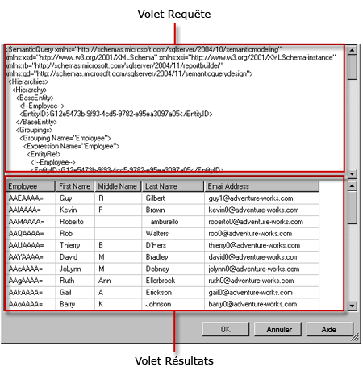

# Interface utilisateur du concepteur de requêtes de modèle de rapport
  Le Concepteur de rapports fournit deux Concepteurs de requêtes pour vous aider à spécifier les données d'une source de données de modèle de serveur de rapports à utiliser dans un rapport. Utilisez le concepteur de requêtes graphique pour explorer et choisir les entités de modèle et les champs d'entité. Utilisez le Concepteur de requêtes textuel pour travailler directement avec une spécification SMDL (Semantic Model Definition Language) au format XML.  
  
> [!IMPORTANT]  
>  Les utilisateurs accèdent aux sources de données lorsqu'ils créent et exécutent des requêtes. Vous devez accorder des autorisations minimales sur les sources de données, telles que des autorisations en lecture seule.  
  
## Concepteur de requêtes graphique  
 Le Concepteur de rapports fournit un Concepteur de requêtes graphique que vous pouvez utiliser pour concevoir et exécuter des requêtes SMDL qui, au cours du traitement de rapport, peuplent la collection de champs d'un dataset de rapport. Le concepteur de requêtes graphique est divisé en trois zones ou volets.  
  
 L'illustration suivante présente chaque volet.  
  
   
  
 Le tableau ci-dessous décrit la fonction de chaque volet.  
  
|Volet|Fonction|  
|----------|--------------|  
|Volet Explorateur|Affiche des représentations graphiques des entités et des champs d'entité dans le modèle. Utilisez ce volet pour explorer des entités, les entités associées ainsi que des champs.|  
|Zone de conception|Affiche une liste des champs du modèle. Utilisez ce volet pour organiser la disposition des champs sélectionnés.|  
|Results pane|Affiche les résultats de la requête. Pour exécuter la requête, avec le bouton droit dans un volet, puis cliquez sur **exécuter**, ou cliquez sur le **exécuter** () dans la barre d’outils.|  
  
 Les modifications apportées aux informations dans les volets Explorateur ou Zone de conception sont répercutées dans le volet Résultat quand vous cliquez sur **Exécuter**.  
  
 Pour effectuer des actions dans un volet précis (par exemple, supprimer une colonne de la zone de conception), cliquez avec le bouton droit dans la colonne, puis cliquez sur la commande souhaitée dans le menu.  
  
### Barre d'outils du concepteur de requêtes graphique  
 Vous pouvez également utiliser les boutons de la barre d'outils lors de la conception d'une requête. Le tableau suivant décrit les boutons de la barre d'outils et leurs fonctions.  
  
|Bouton|Description|  
|------------|-----------------|  
|**Modifier en tant que texte**|Bascule entre le Concepteur de requêtes textuel et le concepteur de requêtes graphique. La requête pour une source de données modèle de Serveur de rapports est une spécification SMQL (Semantic Model Query Language) en XML.|  
|**Importer**|Importe une requête existante à partir d'un fichier de définition de rapport (.rdl) sur le système de fichiers. Pour plus d’informations, consultez [Datasets incorporés dans le rapport et datasets partagés &#40;Générateur de rapports et SSRS&#41;](../../reporting-services/report-data/report-embedded-datasets-and-shared-datasets-report-builder-and-ssrs.md).|  
||Annule la dernière action.|  
||Rétablit la dernière action.|  
||Exécute la requête et affiche les résultats dans le volet Résultat.|  
||Ouvre la boîte de dialogue **Filtrer les données** qui permet de spécifier les données à filtrer. Vous pouvez spécifier des filtres indépendamment des données actuelles de la zone de conception.|  
  
## Concepteur de requêtes textuel  
 Lorsque vous créez un dataset de modèle de serveur de rapports, le concepteur de requêtes graphique est proposé par défaut. Pour basculer vers le concepteur de requêtes textuel, cliquez sur le bouton bascule **Modifier en tant que texte** dans la barre d’outils.  
  
 Le Concepteur de requêtes textuel est composé de deux volets : un volet de requête SMQL et un volet de résultats. Cette vue du Concepteur de requêtes est particulièrement utile si vous disposez déjà d'une spécification de requête SMQL provenant d'une autre source et que vous souhaitez la coller dans le volet de requête. Contrairement au concepteur de requêtes graphique, le Concepteur de requêtes textuel ne restructure pas les requêtes et n'en vérifie pas la syntaxe. Quand vous cliquez sur **Exécuter** dans la barre d’outils, la requête s’exécute sur la source de données et les résultats s’affichent dans le volet Résultat.  
  
 L'illustration suivante présente chaque volet.  
  
   
  
 Le tableau ci-dessous décrit la fonction de chaque volet.  
  
|Volet|Fonction|  
|----------|--------------|  
|Volet Requête|Affiche le texte de la spécification SMQL.|  
|Volet Résultat|Affiche les résultats de la requête. Pour exécuter la requête, cliquez avec le bouton droit dans un volet et cliquez sur **Exécuter**, ou cliquez sur le bouton **Exécuter** dans la barre d’outils.|  
  
### Barre d'outils du Concepteur de requêtes textuel  
 Vous pouvez également utiliser les boutons de la barre d'outils lors de la conception d'une requête. Le tableau suivant décrit les boutons de la barre d'outils et leurs fonctions.  
  
|Bouton|Description|  
|------------|-----------------|  
|**Modifier en tant que texte**|Bascule entre le Concepteur de requêtes textuel et le concepteur de requêtes graphique.|  
|**Importer**|Importe une requête à partir d'un rapport existant.|  
||Exécute le texte de la requête et affiche les résultats dans le volet Résultat.|  
  
## Voir aussi  
 [Outils de création de requêtes &#40;SSRS&#41;](../../reporting-services/report-data/query-design-tools-ssrs.md)   
 [Ajouter des données à partir de sources de données externes &#40;SSRS&#41;](../../reporting-services/report-data/add-data-from-external-data-sources-ssrs.md)   
 [Connexion à un modèle de rapport &#40;SSRS&#41;](../../reporting-services/report-data/report-model-connection-ssrs.md)   
 [Fichier de configuration RSReportDesigner](../../reporting-services/report-server/rsreportdesigner-configuration-file.md)  
  
  
