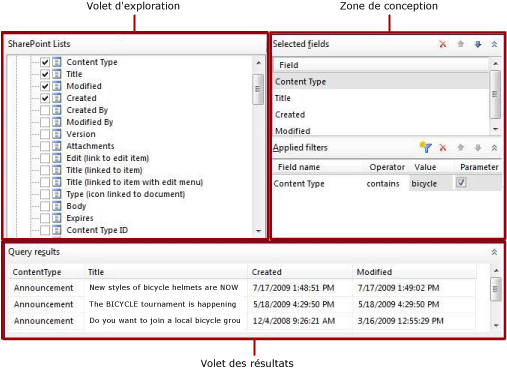

# Concepteur de requêtes de liste SharePoint (Générateur de rapports)
  Le Générateur de rapports et le Concepteur de rapports fournissent un concepteur de requêtes graphique et un concepteur de requêtes textuel, qui vous aident à créer une requête spécifiant les données à récupérer à partir d’un site SharePoint pour un jeu de données de rapport. Utilisez le Concepteur de requêtes graphique pour explorer les métadonnées de liste SharePoint, créer une requête de manière interactive et afficher les résultats de votre requête. Utilisez le Concepteur de requêtes textuel pour afficher la requête créée par le Concepteur de requêtes graphique, modifier une requête ou taper les commandes d'une requête. Vous pouvez également importer une requête existante à partir d'un fichier ou d'un rapport.  
  
> [!IMPORTANT]  
>  Les utilisateurs accèdent aux sources de données lorsqu'ils créent et exécutent des requêtes. Vous devez accorder des autorisations minimales sur les sources de données, telles que des autorisations en lecture seule.  
  
## Concepteur de requêtes graphique  
 Dans le concepteur de requêtes graphique, vous pouvez explorer le site SharePoint et générer de manière interactive la commande qui récupère des données de liste SharePoint pour un dataset. Vous choisissez les champs à inclure dans le dataset et spécifiez éventuellement les filtres qui limitent les données dans le dataset. Vous pouvez spécifier que les filtres soient utilisés comme paramètres et fournir la valeur du filtre au moment de l'exécution.  
  
 Les listes SharePoint incluent un grand nombre de champs spécifiques à SharePoint qu'il n'est pas nécessairement utile d'inclure dans les rapports. Le concepteur de requêtes fournit une option permettant de masquer ces champs pour déterminer plus facilement et plus rapidement les champs à utiliser.  
  
 Le Concepteur de requêtes graphique est divisé en trois zones.  
  
-   Volet d'exploration dans lequel vous sélectionnez les éléments de liste et leurs champs à utiliser.  
  
-   Zone de conception dans laquelle vous générez la requête.  
  
-   Volet des résultats dans lequel vous consultez les résultats de la requête.  
  
 La figure suivante illustre le Concepteur de requêtes graphique lorsqu'il est utilisé avec des listes SharePoint.  
  
   
  
 Le tableau ci-dessous décrit la fonction de chaque volet.  
  
 [Listes SharePoint](#DatabaseView)  
 Affiche les listes SharePoint et les champs dans chaque élément de la liste.  
  
 [Champs sélectionnés](#SelectedFields)  
 Affiche la liste des noms de champ de listes SharePoint à partir des éléments sélectionnés dans le volet Listes SharePoint. Ces champs deviennent la collection de champs pour le dataset de rapport.  
  
 [Filtres appliqués](#AppliedFilters)  
 Affiche une liste des champs et des critères de filtre pour les tables ou vues dans le volet Vue de base de données.  
  
 [Résultats de la requête](#QueryResults)  
 Affiche des exemples de données pour le jeu de résultats de la requête générée automatiquement.  
  
###   Volet Listes SharePoint  
 Le volet Listes SharePoint affiche les métadonnées des objets de base de données que vous êtes autorisés à afficher, selon la connexion à la source de données et les informations d'identification. La vue hiérarchique affiche les objets de base de données organisés par le schéma de base de données. Développez le nœud de chaque schéma pour afficher les tables, les vues, les procédures stockées et les fonctions table. Développez une table ou une vue pour afficher les colonnes.  
  
###   Volet Champs sélectionnés  
 Le volet Champs sélectionnés affiche les champs des éléments de liste que vous sélectionnez pour les éléments de liste SharePoint. Les champs qui sont affichés dans ce volet deviennent la collection de champs du dataset de rapport. Après avoir créé un dataset et une requête, utilisez le volet des données de rapportpour afficher la collection de champs d'un dataset de rapport. Ces champs représentent les données que vous pouvez afficher dans les tables, graphiques et autres éléments de rapport lorsque vous examinez un rapport.  
  
 Pour ajouter des champs à ce volet ou en supprimer, activez ou désactivez les cases à cocher en regard des champs de table ou de vue dans le volet Vue de base de données.  
  
###   Volet Filtres appliqués  
 Le volet Filtres appliqués affiche les critères utilisés pour limiter le nombre de lignes de données qui sont récupérées au moment de l'exécution. Les critères spécifiés dans ce volet sont utilisés pour générer une clause WHERE [!INCLUDE[tsql](../../includes/tsql-md.md)] . Lorsque vous sélectionnez l'option de paramètre, un paramètre de rapport est automatiquement créé. Les paramètres de rapport basés sur des paramètres de requête permettent à un utilisateur de spécifier des valeurs pour la requête afin de contrôler les données dans le rapport.  
  
 Les colonnes suivantes sont affichées :  
  
-   **Nom du champ** Affiche le nom du champ auquel appliquer les critères.  
  
-   **Opérateur** Affiche l’opération à utiliser dans l’expression de filtre.  
  
-   **Valeur** Affiche la valeur à utiliser dans l'expression de filtrage.  
  
-   **Paramètre** Affiche l'option pour ajouter un paramètre de requête à la requête. Utilisez les propriétés de dataset pour afficher la relation entre le paramètre de requête et le paramètre de rapport.  
  
###   Volet Résultats de la requête  
 Le volet Résultats de la requête affiche les résultats pour la requête générée automatiquement qui est spécifiée par des sélections dans d'autres volets. Les colonnes dans le jeu de résultats sont les champs que vous spécifiez dans le volet Champs sélectionnés et les données de ligne sont limitées par les filtres que vous spécifiez dans le volet Filtres appliqués.  
  
 Ces données représentent les valeurs de la source de données au moment de l'exécution de la requête. Les données ne sont pas enregistrées dans la définition du rapport. Les données réelles dans le rapport sont récupérées lors du traitement du rapport.  
  
 L'ordre de tri dans le jeu de résultats est déterminé par l'ordre dans lequel les données sont récupérées à partir de la source de données. Vous pouvez modifier l'ordre de tri en modifiant la requête ou une fois les données récupérées du rapport.  
  
### Barre d'outils du concepteur de requêtes graphique  
 La barre d'outils du concepteur de requêtes relationnelles fournit les boutons suivants pour vous permettre de spécifier ou d'afficher les résultats d'une requête.  
  
|Bouton|Description|  
|------------|-----------------|  
|**Modifier en tant que texte**|Bascule vers le Concepteur de requêtes textuel pour afficher la requête automatiquement générée ou pour modifier la requête.|  
|**Importer**|Importe une requête existante à partir d'un fichier ou d'un rapport. Les types de fichiers .sql et .rdl sont pris en charge.|  
|**Exécuter la requête**|Exécute la requête. Le volet Résultats de la requête affiche le jeu de résultats.|  
|**Afficher les champs masqués**|Bascule pour afficher ou masquer les champs générés automatiquement par SharePoint, tels que les éléments de lien ProgId et Level SharePoint, mais qui ne sont généralement pas utilisés dans les rapports. Le masquage de ces champs rend la liste de champs plus courte et plus facile à utiliser.|  
  
##  Voir aussi  
 [Concepteurs de requêtes &#40;Générateur de rapports&#41;](http://msdn.microsoft.com/library/553f0d4e-8b1d-4148-9321-8b41a1e8e1b9)  
  
  
