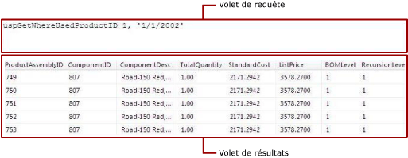

# Interface utilisateur du Concepteur de requ&#234;tes textuel (G&#233;n&#233;rateur de rapports)
  Utilisez le Concepteur de requêtes textuel pour spécifier une requête à l'aide du langage de requête pris en charge par la source de données, exécuter la requête et afficher les résultats au moment de la conception. Vous pouvez spécifier plusieurs instructions [!INCLUDE[tsql](../../includes/tsql-md.md)] , une syntaxe de requête ou de commande pour les extensions pour le traitement des données personnalisées et des requêtes spécifiées en tant qu'expressions. Comme le Concepteur de requêtes textuel n'effectue pas de prétraitement de la requête et peut accepter tout type de syntaxe de requête, il s'agit de l'outil du Concepteur de requêtes par défaut pour de nombreux types de sources de données.  
  
> [!IMPORTANT]  
>  Les utilisateurs accèdent aux sources de données lorsqu'ils créent et exécutent des requêtes. Vous devez accorder des autorisations minimales sur les sources de données, telles que des autorisations en lecture seule.  
  
 Le Concepteur de requêtes textuel affiche une barre d'outils et les deux volets suivants :  
  
-   **Requête** Affiche le texte de la requête, le nom de la table ou celui de la procédure stockée, en fonction du type de requête. Les types de requêtes ne sont pas tous disponibles pour tous les types de sources. Par exemple, le nom de table n'est pris en charge que pour le type de source de données OLE DB.  
  
-   **Résultats** Affiche les résultats de l'exécution de la requête au moment de la conception.  
  
## Barre d'outils du Concepteur de requêtes textuel  
 Le Concepteur de requêtes textuel fournit une barre d'outils unique pour tous les types de commandes. Le tableau suivant répertorie chaque bouton de la barre d'outils et décrit sa fonction.  
  
|Bouton|Description|  
|------------|-----------------|  
|**Modifier en tant que texte**|Bascule entre le Concepteur de requêtes textuel et le concepteur de requêtes graphique. Les types de sources de données ne prennent pas tous en charge les concepteurs de requêtes graphiques.|  
|**Importer**|Importe une requête existante à partir d'un fichier ou d'un rapport. Seuls les types de fichiers sql et rdl sont pris en charge.|  
||Exécute la requête et affiche le jeu de résultats dans le volet Résultats.|  
|**Type de commande**|Sélectionnez **Text**, **StoredProcedure**ou **TableDirect**. Si une procédure stockée comporte des paramètres, la boîte de dialogue **Définir les paramètres de la requête** s'affiche lorsque vous cliquez sur **Exécuter** dans la barre d'outils, et vous pouvez spécifier les valeurs souhaitées. La prise en charge du type de commande varie en fonction du type de source de données. Par exemple, seuls OLE DB et ODBC prennent en charge **TableDirect**.<br /><br /> Remarque : si une procédure stockée renvoie plusieurs jeux de résultats, seul le premier jeu est utilisé pour remplir le jeu de données.|  
  
### Texte de type de commande  
 Lorsque vous créez un dataset [!INCLUDE[ssNoVersion](../../includes/ssnoversion-md.md)] , le Concepteur de requêtes relationnelles s'ouvre par défaut. Pour basculer vers le concepteur de requêtes textuel, cliquez sur le bouton bascule **Modifier en tant que texte** dans la barre d’outils. Le concepteur de requêtes textuel présente deux volets : Requête et Résultats. L'illustration suivante présente chaque volet.  
  
   
  
 Le tableau ci-dessous décrit la fonction de chaque volet.  
  
|Volet|Fonction|  
|----------|--------------|  
|Requête|Affiche le texte de la requête [!INCLUDE[tsql](../../includes/tsql-md.md)] . Ce volet permet d'écrire ou de modifier une requête [!INCLUDE[tsql](../../includes/tsql-md.md)] .|  
|Résultats|Affiche les résultats de la requête. Pour exécuter la requête, cliquez avec le bouton droit dans un volet et cliquez sur **Exécuter**, ou cliquez sur le bouton **Exécuter** dans la barre d’outils.|  
  
#### Exemple  
 La requête suivante renvoie la liste des noms à partir de la table **ContactType** de la base de données AdventureWorks2014 pour le schéma **Person** .  
  
```  
SELECT Name FROM Person.ContactType  
```  
  
 Lorsque vous cliquez sur **Exécuter** dans la barre d'outils, la commande du volet **Requête** s'exécute et les résultats s'affichent dans le volet **Résultat** . Le jeu de résultats affiche une liste de 20 types de contacts, par exemple Owner ou Sales Agent.  
  
### Type de commande StoredProcedure  
 Quand vous sélectionnez le **Type de commande StoredProcedure**, le concepteur de requêtes textuel présente deux volets : Requête et Résultats. Entrez le nom de la procédure stockée dans le volet Requête, puis cliquez sur **Exécuter** dans la barre d'outils. Si les procédures stockées utilisent des paramètres, la boîte de dialogue **Définir les paramètres de la requête** s'ouvre. Entrez les valeurs des paramètres de la procédure stockée. Pour chaque paramètre d'entrée de procédure stockée, un paramètre de rapport est créé.  
  
 La figure suivante illustre les volets Résultats et Requête lorsque vous exécutez une procédure stockée. Dans ce cas, les paramètres d'entrée sont des constantes.  
  
   
  
 Le tableau ci-dessous décrit la fonction de chaque volet.  
  
|Volet|Fonction|  
|----------|--------------|  
|Requête|Affiche le nom de la procédure stockée et tout paramètres d'entrée.|  
|Résultat|Affiche les résultats de la requête. Pour exécuter la requête, cliquez avec le bouton droit dans un volet et cliquez sur **Exécuter**, ou cliquez sur le bouton **Exécuter** dans la barre d’outils.|  
  
#### Exemple  
 La requête ci-après appelle la procédure stockée AdventureWorks2014 **uspGetWhereUsedProductID**. Vous devez entrer une valeur pour le paramètre du numéro d'identification de produit lorsque vous exécutez la requête.  
  
```  
uspGetWhereUsedProductID  
```  
  
 Cliquez sur le bouton **Exécuter** (**!**). Lorsque vous êtes invité à indiquer les paramètres de la requête, utilisez le tableau suivant pour entrer les valeurs.  
  
|||  
|-|-|  
|*@StartProductID*|820|  
|*@CheckDate*|20010115|  
  
 Pour la date spécifiée, le jeu de résultats affiche une liste de 13 identificateurs de produits ayant utilisé le numéro de composant spécifié.  
  
### Type de commande TableDirect  
 Quand vous sélectionnez le **Type de commande TableDirect**, le concepteur de requêtes textuel présente deux volets : Requête et Résultats. Lorsque vous entrez une table et cliquez sur le bouton **Exécuter** , toutes les colonnes pour cette table sont retournées.  
  
#### Exemple  
 Pour un type de source de données OLE DB, la requête de jeu de données suivante renvoie un jeu de résultats pour tous les types de contacts dans la base de données AdventureWorks2014.  
  
 `Person.ContactType`  
  
 Lorsque vous entrez le nom de table Person.ContactType, cela revient à créer l'instruction [!INCLUDE[tsql](../../includes/tsql-md.md)] `SELECT * FROM Person.ContactType`.  
  
## Voir aussi  
 [Interface utilisateur du Concepteur de requêtes relationnelles &#40;Générateur de rapports&#41;](../../reporting-services/report-data/relational-query-designer-user-interface-report-builder.md)   
 [Concepteurs de requêtes &#40;Générateur de rapports&#41;](../Topic/Query%20Designers%20\(Report%20Builder\).md)  
  
  