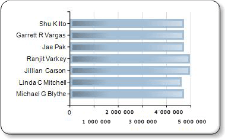

# Ajouter des styles de biseau, du relief et des textures &#224; un graphique (G&#233;n&#233;rateur de rapports et SSRS)
  Lorsque vous utilisez certains types de graphiques, vous pouvez spécifier un effet de dessin pour augmenter l'impact visuel de votre graphique. Ces effets de dessins ne sont appliquées qu'aux series de votre graphique. Ils n'ont pas d'effet sur les autres éléments d'un graphique.  
  
 Lorsque vous utilisez une variante d'un graphique en secteurs ou d'un graphique en anneau, vous pouvez spécifier une bordure arrondie ou un style de dessin concave semblable à des effets de biseau ou de relief qui peuvent être appliqués à une image.  
  
 Lorsque vous utilisez une variante d'un graphique à barres ou d'un histogramme, vous pouvez appliquer des styles de texture, tels que cylindre, coin et clair à sombre, aux barres ou colonnes individuelles.  
  
 En plus de ces styles de dessin, vous pouvez ajouter des bordures et des ombres à de nombreux éléments de graphique pour donner une impression de profondeur. Pour plus d’informations sur d’autres méthodes de mise en forme du graphique, consultez [Mise en forme d’un graphique &#40;Générateur de rapports et SSRS&#41;](../../reporting-services/report-design/formatting-a-chart-report-builder-and-ssrs.md).  
  
> [!NOTE]  
>  [!INCLUDE[ssRBRDDup](../../includes/ssrbrddup-md.md)]  
  
### Pour ajouter un style de biseau ou de relief à un graphique en secteurs ou un graphique en anneau  
  
1.  Sous l'onglet **Affichage** , sélectionnez **Propriétés** pour ouvrir le volet Propriétés.  
  
2.  Sélectionnez le graphique à secteurs ou en anneau que vous souhaitez améliorer. Sélectionnez un champ de données dans le graphique, et pas le graphique entier.  
  
3.  Dans le volet Propriétés, développez le nœud **CustomAttributes** .  
  
4.  Pour PieDrawingStyle, sélectionnez un style dans la liste déroulante.  
  
> [!NOTE]  
>  Vous ne pouvez pas avoir les styles 3D et de biseau ou de relief sur le même graphique. Si vous avez activé le style 3D pour le graphique, la propriété PieDrawingStyle n’y figure pas.  
  
   
  
### Pour ajouter des styles de texture à un graphique à barres ou un histogramme  
  
1.  Sélectionnez le graphique à barres ou l'histogramme que vous souhaitez améliorer. Sélectionnez un champ de données dans le graphique, et pas le graphique entier.  
  
2.  Ouvrez le volet Propriétés.  
  
3.  Développez le nœud **CustomAttributes** .  
  
4.  Pour DrawingStyle, sélectionnez un style dans la liste déroulante.  
  
> [!NOTE]  
>  Vous ne pouvez pas avoir les styles 3D et de biseau ou de relief sur le même graphique. Si vous avez activé le style 3D pour le graphique, la propriété PieDrawingStyle n’y figure pas.  
  
   
  
## Voir aussi  
 [Graphiques à barres &#40;Générateur de rapports et SSRS&#41;](../../reporting-services/report-design/bar-charts-report-builder-and-ssrs.md)   
 [Histogrammes &#40;Générateur de rapports et SSRS&#41;](../../reporting-services/report-design/column-charts-report-builder-and-ssrs.md)   
 [Graphiques à secteurs &#40;Générateur de rapports et SSRS&#41;](../../reporting-services/report-design/pie-charts-report-builder-and-ssrs.md)   
 [Mise en forme d’un graphique &#40;Générateur de rapports et SSRS&#41;](../../reporting-services/report-design/formatting-a-chart-report-builder-and-ssrs.md)  
  
  