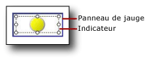

# Ajouter ou supprimer un indicateur (Générateur de rapports et SSRS)
  Dans un rapport paginé [!INCLUDE[ssRSnoversion_md](../../includes/ssrsnoversion-md.md)] , les indicateurs sont des jauges minimales qui communiquent en un coup d’œil l’état d’une valeur de donnée unique. Pour plus d’informations les concernant, consultez [Indicateurs &#40;Générateur de rapports et SSRS&#41;](../../reporting-services/report-design/indicators-report-builder-and-ssrs.md).  
  
 Les indicateurs sont généralement placés dans des cellules d'une table ou d'une matrice, mais vous pouvez également les utiliser seuls, côte à côte avec des jauges ou incorporés dans des jauges.  
  
 Lorsque vous ajoutez un indicateur pour la première fois, il est configuré par défaut pour utiliser des pourcentages comme unités de mesure. Les plages de pourcentage sont réparties uniformément entre les membres du jeu d'indicateurs, et l'étendue de valeurs indiquée par l'indicateur correspond au parent de l'indicateur tel qu'une table ou une matrice.  
  
 Vous pouvez mettre à jour les valeurs et les états d'indicateurs. Pour plus d'informations, consultez les rubriques suivantes :  
  
-   [Modifier les icônes d’indicateur et jeux d’indicateurs &#40;Générateur de rapports et SSRS&#41;](../../reporting-services/report-design/change-indicator-icons-and-indicator-sets-report-builder-and-ssrs.md)  
  
-   [Définir et configurer des unités de mesure &#40;Générateur de rapports et SSRS&#41;](../../reporting-services/report-design/set-and-configure-measurement-units-report-builder-and-ssrs.md)  
  
-   [Définir l’étendue de synchronisation &#40;Générateur de rapports et SSRS&#41;](../../reporting-services/report-design/set-synchronization-scope-report-builder-and-ssrs.md)  
  
 Étant donné qu’un indicateur est positionné à l’intérieur du panneau de jauge, vous devez sélectionner l’indicateur au lieu du panneau quand vous souhaitez configurer l’indicateur à l’aide de la boîte de dialogue **Propriétés des indicateurs** ou du volet **Propriétés** . L'image suivante illustre un indicateur sélectionné dans son panneau de jauge.  
  
   
  
> [!NOTE]  
>  Selon la largeur de colonne et la longueur des valeurs de données, le texte des cellules de table ou de matrice peut être renvoyé à la ligne automatiquement et s'afficher sur plusieurs lignes. Lorsque cela se produit, l'icône d'indicateur peut s'étirer et changer de forme. Cela peut rendre l'icône d'indicateur moins lisible. Placez l'indicateur à l'intérieur d'un rectangle pour vous assurer que l'icône n'est pas étirée.  
  
## Pour ajouter un indicateur à une table ou une matrice  
  
1.  Ouvrez un rapport existant ou créez un rapport qui contient une table et une matrice avec les données que vous souhaitez afficher. Pour plus d’informations, consultez [Tables &#40;Générateur de rapports et SSRS&#41;](../../reporting-services/report-design/tables-report-builder-and-ssrs.md) ou [Matrices](../../reporting-services/report-design/create-a-matrix-report-builder-and-ssrs.md).  
  
2.  Insérez une colonne dans votre table ou matrice. Pour plus d’informations, consultez [Insérer ou supprimer une colonne &#40;Générateur de rapports et SSRS&#41;](../../reporting-services/report-design/insert-or-delete-a-column-report-builder-and-ssrs.md).  
  
3.  Le cas échéant, sous l’onglet **Insérer** , cliquez sur **Rectangle**, puis sur une cellule dans la nouvelle colonne.  
  
4.  Sous l’onglet **Insérer** , cliquez sur **Indicateur**, puis sur une cellule dans la nouvelle colonne.  
  
     Si vous avez ajouté un rectangle à une cellule, cliquez sur cette cellule.  
  
5.  Dans la boîte de dialogue **Sélectionner le style d’indicateur** , dans le volet gauche, cliquez sur le type d’indicateur de votre choix, puis sur le jeu d’indicateurs.  
  
6.  Cliquez sur **OK**.  
  
7.  Cliquez sur l'indicateur. Le volet **Données de la jauge** s’ouvre.  
  
8.  Dans la zone **Valeurs** , dans la liste déroulante **(Non spécifié)** , cliquez sur le champ dont vous souhaitez afficher les valeurs sous la forme d’un indicateur.  
  
     L'indicateur est configuré pour utiliser des valeurs par défaut. Par défaut, les indicateurs sont configurés pour utiliser des pourcentages comme unités de mesure et les plages de pourcentage sont réparties uniformément entre les membres de l'indicateur et la valeur que l'indicateur indique utilise l'étendue du groupe le plus proche.  
  
## Pour supprimer un indicateur dans une table ou une matrice  
  
1.  Cliquez avec le bouton droit sur l’indicateur à supprimer, puis sélectionnez **Supprimer**.  
  
    > [!NOTE]  
    >  Un indicateur peut être positionné à l'intérieur d'un panneau de jauge qui contient d'autres indicateurs ou jauges. Si les panneaux de jauge contiennent plusieurs éléments, veillez à cliquer sur l'indicateur pour le supprimer, et non sur le panneau de jauge. Si vous cliquez sur le panneau de jauge et le supprimez, le panneau de jauge et tous les éléments qu'il contient sont supprimés.  
  
2.  Cliquez sur **Supprimer**.  
  
##  Voir aussi  
 [Indicateurs &#40;Générateur de rapports et SSRS&#41;](../../reporting-services/report-design/indicators-report-builder-and-ssrs.md)  
  
  
