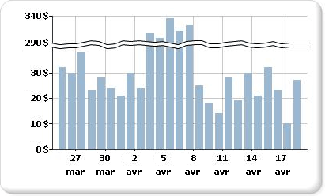

# Ajouter des séparations d'échelle à un graphique (Générateur de rapports et SSRS)

  Une séparation d'échelle est une ligne dessinée sur la zone de traçage d'un graphique pour indiquer une rupture dans la continuité entre les valeurs haute et basse d'un axe des ordonnées (en général, l'axe vertical ou axe des Y). Utilisez une séparation d'échelle pour afficher deux plages distinctes dans la même zone de graphique.  
  
   
  
> [!NOTE]  
>  Vous ne pouvez pas spécifier où placer une séparation d'échelle sur votre graphique. Le graphique utilise ses propres calculs en fonction des valeurs de votre dataset pour déterminer si l'écart entre les différentes plages de données est suffisant pour dessiner une séparation d'échelle sur l'axe des ordonnées (axe Y) au moment de l'exécution.  
  
 Un exemple de graphique avec séparations d’échelle est disponible sous forme d’exemple de rapport. Pour plus d'informations sur le téléchargement de cet exemple de rapport et d'autres rapports, consultez [Exemples de rapports du Générateur de rapports et du Concepteur de rapports](http://go.microsoft.com/fwlink/?LinkId=198283).  
  
> [!NOTE]  
>  [!INCLUDE[ssRBRDDup](../../includes/ssrbrddup-md.md)]  
  
### Pour activer les séparations d'échelle sur le graphique  
  
1.  Cliquez avec le bouton droit sur l’axe vertical, puis cliquez sur **Propriétés de l’axe**. La boîte de dialogue **Propriétés de l’axe vertical** s’ouvre.  
  
2.  Cochez la case **Activer les séparateurs d’échelle** .  
  
### Pour modifier le style de la séparation d'échelle  
  
1.  Ouvrez le volet Propriétés.  
  
2.  Dans l'aire de conception, cliquez avec le bouton droit sur l'axe Y du graphique. Les propriétés de l'objet de l'axe Y (nommé Axe de graphique par défaut) sont affichées dans le volet Propriétés.  
  
3.  Dans la section **Échelle** , développez la propriété ScaleBreakStyle.  
  
4.  Modifier les valeurs de la propriété ScaleBreakStyle, telles que BreakLineType et Spacing. Pour plus d’informations sur les propriétés des séparations d’échelle, consultez, [Affichage d’une série avec plusieurs plages de données sur un graphique &#40;Générateur de rapports et SSRS&#41;](../../reporting-services/report-design/displaying-a-series-with-multiple-data-ranges-on-a-chart.md).  

## Étapes suivantes

[Graphiques](../../reporting-services/report-design/charts-report-builder-and-ssrs.md)   
[Mise en forme d’un graphique](../../reporting-services/report-design/formatting-a-chart-report-builder-and-ssrs.md)   
[Boîte de dialogue Propriétés de l’axe, Options de l’axe](http://msdn.microsoft.com/library/b276e210-7a12-48ae-971b-7dabae51df11)  

D’autres questions ? [Essayez de poser une question dans le forum Reporting Services](http://go.microsoft.com/fwlink/?LinkId=620231)
