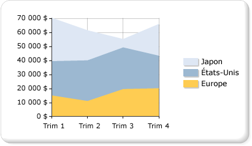

# Graphiques en aires (Générateur de rapports et SSRS)
  Un graphique en aires affiche une série sous la forme d'un ensemble de points reliés par une courbe, la zone sous la courbe étant remplie. Pour plus d’informations sur la façon d’ajouter des données à un graphique en aires, consultez [Graphiques &#40;Générateur de rapports et SSRS&#41;](../../reporting-services/report-design/charts-report-builder-and-ssrs.md).  
  
 L'illustration suivante montre un exemple d'un graphique en aires empilées. Les données conviennent à une présentation en graphique en aires empilées car le graphique peut afficher des totaux pour toute la série ainsi que la contribution de chaque série au total.  
  
   
  
> [!NOTE]  
>  [!INCLUDE[ssRBRDDup](../../includes/ssrbrddup-md.md)]  
  
## Variantes  
  
-   **Aires empilées**. Graphique en aires empilées où plusieurs séries sont empilées verticalement. Si votre graphique ne représente qu'une seule série, le graphique en aires empilées affichera la même chose qu'un graphique en aires.  
  
-   **Aires empilées %**. Graphique en aires où plusieurs séries sont empilées verticalement pour occuper l'intégralité de la zone de graphique. Si votre graphique ne représente qu'une seule série, le graphique en aires empilées affichera la même chose qu'un graphique en aires.  
  
-   **Aires lissées**. Graphique en aires où les points de données sont connectés par une ligne lissée au lieu d'une ligne normale. Utilisez un graphique en aires lissées au lieu d'un graphique en aires lorsque vous souhaitez afficher des tendances plutôt que les valeurs des points de données individuels.  
  
## Considérations relatives aux données pour les graphiques en aires  
  
-   Tout comme le graphique en courbes, un graphique en aires est un type de graphique qui affiche les données de façon contiguë. Pour cette raison, un graphique en aires est souvent utilisé pour représenter des données qui se produisent sur une période de temps continue.  
  
-   Un graphique en aires empilées pourcent est utile pour afficher des données proportionnelles qui se produisent dans le temps.  
  
-   Dans le cas d'une seule série, un graphique en aires empilées sera dessiné comme un graphique en aires.  
  
-   Dans un graphique en aires ordinaire, si les valeurs de plusieurs séries sont identiques, les aires peuvent se chevaucher, en masquant des valeurs de point de données importantes. Vous pouvez résoudre ce problème en changeant le type de graphique en un graphique en aires empilées, conçu pour afficher plusieurs séries sur un graphique en aires.  
  
-   Si votre graphique en aires empilées contient des intervalles, il est possible que votre dataset comprenne des valeurs vides, qui seront affichées sous la forme d'une section vide dans un graphique en aires empilées. Si votre dataset comprend des valeurs vides, pensez à insérer des points vides sur le graphique. L'ajout de points vides remplira les zones vides sur le graphique avec une couleur différente pour indiquer les valeurs null ou égales à zéro. Pour plus d’informations, consultez [Ajouter des points vides à un graphique &#40;Générateur de rapports et SSRS&#41;](../../reporting-services/report-design/add-empty-points-to-a-chart-report-builder-and-ssrs.md).  
  
-   Le comportement des types de graphiques en aires est similaire à celui des graphiques en courbes et des histogrammes. Si vous comparez plusieurs séries, pensez à utiliser un histogramme. Si vous analysez des tendances sur une période de temps, pensez à utiliser un graphique en courbes.  
  
##  Voir aussi  
 [Graphiques &#40;Générateur de rapports et SSRS&#41;](../../reporting-services/report-design/charts-report-builder-and-ssrs.md)   
 [Types de graphiques &#40;Générateur de rapports et SSRS&#41;](../../reporting-services/report-design/chart-types-report-builder-and-ssrs.md)   
 [Graphiques en courbes &#40;Générateur de rapports et SSRS&#41;](../../reporting-services/report-design/line-charts-report-builder-and-ssrs.md)   
 [Modifier un type de graphique &#40;Générateur de rapports et SSRS&#41;](../../reporting-services/report-design/change-a-chart-type-report-builder-and-ssrs.md)   
 [Points de données vides et Null dans les graphiques &#40;Générateur de rapports et SSRS&#41;](../../reporting-services/report-design/empty-and-null-data-points-in-charts-report-builder-and-ssrs.md)  
  
  
