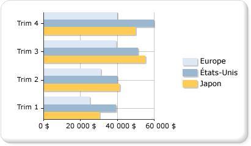

# Graphiques à barres (Générateur de rapports et SSRS)
  Un graphique à barres affiche les séries sous la forme d'ensembles de barres horizontales. Le graphique à barres ordinaire est étroitement lié à l'histogramme, qui affiche les séries sous la forme d'ensembles de barres verticales, ainsi qu'au graphique d'étendue à barres, qui affiche les séries sous la forme d'ensembles de barres horizontales avec des points de départ et de fin variables.  
  
 Le graphique à barres est le seul type de graphique qui affiche des données horizontalement. C'est pourquoi, il est souvent utilisé pour représenter des données qui se produisent avec le temps, avec une date de début et une date de fin fixes. Il est également souvent utilisé pour afficher des informations de catégorie, dans la mesure où les catégories peuvent être affichées horizontalement. Pour plus d’informations sur l’ajout de données à un graphique à barres, consultez [Graphiques &#40;Générateur de rapports et SSRS&#41;](../../reporting-services/report-design/charts-report-builder-and-ssrs.md).  
  
 L'illustration suivante montre un graphique à barres. Le graphique à barres convient bien pour ce type de données, car les trois séries partagent une période de temps commune, ce qui permet d'effectuer des comparaisons valables.  
  
   
  
> [!NOTE]  
>  [!INCLUDE[ssRBRDDup](../../includes/ssrbrddup-md.md)]  
  
## Variations du graphique à barres  
  
-   **Empilé**. Graphique à barres où plusieurs séries sont empilées verticalement. Si votre graphique ne représente qu'une seule série, le graphique à barres empilées affichera la même chose qu'un graphique à barres.  
  
-   **Empilé 100 %**. Graphique à barres où plusieurs séries sont empilées verticalement pour occuper 100 % de la zone de graphique. Si le graphique ne comporte qu'une seule série, toutes les barres s'ajusteront à 100 % de la zone de graphique.  
  
-   **Groupé 3D**. Graphiques à barres qui affiche les séries individuelles en lignes séparées sur un graphique 3D.  
  
-   **Cylindre 3D**. Graphique à barres qui affiche les barres sous forme de cylindres sur un graphique 3D.  
  
## Considérations relatives aux données pour les graphiques à barres  
  
-   Les axes des graphiques à barres sont inversés. L'axe des abscisses est l'axe vertical (ou « axe des Y ») et l'axe des ordonnées est l'axe horizontal (ou « axe des X »). Cela signifie que dans un graphique à barres, vous disposez de davantage d'espace pour afficher les étiquettes de catégorie sur l'axe des Y sous la forme d'une liste qui se lit de haut en bas.  
  
-   Les graphiques à barres et histogrammes sont plus couramment utilisés pour montrer des comparaisons entre groupes. Si le graphique comporte plus de trois séries, pensez plutôt à utiliser un graphique à barres empilées ou un histogramme empilé. Si le graphique comporte plusieurs séries, vous pouvez également rassembler les graphiques à barres empilées ou les histogrammes empilés en plusieurs groupes.  
  
-   Un graphique à barres affiche les valeurs de gauche à droite, ce qui peut être plus intuitif lors de l'affichage de données relatives à des durées.  
  
-   Si vous souhaitez ajouter des barres à un tableau ou une matrice au sein d'un rapport, pensez à utiliser une jauge linéaire plutôt qu'un graphique à barres. La jauge linéaire est conçue pour afficher une valeur au lieu de plusieurs groupes, c'est pourquoi elle est plus flexible pour une utilisation dans une liste ou une région de données de table. Pour plus d’informations, consultez [Jauges &#40;Générateur de rapports et SSRS&#41;](../../reporting-services/report-design/gauges-report-builder-and-ssrs.md).  
  
-   Vous pouvez ajouter des styles de dessin spéciaux aux barres individuelles d'un graphique à barre pour augmenter son impact visuel. Les styles de dessin incluent les effets de coin, de relief, de cylindre et de clair à sombre. Ces effets sont destinés à améliorer l'apparence de votre graphique 2D. Si vous utilisez un graphique 3D, les styles de dessin seront toujours appliqués, mais ils peuvent ne pas avoir le même effet. Pour plus d’informations sur l’ajout d’un style de dessin à un graphique à barres, consultez [Ajouter des styles de biseau, de relief et de textures à un graphique &#40;Générateur de rapports et SSRS&#41;](../../reporting-services/report-design/chart-effects-add-bevel-emboss-or-texture-report-builder.md).  
  
-   Les graphiques à barres empilées placent les séries les unes au-dessus des autres pour créer une pile de barres. Vous avez la possibilité de scinder le graphique à barres empilées en plusieurs groupes de piles pour chaque catégorie. Le graphique à barres empilées groupées est affiché côte à côte. Vous pouvez avoir n'importe quel nombre de séries empilées groupées dans un graphique.  
  
-   Si des étiquettes de points de données figurent sur le graphique, les étiquettes sont placées à l'extérieur de chaque barre. Les étiquettes peuvent alors se chevaucher si les barres occupent tout l'espace alloué au graphique. Vous pouvez modifier la position des étiquettes de points de données affichées pour chaque barre en définissant la propriété **BarLabelStyle** dans le volet Propriétés.  
  
-   Par exemple, si votre dataset contient de nombreux points de données par rapport à la taille du graphique, la taille des colonnes ou barres et l'espacement entre ces éléments seront alors réduits. Pour définir manuellement la largeur des colonnes dans un graphique, modifiez leur largeur, en pixels, en changeant la valeur de la propriété **PointWidth** . Par défaut, la valeur de cette propriété est 0,8. Lorsque vous augmentez la largeur des colonnes ou barres dans un graphique, l'espace entre chaque colonne ou barre diminue.  
  
##  Voir aussi  
 [Graphiques &#40;Générateur de rapports et SSRS&#41;](../../reporting-services/report-design/charts-report-builder-and-ssrs.md)   
 [Types de graphiques &#40;Générateur de rapports et SSRS&#41;](../../reporting-services/report-design/chart-types-report-builder-and-ssrs.md)   
 [Points de données vides et Null dans les graphiques &#40;Générateur de rapports et SSRS&#41;](../../reporting-services/report-design/empty-and-null-data-points-in-charts-report-builder-and-ssrs.md)   
 [Histogrammes &#40;Générateur de rapports et SSRS&#41;](../../reporting-services/report-design/column-charts-report-builder-and-ssrs.md)   
 [Graphiques d’étendue &#40;Générateur de rapports et SSRS&#41;](../../reporting-services/report-design/range-charts-report-builder-and-ssrs.md)   
 [Mise en forme des couleurs des séries sur un graphique &#40;Générateur de rapports et SSRS&#41;](../../reporting-services/report-design/formatting-series-colors-on-a-chart-report-builder-and-ssrs.md)   
 [Mise en forme des étiquettes des axes sur un graphique &#40;Générateur de rapports et SSRS&#41;](../../reporting-services/report-design/formatting-axis-labels-on-a-chart-report-builder-and-ssrs.md)   
 [Mise en forme de la légende sur un graphique &#40;Générateur de rapports et SSRS&#41;](../../reporting-services/report-design/chart-legend-formatting-report-builder.md)   
 [Ajouter des styles de biseau, de relief et de texture à un graphique &#40;Générateur de rapports et SSRS&#41;](../../reporting-services/report-design/chart-effects-add-bevel-emboss-or-texture-report-builder.md)   
 [Didacticiel : ajout d’un graphique à barres à un rapport (Générateur de rapports)](http://go.microsoft.com/fwlink/?LinkId=198052)   
 [Didacticiel : ajout d’un graphique à barres dans un rapport](http://go.microsoft.com/fwlink/?LinkId=198042)  
  
  
