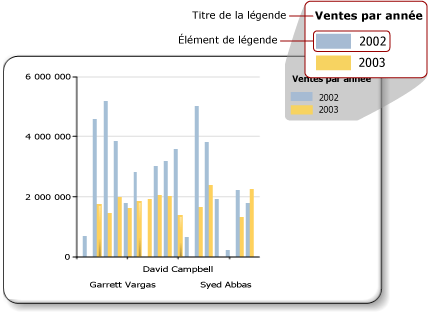

# Légende de graphique - Mise en forme (Générateur de rapports)
  La légende du graphique contient des descriptions pour chaque catégorie d'un graphique. Une légende contient toujours un ou plusieurs éléments de légende. Chaque élément de légende consiste en une zone colorée qui représente les séries et une chaîne de texte qui décrit ces dernières, comme indiqué dans l'illustration ci-dessous.  
  
   
  
 Un élément de légende est relié à une série individuelle sur le graphique, à l'exception des graphiques à base de formes, où la légende est reliée aux points de données individuels. Le graphique ajoute automatiquement des éléments à la légende en fonction des séries générées à partir de vos données.  
  
 Vous pouvez mettre en forme une légende à l'aide de la boîte de dialogue **Propriétés de la légende** ou du volet Propriétés. Cliquez avec le bouton droit sur la légende, puis cliquez sur **Propriétés de la légende** pour modifier les valeurs du texte de légende, de la couleur d’arrière-plan, des bordures et des effets 3D. Pour modifier les valeurs du titre de légende, sélectionnez la légende voulue, cliquez avec le bouton droit sur le titre de légende, puis cliquez sur **Propriétés du titre de légende**.  
  
 Vous ne pouvez pas ajouter d'images, de colonnes ou d'autres éléments supplémentaires à la légende.  
  
> [!NOTE]  
>  [!INCLUDE[ssRBRDDup](../../includes/ssrbrddup-md.md)]  
  
## Ordre des éléments de légende dans la légende  
 Les séries sont ordonnées dans la légende d'après l'ordre dans lequel le moteur de traitement [!INCLUDE[ssRSnoversion](../../includes/ssrsnoversion-md.md)] les traite. Vous pouvez modifier cet ordre en modifiant l'ordre des champs dans la zone de dépôt des champs de données. Si vous utilisez un regroupement de séries, les données de série sont inconnues jusqu'au traitement. Vous ne disposez donc d'aucun moyen pour réordonner ces éléments. Les modifications peuvent être vues dans l'Aperçu. Pour plus d’informations sur le regroupement de séries, consultez [Graphiques &#40;Générateur de rapports et SSRS&#41;](../../reporting-services/report-design/charts-report-builder-and-ssrs.md).  
  
 Vous pouvez masquer l'affichage des séries dans la légende. Si vous utilisez un regroupement de séries, toutes les séries en rapport avec le champ de données seront masquées. Pour plus d’informations, consultez [Masquer des éléments de légende dans le graphique &#40;Générateur de rapports et SSRS&#41;](../../reporting-services/report-design/chart-legend-hide-items-report-builder.md).  
  
## Modification du texte ou de la couleur d'un élément de légende dans la légende  
 Lorsqu'un champ est placé dans la zone de dépôt du champ de données d'un graphique, un élément de légende contenant le nom de ce champ est automatiquement généré. Par défaut, le texte de chaque élément de légende est tiré du nom du champ de données. Chaque élément de légende est relié à une série individuelle sur le graphique, à l'exception des graphiques à base de formes, pour lesquels la légende est reliée à des points de données individuels et non à des séries individuelles. Lorsqu'un groupe de catégories est défini sur un graphique à base de formes, le texte de chaque élément de légende est tiré de la représentation de chaîne du groupe de catégories. Vous pouvez spécifier un texte d'étiquette personnalisé pour les graphiques à secteurs, en anneau ou en entonnoir afin d'afficher des informations autres que l'étiquette du groupe de catégories pour chaque point de données de la légende. Pour ce faire, sélectionnez la légende et spécifiez le texte de la légende dans la boîte de dialogue **Propriétés de la série** ou la propriété **LegendText** du volet Propriétés. Pour plus d’informations, consultez [Modifier le texte d’un élément de légende &#40;Générateur de rapports et SSRS&#41;](../../reporting-services/report-design/chart-legend-change-item-text-report-builder.md).  
  
 Vous pouvez également spécifier des mots clés spécifiques au graphique et respectant la casse pour les attributs communément référencés dans la propriété **LegendText** ou dans la boîte de dialogue **Propriétés de la série** . Le contrôle de graphique remplace ces mots clés au moment de l'exécution par leur représentation de données. Cette approche est utile pour les graphiques à bases de formes car vous êtes en mesure d'afficher les informations relatives à des points de données spécifiques. Pour plus d’informations, consultez [Mise en forme des points de données sur un graphique &#40;Générateur de rapports et SSRS&#41;](../../reporting-services/report-design/formatting-data-points-on-a-chart-report-builder-and-ssrs.md).  
  
 La zone colorée affichée pour chaque élément de légende est héritée de la couleur de remplissage de la série correspondante. Si vous souhaitez modifier la couleur affichée dans un élément de légende, vous devez modifier la couleur de la série correspondante. Pour plus d’informations, consultez [Mise en forme des couleurs des séries d’un graphique &#40;Générateur de rapports et SSRS&#41;](../../reporting-services/report-design/formatting-series-colors-on-a-chart-report-builder-and-ssrs.md).  
  
## Suppression d'éléments de légende superflus de la légende  
 La légende est toujours reliée à une série. Si un élément de légende apparaît dans la légende, mais que la série correspondante ne figure pas dans le graphique, la cause la plus probable en est que la série ne contient aucune valeur. Vous devez supprimer cette série pour supprimer l'élément de légende de la légende. Pour supprimer une série de votre graphique, vous pouvez cliquer avec le bouton droit sur la série spécifiée et sélectionner l'option Supprimer la série.  
  
## Repositionnement de la légende  
 La zone de graphique est la zone rectangulaire qui englobe les étiquettes d'axe et la zone de traçage. Vous pouvez faire glisser la légende à l'une des douze positions différentes lorsque la légende est placée en dehors de la zone de graphique. Par défaut, la légende s'affiche en dehors de la zone de graphique. Vous pouvez également définir la position dans la boîte de dialogue **Propriétés de la légende** .  
  
 Vous ne pouvez pas faire glisser la légende à l'intérieur ou à l'extérieur de la zone de graphique. Si vous souhaitez placer la légende à l’intérieur de la zone de graphique, dans la boîte de dialogue **Propriétés de la légende** , sous **Ancrage**, sélectionnez **Par défaut** dans la liste déroulante et désactivez l’option **Afficher la légende en dehors de la zone de graphique** . En plaçant la légende à l'intérieur de la zone de graphique, vous pouvez agrandir l'espace pour les points de données sur le graphique. Toutefois, selon le dataset, cela peut provoquer un chevauchement de la légende et de certains points de données sur la zone de graphique et rendre la lecture du graphique plus difficile.  
  
## Affichage horizontal des éléments de légende  
 Par défaut, la légende est mise en forme sous la forme d'une liste d'une ou de plusieurs lignes contenant chacune un élément de légende. La zone de légende s'étend pour s'adapter au nombre d'éléments de légende. Si la légende ne peut pas s'étendre, des points de suspension (…) sont affichés. Selon le style de légende spécifié, la légende peut s'étendre verticalement ou horizontalement. Vous pouvez modifier le style de disposition dans la boîte de dialogue **Propriétés de la légende** ou modifier l'espace alloué pour afficher tous les éléments de légende.  
  
 Pour afficher la légende horizontalement, ancrez la légende en haut ou en bas du graphique. La légende s'étend ainsi horizontalement. Vous pouvez également affecter la valeur **Ligne** ou **Tableau large**à la propriété Layout. Définissez la propriété MaxAutoSize dans le volet Propriétés pour contrôler l’espace vertical alloué à la légende quand elle est ancrée en haut ou en bas de la zone de graphique.  
  
## Mise en forme du texte de légende  
 Vous pouvez modifier la police, la taille, le style et la couleur du texte de légende dans la page **Police** de la boîte de dialogue **Propriétés de la légende** .  
  
 Par défaut, le texte de légende n'est pas optimisé pour s'ajuster à la zone de légende. Pour que le texte de légende s’adapte automatiquement à l’espace alloué, affectez la valeur **False** à la propriété AutoFitTextDisabled et définissez la propriété MinFontSize à la plus petite taille de police que vous pensez être présentable tout en permettant l’optimisation de la légende.  
  
##  Voir aussi  
 [Boîte de dialogue Propriétés de la légende, Général &#40;Générateur de rapports et SSRS&#41;](http://msdn.microsoft.com/library/db718f8f-f185-422f-871c-96f0749e5893)   
 [Modifier le texte d’un élément de légende &#40;Générateur de rapports et SSRS&#41;](../../reporting-services/report-design/chart-legend-change-item-text-report-builder.md)   
 [Mise en forme d’un graphique &#40;Générateur de rapports et SSRS&#41;](../../reporting-services/report-design/formatting-a-chart-report-builder-and-ssrs.md)   
 [Mise en forme des couleurs des séries sur un graphique &#40;Générateur de rapports et SSRS&#41;](../../reporting-services/report-design/formatting-series-colors-on-a-chart-report-builder-and-ssrs.md)   
 [Graphiques &#40;Générateur de rapports et SSRS&#41;](../../reporting-services/report-design/charts-report-builder-and-ssrs.md)   
 [Masquer des éléments de légende sur le graphique &#40;Générateur de rapports et SSRS&#41;](../../reporting-services/report-design/chart-legend-hide-items-report-builder.md)   
 [Définir les couleurs d’un graphique à l’aide d’une palette &#40;Générateur de rapports et SSRS&#41;](../../reporting-services/report-design/define-colors-on-a-chart-using-a-palette-report-builder-and-ssrs.md)  
  
  
