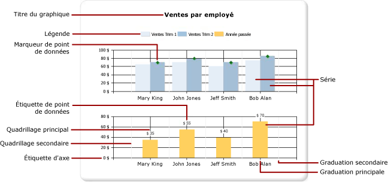
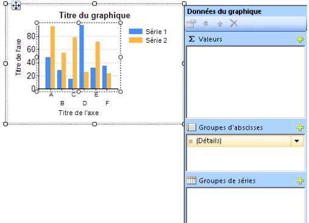
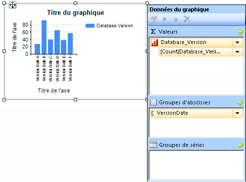

# Graphiques (Générateur de rapports et SSRS)
Apprenez à utiliser les régions de données de graphique pour aider les lecteurs de vos rapports paginés [!INCLUDE[ssRSnoversion_md](../../includes/ssrsnoversion-md.md)] à comprendre en un coup d’œil des volumes importants de données agrégées.  

Plus vous passerez du temps à préparer avec soin vos données et à les comprendre, plus il sera facile et rapide de créer vos graphiques. Pour vous aider à choisir quel graphique utiliser, consultez [Types de graphiques](../../reporting-services/report-design/chart-types-report-builder-and-ssrs.md). Pour commencer à utiliser des graphiques tout de suite, consultez les didacticiels portant sur les graphiques à barres, les histogrammes, les graphiques sparkline et les graphiques à secteurs dans les [Didacticiels du Générateur de rapports](../../reporting-services/report-builder-tutorials.md).  
  
 L'illustration suivante affiche un grand nombre des différents éléments utilisés dans le graphique.  
  
   
  
 Vous pouvez publier des graphiques indépendamment d’un rapport en tant que *parties de rapport*. Pour plus d’informations, consultez [Parties de rapport](../../reporting-services/report-design/report-parts-report-builder-and-ssrs.md).
  
 
##   Conception d'un graphique  
 Après avoir ajouté une région de données de graphique à l'aire de conception, vous pouvez faire glisser des champs de dataset du rapport pour les données numériques et non numériques vers le volet Données du graphique du graphique. Lorsque vous cliquez sur le graphique sur l'aire de conception, le volet Données du graphique s'affiche avec trois zones : Groupes d'abscisses, Groupes de séries et Valeurs. Si le rapport comporte un dataset partagé ou incorporé, les champs du dataset s'affichent dans le volet Données du rapport. Faites glisser les champs du dataset vers la zone appropriée du volet Données du graphique. Par défaut, lorsqu'un champ est ajouté à l'une des zones du graphique, [!INCLUDE[ssRSnoversion](../../includes/ssrsnoversion-md.md)] calcule un agrégat pour ce champ. Vous pouvez également regrouper des séries pour générer dynamiquement des séries. Un graphique est [organisé comme une matrice](#SimilarMatrix).  
  
   
  
> [!NOTE]  
>  Les données dans le graphique au moment de la conception sont différentes de celles au moment du traitement du rapport. Il ne s'agit pas de vos vraies données. Ce sont des données générées qui ont été ajoutées pour que vous puissiez concevoir votre graphique et vous faire une idée de son aspect final.  
  
##  En quoi un graphique est-il comparable à une matrice ?  
 Une façon de réfléchir au fonctionnement des graphiques consiste à les comparer aux matrices.  
  
   
  
 D'un point de vue conceptuel, leur organisation est identique :  
  
-   Le groupe Colonnes dans la matrice est semblable à la zone Groupes de coordonnées dans le graphique.  
  
-   Le groupe Lignes dans la matrice est semblable à la zone Groupes de séries dans le graphique.  
  
-   La zone Données dans la matrice est semblable à la zone Valeurs dans le graphique.  
  
 
##   Ajout de données au graphique  
 Supposez que vous avez un rapport qui indique des ventes par nom. Vous faites glisser le champ Full Name vers la zone Groupes d'abscisses et le champ Sales vers la zone Valeurs.  
  
 Lorsque vous ajoutez le champ Sales à la zone Valeurs, le texte du champ de données apparaît dans la légende et les données de ce champ de type numérique sont agrégées en une seule valeur. Par défaut, la valeur est agrégée à l'aide de la fonction intégrée Sum. Le volet Données du graphique contient une expression simple pour le champ. Dans notre exemple, `[Sum(Sales)]` s'affiche pour l'expression de champ `=Sum(Fields!Sales.Value)`. Si aucun groupe n'est spécifié, le graphique n'affiche qu'un seul point de données. Pour afficher plusieurs points de données, vous devez regrouper vos données en ajoutant un champ de regroupement. Lorsque vous ajoutez le champ Name à la zone Groupes d'abscisses, un champ de regroupement portant le même nom que ce champ est automatiquement ajouté au graphique. Lorsque les champs qui définissent les valeurs le long de l'axe des abscisses et des ordonnées sont ajoutés, le graphique possède suffisamment d'informations pour tracer les données correctement.  
  
   
  
 Lorsque la zone Groupes de séries est laissée vide, le nombre de séries est déterminé au moment de la conception. Dans cet exemple, Sales constitue la seule série qui apparaît sur le graphique.  
  
 
##   Groupes d'abscisses et groupes de séries dans un graphique  
 Un graphique prend en charge des groupes d'abscisses et de séries imbriqués. Les graphiques n'affichent pas les données de détail. Ajoutez des groupes à un graphique en faisant glisser des champs de dataset sur les zones de dépôt de catégories et de séries d'un graphique sélectionné.  
  
 Les graphiques à base de formes tels que les graphiques à secteurs prennent en charge les groupes de catégories et les groupes de catégories imbriqués. D'autres graphiques tels que les graphiques à barres prennent en charge les groupes d'abscisses et les groupes de séries. Vous pouvez imbriquer des groupes, mais vous devez vous assurer que les nombres de catégories ou de séries ne masquent pas la présentation des informations dans le graphique.  
  
### Ajout d'un regroupement de séries à un graphique  
 Si vous ajoutez un champ à la zone Groupes de séries, le nombre de série dépend des données contenues dans ce champ. Dans notre précédent exemple, supposez que vous ajoutez un champ Year à la zone Groupes de séries. Le nombre de valeurs figurant dans le champ Year déterminera le nombre de séries qui apparaîtra sur le graphique. Si le champ Year contient les années 2004, 2005 et 2006, le graphique affichera trois séries pour chaque champ dans la zone Valeurs.  
  
##   Considérations sur les datasets avant de créer un graphique  
 Les graphiques fournissent une vue de résumé de vos données. Toutefois, avec les datasets très volumineux, les informations affichées sur un graphique peuvent être masquées ou illisibles. Des points de données manquants ou Null, des types de données inadaptés au type de graphique et des applications avancées telles que la combinaison de graphiques à des tables peuvent affecter la lisibilité d'un graphique. Avant de concevoir un graphique, vous devez vous préparer avec soin et comprendre vos données afin de pouvoir concevoir vos graphiques rapidement et efficacement.  
  
 Votre rapport peut contenir autant de graphiques que nécessaire. Un graphique, à l'instar de toute autre région de données telle qu'une matrice ou une table, est lié à un seul dataset. Si vous voulez afficher plusieurs datasets sur le même graphique, vous pouvez créer un dataset supplémentaire qui utilise une instruction JOIN ou UNION dans votre requête SQL avant d'ajouter des données au graphique. Pour plus d'informations sur l'instruction JOIN et UNION, consultez la documentation en ligne ou une autre référence sur SQL.  
  
 Pensez à préagréger les données dans la requête de dataset si des données de détail ne sont pas nécessaires ou utiles. Pour afficher plus clairement chaque point de données, réduisez le nombre de catégories dans votre dataset. Vous pouvez filtrer le dataset ou ajouter à votre requête une condition qui réduit le nombre de lignes retournées. 
  
##   Meilleures pratiques lors de l'affichage de données dans un graphique  
 Les graphiques sont plus efficaces lorsque le nombre d'éléments affichés présente une image claire des informations sous-jacentes. De nombreux points de données sont profitables à certains graphiques, tels que les graphiques en nuage de points, tandis que d'autres graphiques, tels que les graphiques à secteurs, sont plus efficaces si le nombre de points de données est moins élevé. Choisissez avec soin un type de graphique en fonction des valeurs de votre dataset et de la façon dont vous voulez que ces informations soient présentées. Pour plus d’informations, consultez [Types de graphiques &#40;Générateur de rapports et SSRS&#41;](../../reporting-services/report-design/chart-types-report-builder-and-ssrs.md).  
  
 Vous pouvez consolider des données sur un graphique de plusieurs manières :  
  
-   Lorsque vous utilisez un graphique à secteurs, regroupez les petits secteurs en un secteur « Autres ». Cela réduira le nombre de secteurs affichés sur votre graphique à secteurs. Pour plus d’informations, consultez [Regrouper des petits secteurs sur un graphique à secteurs &#40;Générateur de rapports et SSRS&#41;](../../reporting-services/report-design/collect-small-slices-on-a-pie-chart-report-builder-and-ssrs.md).  
  
-   Évitez d'utiliser des étiquettes de point de données lorsque les points de données sont nombreux. Les étiquettes de point de données sont d'autant plus efficaces qu'il n'y a que quelques points sur le graphique.  
  
-   Filtrez les données inutiles ou inappropriées. Cette opération vous permet de mettre en surbrillance les données clés que vous essayez d'afficher sur le graphique. Pour filtrer des points de données dans un graphique, définissez un filtre sur un groupe de catégories ou un groupe de séries. Par défaut, le graphique utilise la fonction intégrée Sum pour agréger les valeurs appartenant au même groupe en un point de données individuel dans la série. Si vous modifiez la fonction d'agrégation d'une série, vous devez également modifier la fonction d'agrégation dans l'expression de filtre. Pour plus d’informations, consultez [Filtrer, regrouper et trier des données &#40;Générateur de rapports et SSRS&#41;](../../reporting-services/report-design/filter-group-and-sort-data-report-builder-and-ssrs.md).  
  
-   Pour afficher des données de ratio dans un modèle de table ou de matrice, pensez à utiliser plutôt une jauge linéaire ou un histogramme. Les jauges sont davantage adaptées à l'affichage de valeurs uniques dans les cellules. Pour plus d’informations, consultez [Régions de données imbriquées &#40;Générateur de rapports et SSRS&#41;](../../reporting-services/report-design/nested-data-regions-report-builder-and-ssrs.md).  
   
##   Agrégation des valeurs d'un champ de données sur le graphique  
 Par défaut, lorsqu'un champ est ajouté à la zone Valeurs du graphique, [!INCLUDE[ssRSnoversion](../../includes/ssrsnoversion-md.md)] calcule un agrégat pour ce champ. Si vous faites glisser un champ vers le graphique sans le déposer dans une zone spécifique, le graphique détermine si ce champ appartient à l'axe des abscisses (x) ou à l'axe des ordonnées (y) en fonction de son type de données. Les champs de type numérique qui sont déposés dans la zone Valeurs sont agrégés à l'aide de la fonction SUM. Si le type de données du champ de valeur est String dans la zone Valeurs, le graphique ne peut pas afficher de valeurs numériques même si les champs comportent des nombres et le graphique affiche la fonction COUNT. Pour éviter ce comportement, assurez-vous que les champs que vous utilisez sont des types de données numériques et non des chaînes qui contiennent des nombres mis en forme. Vous pouvez utiliser une expression Visual Basic pour convertir des valeurs de chaîne en type de données numérique à l'aide de la constante **CDbl** ou **CInt** . Par exemple, l'expression complexe suivante convertit un champ nommé `MyField` qui contient des valeurs numériques mises en forme en tant que chaînes.  
  
 `=Sum(CDbl(Fields!MyField.Value))`  
  
 Pour plus d’informations sur les expressions d’agrégation, consultez [Informations de référence sur les fonctions d’agrégation &#40;Générateur de rapports et SSRS&#41;](../../reporting-services/report-design/report-builder-functions-aggregate-functions-reference.md).  
   
##   Dans cette section  
 [Ajouter un graphique à un rapport &#40;Générateur de rapports et SSRS&#41;](../../reporting-services/report-design/add-a-chart-to-a-report-report-builder-and-ssrs.md)  
 Décrit les premières étapes de l'ajout d'un graphique à votre rapport.  
  
 [Types de graphiques &#40;Générateur de rapports et SSRS&#41;](../../reporting-services/report-design/chart-types-report-builder-and-ssrs.md)  
 Décrit tous les types et sous-types de graphiques disponibles dans [!INCLUDE[ssRSnoversion](../../includes/ssrsnoversion-md.md)], avec notamment les points à prendre en considération et les bonnes pratiques pour utiliser les différents types de graphiques.  
  
 [Mise en forme d’un graphique &#40;Générateur de rapports et SSRS&#41;](../../reporting-services/report-design/formatting-a-chart-report-builder-and-ssrs.md)  
 Utilise la mise en forme pour améliorer l'apparence globale et met en évidence les principaux points de données de votre graphique.  
  
 [Points de données vides et Null dans les graphiques &#40;Générateur de rapports et SSRS&#41;](../../reporting-services/report-design/empty-and-null-data-points-in-charts-report-builder-and-ssrs.md)  
 Décrit les éléments à prendre en compte lors de l'utilisation de graphiques basés sur des champs avec des valeurs vides ou Null.  
  
 [Affichage d’une série avec plusieurs plages de données sur un graphique &#40;Générateur de rapports et SSRS&#41;](../../reporting-services/report-design/displaying-a-series-with-multiple-data-ranges-on-a-chart.md)  
 Explique comment ajouter des séparateurs d'échelle à une série qui contient plusieurs plages de données.  
  
 [Plusieurs séries sur un graphique &#40;Générateur de rapports et SSRS&#41;](../../reporting-services/report-design/multiple-series-on-a-chart-report-builder-and-ssrs.md)  
 Décrit différentes méthodes permettant d'afficher plusieurs séries dans un même graphique, parmi lesquelles l'association de types de graphiques, l'utilisation de l'axe secondaire, la spécification de différents types de graphiques et le recours à plusieurs zones de graphique.  
  
 [Liaison de plusieurs régions de données à un même dataset &#40;Générateur de rapports et SSRS&#41;](../../reporting-services/report-design/linking-multiple-data-regions-to-the-same-dataset-report-builder-and-ssrs.md)  
 Fournit différentes vues des données à partir du même dataset du rapport.  
  
 [Ajouter ou supprimer un groupe dans un graphique &#40;Générateur de rapports et SSRS&#41;](../../reporting-services/report-design/add-or-delete-a-group-in-a-chart-report-builder-and-ssrs.md)  
 Décrit l'ajout de groupes et de groupes imbriqués à un graphique.  
  
 [Ajouter une moyenne mobile à un graphique &#40;Générateur de rapports et SSRS&#41;](../../reporting-services/report-design/add-a-moving-average-to-a-chart-report-builder-and-ssrs.md)  
 Décrit l'utilisation de la formule Moyenne mobile pour calculer la moyenne des données dans votre série.  
  
 [Résoudre les problèmes liés aux graphiques &#40;Générateur de rapports et SSRS&#41;](../../reporting-services/report-design/troubleshoot-charts-report-builder-and-ssrs.md)  
 Décrit des conseils d'utilisation de graphiques.  
  
##  Voir aussi  
 [Images, zones de texte, rectangles et lignes &#40;Générateur de rapports et SSRS&#41;](../../reporting-services/report-design/images-text-boxes-rectangles-and-lines-report-builder-and-ssrs.md)   
 [Tri interactif, Explorateurs de documents et liens &#40;Générateur de rapports et SSRS&#41;](../../reporting-services/report-design/interactive-sort-document-maps-and-links-report-builder-and-ssrs.md)   
 [Régions de données imbriquées &#40;Générateur de rapports et SSRS&#41;](../../reporting-services/report-design/nested-data-regions-report-builder-and-ssrs.md)   
 [Didacticiel : ajouter un histogramme à un rapport &#40;Générateur de rapports&#41;](../../reporting-services/tutorial-add-a-column-chart-to-your-report-report-builder.md)   
 [Didacticiel : ajouter un graphique à secteurs à un rapport &#40;Générateur de rapports&#41;](../../reporting-services/tutorial-add-a-pie-chart-to-your-report-report-builder.md)   
 [Didacticiel : ajouter un graphique à barres à un rapport &#40;Générateur de rapports&#41;](../../reporting-services/tutorial-add-a-bar-chart-to-your-report-report-builder.md)  
  
  
