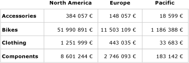
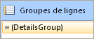
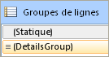
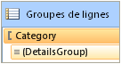
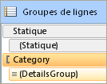
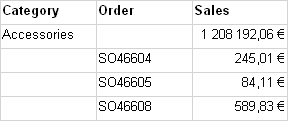

# Contrôle des en-têtes de ligne et de colonne (Générateur de rapports et SSRS)
  Une région de données de table, de matrice ou de liste peut s'étendre sur plusieurs pages horizontalement ou verticalement. Vous pouvez spécifier s'il convient de répéter des en-têtes de lignes ou de colonnes sur chaque page. Dans un convertisseur interactif, tel que le Gestionnaire de rapports ou l'aperçu de rapport, vous pouvez également spécifier si les en-têtes de lignes ou de colonnes doivent être figés pour être toujours visibles lorsque vous faites défiler un rapport horizontalement ou verticalement. Dans une table ou matrice, la première ligne contient habituellement des en-têtes de colonnes qui étiquettent des données dans chaque colonne ; la première colonne contient habituellement des en-têtes de lignes qui étiquettent les données dans chaque ligne. Pour les groupes imbriqués, vous pouvez répéter le jeu initial d'en-têtes de lignes et de colonnes qui contiennent des étiquettes de groupe. Par défaut, une région de données de liste n'inclut pas d'en-têtes.  
  
 Votre décision de répéter ou de figer les en-têtes dépend des éléments suivants :  
  
-   Pour les en-têtes de colonnes qui se répètent en haut de chaque page :  
  
    -   Si la table ou la matrice a une zone de groupe de colonnes qui s'étend horizontalement.  
  
    -   Si vous souhaitez contrôler toutes les lignes associées aux groupes de colonnes en tant qu'unité.  
  
-   Pour les en-têtes de lignes qui se répètent le long de chaque page :  
  
    -   Si la table ou la matrice a une zone de groupe de lignes qui s'étend verticalement. Les en-têtes de lignes sont pris en charge uniquement pour les groupes de lignes avec un en-tête de groupe de lignes.  
  
> [!NOTE]  
>  [!INCLUDE[ssRBRDDup](../../includes/ssrbrddup-md.md)]  
  
## Présentation des lignes et des colonnes dans une région de données de tableau matriciel  
 Une table ou matrice est un modèle pour la région de données de tableau matriciel sous-jacente. Une région de données de tableau matriciel a quatre zones possibles : la zone de groupe de lignes qui contrôle les lignes qui s'étendent verticalement sur un rapport, la zone de groupe de colonnes qui contrôle les colonnes qui s'étendent horizontalement sur un rapport, le corps qui affiche les données et l'angle. Pour savoir où définir des propriétés afin de contrôler si les en-têtes doivent être répétés ou figés, il est utile de comprendre qu'il existe deux représentations pour une région de données de tableau matriciel :  
  
-   **Dans la définition de rapport** Chaque ligne ou colonne dans une définition de région de données de tableau matriciel est un membre de tableau matriciel d’un groupe de lignes ou de colonnes spécifique. Un membre de tableau matriciel est statique ou dynamique. Un membre de tableau matriciel statique contient des étiquettes ou des sous-totaux et se répète une fois par groupe. Un membre de tableau matriciel dynamique contient des valeurs de groupe et se répète une fois par valeur unique d'un groupe, également appelé instance de groupe.  
  
-   **Sur l’aire de conception** Sur l’aire de conception, des traits en pointillés divisent une région de données de tableau matriciel en quatre zones. Chaque cellule d'une zone de région de données de tableau matriciel est organisée en lignes et colonnes. Les lignes et colonnes sont associées aux groupes, notamment le groupe de détails. Pour une région de données de tableau matriciel sélectionnée, les poignées de ligne et de colonne ainsi que les barres de surbrillance indiquent l'appartenance aux groupes. Les cellules dans la zone du groupe de lignes ou de colonnes représentent les en-têtes de groupes pour les membres de tableau matriciel. Une seule ligne ou colonne peut être associée à plusieurs groupes.  
  
     Pour plus d’informations, consultez [Région de données de tableau matriciel &#40;Générateur de rapports et SSRS&#41;](../../reporting-services/report-design/tablix-data-region-report-builder-and-ssrs.md) et [Cellules, lignes et colonnes de région de données de tableau matriciel &#40;Générateur de rapports et SSRS&#41;](../../reporting-services/report-design/tablix-data-region-cells-rows-and-columns-report-builder-and-ssrs.md).  
  
 Pour les régions de données de tableau matriciel avec des zones de groupe de lignes ou de colonnes, contrôlez les lignes et colonnes associées en définissant des propriétés sur la région de données de tableau matriciel. Dans tous les autres cas, contrôlez les lignes et colonnes en définissant des propriétés dans le volet Propriétés pour le membre de tableau matriciel sélectionné. Pour obtenir des instructions détaillées, consultez [Afficher des en-têtes de ligne et de colonne sur plusieurs pages &#40;Générateur de rapports et SSRS&#41;](../../reporting-services/report-design/display-row-and-column-headers-on-multiple-pages-report-builder-and-ssrs.md) et [Laisser les en-têtes visibles lors du défilement d’un rapport &#40;Générateur de rapports et SSRS&#41;](../../reporting-services/report-design/keep-headers-visible-when-scrolling-through-a-report-report-builder-and-ssrs.md).  
  
##   Exemples  
 Les exemples les plus courants de régions de données de tableau matriciel sont relatifs à une matrice, une table sans groupes, une table avec un groupe de lignes et un en-tête de groupe de lignes, et une table avec un groupe de lignes mais sans en-tête de groupe de lignes. Pour contrôler la façon de répéter ou de figer les en-têtes, vous devez déterminer si les lignes ou colonnes que vous souhaitez contrôler sont associées à un en-tête de groupe dans la zone de groupes de lignes ou de groupes de colonnes.  
  
 Les sections suivantes fournissent des exemples pour les mises en page courantes d'une région de données de tableau matriciel :  
  
-   [Matrice](#Matrix)  
  
-   [Table sans groupes](#TableNoGroups)  
  
-   [Table avec groupes de lignes et zone de groupe de lignes](#TableRowGroupsGroupHeader)  
  
-   [Table avec groupes de lignes mais sans zone de groupe de lignes](#TableRowGroupsNoGroupHeader)  
  
###   Matrice  
 Par défaut, une matrice simple possède un groupe de lignes et un groupe de colonnes. La figure ci-dessous illustre une matrice avec un groupe de lignes basé sur la catégorie et un groupe de colonnes basé sur la géographie :  
  
   
  
 Les traits en pointillés indiquent les quatre zones de tableau matriciel. La zone de groupe de lignes a un en-tête de groupe de lignes qui contrôle les étiquettes de catégorie dans la première colonne. De même, la zone de groupe de colonnes a un en-tête de groupe de colonnes qui contrôle les étiquettes de géographie dans la première ligne. Dans l'aperçu, comme la matrice s'étend horizontalement sur la page, la première ligne affiche les en-têtes de colonnes, comme illustré dans la figure ci-dessous :  
  
   
  
 Pour répéter ou figer les en-têtes de colonnes sur la première ligne, définissez les propriétés pour les en-têtes de colonnes sur la région de données de tableau matriciel. Les en-têtes de colonnes pour les groupes de colonnes imbriqués sont inclus automatiquement.  
  
 Pour répéter ou figer les en-têtes de lignes dans la première colonne, définissez les propriétés pour les en-têtes de lignes sur la région de données de tableau matriciel. Les en-têtes de lignes pour les groupes de lignes imbriqués sont inclus automatiquement.  
  
 [Retour au début](#Top)  
  
###   Table sans groupes de lignes  
 Par défaut, une table simple sans groupes inclut le groupe de détails. La figure ci-dessous illustre une table qui affiche la catégorie, le numéro de commande et les données de ventes :  
  
   
  
 Il n'y a pas de traits en pointillés, car la table est constituée uniquement de la zone de corps du tableau matriciel. La première ligne affiche les en-têtes de colonnes et représente un membre de tableau matriciel statique qui n'est associé à aucun groupe. La deuxième ligne affiche les données de détail et représente un membre de tableau matriciel dynamique associé au groupe de détails. La figure ci-dessous illustre la table dans l'aperçu :  
  
   
  
 Pour répéter ou figer des en-têtes de colonnes, définissez les propriétés sur le membre de tableau matriciel pour la ligne statique qui fait partie de la définition de région de données de tableau matriciel. Pour sélectionner la ligne statique, vous devez utiliser le mode Avancé du volet de regroupement. La figure ci-dessous illustre le volet Groupes de lignes :  
  
   
  
 En mode Avancé, la figure ci-dessous illustre les membres de tableau matriciel statiques et dynamiques pour les groupes de lignes dans la table :  
  
   
  
 Pour répéter ou figer les en-têtes de colonne pour le membre de tableau matriciel, sélectionnez la ligne statique étiquetée (**Statique**). Le volet Propriétés affiche les propriétés du membre du tableau matriciel que vous venez de sélectionner. En définissant des propriétés pour ce membre de tableau matriciel, vous pouvez contrôler la façon dont la première ligne se répète ou reste visible.  
  
 [Retour au début](#Top)  
  
###   Table avec groupes de lignes et zone de groupe de lignes  
 Si vous ajoutez un groupe de lignes à une table simple, une zone de groupe de lignes est ajoutée à la table sur l'aire de conception. La figure ci-dessous illustre une table avec un groupe de lignes basé sur la catégorie :  
  
   
  
 Les traits en pointillés indiquent la zone des groupes de lignes du tableau matriciel et la zone de corps du tableau matriciel. La zone de groupe de lignes a un en-tête de groupe de lignes mais aucun en-tête de groupe de colonnes. La figure ci-dessous illustre cette table dans l'aperçu :  
  
   
  
 Pour répéter ou figer des en-têtes de colonnes, utilisez la même approche que l'exemple précédent. La figure ci-dessous illustre l'affichage par défaut du volet Groupes de lignes :  
  
   
  
 Utilisez le mode **Avancé** du volet Groupes de lignes pour afficher les membres de tableau matriciel, comme illustré dans la figure ci-dessous :  
  
   
  
 Pour les membres de tableau matriciel sont répertoriés **Statique**, (**Statique**) Catégorie et (**Détails**). Un membre de tableau matriciel qui inclut des parenthèses () indique qu'il n'existe pas d'en-tête de groupe correspondant. Pour répéter ou figer des en-têtes de colonnes, sélectionnez le membre de tableau matriciel statique supérieur et définissez les propriétés dans le volet Propriétés.  
  
 [Retour au début](#Top)  
  
###   Table avec groupes de lignes et sans zone de groupe de lignes  
 Il existe plusieurs cas où une table peut avoir des groupes de lignes mais aucune zone de groupe de lignes. Cette situation se produit par exemple dans les deux cas suivants :  
  
-   Démarrez avec une table avec des groupes de lignes et une zone de groupe de lignes, puis supprimez les colonnes de la zone de groupe de lignes. Supprimez uniquement les colonnes et non les groupes. Par exemple, vous pouvez choisir une grille simple pour le format de la table.  
  
-   Mettez à niveau un rapport créé pour une version RDL précédente avant que les régions de données du tableau matriciel n'aient été introduites.  
  
 La figure ci-dessous illustre une table avec un groupe de lignes mais sans zone de groupe de lignes sur l'aire de conception :  
  
   
  
 La table a trois lignes. La première ligne contient les en-têtes de colonnes. La deuxième ligne contient la valeur de groupe et les sous-totaux. La troisième ligne contient les données de détail. Il n'y a pas de traits en pointillés, car il n'existe qu'une zone de corps du tableau matriciel. La figure ci-dessous illustre cette table dans l'aperçu :  
  
   
  
 Pour contrôler la façon dont les lignes se répètent ou restent visibles, vous devez définir les propriétés sur le membre de tableau matriciel pour chaque ligne. En mode par défaut, il n'existe aucune différence entre cet exemple et l'exemple précédent pour une table avec un groupe de lignes et un en-tête de groupe. La figure ci-dessous illustre le volet de regroupement en mode par défaut pour cette table :  
  
   
  
 Toutefois, cette structure de disposition affiche un jeu différent de membres de tableau matriciel en mode avancé. La figure ci-dessous illustre le volet de regroupement en mode avancé pour cette table :  
  
 ![Groupes de lignes, avancé, aucun en-tête de groupe] (../../reporting-services/report-design/media/rs-tableheaderdynamicwithnogroupheadercelladvanced.gif "Groupes de lignes, avancé, aucun en-tête de groupe")  
  
 Dans le volet Groupes de lignes, les membres de tableau matriciel suivants sont répertoriés : (**Statique**), (Catégorie), (**Statique**) et (**Détails**). Pour répéter ou figer les en-têtes de colonne, sélectionnez le membre de tableau matriciel (**Statique**) supérieur et définissez les propriétés dans le volet Propriétés.  
  
 [Retour au début](#Top)  
  
## Prise en charge des convertisseurs pour répéter ou figer les en-têtes  
 La prise en charge des convertisseurs varie pour répéter ou figer les en-têtes.  
  
 Les convertisseurs qui utilisent des pages physiques (PDF, Image, Impression) prennent en charge les fonctionnalités suivantes :  
  
-   Répéter les en-têtes de lignes lorsqu'une région de données de tableau matriciel s'étend horizontalement sur plusieurs pages.  
  
-   Répéter les en-têtes de colonnes lorsqu'une région de données de tableau matriciel s'étend verticalement sur plusieurs pages.  
  
 En outre, les convertisseurs qui utilisent des sauts de page conditionnels (Gestionnaire de rapports, aperçu de rapport ou contrôle de la visionneuse de rapports) prennent en charge les fonctionnalités suivantes :  
  
-   Laisser les en-têtes de lignes visibles lorsque vous faites défiler horizontalement un rapport.  
  
-   Laisser les en-têtes de colonnes visibles lorsque vous faites défiler verticalement un rapport.  
  
 Pour plus d’informations, consultez [Comportements de rendu &#40;Générateur de rapports et SSRS&#41;](../../reporting-services/report-design/rendering-behaviors-report-builder-and-ssrs.md).  
  
##  Voir aussi  
 [Filtrer, regrouper et trier des données &#40;Générateur de rapports et SSRS&#41;](../../reporting-services/report-design/filter-group-and-sort-data-report-builder-and-ssrs.md)   
 [Tables, matrices et listes &#40;Générateur de rapports et SSRS&#41;](../../reporting-services/report-design/tables-matrices-and-lists-report-builder-and-ssrs.md)   
 [Pagination dans Reporting Services &#40;Générateur de rapports et SSRS&#41;](../../reporting-services/report-design/pagination-in-reporting-services-report-builder-and-ssrs.md)   
 [Exporter des rapports &#40;Générateur de rapports et SSRS&#41;](../../reporting-services/report-builder/export-reports-report-builder-and-ssrs.md)  
  
  
