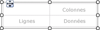
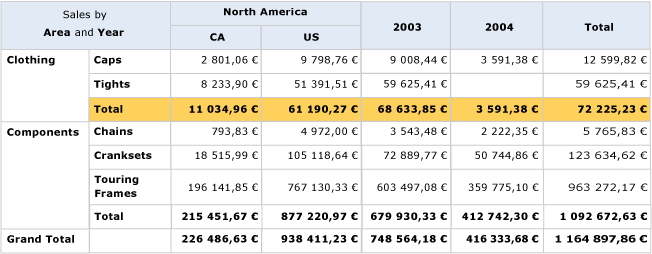

# Créer une matrice (Générateur de rapports et SSRS)
  Utilisez une matrice pour afficher des données groupées et des informations récapitulatives. Vous pouvez regrouper des données en fonction de plusieurs champs ou expressions dans des groupes de lignes et de colonnes. Une matrice fournit des fonctionnalités similaires à celles des analyses croisées et des tableaux croisés dynamiques. À l'exécution, lorsque les données de rapport sont associées aux régions de données, une matrice se développe horizontalement et verticalement sur la page. Les valeurs des cellules de matrice sont des valeurs d'agrégat limitées à l'intersection des groupes de lignes et de colonnes auxquels la cellule appartient. Vous pouvez mettre en forme les lignes et les colonnes afin de mettre en surbrillance les données que vous souhaitez mettre en évidence. Vous pouvez également inclure des bascules d'extraction qui permettent initialement de masquer les données de détail ; l'utilisateur peut ensuite cliquer sur ces bascules pour afficher plus ou moins de détails, en fonction de ses besoins.  
  
 Vous pouvez enrichir votre conception initiale en développant une matrice en vue d'améliorer l'affichage pour l'utilisateur. Pour plus d’informations, consultez [Contrôle de l’affichage de la région de données de tableau matriciel sur une page de rapport &#40;Générateur de rapports et SSRS&#41;](../../reporting-services/report-design/controlling-the-tablix-data-region-display-on-a-report-page.md).  
  
 Pour une rapide prise en main des matrices, consultez [Didacticiel : création d’un rapport de matrice &#40;Générateur de rapports&#41;](../../reporting-services/tutorial-creating-a-matrix-report-report-builder.md).  
  
> [!NOTE]  
>  Vous pouvez publier des listes hors d'un rapport en tant que parties du rapport. En savoir plus sur les [Parties des rapports (Générateur de rapports et SSRS)](../../reporting-services/report-design/report-parts-report-builder-and-ssrs.md).  
  
##   Ajout d'une matrice à votre rapport  
 Ajoutez une matrice à l'aire de conception depuis l'onglet Insérer sur le ruban. Vous avez la possibilité d'ajouter une matrice à l'aide de l'Assistant Tableau ou matrice, qui inclut la création d'une connexion à la source de données et d'un dataset ainsi que la configuration de la matrice ou l'ajout d'une matrice basée sur le modèle de matrice.  
  
> [!NOTE]  
>  L'Assistant n'est disponible que dans [!INCLUDE[ssRBDenali](../../includes/ssrbdenali-md.md)].  
  
 Pour décrire le mode de configuration d'une table du début à la fin, cette rubrique utilise le modèle de matrice.  Au départ, la matrice contient un groupe de lignes, un groupe de colonnes, une cellule d'angle et une cellule de données, comme indiqué dans l'illustration suivante.  
  
   
  
 Lorsque vous sélectionnez une matrice sur l'aire de conception, des descripteurs de ligne et de colonne apparaissent, comme indiqué dans l'illustration suivante.  
  
   
  
 Ajoutez des groupes en faisant glisser des champs de dataset vers les zones de groupes de lignes et de groupes de colonnes du volet de regroupement. Le premier champ que vous faites glisser vers le volet des groupes de lignes ou des groupes de colonnes remplace le groupe par défaut vide initial. Vous pouvez alors appliquer une mise en forme à chaque cellule, en fonction des données.  
  
   
  
 Dans l'aperçu, vous pouvez développer la matrice afin d'afficher les valeurs des groupes de lignes et des groupes de colonnes. Les cellules affichent des valeurs de résumé, comme indiqué dans l'illustration suivante.  
  
   
  
 La matrice avec laquelle vous démarrez est un modèle basé sur la région de données de tableau matriciel. Vous pouvez poursuivre le développement de la conception de votre matrice en ajoutant des groupes de lignes ou de colonnes imbriqués ou adjacents, voire en ajoutant des lignes de détails. Pour plus d’informations, consultez [Exploration de la souplesse d’une région de données de tableau matriciel &#40;Générateur de rapports et SSRS& #41;](../../reporting-services/report-design/exploring-the-flexibility-of-a-tablix-data-region-report-builder-and-ssrs.md).  
  
  
##   Ajout d'un groupe parent ou d'un groupe enfant dans une matrice  
 Pour ajouter un groupe selon un seul champ de dataset, faites glisser le champ à partir du volet des données de rapport vers la zone de groupes de lignes ou de groupes de colonnes appropriée, dans le volet de regroupement. Déposez le champ dans la hiérarchie de groupes pour définir sa relation aux groupes existants. Déposez-le au-dessus d'un groupe existant pour créer un groupe parent ou sous un groupe existant pour créer un groupe enfant.  
  
 L'insertion d'un champ dans le volet de **Regroupement** entraîne plusieurs conséquences :  
  
-   Un nouveau groupe avec un nom unique défini selon le nom du champ est créé automatiquement. L'expression de groupe prend la valeur de la référence de nom de champ simple, par exemple `[Category]`.  
  
-   Une nouvelle ligne ou colonne apparaît dans la zone du groupe de lignes ou de colonnes correspondante.  
  
-   Dans la nouvelle colonne, une cellule de groupe de lignes apparaît pour les lignes de données par défaut du dataset du rapport. Les cellules du corps du tableau matriciel pour cette ligne sont désormais des membres du groupe de lignes. Si des groupes de colonnes sont définis, les cellules de ces colonnes sont des membres de ces groupes de colonnes. Les indicateurs de groupe fournissent des signaux visuels d'appartenance de groupe pour chaque cellule.  
  
 Pour personnaliser le groupe créé, utilisez la boîte de dialogue **Groupe de tableaux matriciels** . Vous pouvez modifier le nom du groupe ; vous pouvez également modifier des expressions ou en ajouter d'autres à la définition de groupe. Pour ajouter ou supprimer des lignes dans la table, consultez [Insérer ou supprimer une ligne &#40;Générateur de rapports et SSRS&#41;](../../reporting-services/report-design/insert-or-delete-a-row-report-builder-and-ssrs.md).  
  
 Au cours de l'exécution du rapport, des en-têtes de colonnes dynamiques se développent vers la droite (ou vers la gauche, si la propriété Direction de la matrice a la valeur RTL), pour autant de colonnes que de valeurs de groupe uniques. Des lignes dynamiques se développent vers le bas de la page. Les données qui apparaissent dans les cellules du corps du tableau matriciel sont des agrégats basés sur les intersections des groupes de colonnes et des groupes de lignes, comme indiqué dans l'illustration suivante.  
  
   
  
 Dans l'aperçu, le rapport s'affiche comme illustré ci-dessous.  
  
   
  
 Pour écrire des expressions qui spécifient une étendue autre que l'étendue par défaut, vous devez spécifier le nom d'un dataset, d'une région de données ou d'un groupe dans la fonction d'agrégation. Pour calculer le pourcentage de chaque sous-catégorie dans les valeurs de groupe de la catégorie Habillement, ajoutez une colonne dans le groupe Catégorie à côté de la colonne Total, mettez en forme la zone de texte pour l'affichage du pourcentage et ajoutez une expression qui utilise l'étendue par défaut dans le numérateur, ainsi que l'étendue du groupe Catégorie dans le dénominateur, comme indiqué dans l'exemple suivant.  
  
 `=SUM(Fields!Linetotal.Value)/SUM(Fields! Linetotal.Value,"Category")`  
  
 Pour plus d’informations, consultez [Étendue des expressions pour les totaux, les agrégats et les collections intégrées &#40;Générateur de rapports et SSRS&#41;](../../reporting-services/report-design/expression-scope-for-totals-aggregates-and-built-in-collections.md).  
  
  
##   Ajout d'un groupe adjacent à une matrice  
 Pour ajouter un groupe adjacent selon un champ de dataset unique, utilisez le menu contextuel du volet de regroupement. Pour plus d’informations, consultez [Ajouter ou supprimer un groupe dans une région de données &#40;Générateur de rapports et SSRS&#41;](../../reporting-services/report-design/add-or-delete-a-group-in-a-data-region-report-builder-and-ssrs.md). L'illustration suivante présente un groupe basé sur la géographie et un groupe adjacent basé sur l'année.  
  
   
  
 Dans cet exemple, la requête a filtré des valeurs de données de sorte à inclure uniquement les valeurs pour l'Europe et correspondant aux années 2003 et 2004. Toutefois, vous pouvez définir des filtres sur chaque de groupe indépendamment. Dans l'aperçu, le rapport s'affiche comme illustré ci-dessous.  
  
   
  
 Pour ajouter une colonne de total à un groupe de colonnes adjacent, cliquez dans la cellule de définition du groupe de colonnes et utilisez la commande **Ajouter un total** . Une nouvelle colonne statique est ajoutée à côté du groupe de colonnes, avec une somme agrégée par défaut pour chaque champ numérique des lignes existantes. Pour modifier l'expression, modifiez manuellement l'agrégat par défaut, par exemple, `Avg([Sales])`. Pour plus d’informations, consultez [Ajouter un total à un groupe ou à une région de données de tableau matriciel &#40;Générateur de rapports et SSRS&#41;](../../reporting-services/report-design/add-a-total-to-a-group-or-tablix-data-region-report-builder-and-ssrs.md).  
  
  
##  Voir aussi  
 [Informations de référence sur les fonctions d’agrégation &#40;Générateur de rapports et SSRS&#41;](../../reporting-services/report-design/report-builder-functions-aggregate-functions-reference.md)   
 [Exemples d’expressions &#40;Générateur de rapports et SSRS&#41;](../../reporting-services/report-design/expression-examples-report-builder-and-ssrs.md)  
  
  
