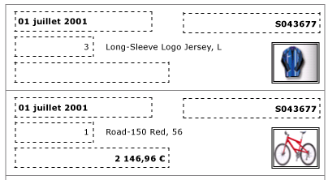
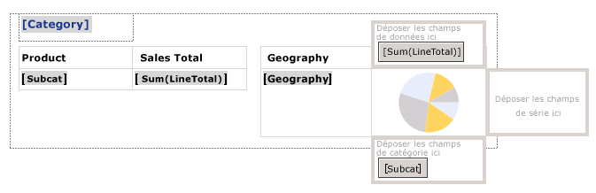
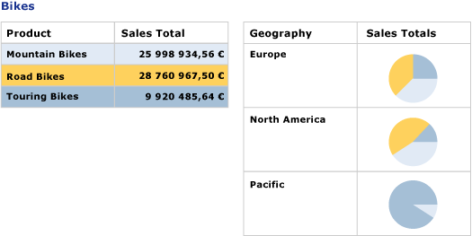

# Créer des factures et des formulaires avec des listes (Générateur de rapports et SSRS)
  Une région de données de liste est répétée avec chaque groupe ou ligne du dataset du rapport paginé [!INCLUDE[ssRSnoversion](../../includes/ssrsnoversion-md.md)] . Une liste peut être utilisée pour créer des formulaires ou des rapports de forme libre, tels que des factures, ou associés à d'autres régions de données. Vous pouvez définir des listes contenant n'importe quel nombre d'éléments de rapport. Une liste peut être imbriquée  
  
 Pour prendre en main les listes rapidement, consultez [Didacticiel : création d’un rapport de forme libre &#40;Générateur de rapports&#41;](../../reporting-services/tutorial-creating-a-free-form-report-report-builder.md).  
  
> [!NOTE]  
>  Vous pouvez publier des listes hors d'un rapport en tant que parties du rapport. En savoir plus sur les [Parties des rapports (Générateur de rapports et SSRS)](../../reporting-services/report-design/report-parts-report-builder-and-ssrs.md).  
  
##   Ajout d'une liste à votre rapport  
 Ajoutez une liste à l'aire de conception depuis l'onglet Insérer sur le ruban. Par défaut, la liste comporte initialement une cellule unique dans une ligne associée au groupe de détails.  
  
   
  
 Lorsque vous sélectionnez une liste sur l'aire de conception, des poignées de ligne et de colonne apparaissent, comme représenté dans l'illustration suivante.  
  
   
  
 La liste avec laquelle vous démarrez est un modèle basé sur la région de données de tableau matriciel. Après avoir ajouté une liste, vous pouvez continuer à améliorer la conception en changeant le contenu ou l’apparence de la liste en spécifiant des expressions de filtre, de tri ou de groupe, ou en modifiant la façon dont la liste s’affiche sur les pages du rapport. Pour plus d’informations, consultez [Contrôle de l’affichage de la région de données de tableau matriciel sur une page de rapport &#40;Générateur de rapports et SSRS&#41;](../../reporting-services/report-design/controlling-the-tablix-data-region-display-on-a-report-page.md). Bien que la liste démarre avec une colonne et une ligne uniques, vous pouvez continuer ensuite à développer votre conception de liste en ajoutant des groupes de lignes ou de colonnes imbriqués ou adjacents, ou en ajoutant des lignes de détails supplémentaires. Pour plus d’informations, consultez [Exploration de la souplesse d’une région de données de tableau matriciel &#40;Générateur de rapports et SSRS& #41;](../../reporting-services/report-design/exploring-the-flexibility-of-a-tablix-data-region-report-builder-and-ssrs.md).  
  
  
##   Affichage des données dans une disposition libre  
 Pour organiser les données de rapport dans une disposition libre au lieu de les présenter sous forme de grille, vous pouvez ajouter une liste à l'aire de conception. Faites glisser les champs du volet des données de rapportvers la cellule. Par défaut, la cellule contient un rectangle qui joue le rôle de conteneur. Déplacez chaque champ dans le conteneur jusqu'à ce que vous obteniez la conception voulue. Utilisez les lignes d'alignement qui apparaissent lorsque vous faites glisser des zones de texte dans le conteneur rectangle pour vous aider à aligner les contours verticalement et horizontalement. Supprimez l'espace vide inutile en ajustant la taille de la cellule. Pour plus d’informations, consultez [Modifier la hauteur de ligne ou la largeur de colonne &#40;Générateur de rapports et SSRS&#41;](../../reporting-services/report-design/change-row-height-or-column-width-report-builder-and-ssrs.md).  
  
 L'illustration suivante montre une liste qui affiche des informations sur une commande et comporte les champs suivants : Date, Order, Qty, Product, LineTotal et une image.  
  
   
  
 Dans l'aperçu, la liste se répète pour afficher les données de champ dans un format libre, comme représenté dans l'illustration suivante :  
  
   
  
> [!NOTE]  
>  Les traits en pointillés dans ces illustrations indiquent la disposition libre de chaque valeur de champ. En général, vous n'utilisez pas de traits en pointillés dans un rapport de production.  
  
  
##   Affichage des données avec un niveau de regroupement unique  
 Comme une liste fournit automatiquement un conteneur, vous pouvez utiliser une liste pour afficher des données regroupées avec plusieurs vues. Pour modifier la liste par défaut pour spécifier un groupe, modifiez le groupe de détails, indiquez un nouveau nom et spécifiez une expression de groupe.  
  
 Par exemple, vous pouvez incorporer un tableau et un graphique qui affiche différentes vues du même dataset. Vous pouvez ajouter un groupe à la liste afin que les éléments de rapport imbriqués soient utilisés à une seule reprise pour chaque valeur de groupe. L'illustration suivante représente une liste regroupée par catégorie de produit. Notez l'absence de ligne de détails. Deux tableaux sont imbriqués côte à côte dans la liste. Le premier tableau affiche les sous-catégories avec les ventes totales. Le deuxième tableau affiche la catégorie regroupée par zone géographique, avec un graphique représentant la distribution des sous-catégories.  
  
   
  
 Dans l'aperçu, le tableau affiche les ventes totales pour toutes les sous-catégories de bicyclettes et le tableau en regard affiche la répartition des ventes par zone géographique. Grâce à l'utilisation d'une expression pour spécifier la couleur d'arrière-plan du tableau et une palette personnalisée pour le graphique, le premier tableau fournit également la légende des couleurs du graphique.  
  
   
  
  
##  Voir aussi  
 [Informations de référence sur les fonctions d’agrégation &#40;Générateur de rapports et SSRS&#41;](../../reporting-services/report-design/report-builder-functions-aggregate-functions-reference.md)   
 [Exemples d’expressions &#40;Générateur de rapports et SSRS&#41;](../../reporting-services/report-design/expression-examples-report-builder-and-ssrs.md)  
  
  
