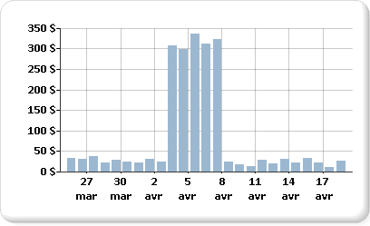

# Affichage d'une série avec plusieurs plages de données sur un graphique

  Le graphique utilisera les valeurs minimale et maximale d'une série pour calculer l'échelle de l'axe. Lorsqu'une série de votre graphique contient plusieurs plages de données, les points de données peuvent être masqués, et seuls quelques points de données sont aisément visibles sur le graphique. Par exemple, supposez qu'un rapport affiche les totaux de ventes quotidiennes sur une période de 30 jours.  
  
   
  
 Pour la majorité du mois, les ventes se situent entre 10 et 40. Toutefois, une campagne de ventes marketing d'une semaine a entraîné une hausse soudaine des ventes au début du mois d'avril. Cette modification des données de ventes produit une distribution irrégulière des points de données qui réduit la lisibilité globale du graphique.  
  
 Il existe différentes manières d'améliorer la lisibilité :  
  
-   **Activer les séparateurs d'échelle**. Si vos données représentent plusieurs jeux de plages de données, utilisez un séparateur d'échelle pour supprimer l'écart entre les plages. Un séparateur d'échelle est une ligne dessinée sur la zone de traçage pour indiquer une rupture entre les valeurs haute et basse d'une série.  
  
-   **Filtrer les valeurs inutiles**. Si des points de données masquent la plage de données importante à afficher sur le graphique, supprimez les points inutiles à l'aide d'un filtre de rapport. Pour plus d’informations sur l’ajout d’un filtre au graphique dans [!INCLUDE[ssRSnoversion](../../includes/ssrsnoversion-md.md)], consultez [Ajouter des filtres de datasets, des filtres de régions de données et des filtres de groupes &#40;Générateur de rapports et SSRS&#41;](../../reporting-services/report-design/add-dataset-filters-data-region-filters-and-group-filters.md).  
  
-   **Tracer chaque plage de données comme une série séparée pour la comparaison de plusieurs séries**. Si vous disposez de plusieurs plages de données, envisagez de les répartir en séries distinctes. Pour plus d’informations, consultez [Plusieurs séries sur un graphique &#40;Générateur de rapports et SSRS&#41;](../../reporting-services/report-design/multiple-series-on-a-chart-report-builder-and-ssrs.md).  
  
> [!NOTE]  
>  [!INCLUDE[ssRBRDDup](../../includes/ssrbrddup-md.md)]  
  
## Affichage de plusieurs plages de données à l'aide de séparateurs d'échelle  
 Lorsque vous activez un séparateur d'échelle, le graphique calcule l'emplacement où tracer une ligne dans le graphique. La séparation doit être suffisante entre les plages pour dessiner un séparateur d'échelle. Par défaut, un séparateur d'échelle ne peut être ajouté que si la séparation entre les plages de données représente au moins 25 % du graphique.  
  
   
  
> [!NOTE]  
>  Vous ne pouvez pas spécifier où placer un séparateur d'échelle sur un graphique. Toutefois, vous pouvez modifier le mode de calcul du séparateur d'échelle, décrit plus loin dans cette rubrique.  
  
 Si vous activez un séparateur d’échelle, mais qu’il n’apparaît pas, bien que la distance soit suffisante entre les plages de données, vous pouvez affecter à la propriété CollapsibleSpaceThreshold une valeur inférieure à 25. La propriété CollapsibleSpaceThreshold spécifie le pourcentage d’espace réductible nécessaire entre les plages de données. Pour plus d’informations, consultez [Ajouter des séparateurs d’échelle à un graphique &#40;Générateur de rapports et SSRS&#41;](../../reporting-services/report-design/add-scale-breaks-to-a-chart-report-builder-and-ssrs.md).  
  
 Les graphiques prennent en charge jusqu'à cinq séparateurs d'échelle par graphique ; toutefois, en affichant plusieurs séparateurs, le graphique peut devenir illisible. Si vous disposez de plusieurs plages de données, envisagez d'utiliser une méthode différente pour afficher ces données. Pour plus d’informations, consultez [Plusieurs séries sur un graphique &#40;Générateur de rapports et SSRS&#41;](../../reporting-services/report-design/multiple-series-on-a-chart-report-builder-and-ssrs.md).  
  
## Scénarios de séparateurs d'échelle non pris en charge  
 Les séparateurs d'échelle ne sont pas pris en charge dans les scénarios de graphiques suivants :  
  
-   Le graphique est en 3D.  
  
-   Un axe des ordonnées logarithmique a été spécifié.  
  
-   La valeur minimale ou maximale de l'axe des ordonnées a été définie de façon explicite.  
  
-   Le type de graphique est polaire, en radar, à secteurs, en anneau, en entonnoir, en pyramide ou tout graphique empilé.  
  
 Un exemple de graphique avec séparations d'échelle est disponible sous forme d'exemple de rapport. Pour plus d'informations sur le téléchargement de cet exemple de rapport et d'autres rapports, consultez [Exemples de rapports du Générateur de rapports et du Concepteur de rapports](http://go.microsoft.com/fwlink/?LinkId=198283).  

## Étapes suivantes

[Plusieurs séries sur un graphique](../../reporting-services/report-design/multiple-series-on-a-chart-report-builder-and-ssrs.md)   
[Mise en forme d’un graphique](../../reporting-services/report-design/formatting-a-chart-report-builder-and-ssrs.md)   
[Effets 3D, de biseau et autres dans un graphique](../../reporting-services/report-design/chart-effects-3d-bevel-and-other-report-builder.md)   
[Graphiques](../../reporting-services/report-design/charts-report-builder-and-ssrs.md)   
[Boîte de dialogue Propriétés de l’axe, Options de l’axe](http://msdn.microsoft.com/library/b276e210-7a12-48ae-971b-7dabae51df11)   
[Regrouper des petits secteurs sur un graphique à secteurs](../../reporting-services/report-design/collect-small-slices-on-a-pie-chart-report-builder-and-ssrs.md)  

D’autres questions ? [Essayez de poser une question dans le forum Reporting Services](http://go.microsoft.com/fwlink/?LinkId=620231)
