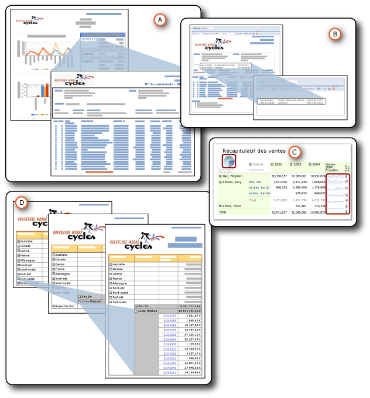

# Extraction, exploration, sous-rapports et régions de données imbriquées
  Vous pouvez organiser les données de plusieurs façons pour montrer une relation du général au particulier.  Vous pouvez placer toutes les données dans le rapport et les masquer jusqu'à ce qu'un utilisateur clique pour afficher des détails ; il s'agit d'une action d' *exploration* . Vous pouvez afficher les données dans une région de données, telle qu'un tableau ou un graphique, *imbriquée* à l'intérieur d'une autre région de données, telle qu'un tableau ou une matrice. Vous pouvez afficher les données dans un *sous-rapport* intégralement contenu dans un rapport principal. Sinon, vous pouvez placer les données de détail dans des rapports d' *extraction* , des rapports distincts qui s'affichent lorsqu'un utilisateur clique sur un lien.  
  
   
  
 A. Rapport d'extraction  
  
 B. sous-rapport  
  
 C. Régions de données imbriquées  
  
 D. Action d'extraction  
  
 Tous les éléments ci-dessus ont des similitudes, mais leurs visées et leurs fonctionnalités sont différentes. Deux d'entre eux, les rapports d'extraction et les sous-rapports, sont en fait des rapports distincts. L'imbrication est un moyen de placer une région de données à l'intérieur d'une autre région de données. L'exploration est une action que vous pouvez appliquer à tout élément de rapport pour masquer et afficher d'autres éléments de rapport. Par conséquent, vous disposez de plusieurs moyens pour organiser et afficher les données afin d'aider les utilisateurs à mieux comprendre votre rapport.  
  
> [!NOTE]  
>  [!INCLUDE[ssRBRDDup](../../includes/ssrbrddup-md.md)]  
  
##   Résumé des caractéristiques  
 Ce tableau résume les différentes caractéristiques. Les détails sont décrits dans des sections distinctes plus loin dans cette rubrique. L'exploration n'est pas incluse dans ces comparaisons, car vous pouvez appliquer son action d'affichage et de masquage à n'importe quel élément de rapport.  
  
|Caractéristique|Sous-rapport|extraction|imbriquée|  
|-----------|---------------|------------------|------------|  
|Utilisation du dataset du rapport principal|Identique ou différent|Identique ou différent|Identique|  
|Récupération des données|Données récupérées en même temps que le rapport principal|Données récupérées à chaque rapport d'extraction|Données toutes récupérées en même temps que le rapport principal|  
|Traitement et rendu|Avec le rapport principal|Après avoir cliqué sur le lien|Avec le rapport principal.|  
|Performances|S'exécute plus lentement (mais récupère toutes les données avec le rapport principal)|S'exécute plus vite (mais ne récupère pas toutes les données avec le rapport principal)|S'exécute plus vite (et récupère toutes les données avec le rapport principal)|  
|Utilisation de paramètres|Oui|Oui|non|  
|Réutilisation possible|En tant que rapport, sous-rapport ou rapport d'extraction dans d'autres rapports|En tant que rapport, sous-rapport ou rapport d'extraction dans d'autres rapports|Réutilisation impossible.|  
|Emplacement|Hors du rapport principal, sur un serveur de rapports identique ou différent|Hors du rapport principal, sur un serveur de rapports identique|Dans le rapport principal|  
|Affichage|Dans le rapport principal|Dans un autre rapport|Dans le rapport principal|  
  
  
##   Détails des caractéristiques  
  
###   Datasets utilisés  
 Les sous-rapports et les rapports d'extraction peuvent utiliser soit le même dataset que le rapport principal, soit un autre dataset. Les régions de données imbriquées utilisent le même dataset.  
  
###   Récupération de données  
 Les sous-rapports et les régions de données imbriquées récupèrent les données en même temps que le rapport principal. Ce n'est pas le cas des rapports d'extraction. Chaque rapport d'extraction récupère les données lorsqu'un utilisateur clique sur chaque lien. Cela est important si les données du rapport principal et du sous-rapport doivent être récupérées en même temps.  
  
###   Traitement et rendu  
 Un sous-rapport est traité dans le cadre du rapport principal. Par exemple, si un sous-rapport qui affiche des informations de détails des commandes est ajouté à une cellule de table dans la ligne de détails, le sous-rapport est traité une fois par ligne de la table et est rendu dans le cadre du rapport principal. Un rapport d'extraction est quant à lui traité et rendu uniquement lorsque l'utilisateur clique sur le lien d'extraction dans le rapport principal de résumé.  
  
###   Performance  
 Lorsque vous réfléchissez à ce que vous allez choisir, songez à utiliser une région de données à la place d'un sous-rapport, en particulier si le sous-rapport ne doit pas être utilisé par plusieurs rapports. Étant donné que le serveur de rapports traite chaque instance d'un sous-rapport comme un rapport distinct, des problèmes de performance peuvent se produire. Les régions de données fournissent une grande partie des fonctionnalités et de la flexibilité des sous-rapports, mais avec de meilleures performances. En outre, les rapports d'extraction offrent de meilleures performances que les sous-rapports, car ils ne récupèrent pas toutes les données en même temps que le rapport principal.  
  
###   Utilisation de paramètres  
 Les rapports d'extraction et les sous-rapports ont en général des paramètres de rapport qui spécifient les données à afficher. Par exemple, lorsque vous cliquez sur un numéro de commande client dans un rapport principal, le rapport d'extraction qui s'ouvre accepte ce numéro en tant que paramètre, puis affiche toutes les données correspondantes. Lorsque vous créez le lien dans le rapport principal, vous spécifiez des valeurs à transmettre en tant que paramètres au rapport d'extraction.  
  
 Pour créer un rapport d'extraction ou un sous-rapport, vous devez concevoir le rapport d'extraction ou sous-rapport cible en premier, puis créer une action d'extraction ou ajouter la référence au rapport principal.  
  
###   Possibilité de réutilisation  
 Les sous-rapports et les rapports d'extraction sont des rapports distincts. Par conséquent, ils peuvent être utilisés dans plusieurs rapports ou être affichés en tant que rapports autonomes. Les régions de données imbriquées ne sont pas réutilisables. Vous ne pouvez pas les enregistrer en tant que parties de rapports, car elles sont imbriquées dans une région de données. Vous pouvez enregistrer la région de données conteneur en tant que partie de rapport, mais pas la région de données imbriquée.  
  
###   Emplacement  
 Les sous-rapports et les rapports d'extraction sont des rapports distincts ; par conséquent, ils sont stockés hors du rapport principal. Les sous-rapports peuvent se trouver sur un serveur de rapports identique ou différent, mais les rapports d'extraction doivent se trouver sur le même serveur de rapports. Les régions de données imbriquées font partie de rapport principal.  
  
###   Affichage  
 Les sous-rapports et les régions de données imbriquées sont affichés dans le rapport principal. Les rapports d'extraction sont affichés de manière autonome.  
  
  
##   Dans cette section  
 [Rapports d’extraction &#40;Générateur de rapports et SSRS&#41;](../../reporting-services/report-design/drillthrough-reports-report-builder-and-ssrs.md)  
 Décrit les rapports qui s'ouvrent lorsqu'un utilisateur clique sur un lien dans un rapport principal.  
  
 [Sous-rapports &#40;Générateur de rapports et SSRS&#41;](../../reporting-services/report-design/subreports-report-builder-and-ssrs.md)  
 Décrit les rapports qui s'affichent dans le corps d'un rapport principal.  
  
 [Régions de données imbriquées &#40;Générateur de rapports et SSRS&#41;](../../reporting-services/report-design/nested-data-regions-report-builder-and-ssrs.md)  
 Décrit l'imbrication d'une région de données dans une autre, par exemple un graphique imbriqué dans une matrice.  
  
 [Action d’exploration &#40;Générateur de rapports et SSRS&#41;](../../reporting-services/report-design/drilldown-action-report-builder-and-ssrs.md)  
 Décrit l'utilisation de l'action d'exploration pour masquer et afficher des éléments de rapport.  
  
 [Spécification de chemins d’accès à des éléments externes &#40;Générateur de rapports et SSRS&#41;](../../reporting-services/report-design/specifying-paths-to-external-items-report-builder-and-ssrs.md)  
 Explique comment faire référence aux éléments externes au fichier de définition de rapport.  
  
##  Voir aussi  
 [Paramètres de rapport &#40;Générateur de rapports et Concepteur de rapports&#41;](../../reporting-services/report-design/report-parameters-report-builder-and-report-designer.md)  
  
  
