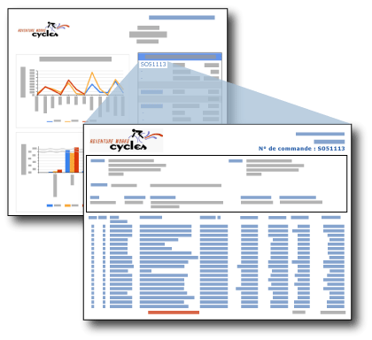

# Rapports d'extraction (Générateur de rapports et SSRS)
  Un rapport d'extraction est un rapport que l'utilisateur ouvre en cliquant sur un lien situé dans un autre rapport. Il contient en général des détails sur un élément figurant dans le rapport de synthèse d'origine. Par exemple, dans cette illustration, le rapport de synthèse des ventes répertorie les commandes client et les totaux. Lorsque l'utilisateur clique sur un numéro de commande dans la liste de résumé, un autre rapport s'affiche pour présenter des informations sur la commande en question.  
  
   
  
 Les données du rapport d'extraction ne sont récupérées que lorsque l'utilisateur clique sur le lien situé dans le rapport principal qui ouvre le rapport d'extraction. Si les données du rapport principal et du rapport d'extraction doivent être récupérées en même temps, envisagez d'utiliser un sous-rapport. Pour plus d’informations, consultez [Sous-rapports &#40;Générateur de rapports et SSRS&#41;](../../reporting-services/report-design/subreports-report-builder-and-ssrs.md).  
  
> [!NOTE]  
>  Lorsque vous utilisez le Générateur de rapports, vous devez être connecté à un serveur de rapports afin d'afficher le rapport d'extraction qui s'ouvre lorsque vous cliquez sur le lien d'extraction dans le rapport principal.  
  
 Pour commencer à utiliser rapidement les rapports d’extraction, consultez [Didacticiel : création d’un rapport principal et d’un rapport d’extraction &#40;Générateur de rapports&#41;](../../reporting-services/tutorial-creating-drillthrough-and-main-reports-report-builder.md). 
   
## Paramètres des rapports d'extraction  
 Un rapport d'extraction comprend généralement des paramètres qui lui sont passés par le rapport de synthèse. Dans l'exemple de rapport de résumé sur les ventes, le rapport de résumé inclut le champ [OrderNumber] dans une zone de texte dans une cellule de table. Le rapport d'extraction comporte un paramètre qui prend le numéro de commande en tant que valeur. Lorsque vous définissez le lien de rapport d'extraction sur la zone de texte pour [OrderNumber], vous affectez également au paramètre du rapport cible la valeur [OrderNumber]. Lorsque l'utilisateur clique sur le numéro de commande dans le rapport de synthèse, le rapport détaillé cible s'ouvre et affiche les informations concernant le numéro commande en question. Pour voir des instructions sur la personnalisation des rapports d’extraction en fonction des valeurs de paramètres, consultez [Paramètres de rapport &#40;Générateur de rapports et Concepteur de rapports&#41;](../../reporting-services/report-design/report-parameters-report-builder-and-report-designer.md) et [Fonction InScope &#40;Générateur de rapports et SSRS&#41;](../../reporting-services/report-design/report-builder-functions-inscope-function.md).  
  
## Conception du rapport d'extraction  
 Pour créer un rapport d'extraction, vous devez d'abord concevoir le rapport d'extraction avant de créer l'action d'extraction dans le rapport principal.  
  
 Un rapport d'extraction peut consister en un rapport quelconque. En général, le rapport d'extraction accepte un ou plusieurs paramètres pour spécifier les données à afficher, en fonction du lien du rapport principal. Par exemple, si le lien du rapport principal a été défini pour une commande client, le numéro de la commande est transmis au rapport d'extraction.  
  
## Création d'une action d'extraction dans le rapport principal  
 Vous pouvez ajouter des liens d'extraction aux zones de texte (notamment du texte contenu dans les cellules d'un tableau ou d'une matrice), des images, des graphiques, des jauges et tout autre élément de rapport qui a une page de propriétés Action. Pour plus d’informations, consultez [Ajouter une action d’extraction à un rapport &#40;Générateur de rapports et SSRS&#41;](../../reporting-services/report-design/add-a-drillthrough-action-on-a-report-report-builder-and-ssrs.md).  
  
 Vous pouvez créer l'action d'extraction dans le rapport principal sous la forme d'une action de rapport ou d'URL. Pour une action de rapport, le rapport d'extraction doit se trouver sur le même serveur de rapports que le rapport principal. Pour une action d'URL, le rapport doit se trouver à l'emplacement indiqué par l'URL complète. La manière de spécifier un rapport peut varier selon que vous utilisez un serveur de rapports ou un site SharePoint intégré à un serveur de rapports. Si le serveur de rapports est configuré en mode intégré SharePoint, seules les actions d'URL sont prises en charge.  
  
 Pour plus d’informations, consultez [Ajouter une action d’extraction à un rapport &#40;Générateur de rapports et SSRS&#41;](../../reporting-services/report-design/add-a-drillthrough-action-on-a-report-report-builder-and-ssrs.md) et [Spécification de chemins d’accès à des éléments externes &#40;Générateur de rapports et SSRS&#41;](../../reporting-services/report-design/specifying-paths-to-external-items-report-builder-and-ssrs.md).  
  
## Affichage d'un rapport d'extraction  
 Pour afficher un rapport de résumé doté de liens d'extraction après sa publication, vous devez vérifier que les rapports d'extraction résident sur le même serveur de rapports que le rapport de résumé. Dans tous les cas, l'utilisateur doit être autorisé à consulter le rapport d'extraction.  
  
##  Voir aussi  
 [Extraction, exploration, sous-rapports et régions de données imbriquées &#40;Générateur de rapports et SSRS&#41;](../../reporting-services/report-design/drillthrough-drilldown-subreports-and-nested-data-regions.md)  
  
  
