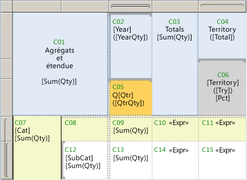

# <a name="expression-scope-for-totals-aggregates-and-built-in-collections"></a>Étendue des expressions pour les totaux, les agrégats et les collections intégrées
  En écrivant des expressions, vous constaterez que le terme *étendue* est utilisé dans plusieurs contextes. L'étendue peut spécifier les données à utiliser pour l'évaluation d'une expression, le jeu de zones de texte dans une page rendue, le jeu des éléments de rapport qui peuvent être affichés ou masqués selon un élément de bascule. Vous verrez le terme *étendue* dans les rubriques relatives à une évaluation d'expression, une syntaxe de fonction d'agrégation, une visibilité conditionnelle et également dans les messages d'erreur liés à ces domaines. Utilisez les descriptions suivantes pour mieux différencier les significations du terme *étendue* qui s'appliquent :  
  
-   **Étendue de données** L'étendue de données est une hiérarchie d'étendues que le processeur de rapports utilise lorsqu'il combine les données et la disposition de rapport, et génère des régions de données telles que les tables et graphiques sur lesquels afficher les données. La compréhension de l'étendue de données vous aide à obtenir les résultats souhaités lorsque vous effectuez les opérations suivantes :  
  
    -   **Écrire des expressions qui utilisent des fonctions d'agrégation** Indiquez les données à agréger. L'emplacement de l'expression dans le rapport influence les données qui sont dans l'étendue pour les calculs d'agrégats.  
  
    -   **Ajouter des graphiques sparkline à une table ou matrice** Indiquez une plage minimale et maximale pour les axes de graphique afin d'aligner les instances imbriquées dans une table ou matrice.  
  
    -   **Ajouter des indicateurs à une table ou matrice** Indiquez une échelle minimale et maximale pour la jauge afin d'aligner les instances imbriquées dans une table ou matrice.  
  
    -   **Écrire des expressions de tri** Indiquez une étendue contenante que vous pouvez utiliser pour synchroniser l'ordre de tri parmi plusieurs éléments de rapport associés.  
  
-   **Étendue de cellule** L'étendue de cellule est l'ensemble de groupes de lignes et de colonnes dans une région de données de tableau matriciel auquel une cellule appartient. Par défaut, chaque cellule de tableau matriciel contient une zone de texte. La valeur de la zone de texte est l'expression. L'emplacement de la cellule détermine indirectement les étendues de données que vous pouvez spécifier pour les calculs d'agrégats dans l'expression.  
  
-   **Étendue d'élément de rapport** L'étendue d'élément de rapport fait référence à la collection d'éléments dans une page de rapport rendue. Le processeur de rapports combine les données et les éléments de disposition de rapport pour produire une définition de rapport compilé. Pendant ce processus, les régions de données telles que les tables et matrices se développent autant que nécessaire pour afficher toutes les données de rapport. Le rapport compilé est ensuite traité par un convertisseur de rapport. Le convertisseur de rapport détermine les éléments de rapport qui apparaissent sur chaque page. Sur un serveur de rapports, chaque page est rendue telle que vous l'affichez. Lorsque vous exportez un rapport, toutes les pages sont rendues. La compréhension de l'étendue d'élément de rapport vous aide à obtenir les résultats souhaités lorsque vous effectuez les opérations suivantes :  
  
    -   **Ajouter des éléments de bascule** Indiquez une zone de texte pour ajouter l'élément de bascule qui contrôle la visibilité d'un élément de rapport. Vous pouvez ajouter un élément de bascule uniquement aux zones de texte qui sont dans l'étendue de l'élément de rapport que vous souhaitez basculer.  
  
    -   **Écrire des expressions dans les en-têtes et pieds de page** Indiquez des valeurs dans les expressions dans les zones de texte ou d'autres éléments de rapport qui s'affichent dans la page rendue.  
  
 La compréhension des étendues vous aide à écrire avec succès des expressions qui vous donnent les résultats souhaités.  
  
> [!NOTE]  
>  [!INCLUDE[ssRBRDDup](../../includes/ssrbrddup-md.md)]  
  
##  <a name="DataScope"></a> Présentation de l'étendue de données et de la hiérarchie de données  
 L'étendue de données spécifie un jeu de données de rapport. L'étendue de données a une hiérarchie naturelle avec une relation contenant-contenu inhérente. Des étendues supérieures dans la hiérarchie contiennent des étendues qui sont inférieures dans la hiérarchie. La liste suivante d'étendues de données décrit la hiérarchie dans l'ordre du plus grand nombre au plus petit nombre de données :  
  
-   **Datasets, une fois les filtres de dataset appliqués** Spécifie le dataset de rapport lié à la région de données ou à un élément de rapport dans le corps du rapport. Les données utilisées pour l'agrégation proviennent du dataset du rapport après l'application des expressions de filtre du dataset. Pour les datasets partagés, cela représente à la fois les filtres dans la définition de dataset partagé et les filtres dans l'instance de dataset partagé dans le rapport.  
  
-   **Régions de données** Spécifie les données provenant de la région de données après l'application des expressions de filtre et de tri de la région de données. Les filtres de groupe ne sont pas utilisés lors du calcul d'agrégats pour les régions de données.  
  
-   **Groupes de régions de données, une fois les filtres de groupe appliqués** Spécifie les données après l'application des expressions de groupe et des filtres de groupe pour le groupe parent et les groupes enfants. Pour une table, il s'agit des groupes de lignes et de colonnes. Pour un graphique, il s'agit des groupes de séries et de catégories. Dans le cadre de l'identification de la relation contenant-contenu de l'étendue, chaque groupe parent contient ses groupes enfants.  
  
-   **Régions de données imbriquées** Spécifie les données de la région de données imbriquée dans le contexte de la cellule à laquelle elles ont été ajoutées, et après l'application des expressions de filtre et de tri de la région des données imbriquée.  
  
-   **Groupes de lignes et de colonnes pour les régions de données imbriquées** Spécifie les données après l'application des expressions de groupe et des filtres de groupe de la région des données imbriquée.  
  
 La compréhension des étendues contenantes et contenues est importante lorsque vous écrivez des expressions qui incluent des fonctions d'agrégation.  
  
##  <a name="Aggregates"></a> Étendue de cellule et expressions  
 Lorsque vous spécifiez une étendue, vous indiquez au processeur de rapports les données à utiliser pour un calcul d'agrégats. Selon l'expression et l'emplacement de l'expression, les étendues valides peuvent être des *étendues contenantes*, également appelées étendues parents, ou des *étendues contenues*, également appelées étendues enfants ou imbriquées. En général, vous ne pouvez pas spécifier d'instance de groupe individuelle dans un calcul d'agrégats. Vous pouvez spécifier un agrégat entre toutes les instances de groupe.  
  
 Lorsque le processeur de rapports combine les données d'un dataset de rapport avec la région de données de tableau matriciel, il évalue les expressions de groupe et crée les lignes et colonnes nécessaires pour représenter les instances de groupe. La valeur des expressions dans une zone de texte dans chaque cellule de tableau matriciel est évaluée dans le contexte de l'étendue de cellule. Selon la structure de tableau matriciel, une cellule peut appartenir à plusieurs groupes de lignes et groupes de colonnes. Pour les fonctions d'agrégation, vous pouvez spécifier l'étendue à utiliser à l'aide de l'une des étendues suivantes :  
  
-   **Étendue par défaut** Données qui sont dans l'étendue pour les calculs lorsque le processeur de rapports évalue une expression. L'étendue par défaut est l'ensemble de groupes les plus profonds auquel la cellule ou le point de données appartient. Pour une région de données de tableau matriciel, l'ensemble peut inclure des groupes de lignes et de colonnes. Pour une région de données de graphique, l'ensemble peut inclure des groupes de catégories et de séries.  
  
-   **Étendue nommée** Nom d'un dataset, d'une région de données ou d'un groupe de régions de données qui est dans l'étendue pour l'expression. Pour les calculs d'agrégats, vous pouvez spécifier une étendue contenante. Vous ne pouvez pas spécifier d'étendue nommée à la fois pour un groupe de lignes et un groupe de colonnes dans une expression unique. Vous ne pouvez pas spécifier d'étendue contenue à moins que l'expression ne soit pour un agrégat d'un agrégat.  
  
     L'expression suivante génère des années d'intervalle entre SellStartDate et LastReceiptDate. Ces champs sont compris dans deux datasets différents, DataSet1 et DataSet2. La [fonction First &#40;Générateur de rapports et SSRS&#41;](../../reporting-services/report-design/report-builder-functions-first-function.md), qui est une fonction d’agrégation, renvoie la première valeur de SellStartDate dans DataSet1 et la première valeur de LastReceiptDate dans DataSet2.  
  
    ```  
    =DATEDIFF(“yyyy”, First(Fields!SellStartDate.Value, "DataSet1"), First(Fields!LastReceiptDate.Value, "DataSet2"))  
    ```  
  
-   **Étendue de domaine** Également appelée étendue de synchronisation. Type d'étendue de données qui s'applique à l'évaluation d'expression pour des régions de données imbriquées. L'étendue de domaine est utilisée pour spécifier des agrégats sur toutes les instances d'un groupe afin que les instances imbriquées puissent être facilement alignées et comparées. Par exemple, vous pouvez aligner la plage et la hauteur pour les graphiques sparkline incorporés dans une table afin que les valeurs s'alignent.  
  
 Dans certains emplacements d'un rapport, vous devez spécifier une étendue. Par exemple, vous devez spécifier le nom du dataset à utiliser pour une zone de texte sur l'aire de conception : `=Max(Fields!Sales.Value,"Dataset1")`. Dans d'autres emplacements, il existe une étendue par défaut implicite. Par exemple, si vous ne spécifiez pas d'agrégat pour une zone de texte dans une étendue du groupe, l'agrégat par défaut First est utilisé.  
  
 Chaque rubrique de fonction d'agrégation répertorie les étendues qui sont valides pour son utilisation. Pour plus d’informations, consultez [Informations de référence sur les fonctions d’agrégation &#40;Générateur de rapports et SSRS&#41;](../../reporting-services/report-design/report-builder-functions-aggregate-functions-reference.md).  
  
##  <a name="Examples"></a> Exemple d'expressions d'agrégation pour une région de données de table  
 L'écriture d'expressions qui spécifient des étendues non définies par défaut demande un peu de pratique. Pour vous aider à comprendre les différentes étendues, utilisez l'illustration et la table suivantes. L'illustration étiquette chaque cellule dans une table des informations des ventes qui affiche la quantité d'articles vendus par an et trimestre ainsi que par secteur de vente. Notez les signaux visuels sur les handles de ligne et de colonne qui affichent la structure des groupes de lignes et de colonnes, en indiquant les groupes imbriqués. La table a la structure suivante :  
  
-   Un en-tête de table qui contient la cellule d'angle et trois lignes qui incluent les en-têtes de groupe de colonnes.  
  
-   Deux groupes de lignes imbriqués basés sur la catégorie nommée Cat et la sous-catégorie nommée SubCat.  
  
-   Deux groupes de colonnes imbriqués basés sur l'année nommée Year et le trimestre nommé Qtr.  
  
-   Une colonne de totaux statique étiquetée Totals.  
  
-   Un groupe de colonnes adjacent basé sur le secteur de vente nommé Territory.  
  
 L'en-tête de colonne pour le groupe de secteur a été fractionné en deux cellules à des fins d'affichage. La première cellule affiche le nom de secteur et les totaux, et la deuxième cellule contient le texte de l'espace réservé qui a calculé la contribution en pourcentage pour chaque secteur à toutes les ventes.  
  
   
  
 Disons que le dataset est nommé DataSet1 et que la table est nommée Tablix1. Le tableau suivant répertorie l'étiquette de cellule, l'étendue par défaut et les exemples. Les valeurs pour le texte de l'espace réservé sont affichées par une syntaxe d'expression.  
  
|Cellule|Étendue par défaut|Étiquettes d'espace réservé|Valeurs de texte ou d'espace réservé|  
|----------|-------------------|------------------------|--------------------------------|  
|C01|Tablix1|[Sum(Qty)]|Agrégats et étendue<br /><br /> `=Sum(Fields!Qty.Value)`|  
|C02|Groupe de colonnes externe "Year"|[Year]<br /><br /> ([YearQty])|`=Fields!Year.Value`<br /><br /> `=Sum(Fields!Qty.Value)`|  
|C03|Tablix1|[Sum(Qty)]|Totaux<br /><br /> `=Sum(Fields!Qty.Value)`|  
|C04|Groupe de colonnes homologue "Territory"|([Total])|Territory<br /><br /> `=Sum(Fields!Qty.Value)`|  
|C05|Groupe interne "Qtr"|[Qtr]<br /><br /> ([QtrQty])|Q<br /><br /> `=Fields!Qtr.Value`<br /><br /> `=Sum(Fields!Qty.Value)`|  
|C06|Groupe de colonnes homologue "Territory"|[Territory]<br /><br /> ([Tty])<br /><br /> [Pct]|`=Fields!Territory.Value`<br /><br /> `=Sum(Fields!Qty.Value)`<br /><br /> `=FormatPercent(Sum(Fields!Qty.Value,"Territory")/Sum(Fields!Qty.Value,"Tablix1"),0) & " of " & Sum(Fields!Qty.Value,"Tablix1")`|  
|C07|Groupe de lignes externe "Cat"|[Cat]<br /><br /> [Sum(Qty)]|`=Fields!Cat.Value`<br /><br /> `=Sum(Fields!Qty.Value)`|  
|C08|Identique à C07|||  
|C09|Groupe de lignes externe "Cat" et groupe de colonnes interne "Qtr"|[Sum(Qty)]|`=Sum(Fields!Qty.Value)`|  
|C10|Identique à C07|<\<Expr>>|`=Sum(Fields!Qty.Value) & ": " & FormatPercent(Sum(Fields!Qty.Value)/Sum(Fields!Qty.Value,"Tablix1"),0) & " of " & Sum(Fields!Qty.Value,"Tablix1")`|  
|C11|Groupe de lignes externe "Cat" et groupe de colonnes "Territory"|<\<Expr>>|`=Sum(Fields!Qty.Value) & ": " & FormatPercent(Sum(Fields!Qty.Value)/Sum(Fields!Qty.Value,"Territory"),0) & " of " & Sum(Fields!Qty.Value,"Territory")`|  
|C12|Groupe de lignes interne "Subcat"|[Subcat]<br /><br /> [Sum(Qty)]|`=Fields!SubCat.Value`<br /><br /> `=Sum(Fields!Qty.Value)`|  
|C13|Groupe de lignes interne "Subcat" et groupe de colonnes interne "Qtr"|[Sum(Qty)]|`=Sum(Fields!Qty.Value)`|  
|C14|Groupe de lignes interne "Subcat"|<\<Expr>>|`=Sum(Fields!Qty.Value) & ": " & FormatPercent(Sum(Fields!Qty.Value)/Sum(Fields!Qty.Value,"Cat"),0) & " of " & Sum(Fields!Qty.Value,"Cat")`|  
|C15|Groupe de lignes interne "Subcat" et groupe de colonnes "Territory"|<\<Expr>>|`=Sum(Fields!Qty.Value) & ": " & FormatPercent(Code.CalcPercentage(Sum(Fields!Qty.Value),Sum(Fields!Qty.Value,"Cat")),0) & " of " & Sum(Fields!Qty.Value,"Cat")`|  
  
 Pour plus d’informations sur l’interprétation des signaux visuels des régions de données de tableau matriciel, consultez [Cellules, lignes et colonnes de région de données de tableau matriciel &#40;Générateur de rapports et SSRS&#41;](../../reporting-services/report-design/tablix-data-region-cells-rows-and-columns-report-builder-and-ssrs.md). Pour plus d’informations sur la région de données de tableau matriciel, consultez [Cellules, lignes et colonnes de région de données de tableau matriciel &#40;Générateur de rapports et SSRS&#41;](../../reporting-services/report-design/tablix-data-region-cells-rows-and-columns-report-builder-and-ssrs.md). Pour plus d’informations sur les expressions et les agrégats, consultez [Utilisation d’expressions dans les rapports &#40;Générateur de rapport et SSRS&#41;](../../reporting-services/report-design/expression-uses-in-reports-report-builder-and-ssrs.md) et [Informations de référence sur les fonctions d’agrégation &#40;Générateur de rapports et SSRS&#41;](../../reporting-services/report-design/report-builder-functions-aggregate-functions-reference.md).  
  
  
##  <a name="Sparklines"></a> Synchronisation des échelles pour les graphiques sparkline  
 Pour comparer des valeurs en fonction du temps sur l'axe horizontal pour un graphique sparkline imbriqué dans une table ou matrice, vous pouvez synchroniser les valeurs de groupe de la catégorie. Cette opération se nomme alignement des axes. En sélectionnant l'option pour aligner des axes, le rapport définit automatiquement les valeurs minimale et maximale pour un axe, et fournit des espaces réservés pour les valeurs d'agrégation qui n'existent pas dans chaque catégorie. Les valeurs dans le graphique sparkline sont ainsi alignées sur chaque catégorie et vous pouvez comparer les valeurs pour chaque ligne de données agrégées. En sélectionnant cette option, vous changez l'étendue de l'évaluation d'expression en *étendue de domaine*. La définition de l'étendue de domaine pour un graphique imbriqué contrôle également indirectement l'affectation de couleur pour chaque catégorie dans la légende.  
  
 Par exemple, dans un graphique sparkline qui affiche des tendances hebdomadaires, supposez qu'une ville avait les chiffres des ventes pour 3 mois et une autre ville avait les chiffres des ventes pour 12 mois. Sans des échelles synchronisées, le graphique sparkline pour la première ville n'aurait que 3 barres qui seraient beaucoup plus larges et occuperaient le même espace que le jeu de barres sur 12 mois pour la deuxième ville.  
  
 Pour plus d’informations, consultez [Aligner les données d’un graphique dans une table ou une matrice &#40;Générateur de rapports et SSRS&#41;](../../reporting-services/report-design/align-the-data-in-a-chart-in-a-table-or-matrix-report-builder-and-ssrs.md).  
  
  
##  <a name="Indicators"></a> Synchronisation des plages pour les indicateurs  
 Pour spécifier les valeurs de données à utiliser pour un jeu d'indicateurs, vous devez spécifier une étendue. Selon la disposition de la région de données qui contient l'indicateur, vous spécifiez une étendue ou une étendue contenante. Par exemple, un ensemble de flèches (vers le haut, vers le bas, oblique) peut indiquer des valeurs de ventes relatives à un seuil dans une ligne d'en-tête de groupe associée aux ventes de catégorie. L'étendue contenante est le nom de la table ou matrice qui contient les indicateurs.  
  
 Pour plus d’informations, consultez [Définir l’étendue de synchronisation &#40;Générateur de rapports et SSRS&#41;](../../reporting-services/report-design/set-synchronization-scope-report-builder-and-ssrs.md).  
  
  
##  <a name="Page"></a> Spécification d'étendues à partir de l'en-tête ou du pied de page  
 Pour afficher des données qui sont différentes sur chaque page d'un rapport, vous ajoutez des expressions à un élément de rapport qui doit être sur la page rendue. Étant donné qu'un rapport est fractionné en pages lors de son rendu, les éléments qui figurent sur une page peuvent uniquement être identifiés à ce moment-là. Par exemple, une cellule dans une ligne de détails a une zone de texte avec de nombreuses instances sur une page.  
  
 Dans cette optique, il existe une collection globale appelée ReportItems. Il s'agit de l'ensemble de zones de texte sur la page actuelle.  
  
 Pour plus d’informations, consultez [En-têtes et pieds de page &#40;Générateur de rapports et SSRS&#41;](../../reporting-services/report-design/page-headers-and-footers-report-builder-and-ssrs.md) et [Références à la collection ReportItems &#40;Générateur de rapports et SSRS&#41;](../../reporting-services/report-design/built-in-collections-reportitems-collection-references-report-builder.md).  
  
  
##  <a name="Toggles"></a> Spécification d'un élément de bascule pour l'exploration vers le bas et la visibilité conditionnelle  
 Les bascules sont des images de signes plus ou moins ajoutées à une zone de texte et sur lesquelles un utilisateur peut cliquer pour afficher ou masquer d'autres éléments de rapport. Dans la page **Visibilité** pour la plupart des propriétés d'élément de rapport, vous pouvez spécifier l'élément de rapport auquel ajouter la bascule. L'élément de bascule doit être dans une étendue contenant-contenu supérieure à l'élément à afficher ou masquer.  
  
 Dans une région de données de tableau matriciel, pour créer un effet d'exploration vers le bas où vous cliquez sur une zone de texte pour développer la table afin d'afficher plus de données, vous devez définir la propriété **Visibilité** sur le groupe et sélectionner comme bascule une zone de texte dans un en-tête de groupe associé à un groupe contenant.  
  
 Pour plus d’informations, consultez [Ajouter une action Développer ou Réduire à un élément &#40;Générateur de rapports et SSRS&#41;](../../reporting-services/report-design/add-an-expand-or-collapse-action-to-an-item-report-builder-and-ssrs.md).  
  
  
##  <a name="Sort"></a> Spécification d'une expression de tri pour synchroniser l'ordre de tri  
 Lorsque vous ajoutez un bouton de tri interactif à une colonne de table, vous pouvez synchroniser le tri pour plusieurs éléments qui ont une étendue contenante commune. Par exemple, vous pouvez ajouter un bouton de tri à un en-tête de colonne dans une matrice et spécifier l'étendue contenante comme nom du dataset lié à la matrice. Lorsqu'un utilisateur clique sur le bouton de tri, non seulement les lignes de la matrice sont triées, mais les groupes de séries des graphiques liés au même dataset le sont également. De cette façon, toutes les régions de données qui dépendent de ce dataset peuvent être synchronisées pour afficher le même ordre de tri.  
  
 Pour plus d’informations, consultez [Filtrer, regrouper et trier des données &#40;Générateur de rapports et SSRS&#41;](../../reporting-services/report-design/filter-group-and-sort-data-report-builder-and-ssrs.md).  
  
  
##  <a name="Nulls"></a> Suppression de valeurs Null ou zéro dans une cellule  
 Pour de nombreux rapports, les calculs qui sont limités à des groupes peuvent créer plusieurs cellules ayant pour valeur zéro (0) ou Null. Pour clarifier votre rapport, ajoutez une expression visant à retourner des espaces vides lorsque la valeur d'agrégation est 0. Pour plus d’informations, consultez « Exemples de suppression de valeurs Null ou zéro » dans [Exemples d’expressions &#40;Générateur de rapports et SSRS&#41;](../../reporting-services/report-design/expression-examples-report-builder-and-ssrs.md).  
  
  
## <a name="see-also"></a> Voir aussi  
 [Exemples d’expressions &#40;Générateur de rapports et SSRS&#41;](../../reporting-services/report-design/expression-examples-report-builder-and-ssrs.md)   
 [Exemples d’expressions de groupe &#40;Générateur de rapports et SSRS&#41;](../../reporting-services/report-design/group-expression-examples-report-builder-and-ssrs.md)   
 [Création de groupes de hiérarchies récursives &#40;Générateur de rapports et SSRS&#41;](../../reporting-services/report-design/creating-recursive-hierarchy-groups-report-builder-and-ssrs.md)   
 [Tables, matrices et listes &#40;Générateur de rapports et SSRS&#41;](../../reporting-services/report-design/tables-matrices-and-lists-report-builder-and-ssrs.md)   
 [Mise en forme du texte et des espaces réservés &#40;Générateur de rapports et SSRS&#41;](../../reporting-services/report-design/formatting-text-and-placeholders-report-builder-and-ssrs.md)  
  
  
