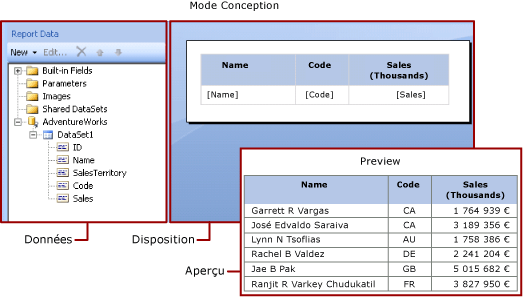
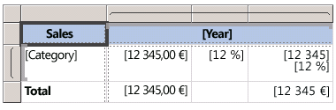

# Expressions (Générateur de rapports et SSRS)
  Les expressions sont couramment utilisées dans des rapports [!INCLUDE[ssRSnoversion_md](../../includes/ssrsnoversion-md.md)] pour récupérer, calculer, afficher, regrouper, trier, filtrer, paramétrer et mettre en forme les données d’un rapport. 
  
  De nombreuses propriétés d'élément de rapport peuvent avoir la valeur d'une expression. Les expressions vous aident à contrôler le contenu, la conception et l'interactivité de votre rapport. Les expressions sont écrites dans [!INCLUDE[msCoName](../../includes/msconame-md.md)] [!INCLUDE[vbprvb](../../includes/vbprvb-md.md)], enregistrées dans la définition de rapport et évaluées par le processeur de rapports au moment où vous exécutez le rapport.  
  
 Contrairement à certaines applications comme [!INCLUDE[msCoName](../../includes/msconame-md.md)] Office Excel, où vous utilisez les données directement dans une feuille de calcul, dans un rapport, vous utilisez des expressions qui représentent des espaces réservés pour les données. Pour consulter les données effectives des expressions évaluées, vous devez afficher un aperçu du rapport. Lorsque vous exécutez le rapport, le processeur de rapports évalue chaque expression au moment de combiner les données de rapport et les éléments de disposition du rapport tels que les tableaux et les graphiques.  
  
 Lorsque vous concevez un rapport, de nombreuses expressions relatives aux éléments de rapport sont définies automatiquement. Par exemple, lorsque vous faites glisser un champ du volet de données vers une cellule de tableau sur l'aire de conception du rapport, la zone de texte prend la valeur d'une expression simple pour le champ. Dans l'illustration suivante, le volet des données de rapport affiche l'ID des champs du dataset, Name, SalesTerritory, Code et Sales. Trois champs ont été ajoutés à la table : [Name], [Code] et [Sales]. La notation [Name] sur l'aire de conception représente l'expression sous-jacente `=Fields!Name.Value`.  
  
   
  
 Lorsque vous affichez un aperçu du rapport, le processeur de rapports combine la région de données de table avec les données effectives de la connexion de données, puis affiche une ligne dans la table pour chaque ligne du jeu de résultats.  
  
 Pour entrer manuellement des expressions, sélectionnez un élément dans l'aire de conception, puis utilisez les menus contextuels et boîtes de dialogue pour définir les propriétés de l'élément. Quand vous voyez le bouton ***(fx)*** ou la valeur `<Expression>` dans une liste déroulante, vous savez que vous pouvez attribuer une expression à la propriété. Pour plus d’informations, consultez [Ajouter une expression &#40;Générateur de rapports et SSRS&#41;](../../reporting-services/report-design/add-an-expression-report-builder-and-ssrs.md).  
  
 Pour développer des expressions complexes ou des expressions qui utilisent du code personnalisé ou des assemblys personnalisés, il est recommandé de recourir au Concepteur de rapports dans [!INCLUDE[ssBIDevStudioFull](../../includes/ssbidevstudiofull-md.md)]. Pour plus d’informations, consultez [Code personnalisé et références d’assembly dans les expressions du Concepteur de rapports &#40;SSRS&#41;](../../reporting-services/report-design/custom-code-and-assembly-references-in-expressions-in-report-designer-ssrs.md).  
  
> [!NOTE]  
>  [!INCLUDE[ssRBRDDup](../../includes/ssrbrddup-md.md)]  
  
##   Présentation des expressions simples et complexes  
 Les expressions commencent par un signe égal (=) et sont écrites en langage [!INCLUDE[msCoName](../../includes/msconame-md.md)] [!INCLUDE[vbprvb](../../includes/vbprvb-md.md)]. Les expressions peuvent se composer d'une combinaison de constantes, d'opérateurs et de références à des valeurs prédéfinies (champs, collections et fonctions) ainsi qu'à du code externe ou personnalisé.  
  
 Vous pouvez utiliser des expressions pour spécifier la valeur de nombreuses propriétés d'élément de rapport. Les propriétés les plus usuelles sont les valeurs des zones de texte et du texte de l'espace réservé. En règle générale, si une zone de texte contient une seule expression, celle-ci représente la valeur de la propriété de la zone de texte. Si une zone de texte contient plusieurs expressions, chaque expression représente la valeur du texte de l'espace réservé dans la zone de texte.  
  
 Par défaut, les expressions s’affichent dans l’aire de conception du rapport sous la forme d’expressions *simples* ou *complexes*.  
  
-   **Simple** : une expression simple contient une référence à un élément unique dans une collection intégrée, par exemple un champ de dataset, un paramètre ou un champ prédéfini. Sur l'aire de conception, une expression simple apparaît entre parenthèses. Par exemple, `[FieldName]` correspond à l’expression sous-jacente `=Fields!FieldName.Value`. Les expressions simples sont créées automatiquement lorsque vous créez la mise en page du rapport et que vous faites glisser des éléments du volet des données de rapport vers l'aire de conception. Pour plus d’informations sur les symboles qui représentent les différentes collections intégrées, consultez [Présentation des symboles de préfixe dans les expressions simples](#DisplayText).  
  
-   **Complexe** : une expression complexe contient des références à plusieurs références intégrées, opérateurs et appels de fonction. Une expression complexe se présente sous la forme <\<Expr>> quand la valeur d’expression inclut plusieurs références simples. Pour consulter l'expression, pointez sur cette dernière et utilisez l'info-bulle. Pour modifier l’expression, ouvrez-la dans la boîte de dialogue **Expression** .  
  
 L'illustration suivante montre des expressions simples et complexes classiques pour des zones de texte et du texte d'espace réservé.  
  
   
  
 Pour afficher des exemples de valeurs à la place du texte pour les expressions, appliquez la mise en forme à la zone de texte ou au texte de l'espace réservé. L'illustration suivante montre l'aire de conception du rapport de manière à afficher les exemples de valeurs :  
  
   
  
 Pour plus d’informations, consultez [Mise en forme du texte et des espaces réservés &#40;Générateur de rapports et SSRS&#41;](../../reporting-services/report-design/formatting-text-and-placeholders-report-builder-and-ssrs.md).  
  
### Formules de modèle de rapport  
 Quand vous concevez une requête pour un dataset qui utilise un modèle de rapport comme source de données, vous pouvez créer des *formules*. Les formules sont des calculs effectués sur les valeurs d'un rapport qui sont basées sur des données d'un modèle de rapport.  
  
 Pour plus d’informations, consultez [Formules dans les requêtes de modèle de rapport &#40;Générateur de rapports et SSRS&#41;](../../reporting-services/report-design/formulas-in-report-model-queries-report-builder-and-ssrs.md).  
   
##   Présentation des symboles de préfixe dans les expressions simples  
 Les expressions simples utilisent des symboles pour indiquer si la référence est une référence à un champ, un paramètre, une collection intégrée ou la collection ReportItems. Le tableau suivant présente des exemples de texte affiché et de texte d'expression :  
  
|Élément|Exemple de texte affiché|Exemple de texte d'expression|  
|----------|--------------------------|-----------------------------|  
|Champs de dataset|`[Sales]`   `[SUM(Sales)]`   `[FIRST(Store)]`|`=Fields!Sales.Value`   `=Sum(Fields!Sales.Value)`   `=First(Fields!Store.Value)`|  
|Paramètres du rapport|`[@Param]`   `[@Param.Label]`|`=Parameters!Param.Value`   `=Parameters!Param.Label`|  
|Champs prédéfinis|`[&ReportName]`|`=Globals!ReportName.Value`|  
|Caractères littéraux utilisés pour le texte affiché|`\[Sales\]`|`[Sales]`|  
  
##   Écriture d'expressions complexes  
 Les expressions peuvent inclure des références à des fonctions, des opérateurs, des constantes, des champs, des paramètres, des éléments provenant de collections intégrées, ainsi que des références à du code personnalisé incorporé ou à des assemblys personnalisés.  
  
> [!NOTE]  
>  Pour développer des expressions complexes ou des expressions qui utilisent du code personnalisé ou des assemblys personnalisés, il est recommandé de recourir au Concepteur de rapports dans [!INCLUDE[ssNoVersion](../../includes/ssnoversion-md.md)][!INCLUDE[ssBIDevStudioFull](../../includes/ssbidevstudiofull-md.md)]. Pour plus d’informations, consultez [Code personnalisé et références d’assembly dans les expressions du Concepteur de rapports &#40;SSRS&#41;](../../reporting-services/report-design/custom-code-and-assembly-references-in-expressions-in-report-designer-ssrs.md).  
  
 Le tableau suivant répertorie les types de références que vous pouvez inclure dans une expression :  
  
|Références|Description| Exemple|  
|----------------|-----------------|-------------|  
|[Constantes](../../reporting-services/report-design/constants-in-expressions-report-builder-and-ssrs.md)|Décrit les constantes auxquelles vous pouvez accéder de manière interactive pour les propriétés qui requièrent des valeurs constantes ; par exemple les couleurs de police.|`="Blue"`|  
|[Opérateurs](../../reporting-services/report-design/operators-in-expressions-report-builder-and-ssrs.md)|Décrit les opérateurs que vous pouvez utiliser pour combiner des références dans une expression. Par exemple, l’opérateur **&** sert à concaténer des chaînes.|`="The report ran at: " & Globals!ExecutionTime & "."`|  
|[Collections intégrées](../../reporting-services/report-design/built-in-collections-in-expressions-report-builder.md)|Décrit les collections intégrées que vous pouvez inclure dans une expression ; par exemple, `Fields`, `Parameters`et `Variables`.|`=Fields!Sales.Value`   `=Parameters!Store.Value`   `=Variables!MyCalculation.Value`|  
|[Fonctions de rapport et d'agrégation intégrées](../../reporting-services/report-design/report-builder-functions-aggregate-functions-reference.md)|Décrit les fonctions intégrées, telles que `Sum` ou `Previous`, auxquelles vous pouvez accéder à partir d’une expression.|`=Previous(Sum(Fields!Sales.Value))`|  
|[Code personnalisé et références d’assembly dans les expressions du Concepteur de rapports &#40;SSRS&#41;](../../reporting-services/report-design/custom-code-and-assembly-references-in-expressions-in-report-designer-ssrs.md)|Explique comment vous pouvez accéder aux classes CLR intégrées <xref:System.Math> et <xref:System.Convert>et à d’autres classes CLR, à des fonctions de la bibliothèque runtime [!INCLUDE[vbprvb](../../includes/vbprvb-md.md)] ou à des méthodes à partir d’un assembly externe.   Explique comment vous pouvez accéder à du code personnalisé qui est incorporé dans votre rapport ou que vous compilez et installez en tant qu'assembly personnalisé à la fois sur le client de rapports et sur le serveur de rapports.|`=Sum(Fields!Sales.Value)`   `=CDate(Fields!SalesDate.Value)`   `=DateAdd("d",3,Fields!BirthDate.Value)`   `=Code.ToUSD(Fields!StandardCost.Value)`|  
   
##   Validation d'expressions  
 Lorsque vous créez une expression pour une propriété d'élément de rapport spécifique, les références que vous pouvez inclure dans l'expression dépendent des valeurs que la propriété d'élément de rapport peut accepter et de l'étendue dans laquelle la propriété est évaluée. Exemple :  
  
-   Par défaut, l'expression [Sum] calcule la somme des données qui se trouvent dans l'étendue au moment où l'expression est évaluée. Pour une cellule de tableau, l'étendue dépend des membres du groupe de lignes et de colonnes. Pour plus d’informations, consultez [Étendue des expressions pour les totaux, les agrégats et les collections intégrées &#40;Générateur de rapports et SSRS&#41;](../../reporting-services/report-design/expression-scope-for-totals-aggregates-and-built-in-collections.md).  
  
-   Pour une propriété Font, la valeur doit correspondre au nom d’une police.  
  
-   La syntaxe de l'expression est validée au moment du design. La validation de l'étendue de l'expression se produit lorsque vous publiez le rapport. Lorsque la validation dépend des données effectives, les erreurs ne peuvent être détectées qu'au moment de l'exécution. Certaines de ces expressions produisent le message d'erreur #Error dans le rapport rendu. Pour faciliter l'identification des problèmes liés à ce type d'erreur, vous devez utiliser le Concepteur de rapports dans [!INCLUDE[ssBIDevStudioFull](../../includes/ssbidevstudiofull-md.md)]. Le Concepteur de rapports fournit une fenêtre Sortie qui indique des informations supplémentaires sur ces erreurs.  
  
 Pour plus d’informations, consultez [Référence d’expression &#40;Générateur de rapports et SSRS&#41;](../../reporting-services/report-design/expression-reference-report-builder-and-ssrs.md).  
  
##   Dans cette section  
 [Ajouter une expression &#40;Générateur de rapports et SSRS&#41;](../../reporting-services/report-design/add-an-expression-report-builder-and-ssrs.md)  
  
 [Utilisation d’expressions dans les rapports &#40;Générateur de rapports et SSRS&#41;](../../reporting-services/report-design/expression-uses-in-reports-report-builder-and-ssrs.md)  
  
 [Étendue des expressions pour les totaux, les agrégats et les collections intégrées &#40;Générateur de rapports et SSRS&#41;](../../reporting-services/report-design/expression-scope-for-totals-aggregates-and-built-in-collections.md)  
  
 [Référence d’expression &#40;Générateur de rapports et SSRS&#41;](../../reporting-services/report-design/expression-reference-report-builder-and-ssrs.md)  

##  Voir aussi
 Pour plus d'informations et pour obtenir des exemples, consultez les rubriques suivantes :  
  
-   [Utilisation d’expressions dans les rapports &#40;Générateur de rapports et SSRS&#41;](../../reporting-services/report-design/expression-uses-in-reports-report-builder-and-ssrs.md)  
-   [Exemples d’expressions &#40;Générateur de rapports et SSRS&#41;](../../reporting-services/report-design/expression-examples-report-builder-and-ssrs.md)  
-   [Exemples d’équations de filtre &#40;Générateur de rapports et SSRS&#41;](../../reporting-services/report-design/filter-equation-examples-report-builder-and-ssrs.md)  
-   [Exemples d’expressions de groupe &#40;Générateur de rapports et SSRS&#41;](../../reporting-services/report-design/group-expression-examples-report-builder-and-ssrs.md)  
-   [Didacticiel : introduction aux expressions](Tutorial:%20Introducing%20Expressions.md)
-   [Exemples de rapports (Générateur de rapports et SSRS)](http://go.microsoft.com/fwlink/?LinkId=198283)  
  
