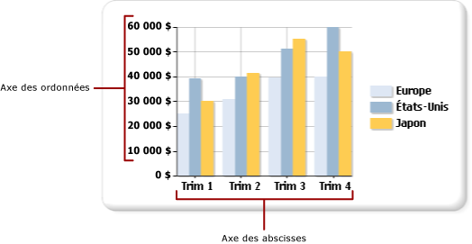

# Mise en forme des étiquettes des axes sur un graphique (Générateur de rapports et SSRS)
  Les types de graphiques basés sur les coordonnées (histogramme, graphique à barres, graphique en aires, graphique à points, graphique en courbes et graphique d'étendue) comportent deux axes qui sont utilisés pour classer des données en catégories et afficher les relations de données. Des types de mises en forme différents seront appliqués à chaque axe.  
  
 Vous pouvez mettre en forme les axes à l’aide de la boîte de dialogue **Propriétés de l’axe** ou du volet Propriétés. Cliquez avec le bouton droit sur l’axe que vous voulez mettre en forme, puis cliquez sur **Propriétés de l’axe** pour modifier les valeurs des formats de texte, numérique et de date de l’axe, les graduations principales et secondaires, l’ajustement automatique des étiquettes, ainsi que l’épaisseur, la couleur et le style de la ligne de l’axe. Pour modifier les valeurs du titre de l’axe, cliquez avec le bouton droit sur le titre de l’axe, puis cliquez sur **Propriétés du titre de l’axe**.  
  
 Les étiquettes de l'axe identifient des intervalles du quadrillage principal du graphique. Par défaut, le graphique utilise un algorithme pour déterminer l'emplacement optimal des étiquettes sur l'axe afin d'éviter une superposition du texte.  
  
> [!NOTE]  
>  [!INCLUDE[ssRBRDDup](../../includes/ssrbrddup-md.md)]  
  
## Types d'axes  
 Le graphique comprend deux axes principaux : l'axe des ordonnées et l'axe des abscisses.  
  
   
  
 Lorsque vous faites glisser un champ de votre dataset sur la surface du graphique, le graphique détermine si ce champ appartient à l'axe des abscisses ou à l'axe des ordonnées.  
  
 L'axe des ordonnées est généralement l'axe vertical, ou axe des Y, du graphique. Il est utilisé pour afficher les valeurs de données numériques qui sont représentées sur le graphique. Si vous faites glisser un champ dans la région de champs de données, ce champ sera tracé sur l'axe des ordonnées. L'axe des abscisses est généralement l'axe horizontal, ou axe des X, du graphique. Pour les graphiques à barres, ces axes sont inversés. Dans les types de graphiques en barres, l'axe des abscisses est l'axe vertical et l'axe des ordonnées est l'axe horizontal. Pour plus d’informations, consultez [Graphiques à barres &#40;Générateur de rapports et SSRS&#41;](../../reporting-services/report-design/bar-charts-report-builder-and-ssrs.md).  
  
## Mode de calcul des intervalles des étiquettes de l'axe par le graphique  
 Avant de mettre en forme les étiquettes des axes, vous devez comprendre la façon dont le graphique calcule les intervalles des étiquettes des axes. Cela vous permettra de définir les propriétés nécessaires pour obtenir le comportement d'étiquetage des axes souhaité.  
  
 L'échelle des axes est liée par une valeur minimale et une valeur maximale qui définissent la plage de données à afficher le long de l'axe. Le graphique calcule la valeur minimale et la valeur maximale le long de chaque axe en fonction des valeurs de votre jeu de résultats. Sur l'axe des ordonnées, l'échelle sera toujours déterminée par le nombre le plus faible et le nombre le plus élevé du champ de valeur. Sur l'axe des abscisses, les types des valeurs minimale et maximale sont déterminés par le type de votre champ de catégorie. Tout champ d'un dataset peut être classé dans l'un des trois types de champs de catégorie. Le tableau suivant illustre ces trois types de champs de catégorie.  
  
|Type de champ de catégorie|Description| Exemple|  
|-------------------------|-----------------|-------------|  
|Numérique|Les catégories sont tracées par ordre numérique le long de l'axe des abscisses.|Un état des ventes par numéro d'identification des employés affiche les numéros d'identification des employés le long de l'axe des abscisses.|  
|Date/heure|Les catégories sont tracées par ordre chronologique le long de l'axe des abscisses.|Un état des ventes par mois affiche des dates mises en forme le long de l'axe des abscisses.|  
|Chaînes|Les catégories sont tracées le long de l'axe des abscisses dans l'ordre où elles apparaissent pour la première fois dans la source de données.|Un état des ventes par région affiche des noms de régions le long de l'axe des abscisses.|  
  
 Tous les types de graphiques comportant deux axes sont conçus pour supprimer des étiquettes des axes lorsque les catégories sont trop nombreuses pour s'ajuster à l'affichage, afin de produire une image plus claire sur le graphique et éviter les collisions d'étiquettes.  
  
 L'application calcule l'emplacement des étiquettes sur un axe d'après les étapes suivantes :  
  
1.  Les valeurs minimales et maximales sont identifiées en fonction des valeurs du jeu de résultats.  
  
2.  Un nombre d'intervalles équidistants de l'axe, généralement entre quatre et six, est calculé en fonction de ces valeurs minimales et maximales.  
  
3.  Les étiquettes sont affichées à ces intervalles, en fonction des propriétés des étiquettes de l'axe. Les propriétés qui affectent le placement des étiquettes sont, notamment, la taille de la police, l'angle d'affichage des étiquettes et les propriétés de renvoi à la ligne du texte. Il est possible de modifier ces options d'ajustement automatique des étiquettes de l'axe.  
  
### Exemple de calcul d'étiquettes d'axe par le graphique  
 Le tableau présenté ici contient des exemples de données de vente à tracer sur un histogramme. Le champ Name est ajouté à la zone Groupes d'abscisses et le champ Quantity est ajouté à la zone Valeurs.  
  
|Nom   |Quantity|  
|----------|--------------|  
|Michael Blythe|229|  
|Jae Pak|112|  
|Ranjit Varkey Chudukatil|494|  
|Jillian Carson|247|  
|Linda Mitchell|339|  
|Rachel Valdez|194|  
  
 Le champ Quantité est tracé le long de l'axe des ordonnées. La valeur la plus faible est 112 et la valeur la plus élevée est 494. Dans le cas présent, le graphique calcule l'échelle pour qu'elle commence à 0 et qu'elle se termine à 500. Le graphique calcule également cinq intervalles équidistants de 100, et crée des étiquettes à 0, 100, 200, 300, 400 et 500.  
  
 Le champ Nom est tracé le long de l'axe des abscisses. Le graphique calcule entre quatre et six étiquettes, ainsi que des paramètres d'ajustement automatique afin de déterminer la façon dont les étiquettes peuvent tenir sur l'axe des abscisses sans provoquer de collisions d'étiquettes. En conséquence, certaines étiquettes de catégories peuvent être omises. Vous pouvez remplacer les options d'ajustement automatique indépendamment pour chaque axe.  
  
## Affichage de toutes les étiquettes sur l'axe des abscisses  
 Sur l'axe des ordonnées, les intervalles de l'axe fournissent une mesure cohérente des points de données sur le graphique. Toutefois, sur l'axe des abscisses, cette fonctionnalité peut entraîner l'affichage des catégories sans étiquettes d'axe. Vous voulez généralement que toutes les catégories portent une étiquette. Vous pouvez définir le nombre d'intervalles à 1 pour afficher toutes les catégories.  Pour plus d’informations, consultez [Spécifier un intervalle d’axe &#40;Générateur de rapports et SSRS&#41;](../../reporting-services/report-design/specify-an-axis-interval-report-builder-and-ssrs.md).  
  
> [!NOTE]  
>  Si vous remplacez les fonctionnalités d'étiquetage automatiques par un intervalle manuel sur un axe, le graphique doit redimensionner tous les autres éléments de manière appropriée. En conséquence, vous pouvez obtenir des résultats imprévisibles avec le dimensionnement et le positionnement des étiquettes, ou la taille des autres éléments sur le graphique.  
  
## Intervalles d'axe variables  
 Le graphique calcule environ cinq intervalles d'étiquettes d'axe, quelle que soit la taille du graphique. Sur les graphiques larges ou hauts, si vous affichez uniquement cinq étiquettes sur un axe, de grands espaces peuvent apparaître entre chaque étiquette. Cela le rend plus difficile l'identification de la valeur de chaque point de données sur l'axe. Pour éviter ce comportement sur les graphiques larges ou hauts, vous pouvez définir un intervalle d'axe variable. Le graphique calculera le nombre optimal d'étiquettes qui peuvent apparaître sur l'axe en fonction de la largeur ou de la hauteur du graphique, suivant l'axe correspondant. Pour plus d’informations, consultez [Spécifier un intervalle d’axe &#40;Générateur de rapports et SSRS&#41;](../../reporting-services/report-design/specify-an-axis-interval-report-builder-and-ssrs.md).  
  
## Tri de valeurs d'axe  
 Les catégories s'affichent le long de l'axe des abscisses dans l'ordre dans lequel elles apparaissent dans le jeu de résultats. Vous pouvez modifier l'ordre de groupe en ajoutant une commande SORT à la requête ou en triant le dataset à l'aide d'une expression. Les régions des données graphiques sont triées de la même manière que toutes les autres régions de données. Pour plus d’informations sur le tri des données, consultez [Trier des données dans une région de données &#40;Générateur de rapports et SSRS&#41;](../../reporting-services/report-design/sort-data-in-a-data-region-report-builder-and-ssrs.md).  
  
## Spécification de valeurs scalaires sur l'axe es abscisses  
 Par défaut, le graphique affichera uniquement les étiquettes d'axe correspondant aux points de données du dataset qui contiennent des valeurs valides. Par exemple, si vous avez les valeurs 1, 2 et 6 sur l'axe des abscisses, le graphique affichera uniquement des catégories 1, 2 et 6. Pour maintenir l'échelle des valeurs de catégories, vous pouvez spécifier que le graphique doit utiliser un axe scalaire. Dans ce scénario, le graphique affichera des étiquettes pour les valeurs de 1 à 6 sur l'axe des abscisses du graphique, bien que votre dataset ne contienne pas les valeurs de 3 à 5.  
  
 Vous pouvez définir un axe scalaire de deux façons :  
  
-   Sélectionnez l’option **Axe scalaire** de la boîte de dialogue **Propriétés de l’axe** . Cela ajoutera des valeurs numérique ou de date/d'heure à l'axe où il n'existe aucune valeur de regroupement de données. Pour plus d’informations, consultez [Boîte de dialogue Propriétés de l’axe, Options de l’axe &#40;Générateur de rapports et SSRS&#41;](http://msdn.microsoft.com/library/b276e210-7a12-48ae-971b-7dabae51df11).  
  
-   Sélectionnez un champ ou tapez une expression pour l’option **Champ de catégorie** de la boîte de dialogue **Propriétés de la série** . Le graphique ajoutera des intervalles d'axe pour toutes les valeurs du champ de catégorie que vous avez spécifié.  
  
## Ajout ou suppression de marges latérales sur l'axe des abscisses  
 Dans les types de graphiques Barres, Histogrammes et Nuages de points, le graphique ajoute automatiquement des marges latérales aux extrémités de l'axe des abscisses. Vous ne pouvez pas modifier la taille de la marge. Dans tous les autres types de graphiques, aucune marge latérale n'est ajoutée. Pour plus d’informations, consultez [Ajouter ou supprimer des marges dans un graphique &#40;Générateur de rapports et SSRS&#41;](../../reporting-services/report-design/add-or-remove-margins-from-a-chart-report-builder-and-ssrs.md).  
  
## Dans cette section  
 [Mettre en forme les étiquettes des axes en tant que dates ou devises &#40;Générateur de rapports et SSRS&#41;](../../reporting-services/report-design/format-axis-labels-as-dates-or-currencies-report-builder-and-ssrs.md)  
  
 [Placer des étiquettes dans un graphique &#40;Générateur de rapports et SSRS&#41;](../../reporting-services/report-design/position-labels-in-a-chart-report-builder-and-ssrs.md)  
  
 [Spécifier un intervalle d’axe &#40;Générateur de rapports et SSRS&#41;](../../reporting-services/report-design/specify-an-axis-interval-report-builder-and-ssrs.md)  
  
 [Ajouter ou supprimer des marges dans un graphique &#40;Générateur de rapports et SSRS&#41;](../../reporting-services/report-design/add-or-remove-margins-from-a-chart-report-builder-and-ssrs.md)  
  
 [Spécifier une échelle logarithmique &#40;Générateur de rapports et SSRS&#41;](../../reporting-services/report-design/specify-a-logarithmic-scale-report-builder-and-ssrs.md)  
  
##  Voir aussi  
 [Mise en forme d’un graphique &#40;Générateur de rapports et SSRS&#41;](../../reporting-services/report-design/formatting-a-chart-report-builder-and-ssrs.md)   
 [Graphiques &#40;Générateur de rapports et SSRS&#41;](../../reporting-services/report-design/charts-report-builder-and-ssrs.md)   
 [Mise en forme des points de données sur un graphique &#40;Générateur de rapports et SSRS&#41;](../../reporting-services/report-design/formatting-data-points-on-a-chart-report-builder-and-ssrs.md)  
  
  
