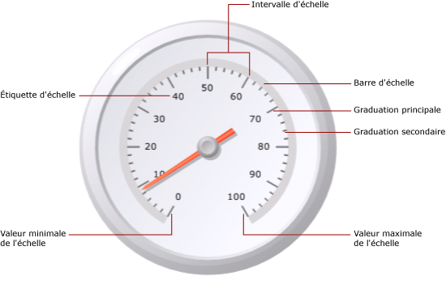
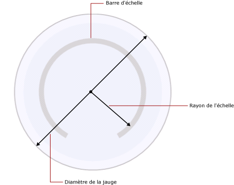

# Mise en forme des échelles sur une jauge (Générateur de rapports et SSRS)
  Dans un rapport paginé [!INCLUDE[ssRSnoversion_md](../../includes/ssrsnoversion-md.md)] , une échelle de jauge correspond à la plage de nombres, limités par une valeur minimale et une valeur maximale, indiqués sur une jauge. En général, une échelle de jauge contient des étiquettes et des graduations qui permettent de lire avec précision la valeur indiquée par le pointeur de la jauge. Une échelle de jauge est la plupart du temps associée à un ou plusieurs pointeurs de jauge. Plusieurs échelles sont possibles sur une même jauge.  
  
   
  
 Contrairement au graphique sur lequel plusieurs groupes sont définis, la jauge affiche seulement une valeur. Vous devez définir les valeurs minimale et maximale de l'échelle. Les intervalles sont calculés automatiquement en fonction des valeurs spécifiées pour le minimum et le maximum.  
  
 Lorsque vous ajoutez une échelle à une jauge qui en contient déjà une, les propriétés d'apparence de la première échelle sont clonées sur la deuxième échelle.  
  
 Pour définir des propriétés sur l’échelle, cliquez avec le bouton droit sur les étiquettes ou les graduations de l’échelle et sélectionnez **Propriétés de l’échelle radiale** ou **Propriétés de l’échelle linéaire**. Chaque type de jauge contient au moins une échelle avec le même jeu de propriétés. Il existe également des propriétés propres à chaque type de jauge :  
  
-   Sur une jauge radiale, vous pouvez spécifier le rayon, l'angle de début et l'angle de balayage de l'échelle radiale.  
  
-   Sur une jauge linéaire, vous pouvez spécifier la largeur des marges de début et de fin par rapport aux points de terminaison.  
  
 Pour une prise en main rapide de la mise en forme des échelles, consultez [Définir un minimum ou un maximum sur une jauge &#40;Générateur de rapports et SSRS&#41;](../../reporting-services/report-design/set-a-minimum-or-maximum-on-a-gauge-report-builder-and-ssrs.md).  
  
##   Définition de valeurs minimale et maximale et d'intervalles sur une échelle  
 Comme une jauge est souvent utilisée pour afficher des indicateurs de performance clés mesurés (KPI) en pourcentage de 0 à 100, ces valeurs sont attribuées par défaut aux propriétés de la valeur minimale et de la valeur maximale de la jauge. Ces valeurs risquent toutefois de ne pas représenter l'échelle de valeurs que vous tentez d'afficher. En l'absence de logique intégrée permettant de déterminer ce que le champ de données KPI représente, la jauge ne calcule pas automatiquement les valeurs minimale et maximale. Si la valeur du champ de données KPI n'est pas comprise entre 0 et 100, vous devez définir explicitement des valeurs pour les propriétés de la valeur minimale et de la valeur maximale de manière à replacer dans son contexte la valeur qui est affichée sur la jauge.  
  
 Des graduations principales et secondaires figurent sur l'échelle. De plus, l'échelle possède des étiquettes qui sont généralement associées aux graduations principales. Par exemple, une échelle peut avoir des graduations principales indiquant 0, 20, 40, 60, 80 et 100. Les étiquettes doivent correspondre à ces graduations. La différence entre les valeurs des étiquettes est appelée « intervalle d'échelle ». Dans cet exemple, l'intervalle d'échelle est défini sur 20. Vous pouvez définir la propriété Interval dans la boîte de dialogue **Propriétés de l'échelle radiale** ou **Propriétés de l'échelle linéaire** .  
  
 L'application calcule les intervalles d'échelle d'après les étapes suivantes :  
  
1.  Spécifiez les valeurs minimale et maximale. Comme ces valeurs ne sont pas automatiquement calculées à partir de votre dataset, vous devez les indiquer dans la boîte de dialogue **Propriétés** de la jauge.  
  
2.  Si vous ne spécifiez pas de valeur pour Interval, la valeur définie par défaut est Auto. Cela signifie que l'application calculera un nombre équidistant d'intervalles en fonction des valeurs minimale et maximale spécifiées au cours de la première étape. Si vous spécifiez une valeur pour Interval, la jauge calculera la différence entre la valeur minimale et la valeur maximale et divisera le nombre obtenu par la valeur spécifiée dans la propriété Interval.  
  
 Des propriétés permettent également de définir des intervalles d'étiquettes et de graduations. Si vous spécifiez une valeur pour ces propriétés, elles remplaceront la valeur spécifiée pour la propriété d'intervalle d'échelle. Par exemple, si l'intervalle d'échelle est Auto, mais que vous spécifiez 4 pour l'intervalle d'étiquettes, les étiquettes s'afficheront sous la forme 0, 4, 8 et ainsi de suite, mais les graduations principales continueront à être calculées par la jauge sur la base de son propre calcul. Dans certains cas, cela risque de provoquer une désynchronisation entre les étiquettes et les graduations. Envisagez de masquer les graduations lorsque vous définissez un intervalle d'étiquettes.  
  
 Le décalage d'intervalle détermine le nombre d'unités qui seront ignorées avant que la première étiquette ne s'affiche. Toutes les graduations principales et les étiquettes qui apparaissent successivement sur l'échelle utiliseront l'intervalle spécifié. Lorsque la valeur des intervalles d'étiquettes et de graduations est 0, cela revient à redéfinir l'intervalle sur Auto.  
  
##   Réduction des collisions d'étiquettes avec des multiplicateurs  
 Lorsque des valeurs contiennent de nombreux chiffres, elles risquent d'altérer la lisibilité de la jauge. Vous pouvez utiliser un multiplicateur d'échelle pour augmenter ou réduire l'échelle des valeurs. Lorsqu'un multiplicateur d'échelle est spécifié, chaque valeur d'origine sur l'échelle est multipliée par le multiplicateur antérieur à leur affichage sur l'échelle. Pour réduire l'échelle des valeurs, vous devez spécifier un nombre décimal. Par exemple, si l' échelle va de 0 à 10000 et que vous souhaitez afficher les nombres de 0 à 10 sur la jauge, vous pouvez utiliser une valeur de multiplicateur de 0,001.  
  
> [!NOTE]  
>  L'utilisation d'un multiplicateur ne multiplie pas la valeur réelle du champ agrégé que la jauge utilise. Seules les valeurs des étiquettes affichées sur la jauge sont multipliées une fois les valeurs minimale et maximale et les intervalles définis. Envisagez de continuer à automatiser les calculs des intervalles lorsque vous utilisez un multiplicateur.  
  
##   Spécification de la largeur de barre d'échelle, du rayon et des angles sur une échelle radiale  
 Utilisez la page **Mise en page** de la boîte de dialogue **Propriétés de l'échelle radiale** pour définir la largeur de barre de l'échelle, le rayon, l'angle de début et l'angle de balayage de l'échelle. Vous pouvez utiliser ces propriétés pour personnaliser la taille et le format de l'échelle. Par exemple, si vous positionnez des étiquettes d'échelle à l'extérieur de l'échelle, vous devrez redimensionner le rayon de l'échelle pour que ces étiquettes puissent tenir à l'intérieur de la jauge.  
  
> [!NOTE]  
>  Lorsque vous cliquez sur l'échelle d'une jauge, un contour en pointillé apparaît autour de l'échelle. Ce contour ne correspond pas à la barre de l'échelle et n'est pas utilisé lors du calcul de mesures sur la jauge. Il est uniquement disponible au moment de la conception pour que vous puissiez mettre en évidence l'échelle et accéder à ses propriétés.  
  
 Toutes les mesures reposent sur la barre de l'échelle. Lorsque vous sélectionnez une jauge, la largeur de la barre de l'échelle n'est pas indiquée. Si vous spécifiez une valeur pour la barre de l'échelle, elle vous sera utile pour toutes les autres mesures associées à l'échelle. Pour afficher la barre de l'échelle, définissez la propriété **Largeur de barre d'échelle** sur une valeur supérieure à 0 dans la page **Mise en page** de la boîte de dialogue **Propriétés de l'échelle radiale** . Sur une jauge radiale, la barre de l'échelle est mesurée en pourcentage du diamètre de la jauge. Sur une jauge linéaire, la barre de l'échelle est mesurée en pourcentage de la largeur ou de la hauteur de la jauge, selon celle qui est la plus petite.  
  
 Le rayon de l'échelle correspond à la distance qui sépare le centre de la jauge du milieu de la barre de l'échelle. La valeur du rayon de l'échelle est mesurée en pourcentage du diamètre de la jauge. La valeur du rayon de l'échelle doit, de préférence, être inférieure à 35. Si vous spécifiez une valeur supérieure à 35, l'échelle risque d'être représentée à l'extérieur des limites de la jauge. L'illustration suivante montre comment le rayon de l'échelle est mesuré, par rapport au diamètre de la jauge, sur la barre de l'échelle.  
  
   
  
 L'angle de début correspond à l'angle de rotation, entre 0 et 360, auquel l'échelle commencera. La position zéro (0) se trouve en bas de la jauge et l'angle de début pivote dans le sens des aiguilles d'une montre. Par exemple, l'échelle commence à la position 9 heures avec un angle de début de 90 degrés.  
  
 L'angle de balayage correspond au nombre de degrés, entre 0 et 360, que l'échelle balaiera dans un cercle. Avec un angle de balayage de 360 degrés, une échelle représente un cercle complet. Cela peut s'avérer utile si vous souhaitez concevoir une jauge ressemblant à une horloge.  
  
##   Positionnement des étiquettes sur une échelle linéaire ou radiale  
 Il existe deux propriétés qui déterminent la position des étiquettes. La propriété de placement des étiquettes spécifie si les étiquettes sont affichées à l'intérieur, à l'extérieur ou en travers de la barre de l'échelle. La propriété de distance définit la distance qui sépare les étiquettes de l'échelle, à partir de la barre de l'échelle. Si vous souhaitez positionner les étiquettes à l'intérieur de la barre de l'échelle, spécifiez un nombre négatif. Par exemple, si les étiquettes se trouvent à l'extérieur de l'échelle et que vous avez défini une distance de 10 entre les étiquettes et l'échelle, les étiquettes s'afficheront à 10 unités à l'extérieur de l'emplacement où les étiquettes se trouveraient normalement, où 1 unité correspond à :  
  
-   1 % du diamètre de la jauge sur une jauge radiale, ou  
  
-   1 % de la plus petite valeur de la hauteur ou de la largeur de la jauge sur une jauge linéaire.  
  
##  Voir aussi  
 [Mise en forme de plages sur une jauge &#40;Générateur de rapports et SSRS&#41;](../../reporting-services/report-design/formatting-ranges-on-a-gauge-report-builder-and-ssrs.md)   
 [Mise en forme des pointeurs sur une jauge &#40;Générateur de rapports et SSRS&#41;](../../reporting-services/report-design/formatting-pointers-on-a-gauge-report-builder-and-ssrs.md)   
 [Mettre en forme les étiquettes des axes en tant que dates ou devises &#40;Générateur de rapports et SSRS&#41;](../../reporting-services/report-design/format-axis-labels-as-dates-or-currencies-report-builder-and-ssrs.md)   
 [Mise en forme des étiquettes des axes sur un graphique &#40;Générateur de rapports et SSRS&#41;](../../reporting-services/report-design/formatting-axis-labels-on-a-chart-report-builder-and-ssrs.md)   
 [Jauges &#40;Générateur de rapports et SSRS&#41;](../../reporting-services/report-design/gauges-report-builder-and-ssrs.md)  
  
  
