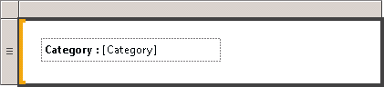

# Mise en forme du texte et des espaces réservés (Générateur de rapports et SSRS)
  Les zones de texte peuvent être des éléments de rapport ou correspondre aux cellules individuelles d'une région de données dans lesquelles figure du texte, un champ calculé, un pointeur renvoyant au champ d'une base de données ou une combinaison de ces trois éléments. Vous pouvez associer des polices et des couleurs, ajouter des styles gras et italiques et appliquer des styles de paragraphe (par exemple, un alignement et des retraits négatifs). Vous pouvez mettre en forme une zone de texte tout entière ou bien mettre en forme un texte spécifique, des nombres, des expressions ou des champs à l'intérieur de la zone de texte.  
  
 La police, la taille, la couleur et les effets sont autant de facteurs qui contribuent à la lisibilité d'un rapport. Les paramètres concernant la police, le style de police, la taille de police et les effets de soulignement peuvent être appliqués au texte apparaissant dans une zone de texte ou une région de données. Par défaut, la police utilisée pour les rapports est la suivante : Arial, 10 points, noir. Les boîtes de dialogue **Zone de texte** et **Propriétés du texte** permettent de spécifier comment le texte apparaît dans le rendu du rapport.  
  
   
  
 Dans cette illustration, la zone de texte proprement dite a une bordure ; par ailleurs, l'ensemble du texte figure dans la même zone de texte mais le texte comporte diverses mises en forme.  
  
 Pour une prise en main rapide, consultez [Didacticiel : mettre en forme du texte &#40;Générateur de rapports&#41;](../../reporting-services/tutorial-format-text-report-builder.md).  
  
> [!NOTE]  
>  [!INCLUDE[ssRBRDDup](../../includes/ssrbrddup-md.md)]  
  
## Création d'un espace réservé dans une zone de texte  
 Quand une expression simple ou complexe est définie à l’intérieur d’une zone de texte, la représentation résultante de cette expression dans l’interface utilisateur correspond à un *espace réservé*. Vous pouvez définir des couleurs, polices, actions et autres comportements pour un nombre indéfini d'espaces réservés ou sections de texte apparaissant dans une seule zone de texte.  
  
 La valeur d'un espace réservé est toujours une expression simple ou complexe. Vous pouvez ajouter un espace réservé à une zone de texte en créant une expression à l'aide de l'une des méthodes suivantes :  
  
-   Faites glisser l’un des champs du volet **Données du rapport** vers la zone de texte concernée. Si vous faites glisser l'expression vers n'importe quelle autre zone du corps du rapport, une nouvelle zone de texte contenant un espace réservé sera créée. Cet espace réservé aura pour valeur l'expression du champ déposé précédemment sur la zone de texte.  
  
-   Cliquez avec le bouton droit n’importe où dans la zone de texte, puis sélectionnez **Insérer un espace réservé**. La boîte de dialogue **Propriétés de l’espace réservé** permet de définir l’expression qui correspondra à la valeur de votre espace réservé. Pour plus d’informations, consultez [Boîte de dialogue Propriétés de l’espace réservé, Général &#40;Générateur de rapports et SSRS&#41;](http://msdn.microsoft.com/library/7a867736-a3b0-4b5a-b3e5-fe7c8d7618a8).  
  
-   Tapez toute expression simple ou complexe dans la zone de texte. Par exemple, si vous tapez **Nom : [Nom]** dans la zone de texte, le texte **[Nom]** sera affiché sous la forme d’un espace réservé qui représentera l’expression `=Fields!Name.Value`.  
  
-   Tapez une expression dans une zone de texte vide en entrant d'abord le signe égal (=). Lorsque la zone de texte cesse d'être en surbrillance, l'expression qui en résulte est convertie en un espace réservé modifiable. Si la zone de texte n'est pas vide ou si le signe égal n'a pas été inséré en premier comme indiqué, ce signe est alors considéré comme étant un littéral de chaîne, auquel cas aucun espace réservé ne peut être créé. Pour plus d’informations sur la définition des expressions simples et complexes, consultez [Utilisation d’expressions dans les rapports &#41;Générateur de rapports et SSRS&#40;](../../reporting-services/report-design/expression-uses-in-reports-report-builder-and-ssrs.md).  
  
## Mise en forme des espaces réservés et du texte statique dans une zone de texte  
 La boîte de dialogue **Propriétés de l’espace réservé** permet de mettre en forme les espaces réservés. La mise en forme des espaces réservés ne peut s'effectuer que globalement et non par sections distinctes. Si vous souhaitez consulter l'expression sous-jacente de votre espace réservé, il vous suffit de déplacer le pointeur de votre souris jusqu'à cette espace. Vous pouvez modifier l’expression sous-jacente en double-cliquant sur l’espace réservé ou en cliquant avec le bouton droit sur cet espace, puis en sélectionnant **Propriétés de l’espace réservé**. Vous pouvez également spécifier une étiquette d’interface utilisateur à l’aide de la propriété **Étiquette** sous l’onglet **Général** de la boîte de dialogue **Propriétés de l’espace réservé** . Le texte de cette étiquette sera alors affiché pour l'espace réservé lors de la phase de conception.  
  
   
  
 Dans cette illustration, une zone de texte située dans une liste contient à la fois une étiquette avec une mise en forme en gras et un espace réservé sans mise en forme.  
  
 À la différence du texte des espaces réservés, le texte des zones de texte peut être aligné de manière séparée. Vous pouvez également utiliser plusieurs paragraphes au sein d'une même zone de texte et définir des comportements distincts pour chaque sous-ensemble du texte qu'elle contient.  
  
 Vous pouvez définir des couleurs, polices, actions et autres comportements pour tout sous-ensemble du texte contenu dans une zone de texte particulière et ainsi créer un publipostage ou modèle pour le texte de votre rapport. Vous pouvez également utiliser plusieurs paragraphes à l'intérieur d'une même zone de texte. Par exemple, si votre texte se compose de deux paragraphes distincts, il vous suffit d'appuyer sur la touche ENTRÉE de votre clavier pour les séparer au niveau de la zone de texte concernée. Vous pouvez également définir une valeur d'alignement pour toute chaîne individuelle de texte. Vous pouvez également définir une action pour le texte d'une zone de texte. Cette fonctionnalité peut se révéler utile lorsque vous souhaitez transformer l'une des chaînes de texte contenues dans la zone de texte en lien hypertexte.  
  
> [!NOTE]  
>  Les actions définies pour la zone de texte sont prioritaires par rapport aux actions définies pour le texte contenu dans cette zone.  
  
 Pour plus d’informations sur la mise en forme mixte, consultez [Mettre en forme du texte dans une zone de texte &#40;Générateur de rapports et SSRS&#41;](../../reporting-services/report-design/format-text-in-a-text-box-report-builder-and-ssrs.md).  
  
## Alignement du texte horizontal à l'aide de l'option Général  
 Dans la zone **Alignement** de la boîte de dialogue **Propriétés de la zone de texte** , vous pouvez indiquer comment le texte doit être aligné au niveau horizontal. Si vous ne spécifiez pas de valeur d’alignement, la valeur d’alignement appliquée par défaut est **Par défaut**. Cela signifie que le texte sera aligné en fonction du type de champ utilisé pour la valeur de votre espace réservé. Si vous spécifiez une expression dont la valeur n'est pas une chaîne (pas un nombre), le texte est aligné à droite. Si, en revanche, votre expression a une valeur de chaîne (un nombre, par exemple), le texte est aligné à gauche.  
  
##  Voir aussi  
 [Expressions &#40;Générateur de rapports et SSRS&#41;](../../reporting-services/report-design/expressions-report-builder-and-ssrs.md)   
 [Mise en forme des étiquettes des axes sur un graphique &#40;Générateur de rapports et SSRS&#41;](../../reporting-services/report-design/formatting-axis-labels-on-a-chart-report-builder-and-ssrs.md)   
 [Mise en forme des échelles sur une jauge &#40;Générateur de rapports et SSRS&#41;](../../reporting-services/report-design/formatting-scales-on-a-gauge-report-builder-and-ssrs.md)   
 [Tables, matrices et listes &#40;Générateur de rapports et SSRS&#41;](../../reporting-services/report-design/tables-matrices-and-lists-report-builder-and-ssrs.md)   
 [Boîte de dialogue Propriétés de l’espace réservé, Général &#40;Générateur de rapports et SSRS&#41;](http://msdn.microsoft.com/library/7a867736-a3b0-4b5a-b3e5-fe7c8d7618a8)   
 [Exportation vers Microsoft Excel &#40;Générateur de rapports et SSRS&#41;](../../reporting-services/report-builder/exporting-to-microsoft-excel-report-builder-and-ssrs.md)   
 [Zones de texte &#40;Générateur de rapports et SSRS&#41;](../../reporting-services/report-design/text-boxes-report-builder-and-ssrs.md)  
  
  
