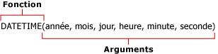

# Formules dans les requêtes de modèle de rapport (Générateur de rapports et SSRS)
  Les formules sont des calculs effectués sur les valeurs d'un rapport utilisant un modèle de rapport comme source de données. Vous définissez des formules dans la **boîte de dialogue Définir la formule** du concepteur de requêtes Modèle de rapport quand vous définissez une requête pour une source de données de modèle de rapport. Une formule peut contenir des fonctions, des opérateurs, des constantes et des références à des champs ou des entités. Les formules vous permettent de combiner, d'agréger, de filtrer et d'évaluer des données numériques et de texte. Vous pouvez créer des formules et les enregistrer en tant que nouveaux champs, ou vous pouvez modifier les formules des champs existants.  
  
 Les formules ne sont pas des expressions RDL et ne commencent pas par un signe égal (=). Pour plus d’informations sur les expressions RDL, consultez [Expressions &#40;Générateur de rapports et SSRS&#41;](../../reporting-services/report-design/expressions-report-builder-and-ssrs.md).  
  
 Les formules peuvent être semblables à :  
  
-   **Sum Line Total**  
  
-   6+12  
  
-   **SUM**(**IF**(**Finished Goods Flag**, "Finished", "Unfinished"))  
  
> [!NOTE]  
>  [!INCLUDE[ssRBRDDup](../../includes/ssrbrddup-md.md)]  
  
## References  
 Une référence est un nom de champ. Il peut s'agir du nom d'un champ existant de l'entité ou du nom d'un champ calculé que vous avez créé et ajouté à la liste Champs. La référence indique au Générateur de rapports où rechercher les valeurs, ou les données, à utiliser dans une formule. Vous pouvez faire référence à des champs de l'entité de contexte et à des champs d'autres entités dans une formule ou utiliser la valeur d'un champ dans plusieurs formules.  
  
 Lorsque vous utilisez des références, le processeur de rapports exécute la formule sur chaque valeur du champ. Par exemple, supposons qu'un champ contienne le total des ventes annuelles des cinq années passées. Ce champ contient cinq valeurs, chacune représentant le total des ventes d'une année donnée. Si la formule contient une référence à ce champ, elle calcule la nouvelle valeur à l'aide de chacune des valeurs.  
  
## Opérateurs  
 Les opérateurs spécifient le type de calcul à réaliser sur les valeurs d'une formule. Il existe trois différents types d'opérateurs de calcul : arithmétique, comparaison et texte. Les opérateurs sont indiqués à l'aide de symboles, tels que le signe plus (+).  
  
 **Opérateurs arithmétiques.** Les opérateurs arithmétiques réalisent des opérations mathématiques de base, telles que l'addition, la soustraction ou la multiplication, combinent des nombres et génèrent des résultats numériques.  
  
 **Opérateurs de comparaison.** Vous pouvez comparer deux valeurs à l'aide d'opérateurs de comparaison. Lorsque deux valeurs sont comparées à l'aide de ces opérateurs, le résultat est une valeur logique (TRUE ou FALSE).  
  
 **Opérateur de concaténation de texte.** Utilisez l'esperluette (&) pour joindre ou concaténer une ou plusieurs chaînes de texte et générer un seul élément de texte.  
  
##   Constantes  
 Une constante est une valeur qui n'est pas calculée et qui, par conséquent, ne change pas. Le Générateur de rapports utilise les constantes suivantes : **True**, **False**et **Empty**. Ces constantes permettent d'évaluer les champs booléens. Par exemple, supposons que vous possédez un champ appelé IsDiscontinued. Les seules valeurs valides pour ce champ sont True, False ou Empty (" ").  
  
##   Fonctions  
 Les fonctions sont des formules prédéfinies qui réalisent des calculs à l'aide de valeurs spécifiques, appelées *arguments*, indiquées dans un ordre précis. Les arguments peuvent être des valeurs littérales et/ou des champs. Lorsqu'un champ est utilisé dans une formule, le nom du champ représente chaque instance du champ. Si l'argument est une valeur littérale, vous pouvez être amené à indiquer sa nature à l'aide de caractères spécifiques.  
  
 Les fonctions peuvent être utilisées pour exécuter des calculs simples ou complexes. La structure d'une fonction commence par le nom de la fonction, suivi d'une parenthèse ouvrante, des arguments de la fonction séparés par des virgules, et d'une parenthèse fermante.  
  
   
  
 Les arguments peuvent être des références de champs, des nombres, du texte et des valeurs logiques telles que **TRUE** ou **FALSE**. Ce sont également des constantes, des formules ou d'autres fonctions. Les arguments que vous entrez doivent produire une valeur correcte pour cet argument. Par exemple, si la formule multiplie deux entiers, le résultat ne peut pas être une chaîne de texte.  
  
 Le Générateur de rapports propose les neuf catégories suivantes de fonctions courantes :  
  
|||  
|-|-|  
|Fonctions d'agrégation|**AVG**, **COUNT**, **COUNTDISTINCT**, **MAX**, **MIN**, **STDEV**, **STDEVP**, **SUM**, **VAR**, **VARP**|  
|Fonctions conditionnelles|**IF**, **IN**, **SWITCH**|  
|Fonctions de conversion|**INT**, **DECIMAL**, **FLOAT**, **TEXT**|  
|Fonctions de date et d'heure|**DATE**, **DATEADD**, **DATEDIFF**, **DATETIME**, **DATEONLY**, **DAY**, **DAYOFWEEK**, **DAYOFYEAR**, **HOUR**, **MINUTE**, **MONTH**, **NOW**, **QUARTER**, **SECOND**, **TIMEONLY**, **TODAY**, **WEEK**, **YEAR**|  
|Fonctions d'information|**GETUSERCULTURE**, **GETUSERID**|  
|Fonctions logiques|**AND**, **NOT**, **OR**|  
|Fonctions mathématiques|**MOD**, **ROUND**, **TRUNC**|  
|Opérateurs|Addition (+), Division (/), Égal à (=), Élévation à la puissance (^), Supérieur à (>), Supérieur ou égal à (>=), Inférieur à (<), Inférieur ou égal à (<=), Multiplication (*), Négation (-), Différent de (<>), Soustraction (-)|  
|Fonctions de texte|**CONCAT**, **FIND**, **LEFT**, **LENGTH**, **LOWER**, **LTRIM**, **REPLACE**, **RIGHT**, **RTRIM**, **SUBSTRING**, **UPPER**|  
  
  
