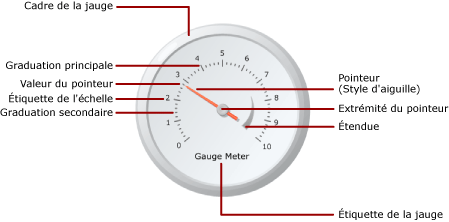

# Jauges (Générateur de rapports et SSRS)
  Dans les rapports paginés [!INCLUDE[ssRSnoversion_md](../../includes/ssrsnoversion-md.md)] , une région de données de jauge affiche une valeur unique tirée de votre dataset. Chaque jauge est toujours positionnée à l'intérieur d'un panneau de jauge, où vous pouvez ajouter des jauges enfants ou adjacentes. Dans un panneau de jauge, vous pouvez créer plusieurs jauges qui partagent des fonctions communes telles que le filtrage, le regroupement ou le tri.  
  
 Vous pouvez utiliser les jauges pour exécuter de nombreuses tâches dans un rapport :  
  
-   Affichez des indicateurs de performance clés (KPI) dans une jauge radiale ou linéaire unique.  
  
-   Placez une jauge au sein d'une table ou d'une matrice pour illustrer des valeurs à l'intérieur de chaque cellule.  
  
-   Utilisez plusieurs jauges dans un panneau de jauge unique pour comparer les données des champs.  
  
 Il existe deux types de jauges : la jauge radiale et la jauge linéaire. L'illustration suivante présente les éléments de base d'une jauge radiale unique dans le panneau de jauge.  
  
   
  
 Pour plus d’informations sur l’utilisation des jauges comme indicateurs de performance clés, consultez [Didacticiel : ajout d’un indicateur de performance clé à un rapport &#40;Générateur de rapports&#41;](../../reporting-services/tutorial-adding-a-kpi-to-your-report-report-builder.md).  
  
> [!NOTE]  
>  Vous pouvez publier des jauges hors d'un rapport en tant que parties du rapport. En savoir plus sur les [Parties de rapports](../../reporting-services/report-design/report-parts-report-builder-and-ssrs.md).  
  
##   Types de jauges  
 [!INCLUDE[ssRSnoversion](../../includes/ssrsnoversion-md.md)] fournit deux types de jauges : la jauge radiale et la jauge linéaire. La jauge radiale est en général utilisée lorsque vous souhaitez exprimer les données comme valeur de rapidité. La jauge linéaire est utilisée pour exprimer les données comme valeur de température ou d'échelle.  
  
 Les principales différences entre les deux types sont la forme globale de la jauge et les pointeurs de la jauge disponibles. Les jauges radiales sont circulaires, ou plus ou moins circulaires, et ressemblent à des indicateurs de vitesse. Les pointeurs de la jauge sont souvent des aiguilles, mais peuvent être des marqueurs ou des barres.  
  
 Les jauges linéaires sont rectangulaires, orientées horizontalement ou verticalement, et ressemblent à des règles. Les pointeurs de la jauge sont souvent des thermomètres, mais peuvent être des marqueurs ou des barres. En raison de sa forme, ce type de jauge est utile pour l'intégration dans les régions de données de table ou de matrice pour afficher des données de progression.  
  
 Outre ces différences, les deux types de jauges sont interchangeables. Toutefois, si vous devez utiliser une jauge simple dans votre rapport, vous devez envisager d'utiliser un indicateur au lieu d'une jauge. Pour plus d’informations, consultez [Indicateurs &#40;Générateur de rapports et SSRS&#41;](../../reporting-services/report-design/indicators-report-builder-and-ssrs.md).  
  
 Les illustrations suivantes montrent des jauges radiale et linéaire. La jauge radiale est ronde et utilise le pointeur de type aiguille. La jauge linéaire est horizontale et utilise le pointeur de type thermomètre.  
  
 **Jauge radiale**  
  
   
  
 Options de jauge radiale : Radial, Radial avec mini-jauge, Deux échelles, 90 degrés nord-est, 90 degrés nord-ouest, 90 degrés sud-ouest, 90 degrés sud-est, 180 degrés nord, 180 degrés sud, 180 degrés ouest, 180 degrés est et Métrique.  
  
 **Jauge linéaire**  
  
   
  
 Options de jauge linéaire : Horizontal, Vertical, Pointeurs multiples en forme de barres, Deux échelles, Plage de trois couleurs, Logarithmique, Thermomètre, Thermomètre Fahrenheit/Celsius et Graphique à puces.  
  
##   Ajout de données à une jauge  
 Une fois que vous avez ajouté une jauge à l'aire de conception, il vous suffit de faire glisser un champ du dataset vers le volet des données de la jauge. Par défaut, la jauge agrège les valeurs du champ en une seule valeur qui est indiquée sur la jauge. Cette valeur est associée au pointeur via la propriété Value. Selon le type de données du champ, la jauge utilise l'agrégat SUM ou COUNT. Lorsque vous utilisez des données numériques qui peuvent être ajoutées, la jauge utilise la fonction SUM. Sinon, elle utilise l'agrégat COUNT. La valeur du pointeur peut utiliser un agrégat différent, ou aucun agrégat.  
  
 Vous pouvez ajouter le regroupement à la jauge pour afficher des groupes individuels ou des lignes individuelles sur la jauge. Une fois le regroupement et le filtrage appliqués, la jauge utilise la valeur du pointeur pour afficher le dernier groupe ou la dernière ligne dans le dataset retourné.  
  
 Vous pouvez ajouter plusieurs valeurs à une jauge individuelle en ajoutant un autre pointeur. Ce pointeur peut appartenir à la même échelle ou vous pouvez ajouter une autre échelle et l'associer au pointeur.  
  
 Contrairement aux types de graphiques disponibles dans la boîte de dialogue **Sélectionner un type de graphique** , les types de jauges disponibles dans la boîte de dialogue **Sélectionner le type de jauge** sont créés à l'aide d'une combinaison de propriétés de jauge. Par conséquent, vous ne pouvez pas changer de type de jauge de la même façon que vous changez de type de graphique. Pour changer de type de jauge, vous devez supprimer la jauge et l'ajouter de nouveau à l'aire de conception. Une jauge a au moins une échelle et un pointeur. Vous pouvez avoir plusieurs échelles en cliquant avec le bouton droit sur la jauge et en sélectionnant **Ajouter une échelle**. Par défaut, cette opération crée une plus petite échelle positionnée à l'intérieur de la première échelle. L'échelle affiche des étiquettes et des graduations. Il y a deux jeux de graduations : les graduations du quadrillage principal et celles du quadrillage secondaire.  
  
 Vous pouvez avoir plusieurs pointeurs en cliquant avec le bouton droit sur la jauge et en sélectionnant **Ajouter un pointeur**. Cette opération crée un autre pointeur sur la même échelle. Si vous avez plusieurs échelles, vous pouvez associer le pointeur à n'importe quelle échelle de la jauge.  
  
### Éléments à prendre en considération lors de l'ajout de données à une jauge  
 Comme toutes les autres régions de données, la région de données de jauge ne peut être liée qu'à un seul dataset. Si vous possédez plusieurs datasets, envisagez d'utiliser un JOIN ou un UNION pour créer un seul dataset ou d'utiliser des jauges séparées pour chaque dataset.  
  
 Les types de données numériques sont agrégés à l'aide de la fonction SUM. Les types de données non numériques sont agrégés à l'aide de la fonction COUNT, qui compte le nombre d'instances d'une valeur ou d'un champ particulier dans le dataset ou le groupe.  
  
 Une fois les données ajoutées, lorsque vous cliquez avec le bouton droit sur le pointeur, les options Effacer la valeur du pointeur et Supprimer le pointeur s'affichent. L'option Effacer la valeur du pointeur supprime le champ associé à la jauge, mais le pointeur apparaît toujours sur la jauge. L'option Supprimer le pointeur supprime le champ de la jauge et le pointeur de la vue. Si vous rajoutez un champ à la jauge, le pointeur par défaut réapparaît. Après avoir ajouté le champ à la jauge, vous devez définir les valeurs minimale et maximale sur l'échelle correspondante de manière à replacer dans son contexte la valeur qui est affichée sur la jauge. Vous pouvez également définir des valeurs minimale et maximale sur une plage qui représente une zone critique sur l'échelle. La jauge ne définit pas automatiquement les valeurs minimale et maximale sur l'échelle ou la plage, car elle ne peut pas déterminer comment la valeur doit être perçue.  
  
### Méthodes d'ajout de données à une jauge  
 Après avoir défini un dataset pour le rapport, vous pouvez ajouter un champ de données à la jauge en suivant l'une des méthodes suivantes :  
  
-   Faites glisser un champ du dataset vers le volet des données. Cliquez sur la jauge et faites glisser un champ vers cette jauge. Vous pouvez ouvrir le volet des données en cliquant sur la jauge ou en faisant glisser un champ sur la jauge. Si aucun pointeur ne figure encore sur la jauge, un pointeur est ajouté à la jauge et est associé au champ que vous avez ajouté.  
  
-   Affichez le volet des données et pointez sur l'espace réservé du champ. Cliquez sur la flèche vers le bas en regard de l'espace réservé du champ et sélectionnez le champ que vous souhaitez utiliser. Si un champ est déjà sélectionné, cliquez sur la flèche vers le bas, puis sélectionnez un autre champ.  
  
    > [!NOTE]  
    >  Cette méthode n'est pas applicable en l'absence de pointeur sur la jauge ou lorsque le rapport contient plusieurs datasets et que le panneau de jauge n'est associé à aucun dataset.  
  
-   Cliquez avec le bouton droit sur le pointeur de la jauge et sélectionnez **Propriétés du pointeur**. Pour **Value**, sélectionnez un champ dans la liste déroulante ou définissez une expression de champ en cliquant sur le bouton **Expression** (*fx*).  
  
### Agrégation de champs en une seule valeur  
 Lorsqu'un champ est ajouté à une jauge, [!INCLUDE[ssRSnoversion](../../includes/ssrsnoversion-md.md)] calcule par défaut un agrégat pour ce champ. Les types de données numériques sont agrégés à l'aide de la fonction SUM. Les types de données non numériques sont agrégés à l'aide de la fonction COUNT, qui compte le nombre d'instances d'une valeur ou d'un champ particulier dans le dataset ou le groupe. Si le type de données du champ de valeur est String, la jauge ne peut pas afficher de valeur numérique, y compris en présence de chiffres dans les champs. Au lieu de cela, la jauge agrège les champs de type String à l'aide de la fonction COUNT. Pour éviter ce comportement, assurez-vous que les champs que vous utilisez sont des types de données numériques, par opposition aux chaînes qui contiennent des nombres mis en forme. Vous pouvez utiliser une expression Visual Basic pour convertir des valeurs de chaîne en type de données numérique à l'aide de la constante CDbl ou CInt. Par exemple, l'expression suivante convertit un champ de chaîne appelé MyField en valeurs numériques.  
  
 `=Sum(CDbl(Fields!MyField.Value))`  
  
 Pour plus d’informations sur les expressions d’agrégation, consultez [Informations de référence sur les fonctions d’agrégation &#40;Générateur de rapports et SSRS&#41;](../../reporting-services/report-design/report-builder-functions-aggregate-functions-reference.md).  
  
### Définition d'un groupe sur une jauge  
 Après avoir ajouté un champ à la jauge, vous pouvez ajouter un groupe de données. Le jauge diffère de toutes les autres régions de données dans [!INCLUDE[ssRSnoversion](../../includes/ssrsnoversion-md.md)]qui peut afficher plusieurs groupes dans une même région de données. Lorsque vous ajoutez un groupe en définissant une expression de groupe sur la jauge, cela revient à ajouter un groupe de lignes sur la région de données de tableau matriciel. Lorsque le groupe est ajouté, seule la valeur du dernier groupe est toutefois affichée en tant que valeur de pointeur sur la jauge. Par exemple, si vous ajoutez une expression de regroupement sur Year, le pointeur pointera sur la valeur qui représente la valeur des ventes agrégées pour la dernière année du dataset. Pour plus d’informations sur les groupes, consultez [Fonctionnement des groupes &#40;Générateur de rapports et SSRS&#41;](../../reporting-services/report-design/understanding-groups-report-builder-and-ssrs.md).  
  
 Vous pouvez ajouter un groupe à la jauge lorsque, par exemple, vous affichez plusieurs jauges dans une table ou une liste et que vous souhaitez afficher des données agrégées par groupe. Pour plus d’informations, consultez [Ajouter ou supprimer un groupe dans une région de données &#40;Générateur de rapports et SSRS&#41;](../../reporting-services/report-design/add-or-delete-a-group-in-a-data-region-report-builder-and-ssrs.md).  
  
##   Positionnement des éléments dans une jauge  
 Le panneau de jauge est le conteneur de niveau supérieur qui contient une ou plusieurs jauges. Pour afficher la boîte de dialogue **Propriétés du panneau de jauge** , cliquez immédiatement en dehors de la jauge. Chaque jauge contient successivement plusieurs éléments de jauge : une échelle de jauge, une plage de jauge et un pointeur de jauge. Lorsque vous utilisez la jauge, vous devez comprendre comment les éléments sont mesurés dans le panneau de jauge pour pouvoir modifier la taille et l'emplacement de ces éléments.  
  
### Présentation des mesures de la taille et de la position  
 Toutes les mesures de la taille et de la position sur la jauge sont calculées en pourcentage de leur élément parent. Lorsque les éléments parents ont des valeurs de largeur et de hauteur différentes, la taille de l'élément de jauge est calculée en pourcentage de la plus petite des deux valeurs. Par exemple, sur une jauge linéaire, toutes les mesures de pointeur sont calculées en pourcentage de la largeur ou de la hauteur de la jauge linéaire, la valeur la moins élevée étant prise en compte.  
  
 Les mesures de la position sont également calculées en pourcentage de leur élément parent à l'aide d'un système de coordonnées. L'origine de ce système de coordonnées se trouve dans l'angle supérieur gauche avec l'axe des X pointant vers la droite et l'axe des Y pointant vers le bas. Les valeurs de coordonnée doivent être comprises entre 0 et 100 et toutes les mesures sont indiquées en pourcentage. Par exemple, lorsque les positions X et Y de la jauge linéaire sont définies sur 50 et 50, la jauge linéaire est positionnée au milieu du panneau de jauge.  
  
### Positionnement de plusieurs jauges dans le panneau de jauge  
 Vous pouvez ajouter une nouvelle jauge à un panneau de jauge qui déjà contient une jauge de deux façons. Vous pouvez ajouter une jauge qui soit enfant de la première jauge ou vous pouvez ajouter une jauge qui soit adjacente à la première jauge.  
  
 Lorsqu'une nouvelle jauge est ajoutée à un panneau de jauge, elle est dimensionnée et positionnée à parts égales avec toutes les autres jauges du panneau de jauge. Par exemple, si une jauge radiale est ajoutée à un panneau de jauge qui contient déjà une jauge radiale, les deux jauges sont automatiquement redimensionnées de sorte que chacune occupe la moitié du panneau.  
  
 Vous pouvez ajouter une nouvelle jauge à un panneau de jauge qui contient déjà une jauge. Pour ce faire, cliquez avec le bouton droit n’importe où sur le panneau de jauge, pointez sur **Ajouter une nouvelle jauge** et sélectionnez **Enfant**. La boîte de dialogue **Sélectionner le type de jauge** s'affiche. Lorsque la nouvelle jauge est ajoutée en tant qu'enfant, cet ajout s'effectue selon le cas de deux manières. Dans une jauge radiale, la jauge enfant est positionnée dans l'angle supérieur gauche de la première jauge. Dans une jauge linéaire, la jauge enfant est positionnée au milieu de la première jauge. Vous pouvez positionner la jauge enfant par rapport à la jauge parente en utilisant les propriétés de la position. Comme pour tous les autres éléments, les mesures de la position sont calculées en pourcentage de leur élément parent.  
  
### Positionnement des étiquettes d'échelle de jauge et des plages de jauge  
 Deux propriétés déterminent la position des étiquettes sur une échelle de jauge. Vous pouvez définir la propriété **Emplacement** de l'échelle de jauge pour spécifier si les étiquettes sont affichées à l'intérieur, à l'extérieur ou en travers de la barre d'échelle. Vous pouvez également spécifier une valeur numérique pour la propriété **Distance par rapport à l'échelle** , qui spécifie le nombre d'unités qui sont ajoutées au placement ou en sont soustraites pour déterminer la position des étiquettes. Par exemple, si **Emplacement** est défini sur **Extérieur** et que vous avez défini **Distance par rapport à l'échelle** sur 10, les étiquettes sont positionnées à 10 unités du bord extérieur de l'échelle de la jauge, où 1 unité correspond à :  
  
-   1 % du diamètre de la jauge sur une jauge radiale, ou  
  
-   1 % de la plus petite valeur de la hauteur ou de la largeur de la jauge sur une jauge linéaire.  
  
 Les propriétés **Position** et **Distance par rapport à l'échelle** s'appliquent également aux plages de jauge.  
  
### Conservation des proportions sur une jauge linéaire  
 Comme la jauge radiale prend une forme circulaire, ce type de jauge conserve généralement les mêmes valeurs de largeur et de hauteur. Sur une jauge linéaire qui prend une forme rectangulaire, la proportion entre la largeur et la hauteur est toutefois généralement inégale. Les proportions d'une jauge déterminent la proportion de la largeur par rapport à la hauteur qui doit être conservée lors du redimensionnement de la jauge. Par exemple, si cette valeur est définie sur 2, la largeur de la jauge fera toujours deux fois la hauteur de la jauge, quel que soit le redimensionnement de la jauge. Pour établir les proportions, vous pouvez définir la propriété AspectRatio dans la boîte de dialogue **Propriétés de la jauge linéaire** .  
  
##   Rubriques de procédures  
 Cette section répertorie les procédures qui vous indiquent pas à pas comment utiliser les jauges dans vos rapports, faire en sorte que les données s'affichent efficacement dans les jauges, et ajouter et configurer des jauges et leurs éléments.  
  
-   [Ajouter une jauge à un rapport &#40;Générateur de rapports et SSRS&#41;](../../reporting-services/report-design/add-a-gauge-to-a-report-report-builder-and-ssrs.md)  
  
-   [Définir un minimum ou un maximum sur une jauge &#40;Générateur de rapports et SSRS&#41;](../../reporting-services/report-design/set-a-minimum-or-maximum-on-a-gauge-report-builder-and-ssrs.md)  
  
-   [Définir un intervalle d'alignement sur une jauge (Générateur de rapports et SSRS)](http://msdn.microsoft.com/en-us/0ece7297-6e2f-47fb-835d-b9e9cce53fe2)  
  
-   [Spécifier une image en tant que pointeur dans une jauge (Générateur de rapports et SSRS)](http://msdn.microsoft.com/en-us/9d73b3c3-a068-4868-a2be-0cd261b6e92b)  
  
##   Dans cette section  
 Les rubriques suivantes fournissent des informations supplémentaires sur l'utilisation des jauges.  
  
|||  
|-|-|  
|Terme|Définition|  
|[Mise en forme des échelles sur une jauge &#40;Générateur de rapports et SSRS&#41;](../../reporting-services/report-design/formatting-scales-on-a-gauge-report-builder-and-ssrs.md)|Fournit des informations générales sur la mise en forme des échelles sur les jauges et des informations détaillées sur les options de mise en forme pour les échelles sur les jauges radiales et linéaires.|  
|[Mise en forme des pointeurs sur une jauge &#40;Générateur de rapports et SSRS&#41;](../../reporting-services/report-design/formatting-pointers-on-a-gauge-report-builder-and-ssrs.md)|Fournit des informations générales sur la mise en forme des pointeurs sur les jauges et des informations détaillées sur les options de mise en forme pour les styles de pointeurs disponibles pour les jauges radiales et linéaires.|  
|[Mise en forme de plages sur une jauge &#40;Générateur de rapports et SSRS&#41;](../../reporting-services/report-design/formatting-ranges-on-a-gauge-report-builder-and-ssrs.md)|Fournit des informations sur la mise en forme des plages sur les jauges pour indiquer une sous-section importante de valeurs sur la jauge ou indiquer visuellement le moment où la valeur de pointeur entre dans une certaine plage de valeurs.|  
  
##  Voir aussi  
 [Expressions &#40;Générateur de rapports et SSRS&#41;](../../reporting-services/report-design/expressions-report-builder-and-ssrs.md)   
 [Filtrer, regrouper et trier des données &#40;Générateur de rapports et SSRS&#41;](../../reporting-services/report-design/filter-group-and-sort-data-report-builder-and-ssrs.md)   
 [Paramètres de rapport &#40;Générateur de rapports et Concepteur de rapports&#41;](../../reporting-services/report-design/report-parameters-report-builder-and-report-designer.md)   
 [Graphiques &#40;Générateur de rapports et SSRS&#41;](../../reporting-services/report-design/charts-report-builder-and-ssrs.md)   
 [Tables, matrices et listes &#40;Générateur de rapports et SSRS&#41;](../../reporting-services/report-design/tables-matrices-and-lists-report-builder-and-ssrs.md)  
  
  
